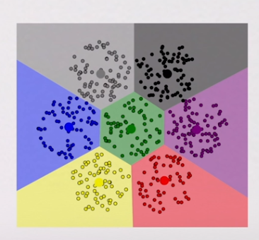
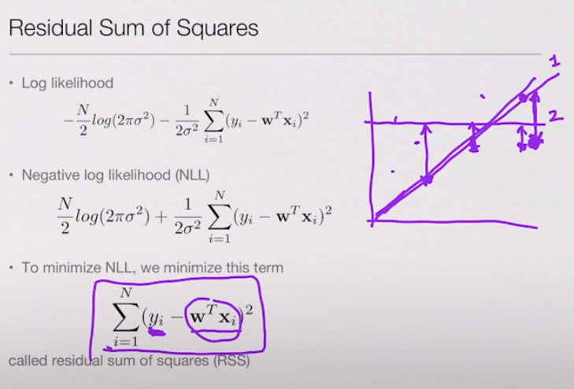

# AI와 머신러닝-rain

## 들어가기 전, 용어정리

+ 머신러닝: 인공 지능의 한 분야로, 컴퓨터가 학습할 수 있도록 하는 알고리즘과 기술을 개발하는 분입니다.
+ 데이터 마이닝: 정형화된 데이터를 중심으로 분석하고 이해하고 예측하는 분야
+ 지도학습 (Supervised learning): 정답을 주고 학습시키는 머신러닝의 방법론. 대표적으로 regression과 classification이 입니다.
+ 비지도학습 (Unsupervised learning): 정답없는 데이터를 어떻게 구성되었는지를 알아내는 머신러닝의 학습 방법론. 지도 학습 혹은 강화 학습과는 달리 입력값에 대한 목표치가 주어지지 않습니다.
+ 강화학습 (Reinforcement Learning): 설정된 환경속에 보상을 주며 학습하는 머신러닝의 학습 방법론입니다.
+ Representation Learning: 부분적인 특징을 찾는 것이 아닌 하나의 뉴럴 넷 모델로 전체의 특징을 학습하는 것을 의미합니다.
+ 선형 회귀 (Linear Regression): 종속 변수 y와 한개 이상의 독립 변수 x와의 선형 상관 관계를 모델링하는 회귀분석 기법입니다. [위키링크](https://ko.wikipedia.org/wiki/%EC%84%A0%ED%98%95_%ED%9A%8C%EA%B7%80)
+ 자연어처리 (NLP): 인간의 언어 형상을 컴퓨터와 같은 기계를 이용해서 모사 할 수 있도록 연구하고 이를 구현하는 인공지능의 주요 분야 중 하나입니다. [위키링크](https://ko.wikipedia.org/wiki/%EC%9E%90%EC%97%B0%EC%96%B4_%EC%B2%98%EB%A6%AC)
+ 학습 데이터 (Training data): 모델을 학습시킬 때 사용할 데이터입니다. 학습데이터로 학습 후 모델의 여러 파라미터들을 결정합니다.
+ 테스트 데이터 (Test data): 실제 학습된 모델을 평가하는데 사용되는 데이터입니다.

## AL / ML

### macine learning vs ?

+ Machine Learning VS big data
  + machine learning : big data를 다루는 방법론 중 요즘 많이 사용되고 있는 것 중하나
  + big data : just 데이터가 많은 것
+ Machine Learning VS data mining
  + data mining : 정형화 된 데이터. ex) 사람의 나이, 성별, 거주 지역
  + machine learning : 비정형화 된 데이터. ex) 이미지, 뉴스 토픽 등
+ Machine Learning VS AI(Artificial Intelligence)
  + AI : 
  + macine learninig : AI의 일부분
+ machine learning vs statistics
  + statistics : 머신러닝을 할 모델을 만들어주는.
  + machine learning : 자료가 빈 곳들을 들어가 통계학의 구멍을 매꾸어줄 수 있다.


### ML의 종류?

+ Supervised Learning : 지도학습
+ Unsupervised Learning : 비지도학습
+ Representation Learning : 딥러닝?
+ (Reinforcement Learning) - not covered today : 강화학습


### 지도학습

+ 사람들이 쉽게 생각할 수 있는 ML
+ 학습시킬 때에 레이블(Lable)을 붙여서 학습 시킨 후 test에 대해 분류(classification)을 하는 것.


#### 지도학습의 모델?

+ 선형 모델 : 

   

  + 

+ 비선형 모델 : decision trees

  


#### 지도학습의 한계점?

+ 정답이 주어져야 하는데 그것에 대해 모든 것을 줄 수 없기 때문에 어렵다.


### 비지도학습

+ 레이블이 주어지지 않은 것을 학습시키는 방법

+ K-menas clustering=> 몇 개의 그룹으로 나눠서 사용할것?

  

  그림에 따라서 몇 개의 그룹으로 나눌지 설정할 수 있다.

  여기서 오류는

  

  이렇게 생긴 것은 컴퓨터가 나눈것 처럼 단순하게 구분할 수 없다.

  

+ DB Scan

  

  결국 다른 방식을 이용해서 구분을 해야만 한다.

  임의의 데이터 포인트 하나를 이용해서 가까운 점들을 이용해서 세력을 키우는 식으로 학습을 한다.

  

  

### 강화학습

+ Neural Networks
+ 2000년에 들어오면서 데이터가 엄청나게 커진다. 
+ facial recognition
  + 예전에 해봤던 것. 
  + 
  + 이것들은 각각의 필터를 만들어서 학습시켰지만, 그것을 넘어 하나의 뉴럴로 학습을 시킬 수 있게 만드는 것이다.
+ 왜 지금 강화학습이 뜨는가?
  + 좋은 모델. 직관적으로 이해 가능. 계산 가능. 표현력 풍부. 
  + 예전에는 학습할만한 데이터 량이 없었고, 컴퓨테이션도 좋지 않았지만, 2000년대 들어오면서 확 좋아졌다.
  + 이후 오버핏 되는것을 막기 위해 드롭아웃처럼, 컴퓨터만이 할 수 있는 작은 디테일(하나만 있으면 이것이 답이다.)을 없애는 방식을 만들었다.


구글 duplex


# Linear Regression

+ Regression : 선형 회귀. 휘귀 분석. 
+ 지도학습
+ 라인핏팅
+ 주어진 자료에 대해 라인으로 구분
+ 이것의 결과를 수치화로 결과를 낼 수 있다.


### linear regression 의 모델?

+ x 값이 주어졌을 때 y값이 잘 주어질 수 있도록 라인을 그리는 것


w : 라인의 식. == a


so, 여기서 linear regression 모델을 찾아내는 것? == w(==a)의 값을 찾는것


### non-linear relationships

+ 선형으로 풀 수 없는것. linear regression의 이름을 하고 있지만 비선형적인 관계를 풀 수 있다. 

+ 

+ wx의 식에서 x를 파이(x)로 만들어 x를 특정 함수로 계산하는것.

+ ex)

  

  + 여기서는 degree1보다는 degree2가 더 효율적인것 처럼 보인다.

+ 

+ 

  + 1번선 : 대각선

  + 2번 선 : 가로로 뻗은 직선

    일 때 1번과 2번이 각 데이터들을 예측한 정도를 확인.

    => RSS

  + yi는 실제의 데이터값. wtxi는 예측한 데이터 값. 이 때, 우리가 해야할 것은 이 차이가 최소가 되는 wt를 찾아내는 것이며, train 을 하게 된다면 train 결과는 차이가 최소가 되는 값을 찾아내는 것이다.

  + 제곱을 하는 이유? 나중에 계산을 용이하게 하기 위함

    차이를 주지 않으면 절대값을 주어 계산을 할 수 도 있지만 미분을 할 때 계산이 예쁘지 않다. 제곱 함수는 모든 부분에서 미분 가능. 절댓값함수는 0점 부분(뾰족함)에서 미분 가능.

+ 최소의 loss를 찾기 위한 방법?

  + [gradient descent]([https://medium.com/@peteryun/ml-%EB%AA%A8%EB%91%90%EB%A5%BC-%EC%9C%84%ED%95%9C-tensorflow-3-gradient-descent-algorithm-%EA%B8%B0%EB%B3%B8-c0688208fc59](https://medium.com/@peteryun/ml-모두를-위한-tensorflow-3-gradient-descent-algorithm-기본-c0688208fc59))
    + 경사 하강법(傾斜下降法, Gradient descent)은 1차 근삿값 발견용 최적화 알고리즘이다. 기본 아이디어는 함수의 기울기(경사)를 구하여 기울기가 낮은 쪽으로 계속 이동시켜서 극값에 이를 때까지 반복시키는 것이다.
    + 
    + 


### Ridge Regression

+ overfit(과적합)

  + 우리가 학습을 할 때 쓸데없이 너무 트레인 데이터에 딱 맞게 곡선을 휘게 만들어버린 것.

  + 얼마나 train data에 잘 맞췄냐 X

  + train data를 잘 맞추는 정도와 test data를 잘 맞추는 정도의 차이가 얼마나 심하냐 O

  + regularization : 복잡한 곡선 - X, 심플한 곡선 - O

    + 우리가 찾는 w가 너무 커지면 여기에 대한 패널티를 주는 것.

  + 

  + 각각 나온 w에 대해 w를 절댓값 씌위 제곱한 것을 모두 더한 값을 패널티로 준다. 때문에 w만 잘 나오는 것이 아니라 적당히 나올 수 있는 부드러운 데이터를 준다.

  + 

    + 왼쪽 : 가장 최적의 w,
    + 오른쪽 : 패널티를 준 w

  +  는 위에서 말한 패널티. == l2 norm == l2 regularization

  + 위에서 사용한 패널티 말고 자주 사용되는 방법? == big data

  + 데이터가 많아지면 몇개의 점을 통과하는 라인이 아니라, 수많은 데이터를 대략적으로 관통하는 심플한 라인을 그릴 수 있다.

    

+ 

  + 1번 모델
    + x 제곱으로 만들어진 모델을 x로 피팅하려고 하기 때문에 트레인도 테스트도 별로
  + 2번 모델
    + x 제곱으로 만들어진 모델을 x제곱으로 피팅해서 학습. 오버핏도 적고, 많은 데이터를 학습시켰을 경우 결과도 좋다.
  + 3번 모델
    + degree 10인 모델로 학습. overfit이 많이 증가했으나, 많은 데이터로 학습시킨 경우 결과가 좋아질 수 있다.
  + 4번 모델
    + degree 25인 모델로 학습. overfit이 아주 많이 증가했고, 많은 데이터로 학습시켰으나, 모델이 너무 복잡해서 결과가 많이 좋아지지는 않는다.


### test

#### test1

```python
# 실습에 필요한 패키지입니다. 수정하지 마세요.
import elice_utils
import matplotlib as mpl
mpl.use("Agg")
import matplotlib.pyplot as plt
import numpy as np
eu = elice_utils.EliceUtils()

# 실습에 필요한 데이터입니다. 수정하지마세요. 
X = [8.70153760, 3.90825773, 1.89362433, 3.28730045, 7.39333004, 2.98984649, 2.25757240, 9.84450732, 9.94589513, 5.48321616]
Y = [5.64413093, 3.75876583, 3.87233310, 4.40990425, 6.43845020, 4.02827829, 2.26105955, 7.15768995, 6.29097441, 5.19692852]

'''
beta_0과 beta_1 을 변경하면서 그래프에 표시되는 선을 확인해 봅니다.
기울기와 절편의 의미를 이해합니다.
'''

beta_0 = 0.5   # beta_0에 저장된 기울기 값을 조정해보세요. 
beta_1 = 2 # beta_1에 저장된 절편 값을 조정해보세요.

plt.scatter(X, Y) # (x, y) 점을 그립니다.
plt.plot([0, 10], [beta_1, 10 * beta_0 + beta_1], c='r') # y = beta_0 * x + beta_1 에 해당하는 선을 그립니다.

plt.xlim(0, 10) # 그래프의 X축을 설정합니다.
plt.ylim(0, 10) # 그래프의 Y축을 설정합니다.

# 엘리스에 이미지를 표시합니다.
plt.savefig("test.png")
eu.send_image("test.png")
```


#### test2 Loss Function

앞서 배운 선형 회귀분석 모델에서 Loss Function을 구하는 방법을 알아보겠습니다.


Loss function 은 예측한 데이터와 실제 데이터와의 차이로 다음과 같이 정의 할 수 있습니다.


```python
import elice_utils
import matplotlib as mpl
mpl.use("Agg")
import matplotlib.pyplot as plt
import numpy as np
eu = elice_utils.EliceUtils()

def loss(x, y, beta_0, beta_1):
    
    '''
    x, y, beta_0, beta_1 을 이용해 loss값을 계산한 뒤 리턴합니다.
    '''
    '''
    답>
    np_x = np.array(x)
    np_y = np.array(y)
    
    y_predict = np_x * beta_0 + beta_1
    return np.sum((y - y_predict)**2)
    
    '''
    N = len(x)
    tmp_sum = 0
    for index in range (N):
        tmp_sum += (y[index] - (x[index] * beta_0 + beta_1)) ** 2
    return tmp_sum / N

X = [8.70153760, 3.90825773, 1.89362433, 3.28730045, 7.39333004, 2.98984649, 2.25757240, 9.84450732, 9.94589513, 5.48321616]
Y = [5.64413093, 3.75876583, 3.87233310, 4.40990425, 6.43845020, 4.02827829, 2.26105955, 7.15768995, 6.29097441, 5.19692852]

beta_0 = 0.48 # 기울기
beta_1 = 2.2 # 절편

print("Loss: %f" % loss(X, Y, beta_0, beta_1))

plt.scatter(X, Y) # (x, y) 점을 그립니다.
plt.plot([0, 10], [beta_1, 10 * beta_0 + beta_1], c='r') # y = beta_0 * x + beta_1 에 해당하는 선을 그립니다.

plt.xlim(0, 10) # 그래프의 X축을 설정합니다.
plt.ylim(0, 10) # 그래프의 Y축을 설정합니다.
plt.savefig("test.png") # 저장 후 엘리스에 이미지를 표시합니다.
eu.send_image("test.png")
```


+ 원래 만든 값이 0.5, 2로 만들었는데 다른 이유? 
  + 노이즈가 들어갔기 때문에 원하는 값과 달라질 수 있다.


#### test3 Scikit-learn을 이용한 linear regression

기계학습 라이브러리 Scikit-learn을 사용하면 최적화 된 을 쉽게 구할 수 있습니다.

주어진 데이터와 다음 선형 모델을 이용하여 최적의 값을 [scikit-learn](http://scikit-learn.org/stable/modules/generated/sklearn.linear_model.LinearRegression.html) 라이브러리를 사용하여 구할 수 있습니다.


```python
import matplotlib as mpl
mpl.use("Agg")
import matplotlib.pyplot as plt
import numpy as np
from sklearn.linear_model import LinearRegression

import elice_utils
eu = elice_utils.EliceUtils()

    
X = [8.70153760, 3.90825773, 1.89362433, 3.28730045, 7.39333004, 2.98984649, 2.25757240, 9.84450732, 9.94589513, 5.48321616]
Y = [5.64413093, 3.75876583, 3.87233310, 4.40990425, 6.43845020, 4.02827829, 2.26105955, 7.15768995, 6.29097441, 5.19692852]

train_X = np.array(X).reshape(-1, 1) 
	# numpy의 reshape은 -1은 나머지는 아는데 한 차원을 모를 때 numpy가 알아서 계산하기 위함
    
train_Y = np.array(Y)

# print(train_X, train_Y)

'''
여기에서 모델을 트레이닝합니다.
'''
lrmodel = LinearRegression()
lrmodel.fit(train_X, train_Y)

beta_0 = lrmodel.coef_[0]
beta_1 = lrmodel.intercept_

print("beta_0: %f" % beta_0)
print("beta_1: %f" % beta_1)

plt.scatter(X, Y) # (x, y) 점을 그립니다.
plt.plot([0, 10], [beta_1, 10 * beta_0 + beta_1], c='r') # y = beta_0 * x + beta_1 에 해당하는 선을 그립니다.

plt.xlim(0, 10) # 그래프의 X축을 설정합니다.
plt.ylim(0, 10) # 그래프의 Y축을 설정합니다.
plt.savefig("test.png") # 저장 후 엘리스에 이미지를 표시합니다.
eu.send_image("test.png")
```


#### test4 선형 회귀 구현하기

선형 회귀는 종속 변수 y와 한 개 이상의 독립 변수 X와의 선형 상관 관계를 모델링하는 회귀분석 기법을 말한다.

이번 시간에는 y와 x가 주어졌을 때, ‘y = ax+b’ 라는 형태의 직선을 회귀식으로 하는 단순한 선형 회귀(Linear Regression) 파이썬을 통해 직접 구현해보도록 하자.

------

**선형 회귀의 절차**

1. x라는 값이 입력되면 'ax+b’라는 계산식을 통해 값을 산출하는 예측 함수를 정의한다.
2. 예측 함수를 통해 예측값과 실제값 y 간의 차이를 계산한다.
3. a와 b를 업데이트 하는 규칙을 정의하고 이를 바탕으로 a와 b의 값을 조정한다.
4. 위의 과정을 특정 반복횟수 만큼 반복한다.
5. 반복적으로 수정된 a와 b를 바탕으로 ‘y=ax+b’ 라는 회귀식을 정의한다.

```python
import numpy as np
import elice_utils
import matplotlib.pyplot as plt
import matplotlib as mpl
mpl.use("Agg")
eu = elice_utils.EliceUtils()
#학습률(learning rate)를 설정한다.(권장: 0.0001~0.01)
learning_rate = 0.01
#반복 횟수(iteration)를 설정한다.(자연수)
iteration = 10
def prediction(a,b,x):
    # 넘파이 배열 a,b,x를 받아서 'x*(transposed)a + b'를 계산하는 식을 만든다.
    
    equation = x * a.T + b
    
    return equation
    
def update_ab(a,b,x,error,lr):
    # 업데이트를 한 번 하는 것이 반복을 한 번 하는것과 같다.
    
    # a를 업데이트하는 규칙을 정의한다.
    delta_a = -(lr*(2/len(error))*(np.dot(x.T, error)))
    # b를 업데이트하는 규칙을 정의한다.
    delta_b = -(lr*(2/len(error))*np.sum(error))
    
    return delta_a, delta_b
    
def gradient_descent(x, y, iters):
    #초기값 a= 0, a=0
    a = np.zeros((1,1))
    b = np.zeros((1,1))
    
    for i in range(iters):
        #실제 값 y와 예측 값의 차이를 계산하여 error를 정의한다.
        error = y - prediction(a, b, x)
        a_delta, b_delta = update_ab(a,b,x,error,lr=learning_rate)
        a -= a_delta
        b -= b_delta
        
    return a, b

def plotting_graph(x,y,a,b):
    y_pred=a[0,0]*x+b
    plt.scatter(x, y)
    plt.plot(x, y_pred)
    plt.savefig("test.png")
    eu.send_image("test.png")

def main():

    x = 5*np.random.rand(100,1)
    y = 3*x + 5*np.random.rand(100,1)
    
    a, b = gradient_descent(x,y,iters=iteration)
    
    print("a:",a, "b:",b)
    plotting_graph(x,y,a,b)
    
main()
    
```


#### test5 릿지 회귀(Ridge Regression) 구현하기 => 과적합(overfitting)을 막는다.

릿지 회귀는 일반적인 선형회귀에서 L2 규제 항(regularization terms)이 추가된 회귀를 의미합니다.

이번 시간에는 릿지 회귀를 직접구현해보고, 파라미터를 변경해가며 회귀 결과가 어떻게 변화하는지 살펴봅니다.

------

1. x라는 값이 입력되면 'ax+b’라는 계산식을 통해 값을 산출하는 예측 함수를 정의합니다.
2. 예측 함수를 통해 예측값과 실제값 y 간의 차이를 계산합니다.
3. a와 b를 업데이트 하는 규칙을 정의하고 이를 바탕으로 a와 b의 값을 조정합니다. (alpha 값을 이용하여 규제 항을 설정합니다.)
4. 위의 과정을 특정 반복횟수 만큼 반복합니다.
5. 반복적으로 수정된 a와 b를 바탕으로 ‘y=ax+b’ 라는 회귀식을 정의합니다.


```python
import numpy as np
import elice_utils
import matplotlib.pyplot as plt
import matplotlib as mpl
mpl.use("Agg")
eu = elice_utils.EliceUtils()

#학습률(learning rate)를 설정한다.(권장: 0.0001~0.01)
learning_rate = 0.01
#반복 횟수(iteration)를 설정한다.(자연수)
iteration = 100000
#릿지회귀에 사용되는 알파(alpha) 값을 설정한다.(권장: 0.0001~0.01)
alpha = 0.0001

def prediction(a,b,x):    
    return a * x + b
    
def update_ab(a,b,x,error,lr, alpha):
    # a와 b가 너무 커지지 않는 적당한 값이 나와야한다.
    #alpha와 a의 곱으로 regularization을 설정한다.  
    regularization = alpha * a
    delta_a = -(lr*(2/len(error))*(np.dot(x.T, error)) + regularization)
    delta_b = -(lr*(2/len(error))*np.sum(error))
    return delta_a, delta_b
    
def gradient_descent(x, y, iters, alpha):
    #초기값 a= 0, a=0
    a = np.zeros((1,1))
    b = np.zeros((1,1))    
    
    for i in range(iters):
        error = y - prediction(a, b, x)
        a_delta, b_delta = update_ab(a,b,x,error,lr=learning_rate, alpha=alpha)
        a -= a_delta
        b -= b_delta
    
    return a, b

def plotting_graph(x,y,a,b):
    y_pred=a[0,0]*x+b
    plt.scatter(x, y)
    plt.plot(x, y_pred)
    plt.savefig("test.png")
    eu.send_image("test.png")

def main():
    #x, y 데이터를 생성한다.
    x = 5*np.random.rand(100,1)
    y = 10*x**4 + 2*x + 1+ 5*np.random.rand(100,1)
    # a와 b의 값을 반복횟수만큼 업데이트하고 그 값을 출력한다. 
    a, b = gradient_descent(x,y,iters=iteration, alpha=alpha)
    print("a:",a, "b:",b)
    #회귀 직선과 x,y의 값을 matplotlib을 통해 나타낸다.
    plotting_graph(x,y,a,b)
    
main()
```


전치행렬을 쓰는 이유???

- 계산을 쉽게 하려고 한다.


# Naive Bayes 

+ [참고자료](<http://www.synapsoft.co.kr/blog/6002>)

+ 나이브법칙
  + P(A|B) = P(B|A)P(A) / P(B)
  + 벤다이어그램으로 그리기
  + 
+ 나이브 베이즈 법칙
  + 분류
  + 여러개 중 하나
  + A와  B의 각각의 확률에서 X인 관측이 A와 B 중 어느곳에서 나왔을 확률을 구하는것.


if test시,

+ 별 1개짜리 평점을 neg 모델로, 별 5개짜리 평점을 pos 모델로 만들어서 각각을 학습시키고 직접 구현도 해보기.
+ naive bayes classifier


### test

#### test1 Bayes Probability

#### 유방암 검사 키트

40대 여성이 mammogram(X-ray) 검사를 통해 유방암 양성 의심 판정을 받았을 때 유방암을 실제로 가지고 있을 확률은 어떻게 될까요?

`mammogram_test()` 함수를 구현하며 베이즈 법칙을 직접 응용해보겠습니다. `mammogram_test()` 함수는 세 가지 숫자를 입력 받습니다.

- `sensitivity` - 검사의 민감성을 뜻합니다. 유방암 보유자를 대상으로 검사 결과가 양성이 표시될 확률입니다. 0부터 1 사이의 값을 갖습니다.
- `prior_prob` - 총 인구를 기준으로 유방암을 가지고 있을 사전 확률(prior probability)입니다. 0.004 정도로 매우 낮은 값입니다.
- `false_alarm` - 실제로는 암을 갖고 있지 않지만 유방암이라고 진단될 확률입니다. 0.1 정도로 생각보다 높은 값입니다.

나이브 법칙을 이용해 입력 받은 세 값을 바탕으로 유방암 보유 여부를 확률로 출력합니다.

```
>>> 0.8
>>> 0.004
>>> 0.1
3.11%
Copy
```


```python
def main():
    sensitivity = float(input())
    prior_prob = float(input())
    false_alarm = float(input())

    print(mammogram_test(sensitivity, prior_prob, false_alarm))

def mammogram_test(sensitivity, prior_prob, false_alarm):

    """
    x=1 : 검진 결과 유방암 판정
    x=0 : 검진 결과 유방암 미판정
    y=1 : 유방암 발병됨
    y=0 : 유방암 미발병
    """

    # The likelyhood probability : 유방암을 가지고 있는 사람이 검진 결과 유방암 판정 받을 확률
    p_x1_y1 =  sensitivity# p(x = 1|y = 1)
    print(p_x1_y1)

    # The prior probability : 유방암을 가지고 있을 확률로 매우 낮다.
    p_y1 =  prior_prob# p(y = 1)
    print(p_y1)

    # False alram : 유방암을 가지고 있지 않지만 검사 결과 유방암 판정을 받을 확률
    p_x1_y0 =  false_alarm# p(x = 1|y = 0)
    print(p_x1_y0)
    
    p_x1 = false_alarm * (1 - p_y1) + sensitivity * prior_prob
    print(p_x1)
    
    # Bayes rule 
    p_y1_x1 =  (sensitivity * prior_prob) / p_x1# p(y = 1|x = 1)
    print(p_y1_x1)

    # 검사 결과 유방암 판정을 받은 환자가 정확한 검진을 받았단 확률
    return 

if __name__ == "__main__":
    main()

```


#### test2 뉴스 데이터 분류하기

`Scikit-learn`에는 머신러닝을 위한 다양한 라이브러리가 내장되어 있습니다.

`Scikit-learn`을 이용하여 뉴스 데이터 기반 간단한 Naive Bayes 분류를 진행해보겠습니다.

이를 위해 4가지 내장 모듈을 불러옵니다.

1. `fetch_20newsgroups`
2. `CountVectorizer`
3. `MultinomialNB`
4. `accuracy_score`

위의 모듈을 토대로 Train과 Test 데이터 세트를 구성하고 Multinomial Naive Bayes 모델을 학습하여 Test 데이터로 정확도를 예측해보겠습니다.


```python
from sklearn.datasets import fetch_20newsgroups             # 20 News group 데이터 로드
from sklearn.feature_extraction.text import CountVectorizer # 단어를 Bag of Word로 만들기 위한 모듈
from sklearn.naive_bayes import MultinomialNB               # 다항분포 나이브 베이즈 모델
from sklearn.metrics import accuracy_score                  # 정확도 계산을 위한 모듈

# Train & Test 데이터 준비
newsdata=fetch_20newsgroups(subset='train')
newsdata_test = fetch_20newsgroups(subset='test', shuffle=True) 

# 데이터 분석
print('데이터 속성                  : ',newsdata.keys())
print('Train 데이터 개수            : ',len(newsdata.data))
print('Train 데이터의 Label 개수    : ',len(newsdata.target))
print('Train 데이터의 카테고리 개수 : ',newsdata.target_names,'\n')

# 뉴스 데이터의 단어를 학습 가능하도록 BoW로 변환
tdmvector = CountVectorizer()
X_train_tdm = tdmvector.fit_transform(newsdata.data)
print('Train Data의 개수, Data안의 단어 개수 : ',X_train_tdm.shape)

# 사이킷런에 내장되어 있는 Naive-Bayes 모델 불러오기
mod = MultinomialNB()

# 뉴스 데이터 학습
mod.fit(X_train_tdm, newsdata.target)

# Test 데이터를 BoW으로 변환
X_test_tdm = tdmvector.transform(newsdata_test.data) 

# Test 데이터에 대한 예측
predicted = mod.predict(X_test_tdm) 
print("Test 데이터 정확도 : ", accuracy_score(newsdata_test.target, predicted)) #예측값과 실제값 비교
```


