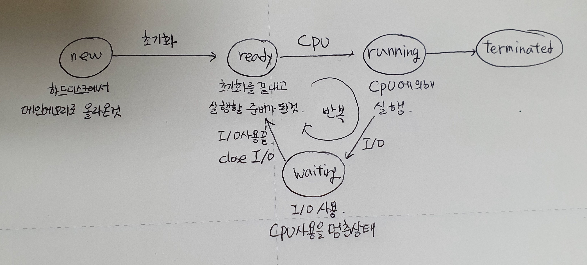
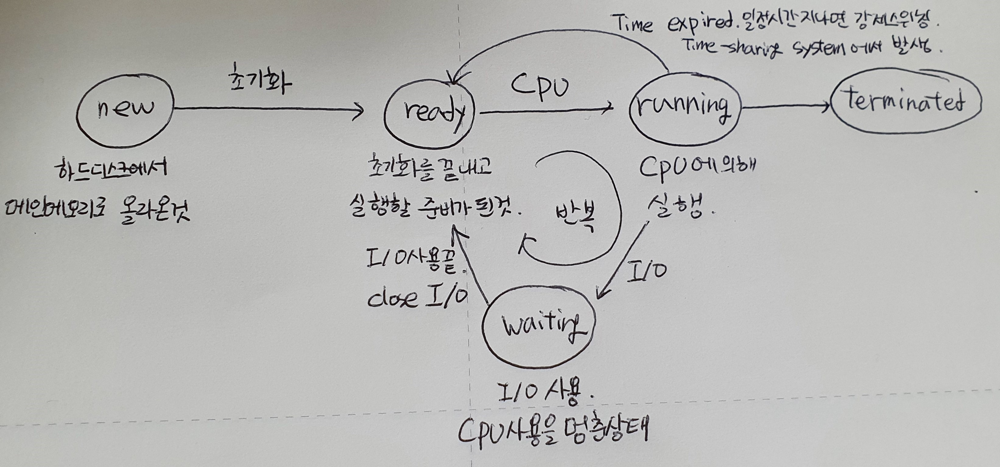

# 프로세스 관리

## 2.1 프로세스

+ 프로그램(program) vs 프로세스(process)
  + 프로그램 : 하드디스크에 설치된 다양한 APP. (program in execution)
  + 프로세스 : CPU에 의해 메인 메모리에 올라온 프로그램.
  + 무덤 속 프로그램(하드디스크 안) vs 살아 움직이는 프로세스 (메인 메모리 위)
+ process == task == job -> 대부분 비슷한 의미로 사용한다. <del>이후에 다시 설명</del>
+ 프로세스는 다음 값들의 변화를 갖는다.
  + text(code) + data + stack, pc(program counter), sp(step pointer), registers, ...


### 프로세스 상태

+ new, ready, running, waiting, terminated
+ new : 하드디스크에서 메인 메모리로 올라온 것.
+ ready : 초기화를 끝내고 실행할 준비가 된 것
+ running : cpu에 의해 실행 되는 것
+ waiting : 프린트, 하드디스크 등 i/o 작업으로 cpu를 사용하지 않아 잠시 멈춘 상태. 이 때 다른 프로세스가 동작한다. 다시 사용할 준비가 되면 ready로 이동.
+ terminated : 실행이 끝난 상태.
+ 
  + 멀티프로그래밍 시스템에서의 프로세스 상태
+ 
  + time-sharing 시스템에서의 프로세스 상태
  + running에서 ready 상태로 강제 스위칭하는 과정이 추가된다.


### PCB(Process Control Block)

+ == TCB(Task Control Block)
+ 프로세스 제어 블록
+ 프로세스에 대한 모든 정보가 들어있다.
  + process state(프로세스 상태. new, ready, 등)
  + PC(program counter, 몇번째 시작되나)
  + registers
  + MMU info(base, limit)(CPU에서 넘어온 주소 정보를 체크)
  + CPU time(사용 시간)
  + process id(pid)
  + list of open files(어떤 파일들을 사용했는가? ex, 메모장에서 연 파일 목록)
+ 사람과 비유? - 개인정보. 집주소, 주민등록번호 등의 개인 정보가 저장.
+ **OS의 process management** 안에 존재한다.
+ c언어라면 구조체로 개발되었을 것. <del>python이라면 class로 개발되었을까?</del>


### 프로세스 대기열 (Queue)

+ 큐(Queue) : first in first out. 먼저 들어온 것이 먼저 나가는 자료구조. 
  + 줄과 같으며 단순 큐 이외에도 우선순위 큐 등이 존재한다.
  + 중요도에 따라 줄을 세우는 방법이 다양하다.
+ 큐에는 누가 줄을 서는가?
  + 프로세스.
  + **더 정확히 말하면 PCB**가 줄을 서게된다.
+ 

#### 1. Job Queue

+ Job Queue
  + 하드디스크에서 메인 메모리에 올라가기 위해 프로그램들이 대기하는 것.
+ job scheduler
  + 줄 선것 중 어떤것을 먼저 메인 메모리 위에 올려야 할지 정하는 것
  + 역시 O/S 안에 존재.
+ long-term scheduler
  + 프로그램이 종료 된 후 다른 프로그램이 올라갈 수 있기 때문에 굉장히 오랜 시간(몇 분~)을 기다려야 하는 스케쥴.

#### 2. Ready Queue

+ ready queue
  + 메인 메모리에 올라온 프로세스들이 CPU를 할당받기 위해 대기하는 것.
+ CPU scheduler
  + CPU를 할당받기 위해 줄서있는 프로세스 들 중 어떤것을 먼저 실행할지 정하는 것.
+ short-term scheduler
  + 1초에도 수십, 수백의 프로세스들이 번갈아가며 CPU를 할당받음. 아주 짧은 시간.

#### 3. Device Queue

+ device queue
  + 프린트, 디스크 등 장치를 사용하기 위해 대기하는 것.
+ device scheduler
  + 장치를 사용하기 위해 대기하는 것 중 어떤것을 먼저 실행할지 정하는 것


#### multiprogramming system

+ Degree of multiprogramming : 멀티프로그래밍의 정도. **메인 메모리에 몇개의 프로세스를 동작시킬 수 있는가?**
+ I/O-bound process vs CPU-bound process
  + I/O bound process : 입출력을 주로 하는 프로세서. ex)한컴, 워드 등의 프로그램
  + CPU-bound process : 연산을 주로 하는 프로세서. ex)일기예보 계산 등의 슈퍼컴퓨터.
+ **job queue에는 I/O bound와 CPU bound를 적절히 섞어서 올린다**
  + 모두 CPU를 많이 사용하게 되면 다른 프로세스가 사용되지 못할 수 있기 때문.
  + O/S가 잘 선택하여 job scheduler에서 적절히 섞어 올릴 수 있게 만든다.

#### Midium-term scheduler

+ multiprogramming system, time sharing system 모두 가능
+ swap out : 사용하던 사람이 자리를 비우면 그 사람이 **사용하던 메모리를 디스크에 통째로 쫓아낸다.**
  + 이 과정에서 빈 메모리 안에 새로운 프로세스를 실행시키거나, 아니면 동시에 실행되고 있던 다른 프로세스의 메모리를 늘려준다.
  + backing store == swap device : 하드디스크에서 프로그램을 저장하는 부분을 제외하고, **swap out된 메모리를 저장하는 영역.**
+ swap in : 자리를 비웠던 사람이 다시 **돌아오면 디스크에 보냈던 메모리를 다시 메인메모리에 올리는 것.**
+ **swapping** : swap out + swap in. 
+ swap out 된 프로그램 중에 어떤것을 swap in 할지 정하는 것.


### 관련 용어

+ Context switching(문맥 전환)
  + CPU를 사용하는 process의 전환.
  + 1번 프로세스를 사용하다가 2번 프로세스로 전환하는 것.
+ Scheduler
  + 지금 실행하는 프로세스(프로그램)가 끝나면 어떤 프로세스(프로그램)을 실행할지 결정하는 역할
+ Dispatcher
  + context switching을 시켜주는 역할(프로그램)
  + OS의 process management에 위치.
  + P1의 정보(MMU info 등)를 PCB P1에 저장하고, P2 실행을 위해 PCB P2의 정보를 복원(restore) 하는 역할
+ Context switching overhead
  + context switching을 할 때 생기는 부담.
  + context switching이 자주 일어날수록 부담이 커진다.
  + 때문에 dispatcher 프로그램은 고효율적으로 만들어져야 한다.
    + ex) 어셈블리어 등의 low-level language로 구현되어 효율을 높인다.


## 2.2 CPU 스케쥴링 (CPU Scheduling)

+ ready queue 안, 혹은 메인 메모리에 여러개의 프로세스가 줄서서 기다릴 때, 현재 실행되는 것이 끝나면 어떤 프로세스를 실행시킬 것인가를 결정.
+ **다음에 CPU에게 어떤 일을 시킬것인가?**를 결정.


### Preemptive(선점) vs Non-preemptive(비선점)

+ Preemptive : CPU가 **현재 실행하고 있는 프로세스를 쫓아내고 새로운 프로세스를 실행**시킬 수 있는 것.
+ Non-preemptive : **CPU가 현재 실행하고 있는 프로세스가 있으면** 끝나거나, I/O를 만날 때 까지 스케쥴링이 일어나지 않는 것. == **강제 스케쥴링이 일어나지 않는것**
+ 병원의 응급실 vs 일반 진료


### Scheduling criteria(스케쥴링 척도)

+ 스케줄링을 비교할 수 있는 기준
+ CPU Utilization(CPU 이용률) : CPU가 얼마나 부지런히 일하는가? 
  + 단위 : %
  + 높을수록 Good
+ Throughput (처리율) : 단위 시간 당 몇 개의 작업을 처리할 수 있는가?
  + 단위 : jobs/sec(=jobs/min=jobs/hour)
  + 높을수록 good
+ Turnaround time (반환시간) : 작업이 job queue에서 **ready queue에 들어가서 **작업을 막 하고 모두 끝나 **종료(terminate) 될 때 까지 걸리는 시간.**
  + 단위 : 시간(sec, min, hour ...)
  + 짧을수록 good
  + 병원에 들어가서 일련의 과정(접수, 진료, 주사, 엑스레이 등등)을 거치고 병원을 나올때까지 걸리는 시간
+ Waiting time(대기시간) : CPU 서비스를 받기 까지 ready queue에서 기다리는 시간.
  + 단위 : 시간(sec, min, hour ...)
  + 짧을수록 good
  + 병원에 가서 의사를 만날 때 까지의 시간
+ Response time(응답 시간) : 사용자가 명령 후 컴퓨터가 응답할때까지의 시간
  + interactive system(대화형 시스템)에서 중요.
  + 단위 : 시간(sec, min, ...)
  + 짧을 수록 good


### CPU Scheduling Algorithms

+ First-Come, First-Served (FCFS) : 먼저 온 것 먼저 처리
+ Shortest-Job-First(SJF) : 작업 시간이 짧은 것 먼저 처리
  + Shortest-Remaining-Time-Frist
+ Priority : 우선순위 높은 것 먼저 처리
+ Round-Robin (RR) : 빙빙 돌면서 순서대로 처리
+ Mulilevel Queue : 큐를 여러개 두는 것
  + Multilevel Feedback Queue


## 2.3 First-Come First-Served (FCFS) Scheduling

+ 먼저 들어온 프로세스를 먼처 처리하는 것.

+ simple & Fair : 간단하고 일반적으로는 공평한 방법.

  + but, 정말 좋은가?

+ Non-preemptive scheduling. 현재 진행하고 있는 작업이 끝나야만 한다.

+ + | process | Burst time (msec) |
    | ------- | ----------------- |
    | P1      | 24                |
    | P2      | 3                 |
    | P3      | 3                 |

  + ex1) P1, P2, P3의 순서대로 queue에 쌓였을 때,

  + |      | P1   | P2   | P3   |
    | ---- | ---- | ---- | ---- |
    | 0    | 24   | 27   | 30   |

    + AWT(Average Waiting Time, 평균대기시간) = (0 + 24 + 27) / 3 = 17msec
    + P1의 대기 시간 : 0
    + P2의 대기 시간 : 24
    + P3의 대기 시간 : 27

  + ex2) P3, P2, P1의 순서대로 queue에 쌓였을 때,

  + |      | P3   | P2   | P1   |
    | ---- | ---- | ---- | ---- |
    | 0    | 3    | 6    | 30   |

    + AWT = (6 + 3 + 0) / 3 = 3 msc
    + P1의 대기 시간 : 6
    + P2의 대기 시간 : 3
    + P3의 대기 시간 : 0

  + ex1과 2의 경우를 볼 때 어떤것을 먼저 시작하느냐에 따라 평균 대기시간의 차이가 많이 나게 된다. 일반적으로 기다리는 일 중 **burst time이 작은 것을 먼저 하는 것이 유리**하다

+ **Gantt Chart** : 위에서 그린것과 같은 시간과 프로세스를 나타내는 차트.

+ Convoy Effect (호위효과) 

  + burst time이 긴 프로세스를 먼저 실행하게 될 때 다른 프로세스들이 뒤에서 기다리는 효과
  + ex1과 같이 CPU 시간을 오래 쓰는 프로세스가 먼저 실행되면 뒤에서 기다리는 P2, P3와 같은 작업들이 오래 기다려야한다. P1을 기준으로 P2, P3가 뒤를 따라다니는 것 처럼 보이게 되는데 이를 convoy effect라 한다.


## 2.4 Shortest-Job-First (SJF) Scheduling

+ 실행 시간(burst time)이 짧은 것 먼저 실행하는 스케쥴링

+ Preemptive(선점)과 Non-preemptive(비선점) 모두 가능.

  + Preemptive 스케쥴링은 **Shortest-Remaining-Time-First**(최소 잔여시간 우선) 이라고도 한다.

+ Provably optimal : 일반적으로 가장 효과적이다. 그러나 자주 사용하지 못한다.

+ Not realistic : 비현실적이기 때문이다. 실제로 burst time이 주어지는 것이 아니기 때문에 **실행 시간을 예측**해야한다. 

  + 멀티프로그래밍 또는 time sharing 시스템 등으로 시간을 예측하게 되는데, 현재까지 작업한 시간과 남은 양을 계산하여 남은 실행 시간을 계산한다.
  + 많은 양의 계산과 오버헤드가 발생한다. 때문에 사용하기 어렵다.

+ EX - 기본

  | Process | Burst Time(msec) |
  | ------- | ---------------- |
  | P1      | 6                |
  | P2      | 8                |
  | P3      | 7                |
  | P4      | 3                |

  + SJF

  + |      | P4   | P1   | P3   | P2   |
    | ---- | ---- | ---- | ---- | ---- |
    | 0    | 3    | 9    | 16   | 24   |

    + AWT = (3 + 16 + 9 + 0) / 4 = 7msec
    + P1 대기 시간 : 3
    + P2 대기 시간 : 16
    + P3 대기 시간 : 9
    + P4 대기 시간 : 0

  + FCFS

  + |      | P1   | P2   | P3   | P4   |
    | ---- | ---- | ---- | ---- | ---- |
    | 0    | 6    | 14   | 21   | 24   |

    + AWT = (0 + 6 + 14 + 21) / 4 = 10.25

+ EX - 선점 vs 비선점

  | Process | Arrival Time | Burst Time (msec) |
  | ------- | ------------ | ----------------- |
  | P1      | 0            | 8                 |
  | P2      | 1            | 4                 |
  | P3      | 2            | 9                 |
  | P4      | 3            | 5                 |

  + Preemptive

  + |      | P1     | P2     | P2     | P2     | P4     | P1     | P3   |
    | ---- | ------ | ------ | ------ | ------ | ------ | ------ | ---- |
    | 0    | 1      | 2      | 3      | 5      | 10     | 17     | 26   |
    |      | P1 : 7 | P1 : 7 | P1 : 7 | P1 : 7 | P1 : 7 | P3 : 9 |      |
    |      | P2 : 4 | P2 : 3 | P2 : 2 | P3 : 9 | P3 : 9 |        |      |
    |      |        | P3 : 9 | P3 : 9 | P4 : 5 |        |        |      |
    |      |        |        | P4 : 5 |        |        |        |      |

    + AWT = (9 + 0 + 15 + 2) / 4 = 6.5
    + P1 대기 시간 : 0 + (10 - 1) = 9
    + P2 대기 시간 : 0
    + P3 대기 시간 : 17 - 2 = 15
    + P4 대기 시간 : 5 - 3 = 2

  + Non-preemtive

  + |      | P1   | P2   | P4   | P3   |
    | ---- | ---- | ---- | ---- | ---- |
    | 0    | 8    | 12   | 17   | 26   |

    + AWT = (0 + 7 + 15 + 9) / 4 = 7. 75
    + P1 대기 시간 : 0
    + P2 대기 시간 : 8 - 1 = 7
    + P3 대기 시간 : 17 - 2 = 15
    + P4 대기 시간 : 12 - 3 = 9

  + 시간이 지나서 새로운 프로세서가 들어올 때, 선점 프로세스의 경우 현재 진행중인 것을 빼고 새로 온 프로세스를 실행할 수 있다. 


## 2.5 Priority Scheduling

+ priority(우선순위)가 높은 프로세스를 먼저 처리하는 스케쥴링

  + Priority : 일반적으로 숫자(정수)이다. 일반적으로 숫자가 작을수록 우선순위가 높다.

+ Preemptive or Non-preemptive : 선점 프로세스, 비선점 프로세스 모두 가능

+ 우선순위 결정하는 기준?

  + Internal (내부 기준) 
    + time limit : 시간 작은것이 우선
    + memory requirement : 메모리 요구 크기 작은것이 우선)
    + I/O to CPU burst : 입출력 장치를 많이 쓰고 CPU 시간을 적게 쓰는 것이 우선
  + external 
    + amount of funds being paid : 서버(유료) 컴퓨터에서 돈을 많이 낸 것이 우선
    + political factors : 정치적 요소(ex, 학교로 따진다면 신입생을 받는 곳에 우선순위 가장 높음. 돈 관리 쪽은 높고, 실제 학생들이 쓰는 영역은 낮음.)

+ EX

  | Process | Burst Time | Priority |
  | ------- | ---------- | -------- |
  | P1      | 10         | 3        |
  | P2      | 1          | 1        |
  | P3      | 2          | 4        |
  | P4      | 1          | 5        |
  | P5      | 5          | 2        |

  + 

    |      | P2   | P5   | P1   | P3   | P4   |
    | ---- | ---- | ---- | ---- | ---- | ---- |
    | 0    | 1    | 6    | 16   | 18   | 19   |

    + AWT = (6 + 0 + 16 + 18 + 1) / 5 = 8.2

+ 우선순위 스케쥴링의 **문제점**

  + 문제점 : Indefinite blocking(기아상태)
    + 우선순위가 아주 낮은 프로세스의 경우, 보다 높은 우선순위의 프로세스들이 계속해서 들어올 때 계속해서 실행되지 못한다. 
  + 해결법 : aging
    + 오래 기다린 프로세스의 경우 우선순위를 높여주어 결국 실행되게 만든다.


## 2.6 Round-Robin (RR) Scheduling

+ 빙빙 돌면서 실행하는 스케쥴링

+ Time-sharing system (시분할/시공유 시스템)에서 많이 사용한다.

  + 프로세스가 3개 있을 때, P1, P2, P3, P1, P2, P3, P1, ... 의 순서로 반복해서 실행되는데 이 때 각 프로세스를 실행하는 시간은 동일하다. 이 시간의 간격. 단위를 **time quantum(시간 양자)** 라 부르며, **time slice**라고도 부른다.
  + time quantum은 주로 10~100 msec 를 기준으로 하며, 이것은 또한 **delta(∆)**로 표기한다.

+ Preemptive scheduling이다. 강제로 시간을 나누어 반복하기 때문에 비선점 스케쥴링이 될 수 없다.

+ EX 

  | Process | Burst Time (msec) |
  | ------- | ----------------- |
  | P1      | 24                |
  | P2      | 3                 |
  | P3      | 3                 |

  + if time quantum = 4msec

  + |      | P1   | P2   | P3   | P1   |
    | ---- | ---- | ---- | ---- | ---- |
    | 0    | 4    | 7    | 10   | 30   |

    + AWT = (6 + 4 + 7) / 3 = 5.66
    + P1 대기 시간 : 0 + (10 - 4) = 6

+ Round-Robin 스케쥴링은 time quantum의 사이즈에 굉장히 의존적이다.

  + if ∆ -> ∞

    + 강제 스위칭이 일어나지 않고, 프로세스가 끝날 때에만 스위칭이 일어난다.
    + FCFS와 같은 동작이 된다.

  + if ∆ -> 0

    + Processor sharing : 스위칭이 너무 빈번해 여러 프로세스가 동시에 실행되는 것과 같아보인다.
    + 스위칭이 일어날 때 dispatcher에서 각 프로세스의 정보를 저장하고 불러온다. 이 때 시간과 부하가 걸리게 되는데, 너무 빠르게 이 과정이 반복되면 context switching overhead가 발생한다.

  + EX

    | Process | Burst Time (msec) |
    | ------- | ----------------- |
    | P1      | 6                 |
    | P2      | 3                 |
    | P3      | 1                 |
    | P4      | 7                 |

  + if ∆ = 1

  + |      | P1   | P2   | P3   | P4   | P1   | P2   | P4   | P1   | P2   | P4   | P1   | P4   | P1   | P4   | P1   | P4   | P4   |
    | ---- | ---- | ---- | ---- | ---- | ---- | ---- | ---- | ---- | ---- | ---- | ---- | ---- | ---- | ---- | ---- | ---- | ---- |
    | 0    | 1    | 2    | 3    | 4    | 5    | 6    | 7    | 8    | 9    | 10   | 11   | 12   | 13   | 14   | 15   | 16   | 17   |

    + ATT(Average Turnaround Time) : 시작한 후 끝날때 까지 걸린 시간
    + ATT = (15 + 9 + 3 + 17) / 4 = 11.0 msec
    + P1 종료 시간 : 15
    + P2 종료 시간 : 9
    + P3 종료 시간 : 3
    + P4 종료 시간 : 17

  + if ∆ = 5

  + |      | P1   | P2   | P3   | P4   | P1   | P4   |
    | ---- | ---- | ---- | ---- | ---- | ---- | ---- |
    | 0    | 5    | 8    | 9    | 14   | 15   | 17   |

    + ATT = (15 + 8 + 9 + 17) / 4 = 12.25 msec


## 2.7 Multilevel Queue Scheduling

+ 성격이 다른 프로세스들을 다른 queue에 세우는 스케쥴링
+ 성격이 다른 프로세스의 묶음 = Process Groups
  + System Process : OS와 관련된 가장 중요한 프로세스
  + Interactive Process : 사용자와 대화하는 프로세스 (게임 등)
  + Interactive editing process : 사용자가 문서작업을 하는 프로세스 등
  + Batch Process : 컴퓨터가 직접 꾸러미로 묶어 처리하는 프로세스
  + Student Process : 학생들이 사용하는 것과 같이 크게 중요하지 않은 프로세스
  + 위로 올라갈수록 중요도가 높고 아래로 내려갈수록 낮게 설정하면 좋겠다.
+ Single ready queue -> Several scparate queues
  + 단일 레디큐에서 여러개의 큐를 놓고 성격대로 분리해 줄을 세운다.
  + 각각의 큐에 절대적인 우선순위가 존재한다. (OS를 가장 먼저 처리 등)
  + 또는 CPU time을 각 queue에 차등 배분
  + 각 queue는 독립된 스케쥴링 정책이 있다. 
    + system은 우선순위, interactive는 RR, 학생은 FCFS 등
+ 은행과 유사한 구조이다.
  + 입출금은 입출금 창구에서 대기, 대출은 대출 창구에서 따로 줄을 서 대기한다.


## 2.8 Multilevel Feedback Queue Scheduling

+ multilevel queue scheduling과 유사하지만 다르다.
  + **큐에서 큐 사이로 프로세스의 이동이 가능하다.**
+ 단순히 스케쥴링 방법이 다른 복수개의 Queue가 존재한다.
+ 특정 queue에서 해결되지 않는 경우 다른 queue로 이동시켜 적합한 스케쥴링 방법을 적용한다.
  + 너무 많은 CPU time 사용 시 적합한 queue로 이동
  + 기아 상태 우려 시 우선순위가 높은 queue로 이동


## 2.9 프로세스 생성과 종료

+ 프로세스는 프로세스에 의해 만들어진다.
+ 맨 처음의 프로세스는 누가 만드나?
  + 부팅 후 OS가 init(이름이 다를 수 있다) 프로세스를 만들고, init 프로세스가 다른 프로세스를 만든다.
  + 프로세스들은 계속 새로운 프로세스를 만든다.
+ 프로세스 트리(process tree) : 프로세스의 구조를 그리면 트리모양이다.
  + 부모 프로세스 (Parent process)
  + 자식 프로세스(Child process)
  + 형제 프로세스(Sibling process) : 부모가 같은 프로세스들
+ Process Identifier(PID) : 프로세스의 아이디.
  + 일반적으로 가장 처음에 만들어지는 PID = 0
  + PID는 중복 불가하며, 일반적으로 integer 범위(대략 42억)의 숫자이다.
  + PID가 범위를 넘어서면 다시 0부터 시작할  수 있지만, 중복 불가하기 때문에 이미 소멸된 번호 내에서 선택하여 사용한다.


### 프로세스 생성(creation)

+ fork() system call : 부모 프로세스 복사
  + 부모 프로세스를 복사하여 자식 프로세스를 만든다.
+ exec() : 실행 파일을 메모리로 가져오기
  + fork() 시스템 콜로 만든 프로세스에 하드디스크에 저장된 프로그램을 불러와 실행시킨다.


### 프로세스 종료 (termination)

+ exit() system call : 프로세스 종료.
  + 프로세스가 가졌던 모든 자원(메모리, 파일, 입출력장치 등)을 OS에게 반환한다.


## 2.10 쓰레드(Thread)

### Thread

+ 프로그램 내부의 흐름. 맥.

+ 일반적으로 하나의 프로그램에는 1개의 맥. 즉 스레드가 존재한다.

  + 이것을 싱글스레드(single thread)라 한다.

    ```java
    class Test{
        pubilc static void main(String[] args){
            int n = 0;
            int m = 6;
            System.out.printIn(n+m);
            while(n<m)
                n++;
            System.out.printIn("Bye");
        }
    }
    ```

    위의 코드에서 스레드는 n과 m에 각각 값을 넣고, 출력한 후 n이 m보다 작을 때 까지 반복문을 돌고 마지막으로 Bye를 출력한다.

    커다랗게 하나의 흐름(쓰레드)로 흘러간다.

+ 왜 스레드를 공부한느가?

  + OS의 프로세스 관리의 큰 2가지 역할 중 하나에 관련
    1. 스케쥴링(FCFS, SJF, RR, 우선순위 등)
    2. 프로세스, 스레드의 동기화(Synchronization) => 3장에서 공부할 것.


### 다중 스레드(Multithreads)

+ 한 프로그램에 2개 이상의 맥(쓰레드) 존재.
+ **맥이 빠른 시간 간격으로 스위칭**된다.(context switching) 따라서 여러 개의 스레드가 동시에 실행되는 것 처럼 보인다.
  + 쉽게 생각할 때, 반복문이 여러개 돌면 반복문마다 하나씩의 스레드가 존재한다고 생각하면 쉽다. 
+ **Concurrent** vs simultaneous
  + Concurrent : 우리가 말하는 동시성.
    + CPU가 하나일 때 빠르게 번갈아가며 실행시켜 동시에 동작하는 것 처럼 보이는 것.
    + 실제 어느 한 순간에 멈춘다면 1개만 실행
  + simultaneous
    + CPU 여러개로 여러개의 동작을 실행시키는 것.
    + 실제 어느 한 순간에 멈춘다면 여러개의 프로세스가 실행되고 있을 것.
+ **문맥 전환(context switching)이 프로세스 단위에서 스레드 단위로 변화했다.**
  + 과거에는 컨텍스트 스위칭이 프로세스 단위로 일어났다.
  + 그러나 현대에는 컨텍스트 스위칭이 스레드 단위로 일어난다.
    + P1의 Th1, P1의 Th2, P2의 Th1, P2의 Th2, P2의 Th3, ...
+ 멀티 스레드의 예
  + Web browser
    + 화면 출력하는 쓰레드 + 데이터 읽어오는 쓰레드
  + Word Processor
    + 화면 출력하는 쓰레드 + 키보드 입력 받는 쓰레드 + 철자/문법 오류 확인 쓰레드
  + 동영상 플레이어
    + 영상 출력 스레드 + 소리 출력 스레드 ...


### 싱글 스레드 vs 다중 스레드

+ 싱글 스레드 : 한 프로세스에 기본 1개의 스레드
+ 다중 스레드 : 한 프로세스에 여러 개의 스레드
+ 다중 스레드 프로그램에서 여러개의 스레드 중 하나의 메인 스레드가 존재한다.(th0)

### Thread 구조

+ 공유 자원
  + 프로세스의 메모리 공간 공유(code, data)
  + 프로세스의 자원 공유 (file, i/p ...)
+ 비공유 자원
  + 개별적인 PC(program counter. 프로세스 다시 시작할 위치), sp(step pointer), registers, stack(파라미터와 리턴 주소가 들어있음)


### 자바 thread에서 주요 메소드

+ public void run() : 새로운 맥(스레드)가 흐르는 곳.(새로 override(치환) 하기 위한 선언)
+ void start() : 스레드 시작 요청
+ void join() : 스레드가 끝날때 까지 기다림
+ static void sleep() : 스레드 잠자기


### 글자 A와 B를 동시에 화면에 출력하기

+ 모든 프로그램은 처음부터 1개의 스레드는 갖고 있다.(main)

+ 2개의 스레드 : main + MyThread

+ ```java
  class Test{
      pubilc static void main(String[] arg){
          MyThread th = new MyThread();	//아래에 만든 thread
          th.start();	// th 실행
          
          for(int i =0; i<1000; i++)
          	System.out.print("A");
      }
  }
  
  class MyThread extends Thread{		// Thread의 하위클래스 MyThread
      public void run() {	// Thread를 치환.
          for(int i = 0; i<1000; i++)
              System.out.print("B");
      }
  }
  ```

  + 이 경우, A를 출력하는 Main Thread와 B를 출력하는 MyThread가 실행된다.


