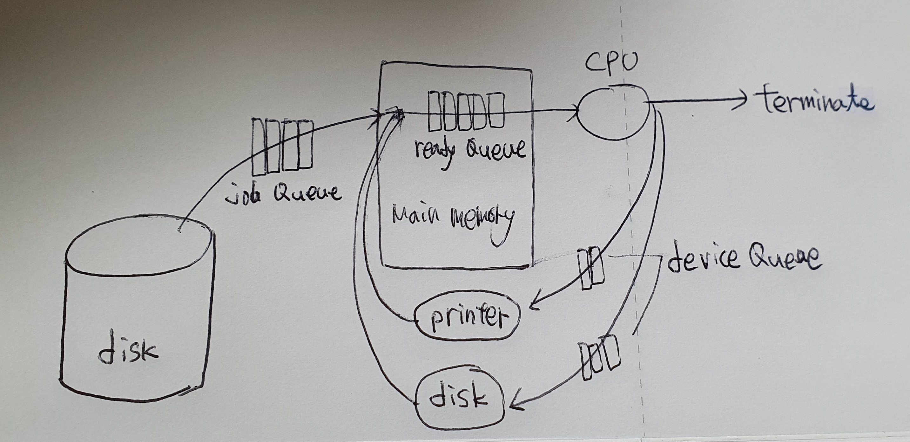

# 프로세스 관리

## 2.1 프로세스

+ 프로그램(program) vs 프로세스(process)
  + 프로그램 : 하드디스크에 설치된 다양한 APP. (program in execution)
  + 프로세스 : CPU에 의해 메인 메모리에 올라온 프로그램.
  + 무덤 속 프로그램(하드디스크 안) vs 살아 움직이는 프로세스 (메인 메모리 위)
+ process == task == job -> 대부분 비슷한 의미로 사용한다. <del>이후에 다시 설명</del>
+ 프로세스는 다음 값들의 변화를 갖는다.
  + text(code) + data + stack, pc(program counter), sp(step pointer), registers, ...

### 프로세스 상태

+ new, ready, running, waiting, terminated
+ new : 하드디스크에서 메인 메모리로 올라온 것.
+ ready : 초기화를 끝내고 실행할 준비가 된 것
+ running : cpu에 의해 실행 되는 것
+ waiting : 프린트, 하드디스크 등 i/o 작업으로 cpu를 사용하지 않아 잠시 멈춘 상태. 이 때 다른 프로세스가 동작한다. 다시 사용할 준비가 되면 ready로 이동.
+ terminated : 실행이 끝난 상태.
+ 
  + 멀티프로그래밍 시스템에서의 프로세스 상태
+ 
  + time-sharing 시스템에서의 프로세스 상태
  + running에서 ready 상태로 강제 스위칭하는 과정이 추가된다.

### PCB(Process Control Block)

+ == TCB(Task Control Block)
+ 프로세스 제어 블록
+ 프로세스에 대한 모든 정보가 들어있다.
  + process state(프로세스 상태. new, ready, 등)
  + PC(program counter, 몇번째 시작되나)
  + registers
  + MMU info(base, limit)(CPU에서 넘어온 주소 정보를 체크)
  + CPU time(사용 시간)
  + process id(pid)
  + list of open files(어떤 파일들을 사용했는가? ex, 메모장에서 연 파일 목록)
+ 사람과 비유? - 개인정보. 집주소, 주민등록번호 등의 개인 정보가 저장.
+ **OS의 process management** 안에 존재한다.
+ c언어라면 구조체로 개발되었을 것. <del>python이라면 class로 개발되었을까?</del>

### 프로세스 대기열 (Queue)

+ 큐(Queue) : first in first out. 먼저 들어온 것이 먼저 나가는 자료구조. 
  + 줄과 같으며 단순 큐 이외에도 우선순위 큐 등이 존재한다.
  + 중요도에 따라 줄을 세우는 방법이 다양하다.
+ 큐에는 누가 줄을 서는가?
  + 프로세스.
  + **더 정확히 말하면 PCB**가 줄을 서게된다.
+ 

#### 1. Job Queue

+ Job Queue
  + 하드디스크에서 메인 메모리에 올라가기 위해 프로그램들이 대기하는 것.
+ job scheduler
  + 줄 선것 중 어떤것을 먼저 메인 메모리 위에 올려야 할지 정하는 것
+ long-term scheduler
  + 프로그램이 종료 된 후 다른 프로그램이 올라갈 수 있기 때문에 굉장히 오랜 시간(몇 분~)을 기다려야 하는 스케쥴.

#### 2. Ready Queue

+ ready queue
  + 메인 메모리에 올라온 프로세스들이 CPU를 할당받기 위해 대기하는 것.
+ CPU scheduler
  + CPU를 할당받기 위해 줄서있는 프로세스 들 중 어떤것을 먼저 실행할지 정하는 것.
+ short-term scheduler
  + 1초에도 수십, 수백의 프로세스들이 번갈아가며 CPU를 할당받음. 아주 짧은 시간.

#### 3. Device Queue

+ device queue
  + 프린트, 디스크 등 장치를 사용하기 위해 대기하는 것.
+ device scheduler
  + 장치를 사용하기 위해 대기하는 것 중 어떤것을 먼저 실행할지 정하는 것

#### multiprogramming system

+ Degree of multiprogramming : 멀티프로그래밍의 정도. **메인 메모리에 몇개의 프로세스를 동작시킬 수 있는가?**
+ I/O-bound process vs CPU-bound process
  + I/O bound process : 입출력을 주로 하는 프로세서. ex)한컴, 워드 등의 프로그램
  + CPU-bound process : 연산을 주로 하는 프로세서. ex)일기예보 계산 등의 슈퍼컴퓨터.
+ **job queue에는 I/O bound와 CPU bound를 적절히 섞어서 올린다**
  + 모두 CPU를 많이 사용하게 되면 다른 프로세스가 사용되지 못할 수 있기 때문.

#### Midium-term scheduler

+ multiprogramming system, time sharing system 모두 가능
+ swap out : 사용하던 사람이 자리를 비우면 그 사람이 **사용하던 메모리를 디스크에 통째로 쫓아낸다.**
  + backing store == swap device : 하드디스크에서 프로그램을 저장하는 부분을 제외하고, **swap out된 메모리를 저장하는 영역.**
+ swap in : 자리를 비웠던 사람이 다시 **돌아오면 디스크에 보냈던 메모리를 다시 메인메모리에 올리는 것.**
+ **swapping** : swap out + swap in. 
+ swap out 된 프로그램 중에 어떤것을 swap in 할지 정하는 것.

### 관련 용어

+ Context switching(문맥 전환)
  + CPU를 사용하는 process의 전환.
  + 1번 프로세스를 사용하다가 2번 프로세스로 전환하는 것.
+ Scheduler
  + 지금 실행하는 프로세스(프로그램)가 끝나면 어떤 프로세스(프로그램)을 실행할지 결정하는 역할
+ Dispatcher
  + context switching을 시켜주는 역할(프로그램)
  + OS의 process management에 위치.
  + P1의 정보(MMU info 등)를 PCB P1에 저장하고, P2 실행을 위해 PCB P2의 정보를 복원(restore) 하는 역할
+ Context switching overhead
  + context switching을 할 때 생기는 부담.
  + context switching이 자주 일어날수록 부담이 커진다.
  + 때문에 dispatcher 프로그램은 고효율적으로 만들어져야 한다.
    + ex) 어셈블리어 등의 low-level language로 구현되어 효율을 높인다.

