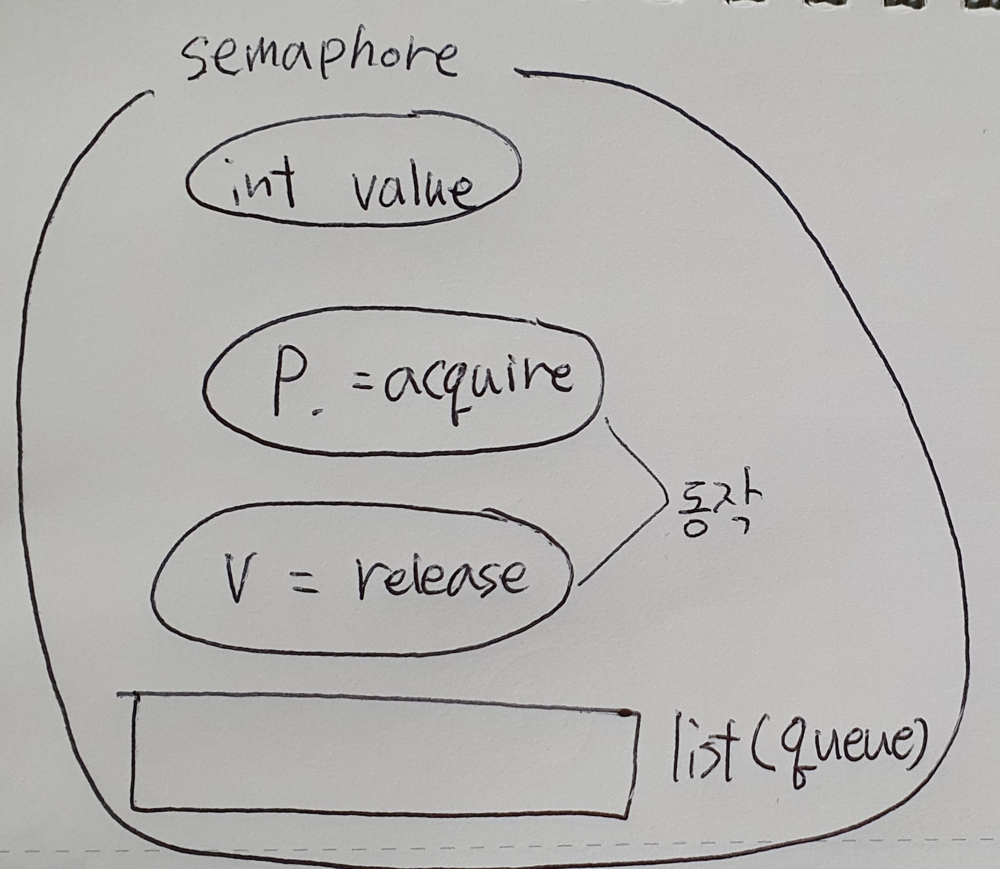
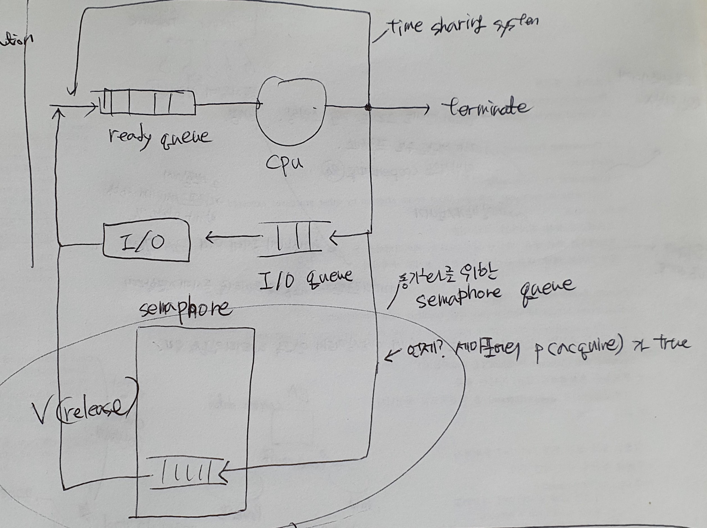
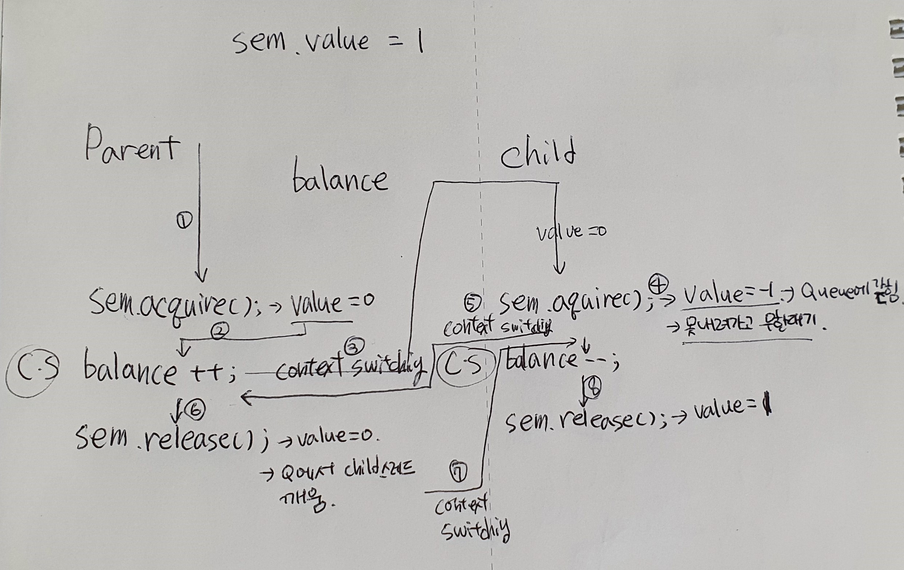
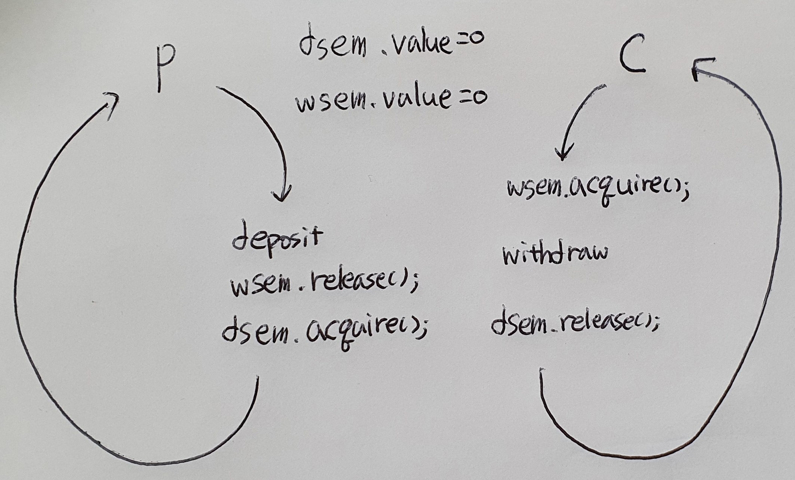

# 3. 프로세스 동기화<br>(Process synchronization)

+ 프로세스 동기화.
+ 스레드 동기화(Thread synchronization)라고도 부를 수 있다.
  + 엄연히 현대는 스레드를 기준으로 한 스위칭 방법을 사용한다.


## 3.1 Cooperating Processes

+ 프로세스는 `Independent` 한 프로세스와 `Cooperating`한 프로세스로 구분된다.
  + Independent : 각 프로세스 사이에 연관, 영향을 주지 않는다. 각각이 독립적 프로세스
  + Cooperating : 연관, 영향을 미치는 프로세스. 일반적으로 cooperating process가 많다.
    + cooperating process : 시스템 안 하나의 프로세스가 다른 프로세스에게 영향을 받거나, 미치는 경우, 그 프로세스.
  + 프로세스간 통신 : 전자우편, 파일 전송(파일/메일을 보내기, 받기)
  + 프로세스간 자원 공유 : 메모리 상의 자료들, 데이터 베이스 등
  + cooperating 예시
    + 명절 기차표 예약 : 만약 여기서 동기화가 일어나지 않으면 한 자리에 여러명이 예약 가능
    + 온라인 수강신청
    + 온라인 주식 거래 등


### Process Synchronization

+ 왜 하는가, 이유?

  + 공유 데이터에 동시에 접근하면 데이터가 일치하지 않을 수 있다. == 이상해 질 수 있다.
    + 위의 명절 기차표 예약처럼, 동기화가 일어나지 않으면 한 자리를 놓고 여러명이 예약 성공하는 경우가 나타날 수 있다.
  + 서로 영향을 주고 받는 프로세스에 순서를 잘 정해서 이상 상태가 되지 않고 데이터의 일관성을 유지할 수 있게 만든다.

+ EX) 은행 계좌 문제.

  + 부모는 은행 계좌에 입금, 자녀는 출금. 입금(deposit)과 출금(withdraw)는 독립적으로 일어난다.

  + ```java
    class Test {
        public static void main(String[] args)
        throws InterruptedException {
            BankAccount b = new
            BankAccount();
            Parent p = new Parent(b);
            Child c = new Child(b);
            p.start();
            c.start();
            p.join();
            c.join();
            System.out.println( "\nbalance = " + b.getBalance());
        }
    } 
    
    class BankAccount {
        int balance;
        void deposit(int amount) {
        	balance = balance + amount;
        }
        void withdraw(int amount) {
        	balance = balance - amount;
        }
        int getBalance() {
        return balance;
        }
    }
    
    class Parent extends Thread {
        BankAccount b;
        Parent(BankAccount b) {
        	this.b = b;
        }
        public void run() {
            for (int i=0; i<100; i++)
                b.deposit(1000);
    } 
        
    class Child extends Thread {
        BankAccount b;
        Child(BankAccount b) {
        	this.b = b;
        }
        public void run() {
            for (int i=0; i<100; i++)
                b.withdraw(1000);
        }
    } 
    ```

    위의 코드에는 시간지연 없음. 따라서 실행하면 결과값이 0이 나오게 됨. 

    같은 횟수로 1000원씩 입금과 출금이 일어나기 때문

  + but 시간지연을 추가하게 되면 잘못된 결과값이 나온다.

    + 실제로 시간지연을 추가하지 않더라도 낮은 확률로 결과값이 이상한것을 찾을 수 있다.
    + high level language를 어셈블리어로 변환하는 순간에 balance 값을 수정하는 순간이 발생할 수 있다. 
    + 0이 아닌 이상한 양수 또는 음수가 출력.
    + 이유 : 공통 변수(common variable)에 대한 동시 업데이트(concurrent update)
    + 해결 : 한번에 한 쓰레드만 업데이트 하도록 -> **임계구역 문제**
      + 공통 변수 업데이트 코드를 atomic하게(하나의 원자처럼 분리하지 않고 묶어서) 다룬다.


## 3.2 임계 구역(Critical Section) 문제

### critical section

+ Critical Section(임계 구역)

  + 여러개의 스레드(프로세스)로 이루어진 시스템에서, 각 스레드는 코드 영역을 가지고 있는데, **공유 자원(표, 파일 등)을 바꾸거나, 업데이트, 쓰기 등을 공유 코드 영역**을 *Critical Section*이라고 한다.

  + 위의 은행 계좌 문제에서 공유 자원인 *balance*를 수정하는 코드를 critical section이라고 한다.

    + ```java
      class BankAccount {
          int balance;
          void deposit(int amount) {
          	balance = balance + amount;	// critical section
          }
          void withdraw(int amount) {
          	balance = balance - amount;	// critical section
          }
          int getBalance() {
          return balance;
          }
      }
      ```

+ Critical Section Problem

  + **임계 구역(critical section)에 있는 코드가 동시에 업데이트** 되어 결과값이 이상해지는 것.

+ 해결 방법

  + 아래의 3가지 조건을 만족해야한다.

  1. Mutual exclusion (상호 배타) 
     + 한 스레드에서 critical section에 진입하면 다른 스레드에서는 진입할 수 없다.
     + 많아야 한 스레드만 진입한다.
     + ex) parent 스레드에서 balance 값을 변경하는 critical section에 진입하면, child 스레드는 끝날때까지 대기해야한다.
  2. Progress (진행)
     + 누가 먼저 critical section에 들어갈지 유한시간 내에 결정해야한다.
  3. Bounded waiting (유한 대기)
     + 기다리고 있는 한, 어느 스레드라도 유한 시간 내에 진입할 수 있다.

+ 이 임계 구역 문제를 해결하기 위해서는 **프로세스/스레드** 동기화가 필요하다.


### 프로세스/스레드 동기화

+ O/S의 역할

  1. process mgmt
     1. CPU scheduling
     2. Process synchronization
  2. memory mgmt
  3. file system
  4. I/O system
  5. ...

  + 위에서 볼 수 있듯 O/S의 process management 부분에서는 크게 CPU 스케쥴링과 프로세스 동기화를 중요하게 다룬다.

+ 프로세스/스레드 동기화를 하는 이유

  + 임계 구역 문제 해결
    + 이상한 답이 나오지 않도록 문제를 해결한다.
    + 상호배타, 진행, 유한 대기의 3가지 조건을 모두 만족시킨다.
  + 프로세스 실행 순서 제어
    + 우리가 원하는대로 프로세스 안의 스레드 실행 순서를 제어할 수 있다. 


## 3.2 세마포(Semaphore)

### 세마포(semaphore)

+ Synchronization tools (동기화 도구)

  + Semaphores : 세마포어. 고전적인 방법
  + Monitors : 모니터. 자바에서 많이 사용

+ Semaphore

  + 동기화 문제 해결을 위한 소프트웨어 도구
  + 구조 : 정수형 변수 + 두 개의 동작(P, V)
    + P : acquire() : test
    + V : release() : 증가

  

+  전체 구조

  + 내부적으로 프로세스(스레드)가 대기하는 큐(queue/list)가 포함되어있다.

  + ```java
    class Semaphore{
        private int value;	// number of permits. (쉽게 생각하면 한번에 몇개의 세마포를 허용할것인가.)
        Semaphore(int value){
            ...
        }
        void acquire() {
            ...				// P
        }
        void release() {
            ...				// V
        }
    }
    ```

+ 세부 동작

  ```java
  void acquire(){
      value--;
      if (value < 0){
          add this process/thread to list;	// 큐에 실행 프로세스를 넣는다.
          block;	// 큐에 넣은 프로세스가 누가 빼줄 때 까지 대기
      }
  }
  void release() {
      value++;
      if (value <= 0) {
          remove a process P from list;	// 큐에서 부터 프로세스 P를 빼낸다.
          wakeup P;	// block 되어있던 프로세스를 깨운다.
      }
  }
  ```
  
+ 


### 일반적인 사용

1. Mutual exclusion(상호 배타)

   + 한번에 하나씩의 스레드만 critical section에 들어가게 한다.

   + **sem.value = 1;**

     + semaphore 변수를 1로 설정한다.
   
   + | sem.acquire();   |
     | ---------------- |
  | Critical Section |
     | Sem.release();   |
   
     우리가 수정해야할 critical section 전에는 semaphore의 acquire코드를, 후에는 release 코드를 실행한다.
     
   + 
   
   + ```java
     import java.util.concurrent.Semaphore;
     
     class BankAccount {
         int balance;
         Semaphore sem;
         BankAccount() {
             sem = new Semaphore(1);	// 초기값 = 1
         }
         void deposit(int amount) {	// 입금
             try {
                 sem.acquire();	// C.S 진입 전 : acquire()
             } catch (InterruptedException e) {}
             int temp = balance + amount;
             System.out.print("+");
             balance = temp;	// critical section
             sem.release();	// 나온 후 : release()
         }
         void withdraw(int amount){	// 출금
             try {
                 sem.acquire();	// 진입 전 : acquire();
             } catch (InteruptedException e) {}
             int temp = balance - amount;
             System.out.print("-");
             balance = temp;	// critical section
             sem.release();	// 나온 후 : release()
         }
         int getBalance(){
             return balance;
         }
     }
     ```
   
2. Ordering (순서 설정)

   + CPU 스케쥴링에 따른 순서가 있어도 우리가 설정한 순서대로 스레드가 실행하게 만든다.
   + 상호배타를 위해 만든 sem 세마포어 이외의 다른 세마포어 sem2를 만들어 사용한다. 아래에서는 임의로 sem2를 sem이라 적는다.

   1. 항상 입금 먼저 (Parent 먼저)

      **sem.value = 0;**

      | Parent        | Child         |
      | ------------- | ------------- |
      |               | sem.acquire() |
      | deposit       | withdraw      |
      | sem.release() |               |

      부모 스레드는 critical section을 바로 실행할 수 있다. 그러나 자식 스레드는 acquire()를 호출하여 value 값을 -1 하고 queue에 추가된다. 

      부모스레드가 끝나면 value 값을 +1하고 queue에 갇힌 스레드가 존재하면 실행할 수 있게 만든다.

   2. 항상 출금 먼저 (Child 먼저)

      1번과 동일하게 하면 된다.

      **sem.value = 0;**

      | Parent        | Child         |
      | ------------- | ------------- |
      | sem.acquire() |               |
      | deposit       | withdraw      |
      |               | sem.release() |

      + 1번과 2번에서는 입출금이 교대로 일어나지 않는다. 입금이 여러번 나타날 수 있으며, 출금이 연달아 나타날 수 있다.

      

   3. 입출금 교대로 (P-C-P-C-P-C-...) (그중에서도 입금 먼저 시작)

      입금 세마포 : **dsem**

      출금 세마포 : **wsem**

      각 스레드의 블락(block)을 위해 세마포어를 두개 둔다.

      **dsem.value = 0**		**wsem.value = 0**

      | Parent         | Child          |
      | -------------- | -------------- |
      |                | wsem.acquire() |
      | deposit        | withdraw       |
      | wsem.release() | dsem.release() |
      | dsem.acquire() |                |

      입금이 먼저 일어나게 하기 위해 부모 스레드는 바로 시작. 자식 스레드는 출금 세마포어의 acquire()에 의해 블락된다.

      입금이 일어난 후, 큐에 갇힌 자식 스레드를 풀어준 후(wsem.release()) 부모 스레드를 블락한다.(desm.acquire())

      탈출한 자식 스레드는 출금을 한 후 부모 스레드를 풀어준다.(dsem.release())

      

      

      


