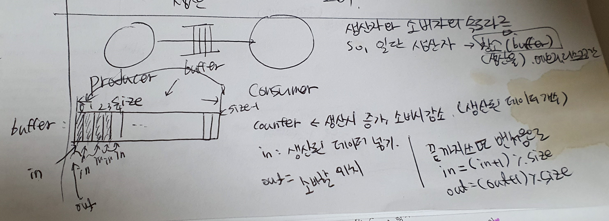

# 3. 프로세스 동기화<br>(Process synchronization)

+ 프로세스 동기화.
+ 스레드 동기화(Thread synchronization)라고도 부를 수 있다.
  + 엄연히 현대는 스레드를 기준으로 한 스위칭 방법을 사용한다.


## 3.1 Cooperating Processes

+ 프로세스는 `Independent` 한 프로세스와 `Cooperating`한 프로세스로 구분된다.
  + Independent : 각 프로세스 사이에 연관, 영향을 주지 않는다. 각각이 독립적 프로세스
  + Cooperating : 연관, 영향을 미치는 프로세스. 일반적으로 cooperating process가 많다.
    + cooperating process : 시스템 안 하나의 프로세스가 다른 프로세스에게 영향을 받거나, 미치는 경우, 그 프로세스.
  + 프로세스간 통신 : 전자우편, 파일 전송(파일/메일을 보내기, 받기)
  + 프로세스간 자원 공유 : 메모리 상의 자료들, 데이터 베이스 등
  + cooperating 예시
    + 명절 기차표 예약 : 만약 여기서 동기화가 일어나지 않으면 한 자리에 여러명이 예약 가능
    + 온라인 수강신청
    + 온라인 주식 거래 등


### Process Synchronization

+ 왜 하는가, 이유?

  + 공유 데이터에 동시에 접근하면 데이터가 일치하지 않을 수 있다. == 이상해 질 수 있다.
    + 위의 명절 기차표 예약처럼, 동기화가 일어나지 않으면 한 자리를 놓고 여러명이 예약 성공하는 경우가 나타날 수 있다.
  + 서로 영향을 주고 받는 프로세스에 순서를 잘 정해서 이상 상태가 되지 않고 데이터의 일관성을 유지할 수 있게 만든다.

+ EX) 은행 계좌 문제.

  + 부모는 은행 계좌에 입금, 자녀는 출금. 입금(deposit)과 출금(withdraw)는 독립적으로 일어난다.

  + ```java
    class Test {
        public static void main(String[] args)
        throws InterruptedException {
            BankAccount b = new
            BankAccount();
            Parent p = new Parent(b);
            Child c = new Child(b);
            p.start();
            c.start();
            p.join();
            c.join();
            System.out.println( "\nbalance = " + b.getBalance());
        }
    } 
    
    class BankAccount {
        int balance;
        void deposit(int amount) {
        	balance = balance + amount;
        }
        void withdraw(int amount) {
        	balance = balance - amount;
        }
        int getBalance() {
        return balance;
        }
    }
    
    class Parent extends Thread {
        BankAccount b;
        Parent(BankAccount b) {
        	this.b = b;
        }
        public void run() {
            for (int i=0; i<100; i++)
                b.deposit(1000);
    } 
        
    class Child extends Thread {
        BankAccount b;
        Child(BankAccount b) {
        	this.b = b;
        }
        public void run() {
            for (int i=0; i<100; i++)
                b.withdraw(1000);
        }
    } 
    ```

    위의 코드에는 시간지연 없음. 따라서 실행하면 결과값이 0이 나오게 됨. 

    같은 횟수로 1000원씩 입금과 출금이 일어나기 때문

  + but 시간지연을 추가하게 되면 잘못된 결과값이 나온다.

    + 실제로 시간지연을 추가하지 않더라도 낮은 확률로 결과값이 이상한것을 찾을 수 있다.
    + high level language를 어셈블리어로 변환하는 순간에 balance 값을 수정하는 순간이 발생할 수 있다. 
    + 0이 아닌 이상한 양수 또는 음수가 출력.
    + 이유 : 공통 변수(common variable)에 대한 동시 업데이트(concurrent update)
    + 해결 : 한번에 한 쓰레드만 업데이트 하도록 -> **임계구역 문제**
      + 공통 변수 업데이트 코드를 atomic하게(하나의 원자처럼 분리하지 않고 묶어서) 다룬다.


## 3.2 임계 구역(Critical Section) 문제

### critical section

+ Critical Section(임계 구역)

  + 여러개의 스레드(프로세스)로 이루어진 시스템에서, 각 스레드는 코드 영역을 가지고 있는데, **공유 자원(표, 파일 등)을 바꾸거나, 업데이트, 쓰기 등을 공유 코드 영역**을 *Critical Section*이라고 한다.

  + 위의 은행 계좌 문제에서 공유 자원인 *balance*를 수정하는 코드를 critical section이라고 한다.

    + ```java
      class BankAccount {
          int balance;
          void deposit(int amount) {
          	balance = balance + amount;	// critical section
          }
          void withdraw(int amount) {
          	balance = balance - amount;	// critical section
          }
          int getBalance() {
          return balance;
          }
      }
      ```

+ Critical Section Problem

  + **임계 구역(critical section)에 있는 코드가 동시에 업데이트** 되어 결과값이 이상해지는 것.

+ 해결 방법

  + 아래의 3가지 조건을 만족해야한다.

  1. Mutual exclusion (상호 배타) 
     + 한 스레드에서 critical section에 진입하면 다른 스레드에서는 진입할 수 없다.
     + 많아야 한 스레드만 진입한다.
     + ex) parent 스레드에서 balance 값을 변경하는 critical section에 진입하면, child 스레드는 끝날때까지 대기해야한다.
  2. Progress (진행)
     + 누가 먼저 critical section에 들어갈지 유한시간 내에 결정해야한다.
  3. Bounded waiting (유한 대기)
     + 기다리고 있는 한, 어느 스레드라도 유한 시간 내에 진입할 수 있다.

+ 이 임계 구역 문제를 해결하기 위해서는 **프로세스/스레드** 동기화가 필요하다.


### 프로세스/스레드 동기화

+ O/S의 역할

  1. process mgmt
     1. CPU scheduling
     2. Process synchronization
  2. memory mgmt
  3. file system
  4. I/O system
  5. ...

  + 위에서 볼 수 있듯 O/S의 process management 부분에서는 크게 CPU 스케쥴링과 프로세스 동기화를 중요하게 다룬다.

+ 프로세스/스레드 동기화를 하는 이유

  + 임계 구역 문제 해결
    + 이상한 답이 나오지 않도록 문제를 해결한다.
    + 상호배타, 진행, 유한 대기의 3가지 조건을 모두 만족시킨다.
  + 프로세스 실행 순서 제어
    + 우리가 원하는대로 프로세스 안의 스레드 실행 순서를 제어할 수 있다. 


## 3.2 세마포(Semaphore)

### 세마포(semaphore)

+ Synchronization tools (동기화 도구)

  + Semaphores : 세마포어. 고전적인 방법
  + Monitors : 모니터. 자바에서 많이 사용

+ Semaphore

  + 동기화 문제 해결을 위한 소프트웨어 도구
  + 구조 : 정수형 변수 + 두 개의 동작(P, V)
    + P : acquire() : test
    + V : release() : 증가

  

+  전체 구조

  + 내부적으로 프로세스(스레드)가 대기하는 큐(queue/list)가 포함되어있다.

  + ```java
    class Semaphore{
        private int value;	// number of permits. (쉽게 생각하면 한번에 몇개의 세마포를 허용할것인가.)
        Semaphore(int value){
            ...
        }
        void acquire() {
            ...				// P
        }
        void release() {
            ...				// V
        }
    }
    ```

+ 세부 동작

  ```java
  void acquire(){
      value--;
      if (value < 0){
          add this process/thread to list;	// 큐에 실행 프로세스를 넣는다.
          block;	// 큐에 넣은 프로세스가 누가 빼줄 때 까지 대기
      }
  }
  void release() {
      value++;
      if (value <= 0) {
          remove a process P from list;	// 큐에서 부터 프로세스 P를 빼낸다.
          wakeup P;	// block 되어있던 프로세스를 깨운다.
      }
  }
  ```
  
+ 


### 일반적인 사용

1. Mutual exclusion(상호 배타)

   + 한번에 하나씩의 스레드만 critical section에 들어가게 한다.

   + **sem.value = 1;**

     + semaphore 변수를 1로 설정한다.
   
   + | sem.acquire();   |
     | ---------------- |
   | Critical Section |
     | Sem.release();   |
   
     우리가 수정해야할 critical section 전에는 semaphore의 acquire코드를, 후에는 release 코드를 실행한다.
     
   + 
   
   + ```java
     import java.util.concurrent.Semaphore;
     
     class BankAccount {
         int balance;
         Semaphore sem;
         BankAccount() {
             sem = new Semaphore(1);	// 초기값 = 1
         }
         void deposit(int amount) {	// 입금
             try {
                 sem.acquire();	// C.S 진입 전 : acquire()
             } catch (InterruptedException e) {}
             int temp = balance + amount;
             System.out.print("+");
             balance = temp;	// critical section
             sem.release();	// 나온 후 : release()
         }
         void withdraw(int amount){	// 출금
             try {
                 sem.acquire();	// 진입 전 : acquire();
             } catch (InteruptedException e) {}
             int temp = balance - amount;
             System.out.print("-");
             balance = temp;	// critical section
             sem.release();	// 나온 후 : release()
         }
         int getBalance(){
             return balance;
         }
     }
     ```
   
2. Ordering (순서 설정)

   + CPU 스케쥴링에 따른 순서가 있어도 우리가 설정한 순서대로 스레드가 실행하게 만든다.
   + 상호배타를 위해 만든 sem 세마포어 이외의 다른 세마포어 sem2를 만들어 사용한다. 아래에서는 임의로 sem2를 sem이라 적는다.

   1. 항상 입금 먼저 (Parent 먼저)

      **sem.value = 0;**

      | Parent        | Child         |
      | ------------- | ------------- |
      |               | sem.acquire() |
      | deposit       | withdraw      |
      | sem.release() |               |

      부모 스레드는 critical section을 바로 실행할 수 있다. 그러나 자식 스레드는 acquire()를 호출하여 value 값을 -1 하고 queue에 추가된다. 

      부모스레드가 끝나면 value 값을 +1하고 queue에 갇힌 스레드가 존재하면 실행할 수 있게 만든다.

   2. 항상 출금 먼저 (Child 먼저)

      1번과 동일하게 하면 된다.

      **sem.value = 0;**

      | Parent        | Child         |
      | ------------- | ------------- |
      | sem.acquire() |               |
      | deposit       | withdraw      |
      |               | sem.release() |

      + 1번과 2번에서는 입출금이 교대로 일어나지 않는다. 입금이 여러번 나타날 수 있으며, 출금이 연달아 나타날 수 있다.

      

   3. 입출금 교대로 (P-C-P-C-P-C-...) (그중에서도 입금 먼저 시작)

      입금 세마포 : **dsem**

      출금 세마포 : **wsem**

      각 스레드의 블락(block)을 위해 세마포어를 두개 둔다.

      **dsem.value = 0**		**wsem.value = 0**

      | Parent         | Child          |
      | -------------- | -------------- |
      |                | wsem.acquire() |
      | deposit        | withdraw       |
      | wsem.release() | dsem.release() |
      | dsem.acquire() |                |

      입금이 먼저 일어나게 하기 위해 부모 스레드는 바로 시작. 자식 스레드는 출금 세마포어의 acquire()에 의해 블락된다.

      입금이 일어난 후, 큐에 갇힌 자식 스레드를 풀어준 후(wsem.release()) 부모 스레드를 블락한다.(desm.acquire())

      탈출한 자식 스레드는 출금을 한 후 부모 스레드를 풀어준다.(dsem.release())

      

      

      


전통적 동기화 문제(Classical Synchronization Problems)

1. Producer and Consumer Problem
   + 생상자-소비자 문제
   + 유한 버퍼 문제(Bounded Buffer Problem)
2. Readers-Writers Problem
   + 공유 데이터베이스 접근
3. Dining Philosopher Problem
   + 식사하는 철학자 문제


## 3.4 생산자-소비자 문제

### Producer and Consumer Problem

+ 생산자가 데이터를 생산하면 소비자는 그것을 소비한다.
  + ex) 컴파일러 -> 어셈블러 
    + 컴파일러 : high level language를 어셈블리어로 변환	: 생산자
    + 어셈블러 : 어셈블리어를 기계어로 번역(10101000010) : 소비자
  + ex) 파일 서버 -> 클라이언트
  + ex) 웹 서버 -> 웹 클라이언트
    + 위 두개 다 서버라는 생산자가 생성. 클라이언트라는 소비자가 소비.
+ 생산된 데이터는 일단 **버퍼**에 저장.
  + 생산자와 소비자의 속도 차이가 난다. 이 때 생산한 데이터를 한번에 다 써버리면 안되기 때문에 일단 버퍼라는 창고에 저장한다.
  + ex) 농부가 가을에 추수를 하면 쌀이 많이나온다. 이때 쌀을 저장해서 1년을 소비한다.
+ 현실세계에서 **버퍼는 유한한 크기**이다.
  + 보통 메모리에 저장한다. 메모리는 유한하다.(=bounded buffer)
+ **생산자는 버퍼가 가득차면 더 넣을 수 없다.**
+ **소비자는 버퍼가 비면 뺄 수 없다.**


### 동작



+ 사용 변수
  + in  : 생산된 데이터 넣는 위치 변수
    + 끝까지 쓰면 맨 처음으로 가야하기 때문에
    + in = (in + 1) % size
  + out : 소비할 데이터 위치 변수
    + out = (out + 1) % size
  + count : 생산된 데이터 개수 : 생산시 증가, 소비시 감소
+ 동작
  + 생산자가 생산하며 in 증가, count 증가
  + 소비자가 소비하며 out 증가, count 감소


### 오류

+ 결과
  + 실행불가
  + count != 0 (생산된 항목 숫자 != 소비한 항목 숫자)
  + 최종적으로 버퍼 내에는 0개의 항목이 있어야 하지만 그렇지 못하다.
+ 이유
  + 공통변수 count, buf[]에 대한 동시 업데이트
  + 공통변수 업데이트 구간(=임계구역, critical section)에 동시 진입
+ 해결법
  + 임계구역에 대한 동시 접근 방지 (상호 배타)
  + 세마포(semaphore)를 이용한 상호 배타
  + 세마포 : mutex.value (of permit)
    + mutex 라는 이름의 세마포 사용
    + 허가는 1개만


### 상호배타 처리한 동작


+ 하지만 이 경우에는 약간의 시간지연. 즉 무한루프가 될게 될 수 있다.
+ 기다리면서 무한루프를 돌기 때문에 이를 busy-wait라 부른다.
  + 생산자 : 버퍼가 가득 차면 기다림 = 빈 공간(empty) 세마포
  + 소비자 : 버퍼가 비면 기다림 = 찬 공간 (full) 세마포
+ 세마포를 이용한 busy-wait 회피


### busy-wait 회피

+ empty.value = buffer_size
+ full.value = 0

| Producer        | Consumer        |
| --------------- | --------------- |
| empty.acquire() | full.acquire()  |
| Produce         | Consume         |
| full.release()  | empty.release() |


## 3.5 읽기-쓰기 문제

### Readers-Writers Problem

+ 공통 데이터베이스
  + reader : 읽기만 가능
  + writer : 읽고 **수정**가능
  + 상호 배타 : 한 번에 하나의 프로세스만 접근
    + 비효율적이다.
    + 수정하지 않는 선에서 동시 접근가능하게 하자
    + **reader가 Critical Section에 진입해있을 때 reader는 접근 가능!**
+ 
+ 효울성 제고
  + 공유 데이터를 사용하는 각각의 reader와 writer는 임계구역에 동시 진입하는 상황이 발생하게 된다.
  + wirter에 있어서는 상호배타(mutual exclusion)을 필수로 지켜야한다.
  + reader에 있어서는 이미 reader가 critical section에 진입해 있어도 진입 가능하다.


## 3.6 식사하는 철학자 문제

### Dining Philosoper Problem

+ 5명의 철학자, 5개의 젓가락(1쌍 아니고 1개씩 5개)이 존재.
+ 한명의 철학자가 식사를 하려면 왼쪽 젓가락 한개, 오른쪽 젓가락 한개. 총 2개가 필요.
+ 각 철학자들이 생각 -> 식사 -> 생각 -> 식사 -> 생각 ... 을 번갈아가면서 반복. 
+ 젓가락은 왼쪽부터 잡는다. 왼쪽->오른쪽
+ 한명이 젓가락을 잡으면, 다른 사람은 그 젓가락을 잡지 못한다.
+ 


### 오류

+ 코드를 실행시키면 **starvation** 발생.
  + 모든 철학자가 식사를 하지 못해 굶어 죽는 상황
  + 모든 철학자들이 왼쪽 젓가락만 들고 있는 상황이 발생한다. => 이것을 교착상태라고 한다.
+ 원인 : **교착상태**


## 3.7 교착상태 (Deadlock)

### 교착상태

+ 어떤 자원이 가진 프로세스를 다른 자원이 가지려고 무한히 기다리는 현상
+ 프로세스는 실행을 위해 여러 자원을 필요로 한다.
  + CPU, 메모리, 파일, 프린터, ...
  + 필요한 자원이 A, B 일 때, A는 갖고있으나 B는 갖고 있지 못하면(e.g. 다른 프로세스가 사용 중) B를 가지기 위해 대기해야한다.
  + 다른 프로세스 역시 다른 자원을 가지려고 대기할 때 교착상태가 일어날 가능성이 생긴다.


### 교착상태 필요 조건(Necessary Conditions)

+ 아래 4가지 조건이 모두 만족되어야 교착상태가 일어날 수도 있다.(가능성이 있다)

1. Mutual exclusion(상호 배타)
   + 서로 자원을 공유하지 않는다.
   + ex) cpu를 동시에 사용하는 것 처럼 보이게 할 수는 있지만, 동시에 사용할 수는 없다.
2. Hold and wait (보유 및 대기)
   + 지금 가진 자원을 잡고 무한히 대기한다.
3. No Preemption (비선점)
   + 먼저 다른 프로세스가 점유한 자원을 뺏지 못한다.
4. Circula wait (환형 대기)
   + 원형으로 동그랗게 대기한다.
   + 맨 처음에 줄 선 사람이 가지고 있는 자원을 맨 마지막 사람이 필요로 하는 경우


### 자원 (Resources)

+ 동일 형식 (type) 자원이 여러개 있을 수 있다.(instance)
+ ex) 동일 CPU 2 개, 동일 프린터 3개 등


### 자원의 사용

+ 요청 (request) -> 사용 (use) -> 반납 (release)


### 자원 할당도 (Resource Allocation Graph)

+ 아래 두가지를 나타내주는 그래프
  + 어떤 자원이 어떤 프로세스에게 할당되었는가?
  + 어떤 자원이 어떤 자원을 할당받으려고 기다리고 있는가?
+ 표현
  + 자원 : 사각형
  + 프로세스 : 원
  + 할당 : 화살표
+ 
  + P1은 R2를 사용하고 있으며, R1을 기다리는 중이다
  + P2는 R1, R2를 사용하고 있으며, R3를 기다리는 중이다.
  + P3는 R3를 사용하고 있다.
  + R4는 놀고있다.
+ 자원에서 프로세스로 화살표가 이어져 있으면 자원을 할당(assign)받은 것이다.
+ 프로세스에서 자원으로 화살표가 이어져 있으면 자원을 요청(request)한 것이다.


### 교착상태 처리

+ 교착상태는 위의 교착상태 필요조건을 모두 만족해야만 일어날 가능성이 존재한다.
  + 충분조건이 아니다!
+ 그 중 식사하는 철학자 문제는 교착상태가 발생했다. == 환형대기가 일어났다.
  + 
  + 원을 파괴한다면?
    + 짝수는 왼쪽, 오른쪽의 순서
    + 홀수는 오른쪽, 왼쪽의 순서대로 자원을 요청한다.
  + 교착상태가 처리된다.


## 3.8 교착상태 처리

### Handing deadlocks

+ 교착 상태 발생 필요조건 중 하나라도 파괴되면 교착상태는 깨진다.

1. 교착상태 방지 (Deadlock prevention)
   + 미리 일어나기 전에 교착상태 필요조건을 결여
2. 교착상태 회피 (Deadlock Avoidance)
   + 가능성이 있어 보여도 미리 계산해서 피함
3. 교착상태 검출 및 복구 (Deadlock Detection & Recovery)
   + 발생하게 되면 발견하고 처리
4. 교착상태 무시 (Don't Care)
   + 발생해도 무시


### 교착상태 방지(Deadlock Prevention)

+ 교착상태가 일어나도 수정할 수 없는 경우에 사용한다.
  + 미사일의 발사 범위, 발사한 로켓의 이동범위 등
+ 교착상태 4가지 조건 중 **한 가지 이상을 결여**시킨다
  + 상호 배타(Mutual exclusion)
  + 보유 및 대기(hold and wait)
  + 비선점 (No preemption)
  + 환형 대기(Circluar wait)
+ 상호 배타(Mutual exclusion)
  + 자원을 공유 가능하게 만든다.
  + 일반적으로 불가능하다. 
    + context switching을 해도 CPU를 동시 사용은 불가능. 동시 사용하게 하는 것 처럼 보이는 것 뿐.
  + 읽기만 하는 파일에서는 가능할 수도 있다.
+ 보유 및 대기(Hold and wait)
  + 자원을 가지고 있으면서 다른 자원을 기다리지 않게 만든다.
    + ex) 자원이 없는 상태에서는 모든 자원은 대기한다.
    + ex) 일부 자원만 사용할 수 있으면 잡은 후 놓아준다. => 잡고 대기 X
  + 단점 
    + 자원 활용율 저하 : 자원을 잡았다가 놓아주면 활용율이 떨어진다.
    + 기아(starvation) : 여러개의 자원을 한번에 잡을 확률은 떨어진다.
+ 비선점(No preemption)
  + 자원을 선점 가능하게 만든다.
  + 일반적으로 불가능하다.
    + 프린터를 선점하게 되면 출력하고 있는 문서가 뒤섞일 수 있다.
    + CPU 등을 강제로 뺐어서 줄 수는 있다.
+ 환형 대기(Circular wait)
  + 자원에 번호를 부여하여 오름차순 / 내림차순 등의 순서대로만 자원을 요청하게 만든다. =>강제로 선형으로 만든다.
    + 0, 1, 2, 3, 4, 5 의 환형 대기가 있을 때 오름차순 요청이면 
    + 0, 1, 2, 3, 4, 5 까지 요청 후 5가 0을 요청할 수 없다.
  + 단점 : 자원 활용률 저하 => 이것 역시 순서대로 처리를 해야하기 때문에 뒷편의 자원은 제대로 활용 못할 수 있다.


### 교착상태 회피 (Deadlock Avoidance)

+ 여기서 **교착상태**란 **자원 요청에 대한 잘못된 승인**이라고 생각한다.

+ 이 잘못된 승인을 하지 않고 미리 회피하는 것을 교착상태 회피라 한다.

+ 자원 요청을 제대로 할당해 교착상태가 일어나지 않으면 **안전한 할당(Safe allocation)** 이라 한다.

+ 반대로 자원요청을 제대로 할당하지 못해 교착상태가 발생하면 **불안전한 할당(Unsafe allocation)**이라 한다.

+ ex) 안전한 할당

  + | Process | Max needs | Current needs |
    | ------- | --------- | ------------- |
    | P0      | 10        | 5             |
    | P1      | 4         | 2             |
    | P2      | 9         | 2             |

    

+ ex)불안전한 할당

  + | Process | Max needs | Current needs |
    | ------- | --------- | ------------- |
    | P0      | 10        | 5             |
    | P1      | 4         | 2             |
    | P2      | 9         | 3             |

    

+ 운영체제는 자원을 할당할 때 불안전 할당 되지 않도록 한다.

+ 불안전 할당 => 교착상태

+ 대출 전문 은행과 유사 : Banker's Algorithm


### 교착상태 검출 및 복구(Deadlock Detection & Recovery)

+ 교착상태가 일어나는 것을 허용.
  + 일단 자원을 다 준다.
  + 이것을 주기적 검사하고, 
  + 교착상태 발생 시 복구한다.
+ 검출 (Detection)
  + 검사에 다른 추가 부담이 존재한다.(overhead) : 계산, 메모리
+ 복구(Recovery)
  + 프로세스 일부 강제 종료
  + 자원 선점하여 일부 프로세스에게 할당
  + 이전 설정으로 되돌릴 필요가 있으면 이전 작업 기억(overhead)


### 교착상태 무시

+ 교착상태는 잘 일어나지 않는다.
  + 때문에 무시한다.
  + 4가지 필요조건을 모두 만족해도 그냥 사용한다.
+ 교착상태 발생 시 재시동(PC 재부팅 등)


## 3.9 모니터(Monitor)

### 모니터

+ 세마포 이후로 나온 프로세스 동기화 도구 => 주로 자바에서 사용
+ 세마포 보다 고수준 개념


### 구조

+ 공유자원 + 공유자원 접근 함수
+ 2개의 queue
  + 배타 동기 (Mutual exclusion)
  + 조건 동기 (Conditional synchronization)
+ 
+ 공유자원 접근 함수에는 최대 1개의 스레드만 진입 가능
+ 진입 스레드가 조건동기로 블록되면 새 스레드 진입 가능
+ 새 스레드는 조건동기로 블록된 스레드를 깨울 수 있다.
+ 깨워진 스레드는 현재 스레드가 나가면 재진입 할 수 있다.


+ 다시 설명하면, 배타동기를 사용하여 먼저 들어오는 스레드를 처리하며, 들어온것에 대해 조건동기를 사용하여 큐에 넣어 블록하거나, 블록된것을 꺼낸다.


+ 자바의 모든 객체는 모니터가 될 수 있다.
  + 배타 동기 : synchronized() 키워드 사용하여 지정
  + 조건 동기 
    + wait() : 큐에 넣는 것
    + notify() : 큐에 넣은것을 깨우는 것
    + notifyAll() : 큐에 있는 것을 모두 깨우는 것


### 사용

1. Mutual exclusion

   ```java
   synchronized{
       Critical-Section
   }
   ```

   + Mutual exclusion을 처리하기 위해서는 `synchronized`로 묶어서 사용한다.

   + 이 과정이 세마포의 `acquire()`과 `release()`를 사용하는 것을 대신한다.

   + ```java
     synchronized void deposit(int amount) {
         ...
     }
     synchronized void withdraw(int amount) {
         ...
     }
     ```

     + 위처럼 표시하면 알아서 세마포의 acquire과 release를 사용하게 된다.

2. Ordering

   | P1      | P2        |
   | ------- | --------- |
   | wait(); |           |
   | S1      | S2        |
   |         | notify(); |

   + wait로 P1를 블록한 후 P2부터 모두 처리. 끝나면 P1 블록을 해제한다.

3. 교대 순서 (P-C-P-C)

   | P               | C                     |
   | --------------- | --------------------- |
   | notify();       | while(parent) wait(); |
   | S1              | notify();             |
   | parent = false; | S2                    |
   | wait();         | parent = ture;        |
   |                 | wait();               |

   + parent = true로 두고 자식은 parent가 true일 동안 무한 대기
   + 그 사이 부모는 입금실행 후 parent 를 false로 변경. 대기.
   + parent가 false가 되면 자식 출금 실행 후 parent를 true로 변경 및 대기

