# 4. 주기억장치 관리<br>(Main Memory Management)

## 4.1 메모리 역사

+ 메모리의 종류
  + Core memory
    + 원형 코일(?)에 자석물질을 발라 전기를 가하면 자장이 발생한다. (플레밍의 오른손법칙)에 따라 전기의 방향을 다르게 하여 자장을 기록한다.
  + 진공관 메모리
    + 50~60년대 사용.
    + core 메모리와 진공관 메모리 때에는 메모리가 아주 비싼 자원이었다.
  + 트렌지스터 메모리 
    + 70~80년대
  + 집적회로 메모리
    + SRAM :캐시 저장
    + DRAM : 메인 메모리
+ 메모리의 용량
  + 1970년대 : 8bit PC, 64KB
  + 1980년대 : 16bit IBM-PC, 640KB -> 1MB -> 4MB
  + 1990년대 : 수 MB -> 수십 MB
  + 2000년 ~ 현재 : 수백 MB -> 수 GB
+ 그러나 언제나 부족한 메모리(메모리의 양이 많이 늘었지만 여전히 부족하다)
  + 프로그램 사이즈가 커졌다.
    + 기계어 / 어셈블리어 :arrow_right: C언어 :arrow_right: 자바, 객체지향형 언어
  + 처리 데이터가 커졌다.
    + 숫자 처리 :arrow_right: 문자 처리 :arrow_right: 멀티미디어 처리 :arrow_right: Big Data
+ 메모리 용량 증가 vs 프로그램 크기 증가
  + 메모리 용량이 증가하는 속도에 맞추어(어쩌면 더 빠르게) 프로그램 크기가 증가한다.
+ *어떻게 메모리를 효과적으로 사용할 수 있을까?*
  + **메모리 낭비 없애기**
  + **가상 메모리(virtual memory)**
    + 물리 메모리는 작으나 커보이게 만들어서 사용하는 방법


## 4.2 메모리 주소

### 프로그램 개발과 개발도구

+ CPU와 Memory 사이에는 주소(address)와 데이터(Data)를 주고 받는다.

  + 주소 : CPU에서 위치 접근
  + 데이터 : 쌍방향. 읽고 쓰기

  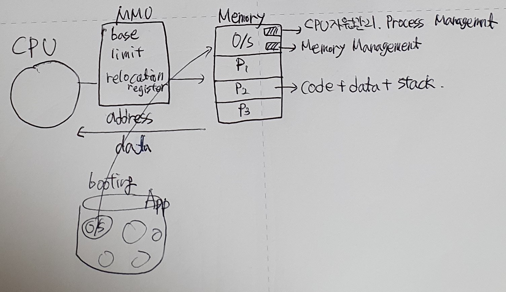

+ 프로그램 개발

  + 원천 파일 (Source file) : 고수준 언어 또는 어셈블리 언어
  + 목적 파일 (Object file) : 컴파일 또는 어셈블 결과
  + 실행 파일 (Executable file) : 링크 결과

+ 개발 도구

  + 컴파일러 (Compiler) 
    + C언어 등의 고수준 언어를 목적파일로 변환해주는 도구
    + 목적파일은 1010000 모양의 기계어 등으로 표현된다.
  + 어셈블러 (assembler)
    + 어셈블리 언어를 목적파일로 변환해 주는 도구
  + 링커 (Linker)
    + 컴파일러나 어셈블러를 거쳐온 목적파일, 라이브러리로 부터 만들어진 파일들을 하나로 묶어 exe 파일을 만드는 도구
  + 로더 (loader)
    + 실행 파일을 메인 메모리에 올리는 도구

  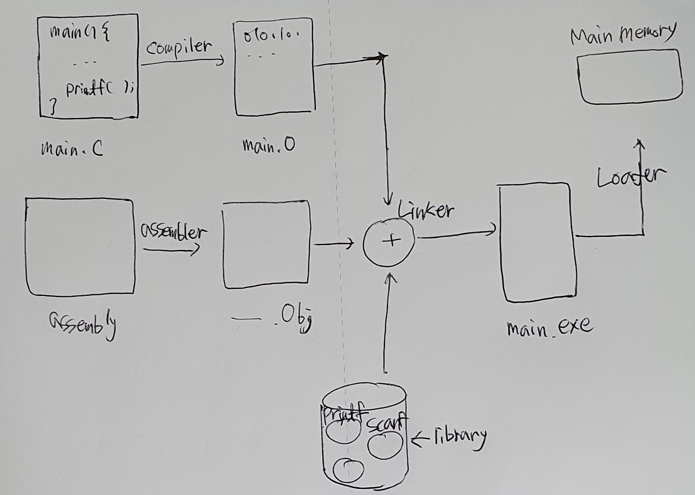


### 실행파일을 메모리에 올리기

+ 실행파일을 메모리에 올리려면?

  + 메모리 몇번지에 올릴것인가?
    + 프로그램이 하나씩만도는 싱글 프로그래밍 환경에서는 하나의 프로세스를 실행한 후, 종료하면 다른 프로그램을 실행시키면 된다.
  + 다중프로그래밍 환경에서는 어떻게?
    + 여러개의 프로세스가 메모리에 올라갈것이다. 
    + 하지만 CPU는 주소가 0번(O/S마다 다르다)이어야만 프로세스를 실행시킬 수 있다.
    + MMU를 사용하자!

+ MMU 사용

  + MMU에는 재배치 레지스터(relocation register)라는 레지스터가 존재한다.
  + CPU는 프로세스가 0번에 있다고 생각하지만 실제로는 메모리 주소 1000번에 존재한다. 이렇게 CPU를 착각하게 만든다.

+ 주소 구분

  + 논리 주소 (logical address) : CPU에서 memory로 향하는 주소. MMU 거치기 전
  + 물리 주소 (physical address) : MMU를 거쳐 나온 실제 메모리에 저장된 주소.

  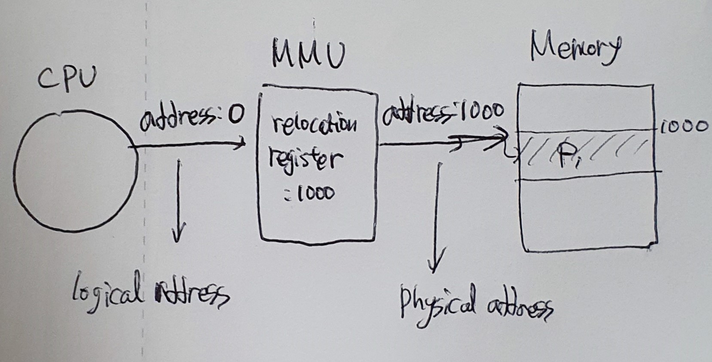


## 4.3 메모리 낭비 방지

+ Dynamic Loading
+ Dynamic Linking
+ Swapping


### 4.3.1 동적 적재 (Dynamic Loading)

+ Load : 하드디스크에 있는 프로그램(실행파일)을 메모리(RAM)에 올리는 것.

+ 프로그램 실행에 반드시 필요한 루틴/데이터만 적재한다.

  + 모든 루틴(routine)(=함수)가 다 사용되는 것은 아니다.

    + 예) 오류처리.

    + ```sudo
      f = file.open("test.txt")
      
      if f == NULL:
      	뭔가 처리하는 코드코드코드
      	return
      else:
      	뭔가 실행하는 코드코드코드
      ```

      위의 수도코드에서 파일이 NULL (== 존재하지 않는 파일, 잘못된 파일)인 경우 오류를 처리하는 코드가 돌게 된다.

      그러나 오류가 항상 생기는 것은 아니다. 일반적으로는 정상작동함.

      <b>때문에 오류가 발생한 경우에만 오류 실행 코드를 올린다.</b>

  + 모든 데이터(data)가 다 사용되는 것은 아니다.

    + 예) 배열
    + 실제로 사용하는 양은 10개의 공간만 있으면 되는데 1000개씩 생성하는 경우.

  + 자바 : 모든 클래스가 다 사용되는 것은 아니다.

    + 실행하기 전에 사용할 클래스들을 import 해야 하는데, 특정 함수만 골라서 import 하기 귀찮기 때문에 *로 모두 import 하는 경우

+ <b>실행 시 필요하면 그 때 해당 부분을 메모리에 올린다.</b>

+ 현재 사용하는 방법은 동적적재.

+ cf. 정적 적재(Static loading) : 과거에는 모두 메모리에 올렸다.


### 4.3.2 동적 연결(Dynamic Linking)

+ 여러 프로그램에 공통 사용되는 라이브러리(common library)를 한 번만 메모리에 올리는 방법
  + 공통 라이브러리 루틴(Library routine)을 메모리에 중복으로 올리는 것은 낭비이다.
    + ex) process 1과 process 2에서 모두 printf 함수를 사용할 때, printf 함수를 한 번만 메모리에 올린다면 메모리를 printf 함수 한 번 적재하는 것 만큼 아낄 수 있다.
  + 이를 위해 라이브러리 루틴 연결(링크)을 실행시까지 미룬다.
    + 링크는 기본적으로 실행파일을 만들기 전에 이루어진다.
    + 동적 연결에서는 이 `링크`를 실행되기 전까지 미룬다.
  + 오직 하나의 라이브러리 루틴만 메모리에 적재하고, 다른 애플리케이션 실행 시 이 루틴과 연결(link)한다.
  + 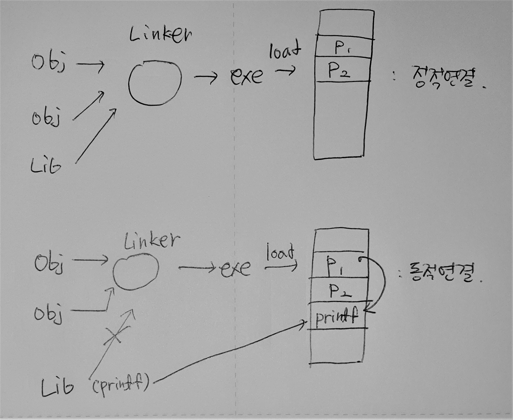
+ 공유 라이브러리(Shared Library) : Linux
+ 동적 연결 라이브러리(Dynamic Linking Library) : Windows
  + DLL파일이 이러한 동적 연결 라이브러리


### 4.3.3 스와핑 (Swapping)

+ 메모리에 적재되어있으나, 현재 사용되지 않고 있는 프로세스 이미지를 다른 영역(하드디스크 등)에 몰아내어 빈 메모리를 활용하는 방법
  + if) 파일을 다운받으면서 문서 작업 중, 잠시 자리를 비우게 되면 문서 작업 프로세스는 사용되지 않는다.
  + 이 때, 문서 작업 프로세스를 하드디스크 등의 공간(이것을 `backing store`라 한다.)에 몰아낸다.
  + 몰아내진 문서 작업 프로세스는 실제 하드디스크에 있는 문서 작업 프로그램과는 다르다.
  + 이를 구분하기 위해 하드디스크를 일부 잘라서, 현의 문서 작업 프로세스의 이미지를 저장한다.
+ Swap-out vs Swap-in
  + Swap out : 프로세스를 몰아내는 것.
  + Swap in : 몰아내 진 프로세스를 다시 메모리에 넣는 것.
+ Backing Store (swap device) : swap out 된 프로세스들이 저장될 공간.
  + 일반적으로 하드디스크의 공간을 일부 잘라서 사용한다.
  + 자신의 메인 메모리 크기만큼 둘 수 있다. 그러나 슈퍼컴퓨터의 경우에는 따로 저장장치를 두기도 한다.
  + 일반 프로그램들이 저장되는 공간은 file system이라고 부른다.
  + 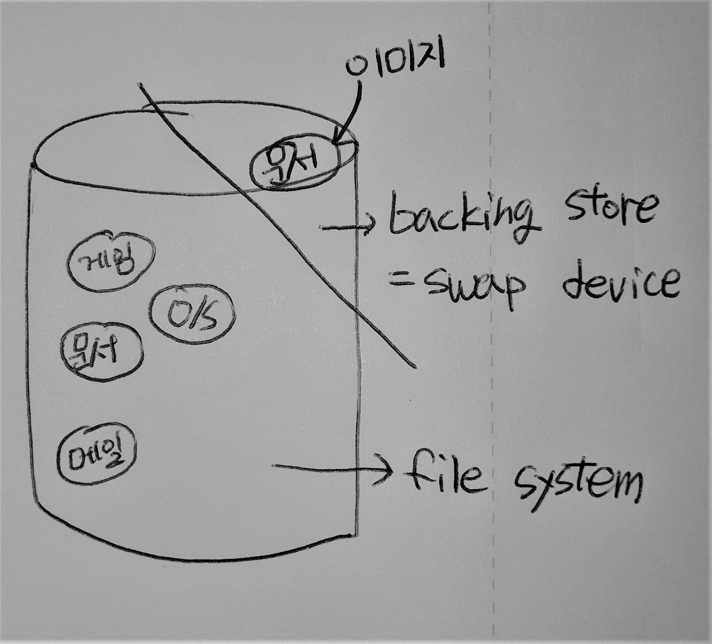
+ Swap in 되는 경우, MMU의 Relocation register를 사용하여 새로 적재되는 위치는 이전과 무관하다.
+ 프로세스의 크기가 크면, backing store 입출력에 따른 부담이 크다.


## 4.4 연속 메모리 할당 (Contiguous Memory Allocation)

+ 다중 프로그래밍 환경에서
  + 부팅 직후의 메모리 상태 : O/S + big single hole
  + 이후 여러개의 프로세스 생성 & 종료 반복 : scattered holes
  + 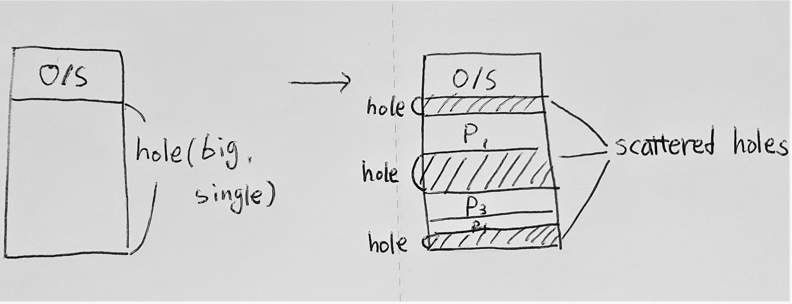


### 4.4.1 메모리 단편화 (Memory fragmentation)

+ 메모리 단편화

  + 기억 장치의 빈 공간 또는 자료가 여러개의 조각으로 나뉘는 현상.
  + 위 그림에서 프로세스의 생성과 종료가 반복 된 상태에서 생각한다. 여러개의 프로세스가 만들어지고 종료되며 빈 공간인 hole이 여러개 조각나게 되는데, 이 hole들을 `scattered holes`라고 한다.
  + 새로운 프로세스가 실행될 때 문제를 야기하게 된다.
  + `내부 단편화`와 `외부 단편화`의 두 가지 종류가 발생할 수 있다.

+ 외부 단편화

  + 위 그림과 같이 여러개의 홀이 존재할 때, 각각의 홀을 모두 합치면 프로세스를 적재할 수 있는 공간이 만들어지지만, 흩어져 있기 때문에 프로세스를 실행할 수 없는 것을 외부 단편화라 한다.

  + 예) 적재 할 프로그램 : 230 kb, holes : 100kb, 40kb, 80kb, 50kb

    이 경우에서 hole의 총 합은 270kb로 프로그램을 충분히 적재할 수 있다. 하지만 각 홀들이 흩어져 있기 때문에 프로그램을 올릴 수 없다.

+ 내부 단편화

  + 페이징 4.5를 공부한 후에 다시 설명
  + 프로세스의 크기가 페이지 크기의 배수가 아닐 때, 마지막 페이지는 프레임을 다 채울수 없다. 그 만큼 메모리의 낭비가 발생하는데 이를 내부 단편화라 한다.


### 4.4.2 연속 메모리 할당 방식

+ 할당 방식에는 최초 적합, 최적 적합, 최악 적합의 방법 등이 존재한다.
+ 일반적으로 속도는 최초적합이, 이용률은 최초적합, 최적 적합이 좋다.

1. First-fit (최초 적합) : 처음부터(뒤에서부터) 훑으며 들어갈 수 있는 크기를 만나면 할당.
2. Best-fit (최적 적합) : 들어갈 프로그램의 크기보다 크면서 가장 밀접한 것을 선택해서 할당.
3. Worst-fit (최악 적합) : 사이즈가 큰 것중 가장 밀접하지 않은 것을 할당.


+ 예제) Holes : 100 / 500 / 600 / 300 / 200 kb
  + 프로세스 : 212 / 417 / 112 / 426 kb
  + 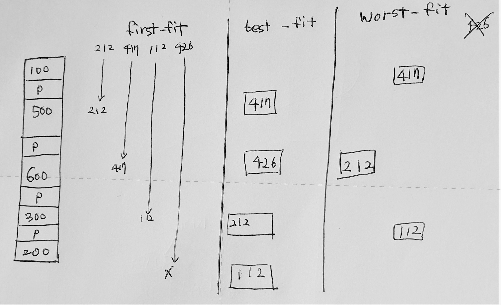
+ 할당 방식 성능 비교 : 속도 및 메모리 이용률
  + 속도 : first-fit : 순서대로 빠르게 찾기 때문에 비교할 것이 없음
  + 이용률 : first-fit, best-fit : 둘은 대부분 비슷한 편
  + 때문에 주로 first-fit이나 best-fit을 사용한다.
+ 외부 단편화로 인한 메모리 낭비
  + 1/3 수준 -> best로 사용을 해도 외부 단편화는 발생한다. 1/3 수준이면 사용이 불가능하다고 생각해야한다.
  + compaction 
    + hole들을 하나로 모아 크게 만드는 방법
    + 사용이 불가능하다. 어떤 프로세스를 옮겨야 하는지에 대한 최적 알고리즘이 없다.
    + 고부담 : 프로세스를 이동시켜야 하기 때문에 계산해야 하는 것이 많다.
  + 다른 방법이 무엇이 있을까? -> 페이징


## 4.5 페이징(Paging)

### 4.5.1 페이징

+ 페이징 : 프로세스를 일정 크기(=페이지)로 잘라서 메모리에 적재하는 방법
  + 메모리를 효율적으로 사용하는 방법이다.
    + 코끼리를 냉장고에 넣으려면? 잘라서 넣으면 가능할 수 있다.
    + 같은 방법으로 프로세스를 잘라서 적재한다. -> 자른다고 프로세스가 실행될까? **CPU가 붙어있다고 착각하게 만든다. CPU를 속인다.**
    + 어떻게 CPU를 속일것인가? [MMU 내의 재배치 레지스터 값을 바꾼다.](4.5.3)


### 4.5.2 페이지와 프레임

+ 페이지와 프레임은 각각 프로세스와 메모리의 단위이다.
+ 페이지와 프레임은 같은 사이즈이다.
+ 페이지(page) : 프로세스를 일정 크기로 자른 것. 프로세스는 페이지의 집합
+ 프레임(frame) : 메모리를 일정 크기로 자른 것. 메모리는 프레임의 집합.
+ **페이지가 프레임에 할당된다.**


### 4.5.3 MMU의 재배치 레지스터

+ 프로세스를 잘라 연속되지 않은 메모리에 적재할 때, CPU는 프로세스가 연속되어 저장되어 있다고 착각해야 한다. 이를 가능하게 하기 위해 MMU를 사용한다.
+ CPU에서 내는 논리주소는 MMU를 거쳐 물리 주소로 변환된다.
  + MMU 내의 재배치 레지스터의 값을 변경하여 물리주소로 변환한다.
  + 하지만 페이지의 개수만큼 저장된 값이 존재해야하며, MMU에 저장된다.
  + 이렇게 저장된 MMU를 **페이지 테이블(page table)**이라 한다.
  + 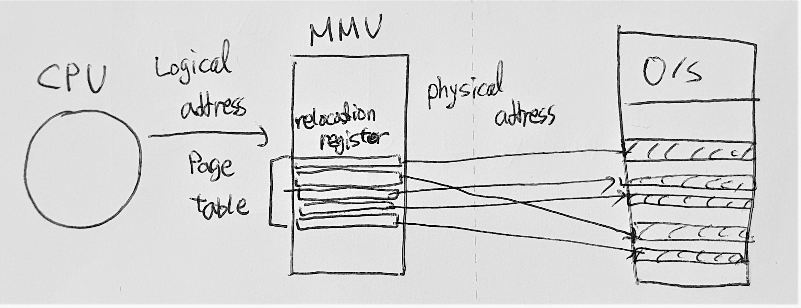


### 4.5.4 주소 변환 (Address translation)

+ 논리 주소(Logical address)
  + CPU가 내는 주소.
  + CPU가 내는 주소는 2진수로 표현된다. (전체 m비트)
  + 하위 n비트는 오프셋(offset) 또는 변위(displacement)
  + 상위 m-n비트는 페이지 번호가 된다.
  + 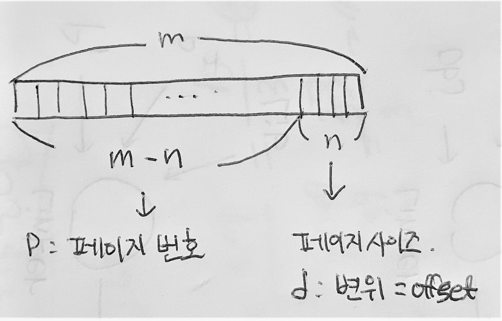
+ 주소 변환(Address translation)
  + 논리 주소를 물리 주소로 변환하는 것.
  + 페이지 번호(p)는 페이지 테이블 인덱스 값이 된다.
  + p에 해당되는 테이블 내용이 프레임 번호(f)이다.
  + 변위(d)는 변하지 않는다. 
    + 변위는 페이지 사이즈를 2의 n승 표현 한 것의 n 값이다.
    + ex) page size = 16byte = 2^4 -> n = 4
    + 이렇게 2의 지수승으로 사용하는 이유는 컴퓨터가 쉬프트 연산을 할 때 관리하기 용이하기 때문이다.
  + 논리 주소를 2진수로 바꾼 후, 페이지 번호에 해당하는 인덱스에 찾아가 프레임 번호를 가져온다. 이 프레임 번호 뒤에 변위를 붙인 값이 물리 주소가 된다.
+ 주소 변환 예제 1
  + page size = 4byte
  + page table : 5 6 1 2
  + 논리주소 13번지는 물리주소 몇 번지인가?
  + 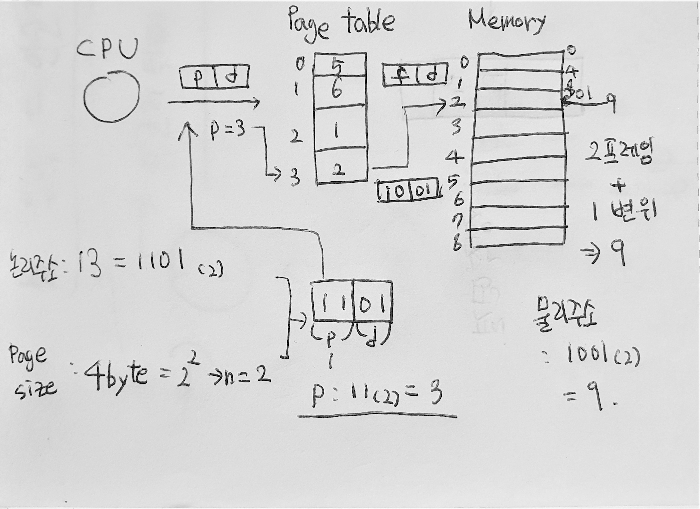
+ 주소 변환 예제 2
  + page size = 1kb
  + page talbe : 1 2 5 4 8 3 0 6
  + 논리 주소 3000번지는 물리 주소 몇 번지인가?
  + 물리 주소 0x1A53번지는 논리 주소 몇 번지인가?
  + 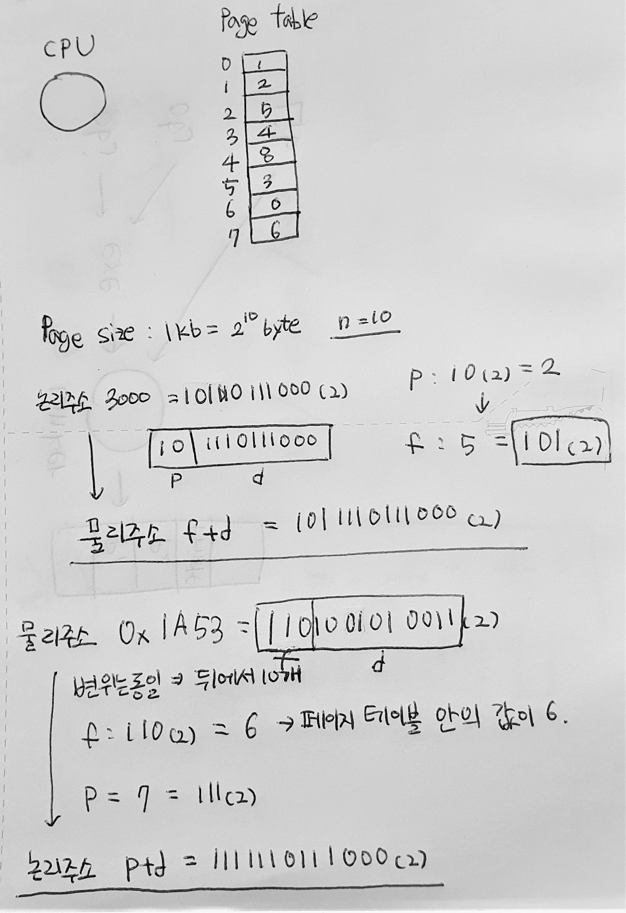


### 4.5.5 내부 단편화 (Internal Fragmentation)

+ 내부 단편화
  + 프로세스 크기가 페이지 크기의 배수가 아니라면 마지막 페이지는 한 프레임을 다 채울 수 없다.
  + 이 때 빈 공간 만큼을 **내부 단편화**라 한다.
  + 페이지 사이즈가 4byte고 프로세스의 크기가 15byte라면, 내부 단편화는 1byte이다.
+ 내부 단편화는 자신도 못 쓰고, 다른 프로세스도 쓸 수 없는 공간이다.
+ 내부 단편화는 큰 낭비는 아니다.
  + 내부 단편화의 최대 크기 = 페이지 사이즈 - 1


### 4.5.6 페이지 테이블 만들기

1. CPU 레지스터로
   + 장점 : 주소 변환이 빠르다.
   + 단점 : CPU 레지스터에 많은 양이 들어가지 않는다.
2. 메모리로
   + 장점 : 아무리 많은 양이어도 다 넣을 수 있다.
   + 단점 : 주소 변환이 느리다. 메모리의 O/S에 가서 주소를 읽었다가 변환된 주소를 가지고 다시 읽어야한다.
3. TLB(Tranlation Look-aside Buffer)
   + CPU와 메모리 방법의 중간이다.
   + D램보다 빠른 S램을 사용하며, 캐쉬 메모리와 유사한 방법으로 구동된다.


+ 성능 비교 척도 : 테이블 엔트리 개수 vs 변환 속도
+ 연습 : TLB 사용 시 유효 메모리 접근 시간
  + 유효 메모리 접근 시간 : 메모리에서 어떤 내용을 읽어오는 데 걸리는 유효한 시간.
  + Tm = 100ns, Tb = 20ns, hit ratio = 80%
    + Tm : 메모리를 읽는 시간
    + Tb : 버퍼를 읽는 시간
    + hit ratio : 변환하려는 주소가 TLB에 있을 확률
      + TLB는 크기가 충분히 크지 않기 때문에 페이지 테이블 엔트리가 모두 들어올 수 없다. 아직 들어오지 않은 것들은 메모리에 존재한다. 
      + 어떤 주소를 낼 때, 페이지 테이블 엔트리가 TLB에 있을 확률을 hit ratio라 한다.
  + Teff = h(Tb) + (1-h)(Tb + Tm + Tm)
    + 존재할 확률 h * 버퍼를 읽는 시간 Tb
    + 존재하지 않을 확률 (1-h) * 버퍼와 메모리를 읽는 시간 + 읽어온 주소를 다시 읽는 시간 ( Tb + Tm + Tm)
    + 0.8 * 20 + 0.2 * (20 + 100 + 100) = 16 + 44 = 60
  + 위에서 볼 수 있듯 아주 느려지기는 하나, 외부 단편화를 막기 위해 사용한다. 
    + 실제로는 hit ratio가 95퍼센트 이상이며, 심각하게 느려지지는 ㅇ낳는다.


### 4.5.7 보호와 공유

+ 보호(Protection)
  + 해킹 등을 방지한다.
  + 모든 주소는 페이지 테이블을 경유하므로, r, w, x 비트를 투어 해당 페이지에 대한 접근을 제어한다.
  + 페이지 테이블에 프레임 번호 + r, w, x 비트를 추가한다.
    + r : read (읽기)
    + w : write (쓰기)
    + x : excute (실행)
  + 만약, 0, 0, 1 비트가 들어오는 경우 (x비트만 1)
    + 허용되지 않는 것을 실행하려고 하면 CPU에 인터럽트 신호를 보내 프로세스를 종료시킨다.
+ 공유 (Sharing)
  + 메모리 낭비를 방지한다.
  + 같은 프로그램을 쓰는 복수 개의 프로세스가 있다면, 프로세스를 구성하는 code + data + stack에서 **code**를 공유할 수 있다.
    + 단, non-selfmodifying code = reentrant code = pure code 인 경우
    + 코드가 실행되며 변경되지 않는 경우에만
    + 만약 문서 작업 프로그램의 경우, 프로그램의 code는 동일
    + 작성하는 문서의 내용 data는 다르기 때문에 공유 불가
    + 적재된 위치, 지역변수 등은 다르기 때문에 stack 공유 불가
  + 프로세스의 페이지 테이블 코드 영역이 같은 곳을 가리키게 만든다.


## 4.6 세그멘테이션 (Segmentation)

### 4.6.1 세그멘테이션

+ 세그멘테이션 : 프로세스를 논리적 내용(=세그멘트)으로 잘라서 메모리에 배치하는 것
  + 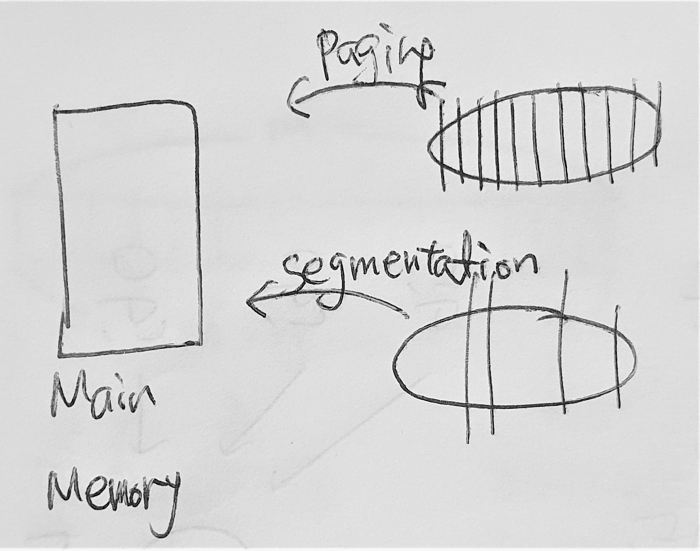
  + 프로세스는 세그멘트(segment)의 집합이다.
    + 프로세스 = code + data + stack으로 최소한 3개의 세그멘트로 나눌 수 있다.
      + code도 main, 각각의 function 등으로 더욱 세분화해서 구분할 수 있다.
  + 세그멘트의 크기는 일반적으로 같지 않다.
    + code, data, stack이 각각 같을 수 없다.


### 4.6.2 세그먼트 메모리 할당

+ MMU의 내의 재배치 레지스터의 값을 바꿈으로서.
  + 페이지와 거의 같다.
+ CPU는 프로세스가 연속된 메모리 공간에 위치한다고 착각한다.
+ MMU는 **세그멘트 테이블(segment table)**이 된다.
  + 세그멘트 테이블은 페이지 테이블과 달리 base와 limit의 정보가 각각 존재한다.


### 4.6.3 주소 변환

+ 논리 주소 (logical address)

  + CPU가 내는 주소
  + segment 번호 (s) + 변위 (d)

+ 주소 변환

  + 논리 주소를 물리 주소로 변환
  + 세그멘트 테이블의 내용 : base + limit
    + 세그멘트 테이블은 2차원이다.
  + 세그멘트 번호 (s)는 세그멘트 테이블 인덱스 값
  + s에 해당하는 테이블 내용으로 시작 위치 및 한계값 파악
  + 한계(limit)를 넘어서면 segment violation 예외 상황 처리
    + 인터럽트가 발생한다.
  + 물리 주소 = base[s] + d

+ 주소 변환 예제

  + | Limit | Base |
    | ----- | ---- |
    | 1000  | 1400 |
    | 400   | 6300 |
    | 400   | 4300 |
    | 1100  | 3200 |
    | 1000  | 4700 |

    

  + 논리 주소 (2, 100)은 물리 주소 무엇인가?

    + 세그멘트 테이블의 2번째는 base는 4300, limit은 400.
    + base로 부터 100만큼 떨어진 4400.
    + 물리주소는 4400

  + 논리 주소 (1, 500)은 물리 주소 몇 번지인가?

    + 세그멘트 테이블의 1번째는 base는 6300, limit은 400
    + base로 부터 500만큼 떨어진 6800.
    + 그러나 base로 부터 400만큼 떨어진 6700까지만 범위로 가질 수 있기 때문에 해당 물리주소 없음.


### 4.6.4 보호와 공유

+ 보호(Protection)
  + 해킹 등을 방지한다.
  + 모든 주소는 세그멘트 테이블을 경유하므로 해당 세그멘트 테이블 엔트리마다 r, w, x 비트를 주어 해당 세그멘트에 대한 접근 제어 가능
  + 페이징보다 우월하다.
+ 공유(sharing)
  + 메모리 낭비 방지
  + 같은 프로그램을 쓰는 복수 개의 프로세스가 있다면, code + data + stack에서 code는 공유 가능
    + 단, non-selfmodifying code = reentrant code = pure code인 경우
  + 프로세스의 세그멘트 테이블 코드 영역이 같은 곳을 가리키게 한다.
  + 페이징보다 우월하다.


### 4.6.5 페이징 vs 세그멘테이션

+ 보호와 공유의 관점에서 세그멘테이션이 페이징보다 낫다.
  + page 단위로 구분을 하게 되면 논리적 구분이 겹쳐서 잘리는 경우가 발생한다.
  + 보호의 관점
    + code와 data가 함께 잘리게 된다면, code는 실행이 가능하지만, data는 실행을 할 수 없다.
    + 이 경우의 x 비트를 1로 두어야 할지 0으로 두어야 할지에 대한 문제가 발생한다.
  + 공유의 관점
    + 같은 상황에서 code는 공유를 할 수 있는데 data와 함께 있는 영역은 공유를 해야할지 말아야 할지의 문제가 발생한다.
  + 이 관점에서 본다면 세그멘테이션을 사용하는 것이 좋다. 그러면 세그멘테이션만 사용할까?
    + no. 외부 단편화 문제가 또 다시 발생한다.


### 4.6.6 외부 단편화(External Fragementation)

+ 세그멘트의 크기는 고정이 아니라 **가변적**이다.
+ 크기가 다른 각 세그멘트를 메모리에 두려면 = 동적 메모리 할당
+ First-fit, best-fit, worst-fit, compaction 등의 문제로 단편화를 줄이려고 하지만 결국 다시 외부 단편화가 발생한다.
+ 결국 세그멘테이션만을 사용하지 않는다.
  + 하지만 분명 세그멘테이션은 좋은 기능이다. 그러면 어떻게 세그멘테이션을 사용할까?
  + 세그멘테이션과 페이징을 함께 사용한다!


### 4.6.7 세그멘테이션 + 페이징

+ 세그멘테이션은 보호와 공유 면에서 효과적
+ 페이징은 외부 단편화 문제를 해결
+ 따라서 **세그멘트를 페이징**하여 사용한다. = **paged segmentation**
+ 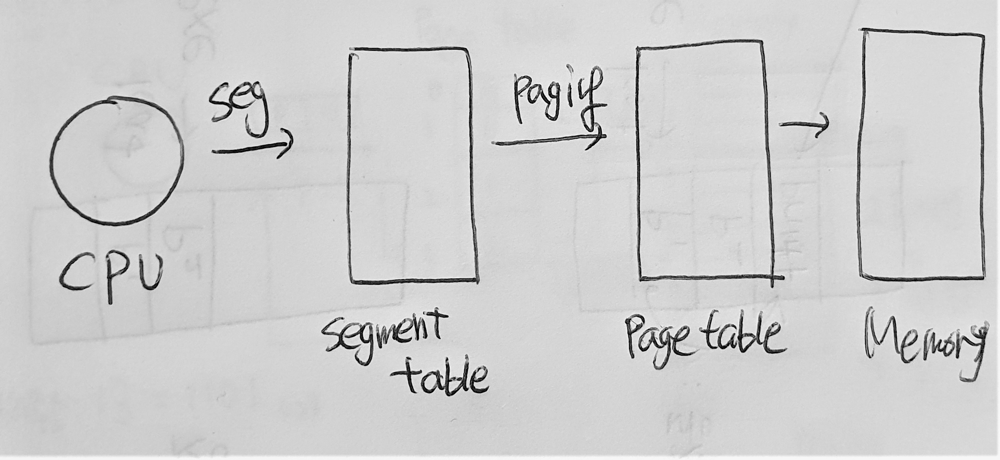
  + 이렇게 사용하게 되면 **주소 변환에 부담**이 생긴다. 속도가 느려진다.
    + trade off : 하나가 좋아지면 다른것은 나빠진다.


