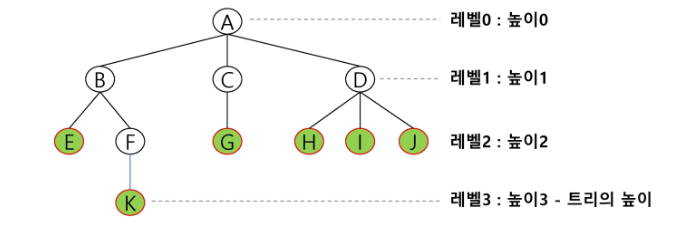
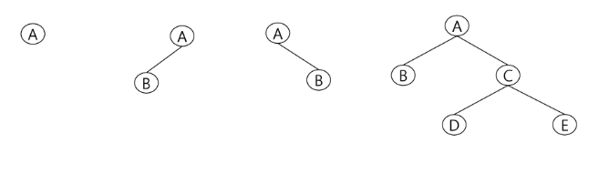

# [Tree](<https://gmlwjd9405.github.io/2018/08/12/data-structure-tree.html>)

## 트리의 정의

+ 노드로 이루어진 자료 구조

+ 비선형 구조.

+ 원소들 간에 계층 관계(level 0(root) -> level 1 -> level 2 ...)가 존재. => 자기 자신으로 돌아올 수 없다. =>사이클이 없다.

    + 이와 반대로 그래프에는 사이클이 존재한다. 또한, 계층관계가 존재하지 않는다. => 자기 자신으로 돌아오는 경우가 발생할 수 있다.

+ 상위 원소에서 하위 원소로 내려가면서 확장되는 것이 트리(나무) 모양의 구조이다.

    + 더 정확하게 말하면 뒤집어놓은 트리 모양이다. 

+ 정점 하나만 존재해도 트리가 된다.

+ 한 개 이상의 노드로 이루어진 유한집합이며, 다음 조건을 만족한다.

    1. 노드 중 최상의 노드를 루트(root)라 한다.
    2. 나머지 노드들은 n(>=0)개의 분리집합 T1, T2, ... , Tn으로 분리될 수 있다.
    3. 이 분리집합들은 각각 하나의 트리가 되며`(재귀적 정의) == DFS 사용 가능` 루트의 부 트리(subtree)라 한다.

+ 그래프의 한 종류. 

    + 사이클(cycle)이 없는 하나의 연결 그래프(connected graph)
    + 또는 DAG(Dicrected Acyclic Graph, 방향성이 있는 비순환 그래프)의 한 종류

    

    

    

## 사용 용어

+ 노드(node) (==정점) : 트리의 원소

+ 간선(edge) : 노드를 연결하는 선. 부모 노드와 자식 노드를 연결

+ 루트 노드(root node) : 트리의 시작 노드

+ 형제 노드(sibling node) : 같은 부모 노드의 자식 노드들

    + 그림1에서 B, C, D는 형제노드

+ 조상 노드 : 간선을 따라 루트 노드까지 이르는 경로에 있는 모든 노드들

    + K의 조상 노드 : F, B, A

+ 서브트리(subtree) : 부모 노드와 연결된 간선을 끊었을 때 생성되는 트리

+ 자손 노드 : 서브트리에 있는 하위 레벨의 노드들

    + B의 자손 노드 : E, F, K

+ 차수(degree)

    + 노드의 차수 : 노드에 연결된 자식 노드의 수
        + B의 차수 = 2, C의 차수 = 1
    + 트리의 차수 : 트리에 있는 노드의 차수 중에서 가장 큰 값
        + 트리T의 차수 : 3
    + 단말 노드(leaf node)(=잎노드) : 차수가 0인 노드(==자식이 없는 노드)

+ 높이

    + 노드의 높이 : 루트에서 노드에 이르는 간선의 수. 노드의 레벨
        + B의 높이 : 1, F의 높이 : 2
    + 트리의 높이 : 트리에 있는 노드의 높이 중에서 가장 큰 값. 최대 레벨

+ 너비

    + 노드의 너비 : 같은 레벨이 가지고 있는 정점의 개수.
    + 트리의 너비 : 트리가 가지고있는 같은 레벨끼리의 정점 개수 중 가장 큰 값.

    

    

    

## 트리의 종류

+ 이진 트리, 이진 탐색 트리, 균형 트리(AVL 트리, red-black 트리), 이진 힙(최대 힙, 최소 힙) 등이 있다.

## 트리의 구현

+ 트리는 그래프의 한 종류이므로 그래프의 구현 방법(인접 리스트 또는 인접 배열)로 구현할 수 있다.
+ 

## 이진트리

+ 모든 노드들이 2개의 서브 트리를 갖는 특별한 형태의 트리

+ 각 노드가 자식 노드를 최대 2개까지만 가질 수 있는 트리.

+ 예)

    

    

    

    

+ 레벨 i에서 노드의 최대 개수는 2^i개

+ 높이가 h인 이진 트리가 가질 수 있는 노드의 최소 개수는 (h+1) 개가 되며, 최대 개수는 2^(h+1) - 1개가 된다.

