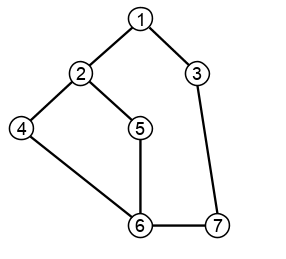

# 그래프(Graph)

## 그래프 용어

### 그래프(Graph)

+ 노드(정점)(V)와 간선(엣지)(E)로 구성된 자료구조.
+ `노드` : node, vertex, 정점, 꼭지점 과 같은 이름으로 불리며, 데이터가 주로 들어있다.
+ `간선` : edge, 엣지, 변 과 같은 이름으로 불리며, 노드와 노드 사이의 가중치. 관계 정보가 들어있다.
+ 
+ 알고리즘 문제에서는 주로 간선으로 연결된 두 정점을 나열하는식으로 주어진다.
  + 1, 2, 1, 3, 2, 4, 2, 5, 4, 6, 5, 6, 6, 7, 3, 7
  + 위 나열된 정보를 두개씩 끊어 보면 위 그래프를 나타낸다.


### degree(차수)

+ 노드에 연결된 간선의 수.
+ 간선에 가중치가 존재할 경우, 노드 가중치를 계산한 값의 합.
+ 방향성이 있는 경우 진출차수와 진입차수가 다르게 된다.
  - 가로방향 : 진출차수
  - 세로방향 : 진입차수


### cycle이 있는 그래프

+ 자기 자신으로 돌아올 수 있는 그래프.
+ 위 그래프에서 정점 1에서 시작된 경로는 여러가지 경우 ex) 1-2-5-6-7-3-1 를 통해 정점 1로 다시 돌아올 수 있다. 위와 같은 경우 cycle을 가진 그래프라 한다.


### 연결 요소

+ 방향성이 없는 그래프에서 노드들이 최대한 연결되어있는 하위 그래프.
+ 
+ 위 그래프 1~6을 G로 볼 때, 연결요소는 [1, 2, 5] 와 [3, 4, 6] 으로 2개가 된다.
+ 만약 3이 독립적으로 존재하여 [1, 2, 5], [3], [4, 6] 으로 존재한다면 3개가 연결요소이다.


## 그래프 표시하기


### 인접행렬

|      | 1    | 2    | 3    | 4    | 5    | 6    | 7    |
| ---- | ---- | ---- | ---- | ---- | ---- | ---- | ---- |
| 1    | 0    | 1    | 1    | 0    | 0    | 0    | 0    |
| 2    | 1    | 0    | 0    | 1    | 1    | 1    | 0    |
| 3    | 1    | 0    | 0    | 0    | 0    | 0    | 1    |
| 4    | 0    | 1    | 0    | 0    | 0    | 0    | 0    |
| 5    | 0    | 1    | 0    | 0    | 0    | 1    | 0    |
| 6    | 0    | 0    | 0    | 1    | 1    | 0    | 1    |
| 7    | 0    | 0    | 1    | 0    | 0    | 0    | 0    |

   + 방향성이 있는 경우 진출차수와 진입차수가 다르게 된다.
     + 가로방향 : 진출차수
     + 세로방향 : 진입차수
   + 차수는 1의 개수로 따진다.


### 인접 정점의 배열 : Linked list

​	1 : 2, 3

​	2 : 1, 4, 5

​	3 : 1, 7

​	... 이렇게 표시


## 그래프 순회 방법

1. DFS
2. BFS


그래프 탐색하기

정점 개수 n, 간선 개수 m, 탐색 시작 정점 v가 주어진 후 m개의 줄에 두 정점의 번호가 주어진다.

```
8 6 1
1 4
4 5
4 8
4 6
6 7
7 3
```

graph

[0, 0, 0, 0, 0, 0, 0, 0, 0]
[0, 0, 0, 0, 1, 0, 0, 0, 0]
[0, 0, 0, 0, 0, 0, 0, 0, 0]
[0, 0, 0, 0, 0, 0, 0, 1, 0]
[0, 1, 0, 0, 0, 1, 1, 0, 1]
[0, 0, 0, 0, 1, 0, 0, 0, 0]
[0, 0, 0, 0, 1, 0, 0, 1, 0]
[0, 0, 0, 1, 0, 0, 1, 0, 0]
[0, 0, 0, 0, 1, 0, 0, 0, 0]


### DFS

```python
def dfs(node):
    visited_dfs[node] = 1
    result_dfs.append(node)
    if node:
        for i in range(1, n + 1):
            if graph[node][i] and not visited_dfs[i]:
                dfs(i)
```


### BFS

```python
def bfs(node):
    result = []
    Q = [node]
    visited_bfs[node] = 1
    while Q:
        t = Q.pop(0)
        result.append(t)
        for i in range(1, n + 1):
            if graph[t][i] and not visited_bfs[i]:
                Q.append(i)
                visited_bfs[i] = visited_bfs[t] + 1
    return result
```


out :

dfs : 1 4 5 6 7 3 8

bfs : 1 4 5 6 8 7 3