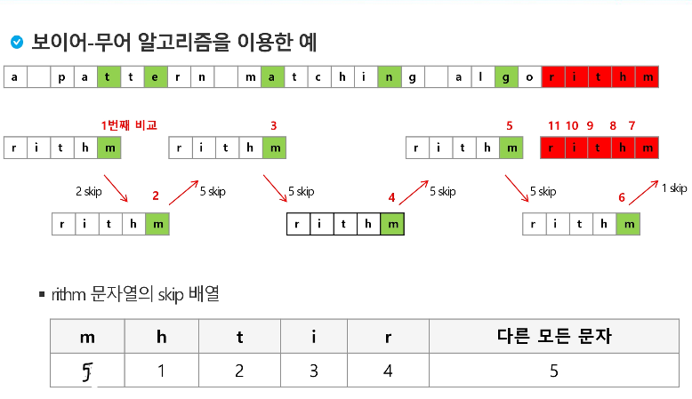

# 문자열 매칭

## 패턴매칭

+ 사용되는 알고리즘
  + 부르트포스 알고리즘
  + 카프-라빈 알고리즘
  + KMP 알고리즘
  + 보이어-무어 알고리즘


### 부르트포스(Brute Force) (고지식한)알고리즘

+ 본문 문자열을 처음부터 끝까지 차례대로 순회하면서 패턴 내의 문자들들 일일히 비교하는 방식으로 동작.
+ 최악의 경우 모든 위치에서 패턴비교.
+ 시간복잡도 O(MN)
+ find와 같은 역할을 한다.
+ == print(t.find(p))

```python
def brute_force(p, t):
    i, j = 0, 0     # t, p의 인덱스
    m = len(p)      # 찾을 패턴의 길이
    n = len(t)      # 전체 텍스트의 길이
    while j < m and i < n:
        if t[i] != p[j]:
            i -= j
            j = -1

        i += 1
        j += 1
    if j == m:
        return i - m    # 검색 성공 시 몇번째에 발견했나?
    else :
        return -1       # 검색 실패

t = "TTTTA"     # 검색될 문자열
p = "TTA"       # 검색할 문자열
print(brute_force(p, t))
```


### KMP알고리즘

+ 불일치가 발생한 텍스트 스트링의 앞 부분에 어떤 문자가 있는지를 미리 알고 있으므로 불일치가 발생한 앞 부분에 대하여 다시 비교하지 않고 매칭을 수행
+ 매칭이 실패했을 때 돌아갈 곳을 계산.
+ 시간복잡도 : O(M + N)


접두어

접미어 사이에 border 있어야한다. 

ex)


ab => 접두어 : a 접미어 : b

abcda => 접두어 : a, 접미어 : a border : bcd 개수 : 1

abcdabc => 접두어 : abc, 접미어 : abc, border : d, 개수 : 3

```python
def preprocess(P, M, PI):
    i, j = 0, -1
    PI[0] = -1
    while i < M:
        while j > -1 and P[i] != P[j]:
            j = PI[j]
        i += 1
        j += 1
        PI[i] = j

def KMP(T, N, P, M, PI):
    i, j = 0, 0
    pos = -1
    while i < N:
        while j >= 0 and T[i] != P[j]:
            j = PI[j]
        i += 1
        j += 1
        if j == M :
            pos = i - j
            break
    return pos

T = "abcdabcdabcdabcef"
P = "abcdabcef"
PI = [0] * (len(P) + 1)

N = len(T)
M = len(P)
preprocess(P, M, PI)
pos = KMP(T, N, P, M, PI)
print(pos)
```


### 보이어-무어 알고리즘

+ 오른쪽에서 왼쪽을 비교
+ 대부분의 상용 소프트웨어에서 채택하고있는 알고리즘
+ 보이어무어 알고리즘은 패턴에 **오른쪽 끝에 있는 문자가 불일치**하고 이 문자가 **패턴 내에 존재하지 않는 경우**, 이동거리는 *패턴의 길이*만큼 이동.
+ 불일치하지만 패턴 내에 존재하는 경우, 그 문자와 패턴을 같은 위치로 놓고 비교한다.

- 텍스트 문자를 다 보지 않아도 된다.
  - 패턴의 오른쪽부터 비교

  - 최악의 수행시간O(mn)

  - 입력에 따라 다르지만 일반적으로 O(n)보다 시간이 덜 든다.

    



```python
def preprocess(P, M, PI):
    for i in range(M-1):
        PI[ord(P[i])] = i + 1

def BoyerMooreHorspool(T, N, P, M, PI):
    i, j, k, l = 0, 0, 0, 0
    pos = -1
    while i <= N-M:
        j = M -1
        k = i + M - 1
        while j >= 0 and P[j] == T[k]:
            j -= 1
            k -= 1
        if j == -1:
            pos = i
            break
        i = i + (M -PI[ord(T[i + M -1])])

    return pos

T = "abcdabcdabcdabcef"
P = "abcdabcef"
ASCII = 128
PI = [0] * (ASCII+1)

N = len(T)
M = len(P)
preprocess(P, M, PI)
pos = BoyerMooreHorspool(T, N, P, M, PI)
print(pos)
```


