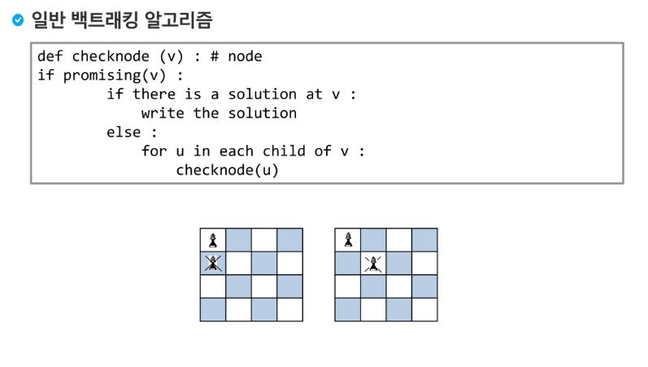
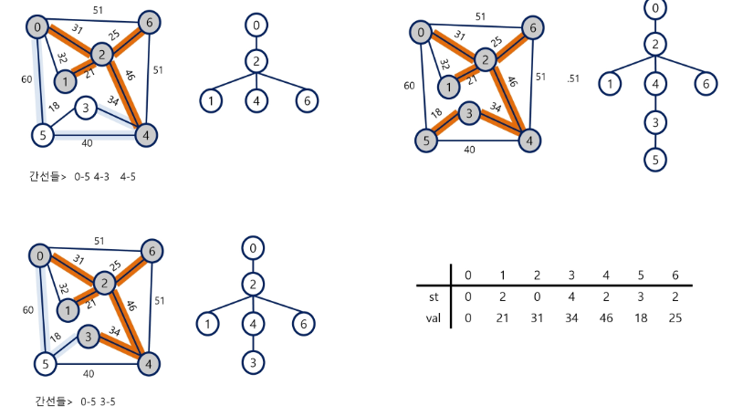

# 알고리즘 강의

+ 프로그램에서 메모리가 넘치는게 낫다. 모자라면 안돌아간다!!

190116

## 프로그래밍 언어 설명

- ALGOL -> B -> C

- C : 데니스리치 만듦. UNIX 운영체제에서 전문가용.

  ​     포인터 존재

- java : OOP(객체지향) 안드로이드 프로그램

  ​	  SUN -> Oracle(DB만드는 회사)

  ​	  어느 플랫폼(윈도우, 리눅스 ...)에서든 돌아간다.

- C++ : 회사에서 만든것이 아님. MS에서 툴만 제공

- C# : MS에서 자바와 C++의 장점을 가지고 만들었다고 한 것.


- Visual Basic  

- Python : 인터프리터 언어. 개발이 쉽다. 

  ​		머신러닝이나 빅데이터 쪽에서 라이브러리를 잘 제공해서 많이 사용.

  ​		문법적으로 배우기 쉽다.

  ​		객체지향


---


인터프리터 언어 : 한 줄한줄 실행. 속도에서 느림. 

compile : 파일 전체를 변환시켜 실행. 속도는 컴파일러가 빠르다. 

스크립트 언어 : 브라우저(클라이언트쪽)에서 도는 언어(자바스크립트, html)

인터프리터 언어 중 서버에서 도는 언어 : jsp, asp, ...


---


프로그램 개발 절차 : 

1. 요구사항 분석 : 문제를 잘 읽어야한다. 제약조건이나 구해야 하는 값을 확인.

2. 설계 : 설계. 연필로 가장 작은 테스트케이스를 설계해 해결 할 건지 확인. 
3. 구현 :  코딩. language는 도구.
4. 테스트 
5. 유지보수 


## 알고리즘

**어떤 문제를 해결하기 위한 절차**

유한한 단계를 통해 문제를 해결하기 위한 절차나 방법. 컴퓨터가 어떤 일을 수행하기 위한 단계적 방법.


## 시간복잡도(Time Complexity)

실제 걸리는 시간을 측정.

실행되는 명령문의 개수를 계산


### 빅-오(O) 표기법

- (Big-Oh Notation)
- 시간복잡도 함수 중에서 가장 큰 영향력을 주는  n에 대한 항만을 표시
- 계수는 생략하여 표시


​	ex) for 1개 : n

​	for 2개 : 2n == n

​	2개 중첩 for : n^2


- O(1) : 수식 한개. or 수식 몇 줄. 반복문 X

-  O(n) : 순차탐색 : 순서대로 모두 체크 for1개

- O(logn) : 이진탐색 : 이분법적으로 반씩 나누고 아닌것은 버리기. 

  ​					ex) 1~100 => 50~100 => 50~75 

- O(n^2) : 선택, 버블, 삽입(하나 잡아서 체크) => for가 중첩으로 2개 

- O(nlogn) : 퀵소트, 병합, heap

- O(n^3) : 프로이드 알고리즘. 모든 최단경로

- O(2^n) : 부분집합. 

- O(n!) : 순열. 숫자를 가지고 나열할 수 있는 모든 경우의 수.


 HDD : 필요한 코드 생성

RAM : 올리기

CPU : 받아온 코드 실행 

RAM : 일부 변수 저장

HDD : 휘발성 내용이 아닌 저장할 부분을 저장.


## 반복(Iteration)과 재귀(recursion)

+ 반복과 재귀는 유사한 작업을 수행할 수 있다.
+ 반복 : 수행하는 작업이 완료될 때 까지 계속 반복
  + 루프(for, while 구조)
+ 재귀 : 주어진 문제의 해를 구하기 위해 동일하면서 더 작은 문제의 해를 이용하는 방법
  + 하나의 큰 문제를 해결할 수 있는(해결하기 쉬운) 더 작은 문제로 쪼개고 결과들을 결합
  + 재귀함수로 구현


### 재귀적 알고리즘

+ 재귀적 정의는 두 부분으로 나뉜다.
+ 하나 또는 그 이상의 기본 경우(basis case or rule)
  + 집합에 포함되어있는 원소로 induction을 생성하기 위한 시드(seed) 역할
+ 하나 또는 그 이상의 유도된경우(inductive case or rule)
  + 새로운 집합의 원소를 생성하기 위해 결합되어지는 방법
+ 입력값 n이 커질수록 재귀 알고리즘은 반복에 비해 비효율적일 수 있다.


### 반복과 재귀의 비교

|                | 재귀                                               | 반복                  |
| -------------- | -------------------------------------------------- | --------------------- |
| 종료           | 재귀 함수 호출이 종류되는 베이스 케이스(base case) | 반복문의 종료 조건    |
| 수행 시간      | (상대적) 느림                                      | 빠름                  |
| 메모리 공간    | (상대적) 많이 사용                                 | 적게 사용             |
| 소스 코드 길이 | 짧고 간결                                          | 길다                  |
| 소스 코드 형태 | 선택 구조(if, else)                                | 반복 구조(for, while) |
| 무한 반복시    | 스택 오버플로우                                    | CPU를 반복해서 점유   |


## 완전검색 / 완전탐색 (Exaustive Search)

- 문제의 해법으로 생각할 수 있는 모든 경우의 수를 나열해보고 확인하는 기법
- **모든 경우의 수를 테스트 한 후 최종 해법을 도출.**
- 경우의 수가 작을 때 유용
- 모든 경우의 수를 생성하고 테스트 하기 때문에 수행 속도는 느리지만 해답을 찾아내지 못할 확률이 작다.
- 완전검색으로 접근하여 해답을 도출 한 후 성능 개선을 위해 다른 알고리즘을 사용하기.


- 완전검색 + 가지치기 => 백트레킹
  -  완전검색을 재귀로. => dfs로 만들면 된다.
- 순열, 조합, 부분집합 등


### 고지식한 방법(brute-force)

+ 대부분의 문제에 적용 가능
+ 상대적으로 빠른 시간에 문제 해결 할 수 있다.
+ 문제에 포함된 자료(요소, 인스턴스)의 크기가 작다면 유용


## 조합적 문제

+ 순열 문제를 조합으로 풀 수 있을까?

  + YES, But, 시간이 오래걸린다.

  

### 순열

+ 서로 다른 것 들 중에서 몇개를 뽑아서 한 줄로 나열하는것
+ 중복 뽑기XXX
+ 서로 다른 n개중 r개를 택하는 순열 nPr = n * (n - 1) * (n - 2) * ... * ... (n - r + 1)
+ nPn = n! => 팩토리얼
+ n개의 요소들에 대해서 n! 개의 순열들이 존재한다.
  + n > 12인 경우, 시간 복잡도 폭발적으로 증가한다.

```python
def perm(n, k):
    if n == k:
        print(a)
    else:
        for i in range(k, n):
            a[i], a[k] = a[k], a[i]
            perm(n, k + 1)
            a[i], a[k] = a[k], a[i]

a = [1, 2, 3]

perm(3, 0)
```


```python
def perm(n, r, q):
    if r == 0:
        print(a)
    else:
        for i in range(n - 1, -1, -1):
            a[i], a[n - 1] = a[n - 1], a[i]
            t[r - 1] = a[n - 1]
            perm(n - 1, r - 1, q)
            a[i], a[n - 1] = a[n - 1], a[i]


a = [1, 2, 3]
t = [0] * 3

perm(3, 3, 3)
```


### 부분집합

+ 집합에 포함된 원소들을 선택
+ 다수의 중요 알고리즘이 원소들의 그룹에서 최적의 부분집합을 찾는 것.
+ 자기 자신과 공집합 포함한 모든 부분집합(powerset)의 개수는 2^n개
+ 원소의 수가 증가하면 부분집합의 개수는 지수적으로 증가한다.


```python
'''
아래의 10개의 정수 집합에 대한 모든 부분집합 중
원소의 합이 10이 되는 부분집합을 모두 출력하시오.
ex) {1, 2, 3, 4, 5, 6, 7, 8, 9, 10}
'''

def powerset(n, k, sum_data):
    if sum_data == sum_check:
        for i in range(k):
            if tmp[i]:
                print(data[i], end=" ")
            else:
                print(" ", end = " ")
        print()
        return
    elif sum_data > sum_check:
        return

    if n == k:
        return

    else:
        tmp[k] = 1

        powerset(n, k + 1, sum_data + data[k])
        tmp[k] = 0
        powerset(n, k + 1, sum_data)


n = 10
sum_check = 10
data = [i for i in range(1, 11)]
tmp = [0] * n
powerset(n, 0, 0)
```


### 조합

+ 서로 다른 n개의 원소 중 r개를 순서 없이 골라낸 것을 조합(combination)이라 부른다.


## 탐욕(Greedy) 알고리즘

최적해를 구하는 데 사용되는 근시안적인 방법

여러 경우 중 하나를 결정해야 할 때 그 순간에 최적이라고 생각되는 것을 선택해 나가는방식

결정은 그 단계에서는 최적이지만 전체에서는 아닐 수 있다.

일반적으로 머릿속에 떠오르는 생각을 바로 구현하면 Greedy 접근이 된다.

그러나 greedy 방식이 최적이라는 보장은 없다.

### 동작과정

1. 해 선택 : 현재 최적 해 구하기
2. 실행 가능성 검사: 새로운 부분 해 집합이 실행 가능한 지 확인
3. 해 검사 : 새로운 부분 해 집합이 문제의 해인지 확인. 


## 정렬

| 알고리즘   | 평균수행시간 | 최악수행시간 | 알고리즘 기법 | 비고                                               |
| ---------- | ------------ | ------------ | ------------- | -------------------------------------------------- |
| 버블정렬   | O(n^2)       | O(N^2)       | 비교와 교환   | 코딩이 가장 손쉽다                                 |
| 카운팅정렬 | O(n+k)       | O(n+k)       | 비교환방식    | n이 비교적 작을때만 가능                           |
| 선택정렬   | O(n^2)       | O(n^2)       | 비교와 교환   | 교환의  횟수가 버블, 삽입정렬보다 작다.            |
| 퀵정렬     | O(n log n)   | O(n^2)       | 분할정복      | 최악의 경우 O(n^2)이지만 평균적으로는 가장 빠르다. |
| 삽입정렬   | O(n^2)       | O(n^2)       | 비교와 교환   | n의 개수가 작을 때 효과적이다                      |
| 병합정렬   | O(n log n)   | O(n log n)   | 분할정복      | 연결리스트의 경우 가장 효율적인 방식               |

### 버블정렬

인접한 두 개의 원소를 비교하여 자리를 계속 교환하는 방식

#### 정렬 과정

1. 첫 번째 원소부터 인접한 원시끼리 계속 자리를 교환하면서 맨 마지막 자리까지 이동.
2. 한 단계가 끝나면 가장 큰 원소가 마지막 자리로 정렬.

#### 시간복잡도 

: O(n^2) => for 2개가 중첩될 것.


#### **파라미터를 부르는 방법**

- call by value : 복사 => 변수 하나
- call by reference : 원본 참조 => list : 함수 안에 들어갔다가 오면 바뀔 수 있다.


### 카운팅 정렬(Counting Sort)

항목들의 순서를 결정하기 위해 집합에 각 항목이 몇 개씩 있는지 세는 작업을 하여 선형시간에 정렬하는 효율적인 알고리즘

data에서 각 항목들의 발생 회수를 세고, 정수 항목들로 직접 인덱스 되는 카운트 배열 count에 저장한다.

**제한사항이 많다**

- 정수나, 정수로 표현할 수 있는 자료에 대해서만 적용 가능. : 각 항목의 발생 회수를 기록하기 위해, 정수 항목으로 인덱스 되는 카운트들의 배열을 사용하기 때문.
- 카운트들을 위한 충분한 공간을 할당하려면 집합 내의 가장 큰 정수를 알아야한다.

#### 시간복잡도

O(n + k) : n은 리스트 길이, k는 정수의 최대값.


190123

## 배열 : 2차원 배열

+ 1차원 list를 묶어놓은 list
+ 2차원 이상의 다차원 list는 차원에 따라 index를 선언
+ 2차원 list의 선언 : 세로길이(행의 개수), 가로길이(열의 개수)를 필요로 함
+ python에서는 데이터 초기화를 통해 변수선언과 초기화가 가능함


### 2차원 배열 순회

```
arr = [[0, 1, 2, 3],
       [4, 5, 6, 7],
       [8, 9, 10, 11]]
```

* 행우선

```python
for i in range(len(arr)):
    for j in range(len(arr[i])):
        print(arr[i][j], end=" ")
    print()
```

​	out

```
0 1 2 3 
4 5 6 7 
8 9 10 11 
```

​	


* 열우선

```python
for j in range(len(arr[0])):
    for i in range(len(arr)):
        print(arr[i][j], end=" ")
    print()
```

​	out

```
0 4 8 
1 5 9 
2 6 10 
3 7 11 
```


* 지그재그

```
n = len(arr)
m = len(arr[0])

print("\n지그재그")
for i in range(n):
    for j in range(m):
        print(arr[i][j + (m - 1 - 2 * j) * (i % 2)], end=" ")
    print()
```

​	out

```
지그재그
0 1 2 3 
7 6 5 4 
8 9 10 11 
```


### 2차원 배열 입력(input)

```python
n, m = map(int, input().split())	# 행과 열의 사이즈를 받는다.
# 아래가 리스트 초기화. 0으로만 되어있는 리스트를 만든다. 
# _ 로 변수를 받으면 특정한 변수를 지정하지 않고 for 를 돌릴 수 있다.
# 행, 열을 돌리기 위해서 행은 for의 밖에, 열은 for의 안에 넣어야한다.
mylist = [[0 for _ in range(m)] for _ in range(n)]
print(mylist)


for i in range(n):
    mylist[i] = list(map(int, input().split()))
print(mylist)
```

+ input

```
3 4
0 1 0 0
0 0 0 0
0 0 1 0
```

+ output

```
[[0, 0, 0, 0], [0, 0, 0, 0], [0, 0, 0, 0]]	# 초기화

[[0, 1, 0, 0], [0, 0, 0, 0], [0, 0, 1, 0]]	# 결과
```


### 전치행렬

대각선으로 가로지르게 잘라서 각각의 x, y와 y, x 위치를 바꾸는 행렬


### 부분집합 합(subset Sum) 문제

+ 부분집합의 개수 : 2^n개

  => 각 원소가 포함될 때(1), 포함되지 않을 때(0) 각 2가지의 경우가 존재한다.

  그것을 각원소에 해당시켜야 하기 때문에 각 원소개만큼 2를 곱해야하므로, 2의 n(원소의 개수)승 만큼 부분집합의 개수를 가지게된다.


+ 유한개의 정수로 이루어진 집합이 있을때 이 집합의 부분집합 중에서 집합의 원소를 모두 더한 값이 0이 되는 경우가 있는지를 알아내는 문제.


풀이법) 완전검색기법을써야한다.

 1. 집합의 모든 부분집합을 생성한 후에 각 부분집합의합을 계산해야한다.

 2. 부분집합의 원소 개 만큼 for문을 돌려야한다.

    => 이게 너무 어려워지면 비트연산자를 사용한다.


### 비트연산자

컴퓨터가 좋아해용~~ 2진수로 계산하기 때문에!


| &    | 비트 단위로 and 연산을 한다.                |
| ---- | ------------------------------------------- |
| \|   | 비트 단위로 or 연산을 한다.                 |
| <<   | 피연산자의 비트 열을 왼쪽으로 이동시킨다.   |
| >>   | 피연산자의 비트 열을 오른쪽으로 이동시킨다. |


2^n 을 표현하기

```python
# 1
2 ** n

#2
1 << n

```


2번 방법으로 사용할 때, 1은 2의 0 승.

1 << 1이 되면

00001(2) 인게 00010(2)가 되어 2가 되고,

1 << 3이 되면

00001(2) 인 게 01000(2)이 되어 8이 된다.


```
i & (1<<j)
```

i의 j번째 비트가 1인지 아닌지를 리턴

ex, 7의 비트가 0111(2)일 때,

and연산을 통해 차례대로 같으면 1, 아니면 0을 리턴한 후 리턴된 최종값과 7의 비트값을 비교한다.


### 비트연산자를 이용한 부분집합 생성

```python
arr = [1, 2, 3]
n = len(arr)

for i in range(1 << n):		# 1 << n == 2^n == 2^3 == 8(8회 반복)
    for j in range(n):		# n번 반복(3번)
        if i & (1 << j):	# &는 비트연산자이므로 i로 들어온 숫자를 
            				# 비트연산한다
            print(arr[j], end=" ")
    print()
```


## 검색(search)

* 저장되어 있는 자료 중에서 원하는 항목을 찾는 작업
* 목적하는 탐색 키를 가진 항목을 찾는 것
  + 탐색 키(search key) : 자료를 구별하여 인식할 수있는 키
* 검색의 종류
  + 순차 검색
  + 이진 검색
  + 해쉬


### 1. 순차 검색(Sequential Search)

+ 일렬로 되어있는 자료를 순서대로 검색하는 방법
  + 가장 간단하고 직관적인 검색 방법
  + 배열이나 연결 리스트 등 순차구조로 구현된 자료 구조에서 원하는 항목을 찾을 때 유리.
  + 알고리즘이 단순하여 구현이 쉽지만, 검색 대상의 수가 많은 경우에는 수행 시간이 급격히 증가하여 비효율적임
+ 2가지 경우
  + 정렬된 경우
  + 정렬되어있지 않는 경우


#### 정렬되어 있지 않은 경우

* 첫 번째 원소부터 순서대로 검색 대상과 키 값이 같은 원소가 있는지 비교하며 찾는다.
* 키 값이 동일한 원소를 찾으면 그 원소의 인덱스를 반환
* 자료구조의 마지막에 이를 때 까지 검색 대상을 찾지 못하면 검색 실패
* 평균 비교 회수 : n+1/2

시간복잡도 : O(n)

```python
def sequential_search(a, n, key):
    for i in range(n):
        if a[i] == key:
            return i
    return None


data=[4, 9, 11, 23, 2, 19, 7]
key = 19

print("index", sequential_search(data, len(data), key))
```


#### 정렬되어 있는 경우

* 자료를 순차적으로 검색하면서 키 값을 비교하여, 원소의 키 값이 검색 대상의 키 값보다 크면 찾는 원소가 없다는 것이므로 검색 종료.
* 찾고자 하는 원소의 순서에 따라 비교 회수가 결정
  + 정렬되어있으므로 검색 실패를 반환하는 경우 평균 비교 회수가 반으로 줄어든다.

시간복잡도 : O(n)


### 2. 이진 검색 (Binary Search)

* 자료의 가운데에 있는 항목의 키값과 비교하여 다음 검색의 위치를 결정하고 검색을 계속 진행하는 방법
  + 목적 키를 찾을 때 까지 이진 검색을 순환적으로 반복 수행함으로써 검색 범위를 반으로 줄여가면서 보다 빠르게 검색을 수행함.
* 이진 검색을 하기 위해서는 자료가 **정렬된 상태**여야 한다.

검색 과정

1. 자료의 중앙에 있는 원소를 고른다.
2. 중앙 원소의 값과 찾고자 하는 목표 값을 비교한다.
3. 목표 값이 중앙 원소의 값보다 작으면 자료의 왼쪽 반에 대해서 새로 검색을 수행하고, 크다면 자료의 오른쪽 반에 대해서 새로 검색을 수행한다.
4. 찾고자 하는 값을 찾을 때 까지 1~3의 과정을 반복.


구현 :

+ 검색 범위의 시작점과 종료점을 이용하여 검색을 반복수행
+ 이진 검색의 경우, 자료에 삽입이나 삭제가 발생했을 때 배열의 상태를 항상 정렬상태로 유지하는 추가 작업이 필요. 


```python
def binSearch(start, end, check):
    while start <= end:
        mid = (start + end) // 2
        if check == data[mid]:
            return mid + 1
        elif check > data[mid]:
            start = mid + 1
        else:
            end = mid - 1
    return 0

```


## 인덱스

+ 인덱스라는 용어는 Database에서 유래했으며, 테이블에 대한 동작 속도를 높여주는 자료 구조를 일컫는다. Database 분야가 아닌 곳에서는 Look up table 등의 용어를 사용하기도 한다.
+ 인덱스를 저장하는 데 필요한 디스크 공간은 보통 테이블을 저장하는 데 필요한 디스크 공간보다 작다. 왜냐하면 보통 인덱스는 키-필드만 가지고 있고, 데이블의 다른 세부 항목들은 갖고 있지 않기 때문. 
+ 배열을 사용한 인덱스
  + 대량의 데이터를 매번 정렬하면, 프로그램의 반응은 느려질 수 밖에 없다. 이러한 대량 데이터의 성능 저하 문제를 해결하기 위해 배열 인덱스를 사용할 수 있다.

=> 배열이 어디에 있는지 **인덱스(위치)만** 가져온 후, **주소를 직접 옮기는 게 아니라**, 배열 인덱스를 옮긴 후 오리지널 인덱스를 찾아가 주소에 있는 내용을 가져온다.


## 셀렉션 알고리즘(selection algorithm)

* 저장되어있는 자료로 부터 k번째로 큰, 작은 원소를 찾는 방법
* 최소값, 최대값 혹은 중간값을 찾는 알고리즘을 의미하기도 함


선택 과정1

1. 정렬 알고리즘을 이용하여 정렬
2. 원하는 순서에 있는 원소 가져오기

선택 과정 2

1. 최대값을 k번만큼 찾는다.


## 선택 정렬

가장 작은(큰)숫자부터 골라서 차례대로 정리.

+ 주어진 자료 중 가장 작은 값의 원소부터 차례대로 선택하여 위치를 교환

정렬과정

1. 주어진 리스트 중에서 최소값 찾기
2. 그 값을 맨 앞에 위치한 값과 교환
3. 맨 처음 위치를 제외한 나머지 리스트를 대상으로 위의 과정 반복


시간 복잡도 :

O(n^2)

구현

```python
def selection_sort(a):
    for i in range(0, len(a)-1):
        # 최솟값의 인덱스를 구하기
        min_check = i
        for j in range(i + 1, len(a)):
            if a[min_check] > a[j]:
                min_check = j
        # 최솟값의 인덱스와 현재 체크한 부분을 교환
        a[i], a[min_check] = a[min_check], a[i]

data = [64, 25, 10, 22, 11]
print(data)
selection_sort(data)
print(data)
```


190130

++ **다중 반복문을 빠져나오고 싶으면 함수를 만들어서 리턴을 시켜라!!!**

++ 파싱 : 더 이상 자를 수 없을 때 까지 자르는 가장 작은 단위


# 문자열(string)

컴퓨터의 문자 표현 :

메모리에 자주 사용되는 문자에 대한 숫자를 정해놓고 저장.

이것의 표준안 : 아스키(ASCII) => 7bit

bit : 0 or 1

byte : 영문자 하나를 표현할 수 있음


그럼 1bit는 어디로 갔을까?

Parity 검사 : 이진수로 개수를 넘길 때 1의 개수가 짝수개 or 홀수개로 정한다. 

이 때 짝수개로 정하면 7bit의 1의 개수를 보고 홀수면 1을, 짝수면 0을 붙여서 보내게된다.


영어 말고 다른 언어들까지 표시하기위해 확장아스키 사용.

but 다국어처리 불가. 다국어 처리를 위해 **유니코드 표준** 사용


+ Big-endian, Little-endian

  

  16진수 4자리 => 2바이트

  0x1234 => 12 | 34 로 2바이트씩

| Big-endian                                            | Little-endian                               |
| ----------------------------------------------------- | ------------------------------------------- |
| 0x 12, 0x34로 저장되는것이 big-endian                 | 0x34, 0x12로 저장되는것이 little-endian     |
| bit-endian이 네트워크나 큰 컴퓨터 등에서 저장하는 것. | little-endian이 보통 데스트탑이 저장하는것. |


보통 컴퓨터 프로그램은 32비트. 즉 4바이트씩 읽어서 보내기.

32비트 컴퓨터는 RAM을 4기가까지밖에 인식을 못한다. 그래서 64비트 컴퓨터를 사용하는 것이다.


### 문자열은 어디에 위치하나?

| code                                                     |
| -------------------------------------------------------- |
| data(전역변수, 정적변수)                                 |
| heap (문자열, 리스트 등)                                 |
| stack (변수가 heap의 문자열이나 리스트 주소를 갖고있다.) |

문자열은 heap에 저장된다.


## 문자열(String) = immutable

문자열의 분류 :

문자열 (string) -> fixed length

​			  -> variable length	-> length controlled	(java 언어에서의 문자열)

​								-> delimited			(c언어에서의 문자열)


### 문자열 뒤집기

+ 자기 문자열에서 뒤집는 방법 => n/2회
+ 새로운 빈 문자열 만들어 뒤에서부터 읽어서 사용


### 문자열 비교

+ C나 Java에서는 == 연산자가 메모리 참조(주소)가 같은지를 확인한다.

+ python에서는 == 연산자가 갖는 값이 같은지를 확인한다.  이 경우 == 연산자가 __eq_._메소드를 가져오게 된 것이다.

+ 때문에 메모리 참조(주소)가 같은지를 확인하기 위해서는 is 연산자를 확인한다.


**python에서는 == 연산자를 사용하여 비교한다.**


문자열이 같은지 확인하려는 방식은 

1. 문자열 길이를 먼저 확인
2. 문자열 길이가 같으면 하나씩 비교하기.


### 문자열 숫자를 정수로 변환

+ python : int()
+ c언어 : atoi()    <-> 정수를 문자로 변환 : itoa()
+ java : parseInt()   <-> 정수를 문자로 변환 : soString()


+ 숫자 문자변환 : 

  ```python
  def itoa(x):
      arr = []
  
      while True:
          arr.append(chr(x % 10 + ord('0')))
          x = x // 10
          if x == 0 :
              break
  
      arr = arr[::-1]
      return ''.join(arr)
  
  x = 123
  print(x, type(x))
  str1 = itoa(x)
  print(str1, type(str1))
  ```

+ 문자 숫자 변환 :

  ```python
  def atoi(string):
      val = 0
      i = 0
  
      while (i < len(string)):
          c = string[i]
          if c >= '0' and c <= '9':
          # if ord(c) >= ord('0') and ord(c) <= ord('0') 이렇게 보면 좀 더 명확.
              digit = ord(c) - ord('0')
          else:
              break
          val = (val * 10) + digit
          i += 1
      return val
  
  
  
  a = "123"
  print(a, type(a))
  b = atoi(a)
  print(b, type(b))
  c = int(a)
  print(c, type(c))
  
  
  ```


### 문자열 교체

+ python에서는 replace
+ replace가 없으면 교체할 부분의 뒷부분을 잘라 다른 변수에 저장. 교체할 부분을 삭제 후 교체하고, 이후 뒷부분을 붙인다.


## 패턴매칭

+ 사용되는 알고리즘
  + 부르트포스 알고리즘
  + 카프-라빈 알고리즘
  + KMP 알고리즘
  + 보이어-무어 알고리즘


### 부르트포스(Brute Force) (고지식한)알고리즘

+ 본문 문자열을 처음부터 끝까지 차례대로 순회하면서 패턴 내의 문자들들 일일히 비교하는 방식으로 동작.
+ 최악의 경우 모든 위치에서 패턴비교.
+ 시간복잡도 O(MN)
+ find와 같은 역할을 한다.
+ == print(t.find(p))

```python
def brute_force(p, t):
    i, j = 0, 0     # t, p의 인덱스
    m = len(p)      # 찾을 패턴의 길이
    n = len(t)      # 전체 텍스트의 길이
    while j < m and i < n:
        if t[i] != p[j]:
            i -= j
            j = -1

        i += 1
        j += 1
    if j == m:
        return i - m    # 검색 성공 시 몇번째에 발견했나?
    else :
        return -1       # 검색 실패

t = "TTTTA"     # 검색될 문자열
p = "TTA"       # 검색할 문자열
print(brute_force(p, t))
```


### KMP알고리즘

+ 불일치가 발생한 텍스트 스트링의 앞 부분에 어떤 문자가 있는지를 미리 알고 있으므로 불일치가 발생한 앞 부분에 대하여 다시 비교하지 않고 매칭을 수행
+ 매칭이 실패했을 때 돌아갈 곳을 계산.
+ 시간복잡도 : O(M + N)


접두어

접미어 사이에 border 있어야한다. 

ex)


ab => 접두어 : a 접미어 : b

abcda => 접두어 : a, 접미어 : a border : bcd 개수 : 1

abcdabc => 접두어 : abc, 접미어 : abc, border : d, 개수 : 3

```python
def preprocess(P, M, PI):
    i, j = 0, -1
    PI[0] = -1
    while i < M:
        while j > -1 and P[i] != P[j]:
            j = PI[j]
        i += 1
        j += 1
        PI[i] = j

def KMP(T, N, P, M, PI):
    i, j = 0, 0
    pos = -1
    while i < N:
        while j >= 0 and T[i] != P[j]:
            j = PI[j]
        i += 1
        j += 1
        if j == M :
            pos = i - j
            break
    return pos

T = "abcdabcdabcdabcef"
P = "abcdabcef"
PI = [0] * (len(P) + 1)

N = len(T)
M = len(P)
preprocess(P, M, PI)
pos = KMP(T, N, P, M, PI)
print(pos)
```


### 보이어-무어 알고리즘

+ 오른쪽에서 왼쪽을 비교
+ 대부분의 상용 소프트웨어에서 채택하고있는 알고리즘
+ 보이어무어 알고리즘은 패턴에 **오른쪽 끝에 있는 문자가 불일치**하고 이 문자가 **패턴 내에 존재하지 않는 경우**, 이동거리는 *패턴의 길이*만큼 이동.
+ 불일치하지만 패턴 내에 존재하는 경우, 그 문자와 패턴을 같은 위치로 놓고 비교한다.

+ 텍스트 문자를 다 보지 않아도 된다.
  + 패턴의 오른쪽부터 비교
  + 최악의 수행시간O(mn)
  + 입력에 따라 다르지만 일반적으로 O(n)보다 시간이 덜 든다.


```python
def preprocess(P, M, PI):
    for i in range(M-1):
        PI[ord(P[i])] = i + 1

def BoyerMooreHorspool(T, N, P, M, PI):
    i, j, k, l = 0, 0, 0, 0
    pos = -1
    while i <= N-M:
        j = M -1
        k = i + M - 1
        while j >= 0 and P[j] == T[k]:
            j -= 1
            k -= 1
        if j == -1:
            pos = i
            break
        i = i + (M -PI[ord(T[i + M -1])])

    return pos

T = "abcdabcdabcdabcef"
P = "abcdabcef"
ASCII = 128
PI = [0] * (ASCII+1)

N = len(T)
M = len(P)
preprocess(P, M, PI)
pos = BoyerMooreHorspool(T, N, P, M, PI)
print(pos)
```


## 문자열 암호화

+ &, |, <<, >>, ^


& : 논리곱

| : 논리합

논리 곱인 &가 먼저 실행된다.


^ : XOR : 두개가 같으면 0 다르면 1


### 비트열 암호화

```python
def bit_print(a):
    for i in range(7, -1, -1):
        if a & (1<<i):
            print(1, end="")
        else:
            print(0, end="")
    print()

a = 0x86
key = 0xAA

print("a        ==>", end=" ")
bit_print(a)

print("a        ==>", end=" ")
a ^= key
bit_print(a)

print("a        ==>", end=" ")
a ^= key
bit_print(a)


```


## 문자열 압축


### Run-length encoding 알고리즘

같은 값이 몇 번 반복되는가를 나타냄으로써 압축


문자열에서는 나중에 **허프만 코딩 알고리즘** 을 하면 좋겠다!


## 스택

### 스택(stack)의 특성

+ 비어있을 때 pop 하는 것을 조심해라!!!!!!!!!

- 물건을 쌓아 올리듯 자료를 쌓아 올린 형태의 자료구조

- 스택에 저장된 자료는 선형 구조를 갖는다.

  - 선형구조 : 자료 간의 관계가 1대 1의 관계를 갖는다. -> 부모와 자식이 하나씩

  - 비선형구조 : 자료 간의 관계가 1대 N의 관계를 갖는다. (예 : 트리 => 부모 자식간의 상하관계가 있는 그래프)

    (자식이 2개 이하인 트리 : binary 트리)

    (보통 바이너리 트리가 아닌 경우 그래프 취급한다.)

    - N : M의 관계 (예: 그래프)

  - 정점(node)와 간선(edge)로 이루어진다. => DFS(깊이우선탐색), BFS(너비우선탐색)으로 풀 수 있다.

- 스택에 자료를 삽입하거나 스택에서 자료를 꺼낼 수 있다.

- 마지막에 삽입한 자료를 가장 먼저 꺼낸다. 후입선출(LIFO, Last-In-First-Out)

  - ex) 스택에 1, 2, 3 순으로 자료를 삽입한 후 꺼내면 역순. 즉, 3, 2, 1 순으로 꺼낼 수 있다.


 + 점선은 동적으로 영역 크기 변경 가능.

   

### 스택 구현에 필요한 자료구조와 연산

+ ADT(Abstract Data Type) : 추상자료형
+ 자료구조 : 자료를 선형으로 저장할 저장소
  + c : 배열
  + python : list
  + 저장소 자체를 스택이라고 부르기도 한다.
  + 스택에서 마지막으로 삽입된 원소의 위치를 top라고 부른다.
+ 연산 
  + 삽입 : push. 자료 저장
  + 삭제 : pop. 자료 꺼내기. 삽입의 역순으로 꺼낸다.
  + isEmpty : 스택에서 공백인지 아닌지 확인
  + peek : 스택 top의 item(원소) 반환. 꺼내지는 않는다.


### 스택의 삽입/삭제 과정


1. 초기값의 top을 -1로 주어야한다.
2. top += 1을 한 후, 그 자리에 값을 넣는다.(A push) => top 0
3. top += 1을 한 후 그 자리에 값을 넣는다. (B push) => top1
4. top += 1을 한 후, 그 자리에 값을 넣는다.(C push) => top 2
5. pop을 하면 C를 꺼내고(C pop), top -=1을 한다.  => top 1
6. pop을 하면 B를 꺼내고(B pop), top -=1을 한다. => top 0


+ 연습문제 1

  + 스택 구현( c버전)

    ```python
    # C 스타일로 짜기
    size = 100
    stack = [0] * size
    top = -1
    
    def push(item):
        # top은 int. int는 def 등 함수 속에서 변경이 되어도 실제 int 값이 변화하지 않는다.
        # 때문에 그렇게 사용하기 위해서는 global top으로 사용한다.
        global top
        if top > size -1:
            return
        else:
            top += 1
            # stack은 list. python에서  list는 def등 함수 속에서 변경이 되어도 실제 list가 변화한다.=> list는 heap영역.
            stack[top] = item
    
    def pop():
        global top
        if top == -1:
            print("stack is empty!")
            return 0
        else:
            result = stack[top]
            top -= 1
            return result
    
    push(1)
    push(2)
    push(3)
    
    print(top, stack)
    
    print("pop item => %d " % pop())
    print(pop())
    print(pop())
    print(top, stack)
    ```

    out :

    2 [1, 2, 3, 0, 0, 0, 0, 0, 0, 0, 0, 0, 0, 0, 0, 0, 0, 0, 0, 0, 0, 0, 0, 0, 0, 0, 0, 0, 0, 0, 0, 0, 0, 0, 0, 0, 0, 0, 0, 0, 0, 0, 0, 0, 0, 0, 0, 0, 0, 0, 0, 0, 0, 0, 0, 0, 0, 0, 0, 0, 0, 0, 0, 0, 0, 0, 0, 0, 0, 0, 0, 0, 0, 0, 0, 0, 0, 0, 0, 0, 0, 0, 0, 0, 0, 0, 0, 0, 0, 0, 0, 0, 0, 0, 0, 0, 0, 0, 0, 0]
    pop item => 3 
    2
    1
    -1 [1, 2, 3, 0, 0, 0, 0, 0, 0, 0, 0, 0, 0, 0, 0, 0, 0, 0, 0, 0, 0, 0, 0, 0, 0, 0, 0, 0, 0, 0, 0, 0, 0, 0, 0, 0, 0, 0, 0, 0, 0, 0, 0, 0, 0, 0, 0, 0, 0, 0, 0, 0, 0, 0, 0, 0, 0, 0, 0, 0, 0, 0, 0, 0, 0, 0, 0, 0, 0, 0, 0, 0, 0, 0, 0, 0, 0, 0, 0, 0, 0, 0, 0, 0, 0, 0, 0, 0, 0, 0, 0, 0, 0, 0, 0, 0, 0, 0, 0, 0]

  

  + 스택 구현 python 버전

    + top이 필요하지 않으며, 실제 삭제가 된다.

    ```python
    def push(item):
        s.append(item)
    
    def pop():
        if len(s) == 0:
            print("stack is empty!")
            return
        else:
            return s.pop()
    s = []
    
    push(1)
    push(2)
    push(3)
    print(s)
    print(pop())
    print(pop())
    print(pop())
    print(s)
    ```

    out :

    [1, 2, 3]
    3
    2
    1
    []

+ C에서는 1차원배열의 크기를 정해주어야하기 때문에 크기를 바꾸어주고 싶으면 동적 할당을 해야한다. 

+ 그러나 python에서는 동적으로 배열의 크기를 할당해주기 때문에 사용하지 않는다.


### 스택응용 (괄호검사)

+ 괄호의 종류 : 대괄호 [   ], 중괄호 {   }, 소괄호 (   )
+ 조건
  1. 왼쪽 괄호의 개수와 오른쪽 괄호의 개수가 같아야한다.
  2. 같은 괄호에서 왼쪽 괄호는 오른쪽 괄호보다 먼저 나와야한다.
  3. 괄호 사이에는 포함관계만 존재한다.

+ 알고리즘

  1. 문자열에 있는 괄호를 차례대로 조사하면서 왼쪽 괄호를 만나면 스택에 삽입. 오른쪽 괄호를 만나면 스택에서 top을 pop한 후 오른쪽 괄호와 짝이 맞는지 검사
  2. 이 때, 스택이 비어있으면 조건 1 or 2에 위배. 괄호의 짝이 맞지 않으면 조건 3에 위배
  3. 마지막까지 괄호 조사 후 스택에 괄호가 남아있으면 조건 1에 위배

+ programming

  ```python
  def push(item):
      stack.append(item)
  
  def pop():
      if len(stack) == 0:
          print("stack is empty!")
          return
      else:
          return stack.pop()
  
  
  def solution(brackets):
  
      for bracket in brackets:
          if bracket == '(':
              push(bracket)
          elif bracket == ')':
              check = pop()
              if not check == '(':
                  print("False")
                  return False
      if stack:
          return False
      else:
          return True
  
  
  stack = []
  
  print(solution('()()((()))'))
  print(solution('((()((((()()((()())((())))))'))
  print(solution(')('))
  ```

  out :

  True
  False
  False


## 재귀 호출

### 재귀함수

+ 자기 자신을 호출하여 순환 수행되는 것
+ 함수에서 실행해야 하는 작업의 특성에 따라 일반적인 호출 방식보다 재귀호출방식을 사용하여 함수를 만들면 프로그램의 크기를 줄이고 간단하게 작성
+ 완전검색 시 반복문으로만 하면 시간이 오래걸릴 때 가지치기 불가능.
+ 가지치기를 해서 사용하려면 재귀함수를 사용해야한다. ( 자기 자신을 더 이상 호출을 불가능하게 만든다.)
+ 재귀 문법
  1. basis( 기본 ): 멈추는 부분			=> f(1) == 1
  2. inductive( 유도 ) : 자기호출   			=> f(n) == n * f(n - 1)
+ **엄청난 중복 호출이 불러진다**
+ == 깊이우선탐색(DFS)와 같은 방식으로 불러오게된다.


### 팩토리얼

: n에 대한 factorial 

: 1부터 n 까지의 모든 자연수를 곱하여 구하는 연산

: 쉽게는 반복문으로 가능하다.


```python
def fact(n):
    if n == 1:
        return 1
    else:
        return fact(n-1) * n


print(fact(4))
```


### 피보나치

```python
def fibo(n):
    if n < 2:
        return n
    else:
        return fibo(n - 1) + fibo(n - 2)

print(fibo(8))
```


### 메모이제이션(Memoization)

+ 컴퓨터 프로그램을 실행할 때 이전에 계산한 값을 메모리에 저장해서 매번 다시 계산하지 않도록 하여 전체적인 실행속도를 빠르게 하는 기술. => 동적계획법의 핵심
+ 메모리에 넣는것. 위 피보나치에 적용할 때, fib(0), fib(1)의 값. 즉 종료조건의 값만 먼저 지정해놓은 후, 나머지 fib(2)~ fib(n)까지의 값을 바로바로 list에 저장한다.
+ big-O가  `O(n)` 이 된다.


+ 메모이제이션을 사용한 피보나치

  ```python
  memo = [0, 1]
  def fibo_memoization(n):
      if n >= 2 and len(memo) <= n:
          memo.append(fibo_memoization(n - 1) + fibo_memoization(n - 2))
      print(memo)
      return memo[n]
  
  print(fibo_memoization(50))
  ```

  

### DP(Dynamic Programming)

+ 최적화 문제를 푸는 알고리즘

+ 입력 크기가 작은 부분 문제들을 모두 해결한 후에 그 해들을 이용하여 보다 큰 크기의 부분 문제들을 해결하여 최종적으로 원래 주어진 입력의 문제를 해결하는 알고리즘

+ 최적 부분 구조 : 부분 문제의 답으로부터 본 문제의 답을 얻을 수 있다.

  즉, fib(n) = fib(n-1) + fib(n - 2) 와 같이 앞의 값을 저장한다면 사용할 수 있다.


+ DP를 이용한 피보나치

  ```python
  def fibo_DP(n):
      f = [0, 1]
  
      for i in range(2, n + 1):
          f.append(f[i - 1] + f[i - 2])
  
      return f[n]
  
  print(fibo_DP(1000))
  ```

  

### 효율성 : 재귀 < memoization < DP

결론 : DP가 짱이다?!?!?!?!?!?!


## DFS(깊이 우선 탐색)

+ 비선형구조인 그래프는 그래프로 표현된 모든 자료를 빠짐없이 검색하는 것이 중요.
+ 두 가지 방법 :
  + 깊이 우선 탐색(Depth First Search, DFS)
  + 너비 우선 탐색(Breadth First Search, BFS)
+ 시작 정점의 한 방향으로 갈 수 있는 경로가 있는 곳까지 깊이 탐색해 가다가 **더 이상 갈 곳이 없게 되면**, 가장 마지막에 만났던 갈림길 간선이 있는 정점으로 돌아와서 다른 방향의 정점으로 탐색을 계속 반복하여 모든 정점을 방문하는 순회방법.
+ 가장 마지막에 만났던 갈림길의 정점으로 되돌아가서 다시 깊이 우선 탐색을 반복해야하므로 후입선출 구종의 **스택** 사용.

### DFS 알고리즘

  


#### 재귀 (stack) 사용

visited : 방문설정

A가 방문 되었는지 확인. A를 방문처리 후, result += A

stack에 dfs(A) : w = B, C

다음 dfs(B) : w = A, D, E. B를 방문처리 한 후 result += B

=> w의 방문한 A를 제거하고 D를 먼저 확인

dfs(D) : w = B, F. D를 방문처리 한 후, result += D

=> w의 방문한 B를 제거한 후 F를 확인

dfs(F): w = D, E, G , result += F

=> D 제거.

dfs(E) : w = B, C, F, result += E

=> 모두 방문했기 때문에 제거. 그 바로 아래에 방문 안한 G 방문

dfs(G) : w = F, result += G

=> 모두 방문했기 때문에 이제 끝.


=> 우선 방문설정 먼저 한 후, 인접한 모든 정점들이 방문 안되어 있으면 들어가서 방문 체크 한 후 재귀로 돌린다.


#### 반복 (직접 stack 생성)

1. A가 첫 V(정점). v 를 stack(s)에 넣는다.			s : |A|

   ​												visited : |

   ​												result : |

2. v = pop(s), 

   if v not in visited:								s : |

   ​	visited.append(v)							visited : |A|

   ​												result : |A|

3. A의 각각의 w(자식). B, C를 visitied에 있는지 체크하고, 없으면 push를 한다.

   for w in (자식들):

   ​	if w not in visited:

   ​		push(w)								s : |B|C|

   ​												visited : |A|

   ​												result : |A|


다시 쉽게 말해서, 첫번째 push, 방문처리 한 다음에 stack에 pop 한 후 result에 추가. 방문한 정점에 인접한 것들 중 방문이 되어있지 않으면 스택에 모두 push. 스택의 가장 마지막에 있는 것을 pop 한 후, 방문처리. 그 부분을 result에 push한 후 인접 노드들을 확인. 


### 연습 하기

다음은 연결되어 있는 두 개의 정점 사이의 간선을 순서대로 나열해놓은것이다. 모든 정점을 깊이 우선 탐색하여 화면에 깊이 우선 탐색 경로를 출력하시오. 시작 정점을 1로 시작하시오.

+ 1, 2, 1, 3, 2, 4, 2, 5, 4, 6, 5, 6, 6, 7, 3, 7


출력 결과 :

+ 1-2-4-6-5-7-3
+ 1-3-7-6-5-2-4


#### 그래프 표시하기

1. 인접행렬

   |      | 1    | 2    | 3    | 4    | 5    | 6    | 7    |
   | ---- | ---- | ---- | ---- | ---- | ---- | ---- | ---- |
   | 1    | 0    | 1    | 1    |      |      |      |      |
   | 2    | 1    | 0    |      | 1    | 1    | 1    |      |
   | 3    | 1    |      | 0    |      |      |      | 1    |
   | 4    |      | 1    |      | 0    |      |      |      |
   | 5    |      | 1    |      |      | 0    | 1    |      |
   | 6    |      |      |      | 1    | 1    | 0    | 1    |
   | 7    |      |      | 1    |      |      |      | 0    |

   + 방향성이 있는 경우 진출차수와 진입차수가 다르게 된다.
     + 가로방향 : 진출차수
     + 세로방향 : 진입차수

   + 차수는 1의 개수로 따진다.

     

   + 단점 : 0으로 채워진 빈 공간이 많아진다.

   

2. 인접 정점의 배열 : linked list

   1 : 2, 3

   2 : 1, 4, 5

   3 : 1, 7

   ... 이렇게 표시

   

   

   

   

   

+ 인접행렬로 표시하기

  input :

  ```
  7 8
  1 2 1 3 2 4 2 5 4 6 5 6 6 7 3 7
  ```

  ```python
  for i in range(len(temp) // 2):
  
      w1, w2 = temp[i * 2 : (i + 1) * 2]
      # print(w1, w2)
      graph[w1][w2] = 1
      graph[w2][w1] = 1
  
  for g in range(1, v + 1):
      print(graph[g][1:])
  
  ```

  out : 

  [0, 1, 1, 0, 0, 0, 0]
  [1, 0, 0, 1, 1, 0, 0]
  [1, 0, 0, 0, 0, 0, 1]
  [0, 1, 0, 0, 0, 1, 0]
  [0, 1, 0, 0, 0, 1, 0]
  [0, 0, 0, 1, 1, 0, 1]
  [0, 0, 1, 0, 0, 1, 0]


### 반복문

```python
def dfs(n):
    stack = []
    result = []
    stack.append(n)
    while stack:
        node = stack.pop()
        if not visited[node]:
            visited[node] = 1
            result.append(node)
            for w in range(v + 1):
                if graph[node][w] and not visited[w]:
                    stack.append(w)

    return result

result = dfs(1)
print(result)
```

out : 

[1, 3, 7, 6, 5, 2, 4]


### 재귀

```python
def dfs2(n):
    result = []
    visited[n] = 1
    result.append(n)
    for w in range(v + 1):
        if graph[n][w] and not visited[w]:
            dfs2(w)
        
dfs2(1)
print(result)
```

out :

[1, 2, 4, 6, 5, 7, 3]


## 스택 2


## 계산기

+ 문자열로 된 계산식이 주어질 때 스택을 이용하여 이 계산식의 값을 계산할 수 있다.

+ 문자열 수식 계산의 일반적 방법

  1. 중위 표기법의 수식을 후위표기법으로 변경한다.(stack이용) => 괄호가 사라진다.
  2. 후위표기법의 수식을 스택을 이용하여 계산한다.

  + 중위 표기법 : 연산자를 피연산자의 가운데 표기하는 방법 : ex) A+B
  + 후위 표기법 : 연산자를 피연산자 뒤에 표기하는 방법 : ex) AB+

### 중위 표기법에서 후위 표기법으로의 변환 알고리즘(스택 이용)

1. 입력 받은 중위 표기식에서 토큰을 읽는다.
2. 토큰이 피연산자이면 == 숫자이면, 토큰을 출력한다.
3. 토큰이 연산자(괄호 포함)일 때, 현재 토큰이 스택의 top에 저장되어있는 연산자보다 우선순위가 높으면 스택에 push하고, 낮거나 같으면 스택의 top이 현재 토큰보다 우선순위가 낮을 때 까지 push 한다. 만약 top에 연산자가 없으면 push
4. 토큰이 오른쪽 괄호 ')'이면 스택top에 왼쪽 괄호 '('가 나올 때 까지 스택에 pop 연산을 수행하고 pop한 연산자를 출력. 왼쪽 괄호를 만나면 pop만 하고 출력하지는 않는다.
5. 중위표기식에 남아있는 연산자를 모두 pop하여 출력.
   + 스택 밖의 왼쪽 괄호는 우선순위가 가장 높으며, 스택 안의 왼쪽 괄호는 우선순위가 가장 낮다. 
   + 때문에 왼쪽 괄호가 나타나면 무조건 넣는다.


### 후위 표기법의 수식을 스택을 이용하여 계산

1. 피연산자를 만나면 스택에 push
2. 연산자를 만나면 필요한 만큼의 피연산자를 스택에서 pop하여 연산하고, 연산결과를 다시 스택에 push .
3. 수식이 끝나면 마지막으로 스택을 pop 하여 출력한다.


## 백트래킹(Backtracking) => AD에서 많이 나온다.

+ 해를 찾는 도중에 막히면(즉, 해가 아니면) 되돌아가서 다시 해를 찾아가는 기법
+ 최적화(optimization) 문제와 결정(decision)문제를 해결할 수 있다.
+ 결정문제 : 문제의 조건을 만족하는 해가 존재하는지의 여부를 'yes' 또는 'no'로 답하는 문제
  + 미로찾기
  + n-Queen문제
  + Map coloring
  + 부분집합의 합(Subset Sum) 문제 등
+ 완전검색 (재귀로 풀기 == dfs)+ 가지치기 => 재귀로 해야 가지치기를 할 수 있다.


### 미로찾기

+ 입구와 출구가 주어진 미로에서 입구부터 출구까지 경로를 찾는 문제

+ 이동할 수 있는 방향은 4방향

+ for로 모든 방향을 찾는것이 아니라 시작부분에서 갈 수 있는 방향으로만 가는것.

  ```python
  def(x, y):
      dx = [1, -1, 0, 0]
      dy = [0, 0, 1, -1]
      if maze[x][y] == 3:
          flag = 1
          return
      for i in range(4):
          nx = x + dx[i]
          ny = y + dy[i]
          
          if 벽 체크:
              maze[nx][ny] = 9	# visited 셋팅
              retrun dfs(nx, ny)
  ```

  

+ 


### 백트래킹과 깊이우선탐색과의 차이

- 어떤 노드에서 출발하는 경로가 해결책으로 이어질 거 같지 않으면 더 이상 경로를 따라가지 않음으로서 시도의 횟수를 줄임.(Prunning 가지치기)
- 깊이 우선탐색이 모든 경로를 추적하는데 비해 백트래킹은 불필요한 경로를 조기에 차단.
- 깊이우선탐색을 가하기에는 경우의 수가 너무 많음. 즉 N! 가지의 경우의 수를 가진 문제에 대해 깊이 수선 탐색을 가하면 당연히 처리 불가능한 문제 => DP로 갈 수 있다.
- 백트래킹 알고리즘을 적용하면 일반적으로 경우의 수가 줄어들지만 이 역시 최악의 경우에는 여전히 지수함수 시간을 요하므로 처리 불가능.
- 백트래킹에서 가지치기를 더 스마트하게 여러개 두는 방법 : 분기한정 
- 이 경우 힘들게되면 DP를 사용하는게 나을수 있다.


### 백트래킹

- 모든 후보를 검사하는것? NO!!!
- 백트래킹 기법
  - 어떤 노드의 유망성을 점검한 후에 유망(promising)(= 가능성이 있다.)하지 않다고 결정되면 그 노드의 부모로 되돌아가(backtracking) 다음 자식 노드로 감
  - 어떤 노드를 방문하였을 때 그 노드를 포함한 경로가 해답이 될 수 없으면 그 노드는 유망하지 않다고 하며, 반대로 해답의 가능성이 있으면 유망.
  - 가지치기(pruning) : 유망하지 않은 노드가 포함되는 경로는 더 이상 고려하지 않는다.




재귀. 내가 원하는 깊이까지 들어가는 순간 while이 끝.


그러나 이것보다 유망하지 않으면 return 하는것이 낫다. => 상태공간트리.


### 부분집합 구하기

문제 : 어떤 집합의 공집합과 자기 자신을 포함한 모든 부분집합을 powerset이라고 하며 구하고자 하는 어떤 집합의 원소 개수가 n일 경우 부분집합의 개수는 2^n이 나온다.

+ 백트래킹 기법으로 powerset을 구하자
  + n개의 원소가 들어있는 집합의  2^n개의 부분집합을 만들 때는 True, False 값을 가지는 항목들로 구성된 n 개의 배열을 만드는 방법을 이용
  + 여기서 배결의 i번째 항목을 i번째의 원소가 부분집합의 값인지 아닌지를 나타내는 값이다.


**재귀 : 깊이우선**


#### 모든 부분집합을 가지치기 없이 구하기.

a[] : 초기 빈 리스트. 이후에 넣기

k = depth : 초 기는 0

```python
def process_solution(a, k):
    for i in range(1, k + 1):
        if a[i]:
            print(data[i], end=" ")
    print()
# make_candidates 함수는 현재 c밖에 사용하지 않지만, 후에 순열 등에서 a, k, input을 사용하기 때문에 넣어둔다.
def make_candidates(a, k, input, c):
    c[0] = True
    c[1] = False
    return 2

	# input 은 깊이!!
def backtrack(a, k, input):
    global MAXCANDIDATES
    c = [0] * MAXCANDIDATES

    if k == input:
        process_solution(a, k)
    else:
        k += 1		# 가장 특이한 부분!!!!
        ncands = make_candidates(a, k, input, c)
        for i in range(ncands):
            a[k] = c[i]
            backtrack(a, k, input)

# MAXCANDIDATES는 부분집합을 구할때에는 2개면 충분하다.
# 그러나 이것이 기본 틀이기 때문에 적당한 크기로 잡아주는 것이다.
# NMAX 역시 같은 맥락이다.
MAXCANDIDATES = 100
NMAX = 100
data = [0, 1, 2, 3]
a = [0] * NMAX
backtrack(a, 0, 3)

```

out :

1 2 3 
1 2 
1 3 
1 
2 3 
2 
3 


#### 특정 부분집합을 가지치기 없이 구하기

+ {1, 2, 3, 4, 5, 6, 7, 8, 9, 10}의 powerset 중 원소의 합이 10인 부분집합을 구하시오.

  ```python
  def process_solution(a, k):
      sum_data = 0
      for i in range(1, k + 1):
          if a[i]:
              sum_data += data[i]
      if sum_data == 10:
          for i in range(1, k + 1):
              if a[i]:
                  print(data[i], end=" ")
  
          print()
  
  def make_candidates(a, k, input, c):
      c[0] = True
      c[1] = False
      return 2
  
  
  
  # a = 원본 list    k = 0(초기값 및 input과 같아지기 위해 커지는 값)   input : depth.
  def backtrack(a, k, input):
      global MAXCANDIDATES
      c = [0] * MAXCANDIDATES
  
      if k == input:
          process_solution(a, k)
      else:
          k += 1
          ncands = make_candidates(a, k, input, c)
          for i in range(ncands):
              a[k] = c[i]
              backtrack(a, k, input)
  
  
  # 임의의 값(공간)을 미리 확보
  MAXCANDIDATES = 100
  NMAX = 100
  # 부분집합을 만들 원본 데이터
  data = [i for i in range(11)]
  print(data)
  a = [0] * NMAX
  backtrack(a, 0, 10)
  ```

  

#### 특정 부분집합을 가지치기를 해서 만들기

{1, 2, 3, 4, 5, 6, 7, 8, 9, 10}의 powerset 중 원소의 합이 10인 부분집합을 구하시오.

```python
def process_solution(a, k, sum_data):
    if sum_data != 10:
        return
    for i in range(1, k + 1):
        if a[i]:
            print(data[i], end=" ")
    print()

def make_candidates(a, k, input, c):
    c[0] = True
    c[1] = False
    return 2

def backtrack(a, k, input, sum_data):
    if sum_data > 10:
        return
    global MAXCANDIDATES
    c = [0] * MAXCANDIDATES

    if k == input:
        process_solution(a, k, sum_data)
    else:
        k += 1
        ncands = make_candidates(a, k, input, c)
        for i in range(ncands):
            a[k] = c[i]
            # 가지치기. a[k]가 1일 때 data[k]의 값을 확인하여 더한다.
            if a[k]:
                backtrack(a, k, input, sum_data + data[k])
            else:
                backtrack(a, k, input, sum_data)


# 임의의 값(공간)을 미리 확보
MAXCANDIDATES = 100
NMAX = 100


# 부분집합을 만들 원본 데이터
data = [i for i in range(11)]
print(data)
a = [0] * NMAX
backtrack(a, 0, 10, 0)
```


## 순열 구하기

### 백트래킹을 이용한 순열

in_perm  == visited

```python
def process_solution(a, k):
    for i in range(1, k + 1):

        print(data[a[i]], end=" ")
    print()

def make_candidates(a, k, input, c):
    in_perm = [False] * NMAX

    for i in range(1, k):
        # a[i]가 2면, (== 이미 2를 포함한 순열이면)
        in_perm[a[i]] = True
        # in_perm[2] index(2)를 포함했다고 True로 처리.(visited와 유사하다.)

    ncands = 0
    for i in range(1, input + 1):
        if in_perm[i] == False:
            c[ncands] = i
            ncands += 1
    return ncands

def backtrack(a, k, input):
    global MAXCANDIDATES
    c = [0] * MAXCANDIDATES

    if k == input:
        process_solution(a, k)
    else:
        k += 1
        ncands = make_candidates(a, k, input, c)
        for i in range(ncands):
            a[k] = c[i]
            backtrack(a, k, input)

MAXCANDIDATES = 100
NMAX = 100
data = [0, 1, 2, 3]
a = [0] * NMAX
backtrack(a, 0, 3)
```


## 분할 정복 알고리즘

+ 둘로 나눈것들을 하나씩 처리
+ 설계 전략
  + 분할(Divide): 해결할 문제를 여러 개의 작은 부분으로 나눈다.
  + 정복(Conquer) : 나눈 작은 문제를 각각 해결한다.
  + 통합(Combine) : 필요하다면 해결된 해답을 모은다.


## 퀵정렬

+ 주어진 배열을 두 개로 분할하고, 각각을 정렬
  + 합병정렬(merge)와 비슷하다.
  + 다른점 1: 합병정렬은 그쟝 두 부분으로 나눔. 퀵정렬은 분할할 대 기준 아이템(pivot item) 중심으로 작은것을 왼쪽 큰것을 오른쪽에 위치
  + 다른점 2: 각 부분 정렬이 끝난 후, 합병정렬은 '합병'이란 후처리 작업은 필요하나 퀵정렬은 필요하지 않다.
+ 아이디어 
  + P(피봇) 값들보다 큰 값은 오른쪽, 작은 값들은 왼쪽에 위치시켜서 피봇을 두 집합의 가운데에 위치.
  + 피봇을 선택할 때 맨 왼쪽으로 사용하나, 값의 치우침을 방지하기 위해서는 (왼쪽끝/오른쪽끝/임의의 값) 세 개 중 중간값을 사용할 수도 있다.

```python
def PrintArray():
    for i in range(len(arr)):
        print("%3d" % arr[i], end=" ")
    print()

def partition(a, l, r):
    pivot = a[l]
    i = l
    j = r

    while i < j:
        while a[i] <= pivot:
            i += 1
            if i == r:
                break
        while a[j] >= pivot:
            j -= 1
            if j == l:
                break
        if i < j:
            a[i], a[j] = a[j], a[i]
    arr[l], arr[j] = arr[j], arr[l]
    return j

def quicksort(a, low, high):
    if low < high:
        pivot = partition(a, low, high)
        quicksort(a, low, pivot - 1)
        quicksort(a, pivot + 1, high)

arr = [11, 45, 22, 81, 23, 34, 99, 22, 17, 8]
# arr = [69, 10, 30, 2, 16, 8, 31, 22]
# arr = [1, 1, 1, 1, 1, 0, 0, 0, 0, 0]
PrintArray()
quicksort(arr, 0, len(arr) - 1)
PrintArray()
```

out :

 11  45  22  81  23  34  99  22  17   8 
  8  11  17  22  22  23  34  45  81  99 


## 큐(Queue)

### 큐

+ 삽입과 삭제의 위치가 제한적인 자료구조.
  + 큐의 뒤에서는 삽입만 하고, 앞에서는 삭제만 이루어지는 구조
+ 선입선출구조(FIFP : First In First Out)
  + 큐에 삽입한 순서대로 원소가 저장되어, 가장 먼저 삽입(first in)된 원소는 가장 먼저 삭제


### 큐의 구조 및 기본 연산

머리 : front

꼬리 : rear


기본 연산 :

삽입 : enQueue

삭제 : deQueue

### 큐의 주요 연산

| 연산          | 기능                                                |
| ------------- | --------------------------------------------------- |
| enQueue(item) | 큐의 뒤쪽(rear 다음)에 원소를 삽입하는 연산         |
| deQueue()     | 큐의 앞쪽(front)에서 원소를 삭제하고 반환하는 연산  |
| createQueue() | 공백상태의 큐를 생성하는 연산                       |
| isEmpty()     | 큐가 공백상태인지를 확인하는 연산                   |
| isFull()      | 큐가 포화상태인지를 확인하는 연산                   |
| Qpeek()       | 큐의 앞쪽(front)에서 원소를 삭제 없이 반환하는 연산 |


### 큐의 연산 과정

1. 공백 큐 생성 : createQueue()

   front = rear = -1

2. 원소 A 삽입 : enQueue(A)

   front = -1, rear = A. rear = 0

3. 원소 B 삽입 : enQueue(B)

   front( = -2), rear = B. rear = 1

4. 원소 반환/삭제 : deQueue()

   A 반환.

   front = 0

5. 원소 C 삽입 : enQueue(C)

   rear = C. rear = 2

6. 원소 반환/삭제 : deQueue()

   B반환

   front = 1

7. 원소 반환/삭제 : deQueue()

   C 반환

   front = 2, rear = 2

   + front 와 rear가 같으면 종료


### 큐의 구현

#### 선형큐

+ 1차원 배열을 이용한 큐
  + 큐의 크기 = 배열의 크기
  + front : 저장된 첫 번째 원소의 인덱스
  + rear : 저장된 마지막 원소의 인데긋
+ 상태 표현
  + 초기 상태 : front = rear = -1
  + 공백상태 : front = rear
  + 포화상태 : rear = n - 1(n : 배열의 크기, n - 1 : 배열의 마지막 인덱스)


#### 초기 공백 큐 생성

+ 크기 n인 1차원 배열 생성
+ front와 rear를 -1로 초기화


#### 삽입 : enQueue(item)

+ 마지막 원소 뒤에 새로운 원소를 삽입하기 위해
  1. rear 값을 하나 증가시켜 새로운 원소를 삽입할 자리를 마련
  2. 그 인덱스에 해당하는 배열원소 Q[rear]에 item을 저장


#### 삭제 : deQueue()

+ 가장 앞에 있는 원소를 삭제하기 위해
  1. front 값을 하나 증가시켜 큐에 남아있게 될 첫 번때 원소 이동
  2. 새로운 첫 번째 원소를 리턴함으로써 삭제와 동일한 기능

#### 공백상태 및 포화상태 검사 : isEmpty(), isFull()

+ 공백상태 : front = rear
+ 포화상태 : rear = n - 1(n : 배열의 크기, n-1 : 배열의 마지막 인덱스)

#### 검색 : Qpeek()

+ 가장 앞에 있는 원소를 검색하여 반환하는 연산
+ 현재 front의 한 자리 뒤 (front + 1)에 있는 원소, 즉 큐의 첫 번째에 있는 원소를 반환


### 선형 큐 사용시의 문제점

+ 잘못된 포화상태 인식

  + 선형 큐를 이용하여 원소의 삽입과 삭제를 계속할 경우, 배열의 앞부분에 활용할 수 있는 공간이 있음에도 불구하고 rear = n-1인 상태. 즉 포화상태로 인식하여 더 이상의 삽입을 수행하지 않게 됨
+ 해결방법 : 
  + 매 연산이 이루어질 때 마다 저장된 원소들을 배열의 앞부분으로 모두 이동시킴
  + 원소 이동에 많은 시간이 소요되어 큐의 효율성이 급격히 떨어짐

+ 해결 방법:

  + 1차원 배열을 사용하되, 논리적으로는 배열의 처음과 끝이 연결되어 원형 형태의 큐를 이룬다고 가정하고 사용
  + 원형큐의 논리적 구조

  


### 원형 큐의구조

+ 초기 공백 상태

  + front = rear = 0
+ index의 순환
  + fornt와 rear의 위치가 배열의 마지막 인덱스인 n-1을 가리킨후, 그 다음에는 논리적 순환을 이루어 배열의 처음 인덱스인 0으로 이동해야함
  + 이를 위해 나머지 연산자 % 를 사용.

+ front 변수

  + 공백 상태와 포화 상태 구분을 쉽게 하기 위해 front가 있는 자리는 사용하지 않고 항상 빈 자리로 둠

+ 삽입 위치 및 삭제 위치

  | 비고   | 삽입 위치             | 삭제 위치               |
  | ------ | --------------------- | ----------------------- |
  | 선형큐 | rear += 1             | front += 1              |
  | 원형큐 | rear = (rear + 1) % n | front = (front + 1) % n |

  

### 원형 큐의 연산 과정

1. 큐 생성

   front = rear = 0

2. enQueue(A)

   rear = 1, A.index = 1

3. enQueue(B)

   rear = 2, B.indes = 2

4. deQueue()

   front = 1, A삭제

5. enQueue(C)

   rear = 3, C.index = 3

6. enQueue(D)

   rear = 0, D.index = 0

   이 경우 Queue는 Full


### 원형 큐의 구현

front가 가리키는 곳은 넣지 말기. size가 4이면 총 3개의 값을 넣을 수 있다.

#### 초기 큐 생성
  + 크기 n인 1차원 배열 생성
  + fornt와 rear를 0으로 초기화
#### 공백상태 및 포화상태 검사
  + 공백 : front = rear
  + 포화 : 삽입할 rear의 다음 위치 = 현재front
    + rear + 1 % n = front

#### 삽입

+ 마지막 원소 뒤에 새로운 원소를 삽입하기 위해
  + rear 값을 조정하여 새로운 원소를 삽입할 자리를 마련함 : rear = (rear + 1) % n
  + 그 인덱스에 해당하는 배열원소 cQ[rear]에 item을 저장


#### 삭제

+ 가장 앞에 있는 원소를 삭제하기 위해
  + front 값을 조정하여 삭제할 자리를 준비함
  + 새로운 front 원소를 return함으로써 삭제와 동일한 기능함.


### 연결 큐

+ 단순 연결 리스트(Linked List)를 이용한 큐

  + 큐의 원소 : 단순 연결 리스트의 노드

  + 큐의 원소 순서 : 노드의 연결순서. 링크로 연결

  + fornt : 첫 번째 노드를 가리키는 링크

  + rear : 마지막 노드를 가리키는 링크

    


### 우선순위 큐

#### 우선 순위 큐의 특성

+ 우선순위를 가진 항목들을 저장하는 큐
+ FIFO 순서가 아니라 우선순위가 높은 순서대로 먼저 나가게 된다.

#### 우선순위 큐의 적용 분야

+ 시뮬레이션 시스템
+ 네트워크 트래픽 제어
+ 운영체제의 테스크 스케줄링


## BFS(Breadth First Search)

+ 탐색 시작점의 인접한 정점들을 먼저 모두 차례로 방문한 후에, 방문했던 정점을 시작점으로 하여 다시 인접한 정점들을 차례로 방문하는 형식
+ 인접한 정점들에 대해 탐색을 한 후, 차례료 다시 너비 우선 탐색을 진행해야 하므로, 선입선출 형태의 자료구조인 큐를 활용함.


+ 높이에서 한 칸 떨어진 정점들을 먼저 탐색.


### 연습문제


```
다음은 연결되어있는 두 개의 정점 사이의 간선을
순서대로 나열해 놓은 것.
모든 정점을 너비우선탐색하여 경로를 출력하시오
시작정점을 1로 시작하시오
정점 : 7개 간선 : 8개
1, 2, 1, 3, 2, 4, 2, 5, 4, 6, 5, 6, 6, 7, 3, 7
출력 결과의 예는 다음과 같다.
1-2-3-4-5-7-6
```


### dequeue시 visited 체크

```python
def BFS(g, start):
    global v
    visited = [0] * (v + 1)

    Q = []
    Q.append(start)
    while Q:
        # print(Q)
        t = Q.pop(0)
        if not visited[t]:
            visited[t] = 1
            print(t)
        for row in range(t, t + 1):
            for col in range(v + 1):
                if g[row][col] and not visited[col]:
                    Q.append(col)
    return

v, e = 7, 8
data = [1, 2, 1, 3, 2, 4, 2, 5, 4, 6, 5, 6, 6, 7, 3, 7]
g = [[0 for _ in range(v + 1)] for _ in range(v + 1)]

start = 1

for i in range(e):
    g[data[i * 2]][data[i * 2 + 1]] = 1
    g[data[i * 2 + 1]][data[i * 2]] = 1

BFS(g, start)


for i in range(1, v + 1):
    for j in range(1, v + 1):
        print(g[i][j], end=" ")
    print()
```


### enqueue시 visited 체크

```python
def BFS(g, start):
    global v
    visited = [0] * (v + 1)

    # Q에 첫번째 넣을때에는 무조건 방문 안했으니까
    # visited check
    Q = []
    Q.append(start)
    visited[start] = 1
    print(start)
    # 방문 했을때 프린트
    while Q:
        t = Q.pop(0)

        for w in range(1, v + 1):
            if g[t][w] and not visited[w]:
                Q.append(w)
                visited[w] = 1
                print(w)
                # 방문 했을 때 프린트
    return

v, e = 7, 8
data = [1, 2, 1, 3, 2, 4, 2, 5, 4, 6, 5, 6, 6, 7, 3, 7]
g = [[0 for _ in range(v + 1)] for _ in range(v + 1)]

start = 1

for i in range(e):
    g[data[i * 2]][data[i * 2 + 1]] = 1
    g[data[i * 2 + 1]][data[i * 2]] = 1

BFS(g, start)

for i in range(1, v + 1):
    for j in range(1, v + 1):
        print(g[i][j], end=" ")
    print()
```


| 그래프  ⊃ | 트리   ⊃ | 이진트리(BT) |
| --------- | -------- | ------------ |
| n:n       | 1:n      | 1:1          |
|           |          | 1. preorder  |
|           |          | 2. inorder   |
|           |          | 3. postorder |
|           |          |              |


## 트리(Tree)

#### 그래프를 그리는 방법

1. 인접행렬
2. 인접행렬의 리스트
3. 간선의 배열

#### 그래프

+ 그래프에는 사이클이 존재한다. => 자기 자신으로 다시 돌아오는 루트가 존재할 수 있다.

### 트리

+ 비선형구조
+ 원소들 간에 1:n 관계를 가지는 자료구조
+ 원소들 간에 계층관계를 가지는 계층형 자료구조 => 자기 자신으로 돌아올 수 없다. => 방향성이 없다.
+ 상위원소에서 하위원소로 내려가면서 확장되는 트리(나무)모양의 구조
+ 정점 하나만 있어도 트리가 된다.


+ 한 개 이상의 노드로 이루어진 유한집합이며 다음 조건을 만족
  1. 노드 중 최상위 노드를 루트(root)라 한다.
  2. 나머지 노드들은 n(>=0)개의 분리집합 T1, ..., TN으로 분리될 수 있다.
+ 이들 T1, ..., TN은 각각 하나의 트리가 되며`(재귀적 정의) == DFS사용가능` 루트의 부 트리(subtree)라 한다.


자식이 없는 노드 : 단말노드 == 잎노드 == leaf


+ 노드(node) : 트리의 원소

+ 간선(edge) : 노드를 연결하는 선. 부모 노드와 자식 노드를 연결

+ 루트 노드(root node) : 트리의 시작 노드

+ 형제 노드 (sibling node) : 같은 부모 노드의 자식 노드들

  + B, C, D는 형제 노드

+ 조상 노드 : 간선을 따라 루트 노드까지 이르는 경로에 있는 모든 노드들

  + K 의 조상 노드 : F, B, A

+ 서브트리 (subtree): 부모 노드와 연결된 간선을 끊었을 때 생성되는 트리

+ 자손 노드 : 서브트리에 있는 하위 레벨의 노드들

  + B의 자손 노드 : E, F, K

+ 차수(degree)

  + 노드의 차수 : 노드에 연결된 자식 노드의 수
    + B의 차수 = 2, C의 차수 = 1
  + 트리의 차수 : 트리에 있는 노드의 차수 중에서 가장 큰 값
    + 트리 T의 차수 = 3
  + 단말 노드(리프 노드) : 차수가 0인 노드. 자식 노드가 없는 노드

+ 높이

  + 노드의 높이 : 루트에서 노드에 이르는 간선의 수. 노드의 레벨

    + B의 높이 = 1, F의 높이 = 2
  + 트리의 높이 : 트리에 있는 노드의 높이 중에서 가장 큰 값. 최대 레벨

+ 너비

  + 노드의 너비 : 같은 레벨이 가지고 있는 정점의 개수.
  + 트리의 너비 : 트리가 가지고 있는 같은 레벨끼리의 정점 개수 중 가장 큰 값.

  


## 이진 트리

+ 모든 노드들이 2개의 서브트리를 갖는 특별한 형태의 트리

+ 각 노드가 자식 노드를 최대한 2개까지만 가질 수 있는 트리

+ 예

  

+ 레벨 i에서의 노드의 최대 개수는 2 ^ i개

+ 높이가 h인 이진트리가 가질 수 있는 노드의 최소 개수는 (h + 1)개가 되며, 최대 개수는 2^(h + 1) - 1개가 된다.


### 포화 이진 트리(Full Binary Tree)

+ 모든 레벨에 노드가 포화상태로 차 있는 이진 트리
+ 높이가 h일때 최대의 노드 개수인 2^(h + 1) - 1의 노드를 가진 이진트리
+ 루트를 1번으로 하여 2^(h + 1) - 1까지 정해진 위치에 대한 노드 번호를 가짐


### 완전 이진 트리(Complete Binary Tree)

+  높이가 h이고 노드 수가 n개 일 때, (단, h + 1 <= n < 2^(h + 1) - 1), 포화 이진 트리의 노드번호 1번부터 n번까지 빈 자리가 없는 이진 트리

 


### 편향 이진 트리(Skewed Binary Tree)

+ 높이 h에 대한 최소 개수의 노드를 가지면서 한쪽 방향의 자식 노드만을 가진 이진트리


### 순회(traversal)

+ 순회 : 트리의 각 노드를 중복되지 않게 전부 방문하는것을 말함. 비선형구조기 때문에 선형구조와 같이 선후연결관계를 알 수 없다.

+ 순회 : 트리의 각 노드를 체계적으로 방문하는것.

  3가지 방법 모두 visited가 필요 없다.

  + 전위순회 : VLR
    +  부모노드 방문 후 자식노드를 좌 우 순서로 방문
  + 중위순회 : LVR
    + 왼쪽 자식노드, 부모노드, 오른쪽 자식노드 순으로 방문
  + 후위순회  : LRV
    + 자식노드를 좌 우 순서로 방문한 후 부모노드 방문


### 전위 순회(Preorder traversal)

+ 수행방법
  1. 현재 노드 n을 방문하여 처리 : V
  2. 현재 노드 n의 왼쪽 서브트리로 이동 : L
  3. 현재 노드 n의 오른쪽 서브트리로 이동한다. : R


 

순서 1 : T0 -> T1 -> T2

순서 2 : A -> B D (T3) =>  C F G

총 순서 : A B D E H I C F G

```python
pre_result =[]
def pre_traver(node):
    if node != 0:
        pre_result.append(node)
        pre_traver(tree[node - 1][1])
        pre_traver(tree[node - 1][2])

pre_traver(1)
print(pre_result)
```


### 중위순회(inorder traversal)

+ 수행 방법
  1. 현재 노드 n의 왼쪽 서브트리로 이동 : L
  2. 현재 노드 n을 방문하여 처리 : V
  3. 현재 노드 n의 오른쪽 서브트리로 이동 : R


순서 1 : T1 - T0 - T2

순서 2 : D B T3 - A - F C G

총 순서 : D B H E I A F C  G


```python
inorder_result = []
def inorder_traversal(node):
    if node != 0:
        inorder_traversal(tree[node - 1][1])
        inorder_result.append(node)
        inorder_traversal(tree[node - 1][2])
inorder_traversal(1)
print(inorder_result)

```


### 후위 순회(postorder traversal)

+ 수행 방법
  1. 현재 노드 n의 왼쪽 서브트리로 이동 : L
  2.  현재 노드 n의 오른쪽 서브트리로 이동 : R
  3. 현재 노드 n을 방문하여 처리 : V

순서 1 : T1 - T2 - T0

순서 2 : D T3 B - F G C - A

총 순서 : D H I E B F G E A


```python
post_result = []
def post_traversal(node):
    if node != 0:
        post_traversal(tree[node - 1][1])
        post_traversal(tree[node - 1][2])
        post_result.append(node)
post_traversal(1)
print(post_result)
```


### 이진 트리의 표현

1. 1차원 배열 => 연결리스트(linked list)
2. 2차원 배열


#### 1차원 배열

+ 이진 트리에 각 노드번호를 완전이진트리와 같이 정한다.
+ 루트의 번호를 1로한다.
+ 레벨 n에 있는 노드에 대하여 왼쪽부터 2^n부터 2^(n + 1) - 1까지 번호를 차례로 부여
+ 노드 번호의 성질
  + 노드 번호가 i인 노드의 부모 노드 번호 ? i / 2
  + 노드 번호가 i인 노드의 왼쪽 자식 노드 번호 ? 2 * i
  + 노드 번호가 i인 노드의 오른쪽 자식 노드 번호? 2 * i + 1
  + 레벨 n의 노드 번호 시작 번호 ? 2 ^ n
+ 노드 번호를 배열의 인덱스로 사용
  + 높이가 h인 이진 트리를 위한 배열의 크기?
    + 레벨 i의 최대 노드 수 ? 2 ^ i
    + 따라서 2 ^ (h + 1) - 1
+ 단점 :
  + 편향 이진 트리의 경우에 사용하지 않는 배열 원소에 대한 메모리 공간 낭비 발생
  + 트리의 중간에 새로운 노드를 삽입하거나 기존의 노드를 삭제할 경우 배열의 크기 변경이 어려워 비효율적


#### 연결리스트

+ 배열을 이용한 이진 트리의 단점을 보완하기 위해 연결 리스트를 이용하여 트리를 표현할 수 있다.
+ 연결 자료구조를 이용한 이진 트리의 표현
  + 이진 트리의 모든 노드는 최대 2개의 자식 노드를 가지므로 일정한 구조의 단순 연결 리스트 노드를 사용하여 구현


+ c에서 배열의 한개 원소를 제거하려면 뒤에 딸린 모든 원소 하나하나가 당겨져 와야하는데, 이 방법을 원소 개수n만큼 반복해야한다.
+ 이것을 연결리스트로 표현하게되면 제거할 왼쪽 자식 주소와 오른쪽 자식 주소를 끊고 두개를 연결하기만 하면 된다.
+ 구현하기가 어렵다.


### 수식트리

+ 수식을 나타내는 이진 트리
+ 수식 이진 트리(Expression Binary Tree) 라고 부르기도 함
+ 연산자는 루트 노드이거나 가지 노드
+ 피연산자는 모두 잎 노드


이 트리를 중위순회를 하면 중위표기법, 후위순회를 하면 후위표기, 전위 순회를 하면 전위 표기로 된다.


### 이진 탐색 트리

+ 탐색작업을 효율적으로 하기 위한 자료구조
+ 모든 원소는 서로 다른 유일한 키를 갖는다.
+ key(왼쪽 서브 트리) < key(루트 노드) < key(오른쪽 서브트리)
+ 왼쪽 서브트리와 오른쪽 서브트리도 이진 탐색 트리
+ 중위 순회하면 오름차순으로 정렬된 값을 얻을 수 있다.


#### 탐색 연산

+ 루트에서 시작
+ 탐색할 키 값 x를 루트 노드의 키 값과 비교한다.
  + 키 값 x = 루트 노드의 키 값 : 원하는 원소를 찾았으므로 탐색 연산 성공
  + 키 값 x < 로트 노드의 키 값 : 루트 노드의 왼쪽 서브 트리에 대해서 탐색 연산 수행
  + 키 값 x > 로트 노드의 키 값 : 루트 노드의 오른쪽 서브 트리에 대해서 탐색 연산 수행


#### 삽입 연산

1. 먼저 탐색 연산을 수행.
   + 삽입할 원와 같은 원소가 트리에 있으면 삽입할 수 없으므로, 같은 원소가 트리에 있는지 탐색하여 확인
   + 탐색에서 탐색 실패가 결정되는 위치가 삽입 위치가 된다.
2. 탐색 실패한 위치에 원소를 삽입한다.


#### 삭제 연산

1. 먼저 탐색 연산 수행
2. 단말 노드가 삭제시 그냥 삭제
3. 가지노드가 삭제 시 삭제 후 아래 노드들을 끌어 올린다.
4. 루트 노드가 삭제 시 다음 자식 노드들 중 가장 큰 값을 루트로 세운다.

### 성능

+ 탐색, 삽입, 삭제 시간은 트리의 높이만큼 시간이 걸린다.


## 서로소 집합들(Disjoint-Set)

- 서로소 또는 상호 배타 집합들은 서로 중복 포함된 원소가 없는 집합들. 다시 말해 교집합이 없다.
  - **사이클을 찾기 위해 서로소 집합을 찾는다**
- 하나의 특정 멤버를 통해 각 집합들을 구분. 이를 대표자(representative)라 한다.
- **부모를 찾는 것이 중요한것이 아니라 대표자를 찾는것이 중요하다**
- 상호 배타 집합을 표현하는 방법
  - 연결 리스트
  - 트리
- 상호 배타 집합 연산
  - Make-Set(x) => set을 만들기
  - Find-Set(x) => 부모를 리턴
  - Union(x, y) => 두 set을 하나로 묶기. => 우선 각각의 부모를 찾은 후 부모끼리 연결한다. 짧은것을 긴 것 아래에 붙이기.

### 연결 리스트로 표현


### 트리로 표현


### 연산의 효율을 높이는 방법

- Rank(깊이?)를 이용한 Union
  - 각 노드는 자신을 루트로 하는 subtree의 높이를 랭크라는 이름으로 저장한다.
  - 두 집합을 합칠 때 rank가 낮은 집합을 rank가 높은 집합에 붙인다.
- Path compression
  - find-set을 행하는 과정에서 만나는 모든 노드들이 직접 root를 가리키도록 포인터를 바꾸어준다.


## 최소 신장 트리(MST)

+ 그래프에서 최소 비용 문제
  1. 모든 정점을 연결하는 간선들의 가중치의 합이 최소가 되는 트리
  2. 두 정점 사이의 최소 비용의 경로 찾기
+ 신장 트리
  + n개의 정점으로 이루어진 무향 그래프에서 n개의 정점과 n - 1개의 간선으로 이루어진 트리
+ 최소 신장 트리(Minimum Spanning Tree)
  + 무향 가중치 그래프에서 신장 트리를 구성하는 간선들의 가중치의 합이 최소인 신장트리
+ 표현
  + 그래프
  + 간선들의 배열
  + 인접리스트
  + 부모 자식관계와 가중치에 대한 배열


### Prim 알고리즘

+ 하나의 정점에서 연결된 간선들 중에 하나씩 선택하면서 MST를 만들어가는 방식
  1. 임의 정점을 하나 선택해서 시작
  2. 선택한 정점과 인접하는 정점들 중의 최소 비용의 간선이 존재하는 정점을 선택
  3. 모든 정점이 선택될 때 까지 1, 2 과정을 반복
+ 서로소인 2개의 집합(2 disjoint-sets) 정보를 유지
  + 트리 정점들(tree vertices) - MST를 만들기 위해 선택된 정점들
  + 비트리 정점들(non-tree-vertices) - 선택되지 않은 정점들
+ 사이클이 생기는 것은 추가하지 않는다.





알고리즘 python

```python


```

+ key : 가중치 - 아주 큰 값을 준다.
+ pi : 부모 - 주로 자기 자신을 쓴다.


### KRUSKAL 알고리즘

+ 간선을 하나씩 선택해서 MST를 찾는 알고리즘
  1. 최초, 모든 간선을 가중치에 따라 오름차순으로 정렬
  2. 가중치가 가장 낮은 간선부터 선택하면서 트리를 증가시킴
     - 사이클이 존재하면 다음으로 가중치가 낮은 간선 선택
  3. n - 1개의 간선이 선택될 때 까지 2를 반복. => 트리는 간선의 개수 = 정점의 개수 - 1


## 최단경로

+ 최단경로
  + 간선의 가중치가 있는 그래프에서 두 정점 사이의 경로들 중에 간선의 가중치의 합이 최소인 경로
+ 하나의 시작 정점에서 끝 정점까지의 최단 경로
  + 다익스트라(dijkstra) 알고리즘
    + 음의 가중치를 허용하지 않음
  + 벨만-포드(Bellman-Ford) 알고리즘
    + 음의 가중치 허용
+ 모든 정점들에 대한 최단경로
  + 플로이드-워샬(Floyd-Warshall) 알고리즘


### Dijkstra 알고리즘

+ 두 정점 사이의 최단경로
+ 시작 정점에서 거리가 최소인 정점을 선택해 나가면서 최단경로를 구하는 방식
+ 시작정점(s)에서 끝 정점(t) 까지의 최단경로에 정점 x가 존재. 이 때, 최단 경로는 s에서 x까지의 최단경로와 x에서 t까지의 최단경로로 구성된다.
+ 시작 정점이 고정된다.


