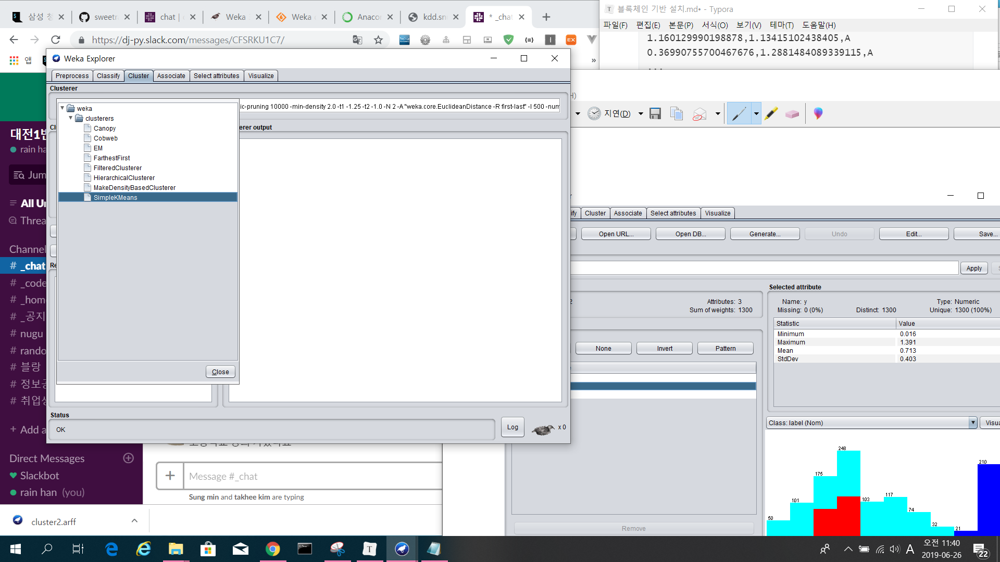

# 블록체인 기반 설치

## Weka[홈페이지](<https://www.cs.waikato.ac.nz/ml/weka/>)

+ 데이터 마이닝을 하기 위한 알고리즘을 돌려볼 수 있는 툴
+ 자바 버전이 완벽하게 맞는것을 받아야한다.
  + Click [here](http://prdownloads.sourceforge.net/weka/weka-3-8-3jre-x64.exe) to download a self-extracting executable for 64-bit Windows that includes Oracle's 64-bit Java VM 1.8
    (weka-3-8-3jre-x64.exe; 120.3 MB) 버전을 받기
+ 
+ explorer-> open
+ 
+ 
+ 
+ 


#### arff file?

+ ㅇㅇ

+ 파일 열어보기

  ```txt
  @relation /cluster2
  @attribute 'x' real
  @attribute 'y' real
  @attribute 'label' { A, B, C }
  @data
  1.070486877555168,1.3281468963583423,A
  1.072777233759164,1.1912489791897676,A
  0.3280287029393205,1.2617127526721839,A
  0.6009257751380932,1.2544653007707827,A
  0.759280982933527,1.284540587384515,A
  0.3984657492146197,1.1409082848170018,A
  0.23262513899155246,1.361438842638087,A
  0.8684272203469869,1.226005354288509,A
  0.39796079548992414,1.2416439972727638,A
  0.9733747561951592,1.3095277358768926,A
  1.160129990198878,1.13415102438405,A
  0.36990755700467676,1.2881484089339115,A
  ...
  ```

  + x와 y의 attribute 설정
  + label이라는 attribute에 A, B, C라는 이름 지정
  + data 아래에는 값 지정.
    + x, y, label 순서.

+ 꼭 이것을 사용하지 않고csv 파일로 사용 가능

  + 저장시 csv 파일로 저장도 가능하고, 읽어오기도 가능하다.


#### clustering 돌리기

+ 

+ 이름을 클릭하면

  

  이와 같은 창이 뜨고 distance는 유클리드로 사용하기

  numClusters 는 클러스터의 개수. 여기서 4개로 시도해볼것

  

  

  

  

  x와 y를 우리가 원한것으로 수정하면 잘 결과가 나온다.

+ if numclusters를 3으로 하면

  

+ 추가하고싶다면 explorer를 나가고 package manager에서 설치

  + 

+ dbscan 설치함.

+ deeplearning도 제공함

+ 


## Anaconda [홈페이지](<https://www.anaconda.com/>)

+ 딥러닝 돌리기 쉽게 만든 라이브러리 모음
+ python 3.7 버전=> version 3 이상이면 상관 X


### jupyter notebook

+ 
+ 
+ 흰색으로 색칠 된 부분이 주소이기 때문에 이 하위폴더에서 사용해야한다.
+ 이미 사용해봤듯, 디렉토리 관리만 잘 하면된다.
+ 주피터 노트북 안에서도 디렉토리 및 파일 생성 / 삭제가 가능하며, 해당 디렉토리에서 만들어도 똑같이 사용이 가능하다.
+ 단축키 다시 정리
  + d : delete
  + b : 아래 추가
  + m : markdown 문법
  + ctrl + enter : 셀 실행
  + 


