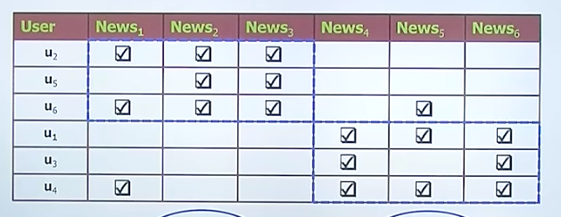
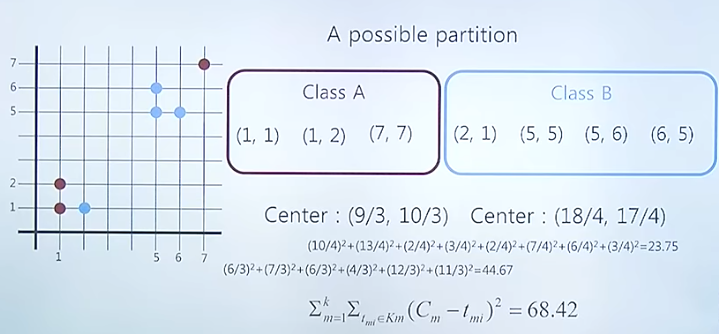
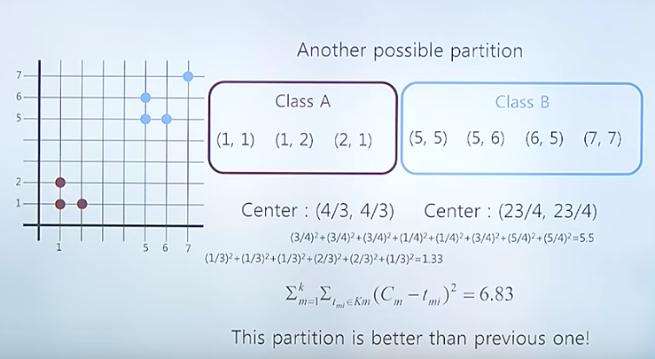
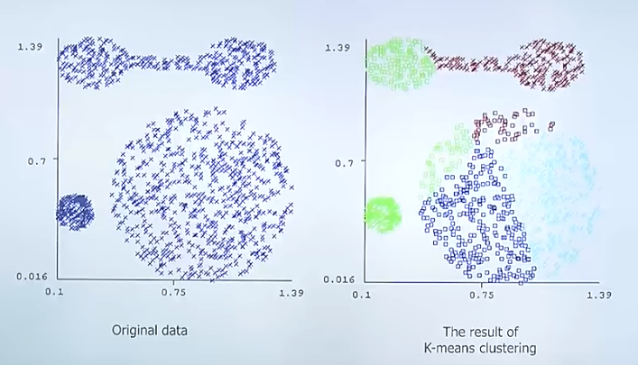
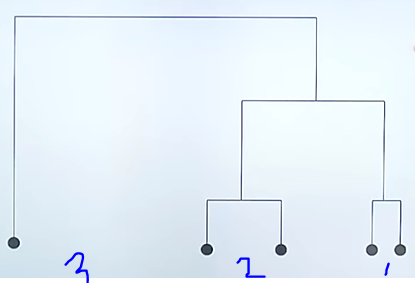
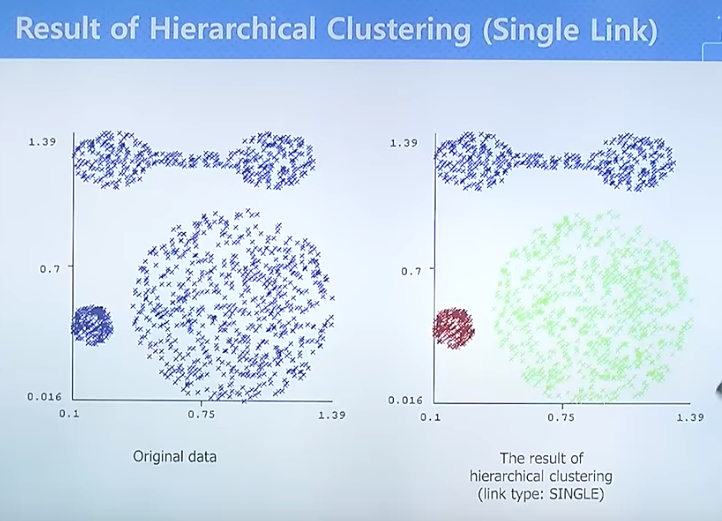

# 빅데이터

## clustering

+ 데이터와 원하는 개수 k 라는 그룹이 있을 때 데이터를 유사도에 의해 k 개의 그룹으로 나눈 것
+ 
  + 위와 같은 테이블에서 뉴스 123을 읽은 그룹과 456을 읽은 그룹으로 구분할 수 있다. 위와 같은 그룹이 나눠질 때, 5번 뉴스와 6번 뉴스를 본 사람에게 4번 뉴스를 추천해 줄 수 있다.
+ 가장 잘 적용할 수 있는 방법? =**추천시스템**
+ 2가지 경우의 클러스터의 개수는? => 2^(가능한 상황의 수)

### 2차원 클러스터링 방법과 확인법

+ 

+ 각각의 포인트와 계산을 통하여 값을 구할 수 있다.

+ 이 것을 우리가 레이블 한 값으로 체크하여 계산해본다면 

  

  이렇게 볼 수 있는데, 위에서 본 68.42와 6.83의 값이 차이가 나는데, 이 값이 작을수록 훨씬 의미있는, meaningful한 값이 된다.

### k-means clustering

+ 랜덤하게 레이블을 지정한 후, 지정된 레이블끼리의 평균점을 구하고, 각각의 지점이 어느 평균점과 가까운지를 체크하여 레이블을 변경한다.
+ 이것을 반복하다가 평균점이 변화가 없으면 stop한다.

+ 단점
  + 클러스터의 사이즈가 크거나 작으면 잘 못찾음
  + 공같은 모양의 클러스터만 잘 찾을 수 있다.
  + 아주 밖에 있는 점에 계산이 잡혀서 평균점이 이상하게 나올 가능성이 있다.
+ 단점의 보완?
  + k-Medoids : 실제로 있는 값들에서 센터값을 결정한다.

### Hierarchical clustering

+ top down 방식과 bottom up 방식이 존재

+ 보통 bottom up 방식을 사용.

+ 방법 

  + 모든 포인터에 있어서 각각의 거리를 계산해보고, 거리가 가장 짧은 두개의 포인터를 하나의 클러스터로 merge해버린다. 이렇게 되면 클러스터의 개수가 하나 줄어든다. 
  + 위 방식을 반복하다가 클러스터가 k개가 되면 stop하는 방식으로 되는것이 bottom up 방식
  + 
  + 1번이 먼저 merge 되고, 다음은 2번이 merge. 만약 여기서 정한 k가 3이라면 총 3개가 되기 때문에 stop한다.

+ 이 때 클러스터의 거리를 구하는 방법은 여러가지가 존재한다.

  + dmin(Ci, Cj) : 두 거리의 최솟값
  + dmean(Ci, Cj) : 두 거리의 평균값
  + dave(Ci, Cj) : 두 점 사이의 모든 값들의 합의 평균
  + dmax(Ci, Cj) : 두 점 사이의 최댓값

  여기서, min과 max를 사용하는 알고리즘을 각각 다른 이름으로 부른다.

  + Single-link - use dmin(Ci, Cj)
  + complete-link - use dmax(Ci, Cj)

+ 각각의 방법에 따라 성능이 아주 달라지기 때문에 잘 선택해야한다.

+ 

  + k-means 클러스터링과 같은 자료를 가지고 클러스터링을 하지만 single link 클러스터링이 훨씬 의미있는 결과를 뽑아냈다.
  
+ 병렬처리(계산) 불가능.

### DBSCAN Clustering

+ density base 

#### 용어정리

+ 2개의 파라미터 정의
  + Eps : 원형으로 이웃해있는 것들의 최대 (입실론)
    + 어디까지 친구라고 할거야?
  + MinPts : Eps 이웃한 포인터들의 최소 숫자
    + 친구가 몇명 이상이어야 인싸야?
+ Neps : 점 p로 부터 입실론 거리 안의 이웃의 집합
+ core point
  + == 인싸
  + Neps 내에서 number of point가 MinPts를 넘으면 core point, 아니면 border point
    + border point == 인싸 아님
+ Density reachable : 점 q에서 p까지 몇번에 걸쳐서라도 갈수만 있다면 ok
+ Density connected : 점 p와 q 사이의 o라는 점에서 p와 q모두를 갈 수 있는 경우
+ 못찾는 아웃사이더 == outlier

### PLSI(probabilistic latent semantic indexing)

+ 토픽을 하나 결정하면 그 다음 단어를 결정하고, 그 다음 단어를 결정하는 방법을 가정하고 학습하는 모델. 
+ 의미 없는 단어(is, are, ... 한국어에서는 조사들)를 미리 걸러주는 과정이 필요한다.
  + 일정 횟수 이상 많이 등장하는 단어는 의미 없이 원래 많이 사용되는 단어이다. 이런것을 제거하는 처리 한다.

