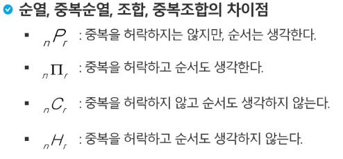

# Computational Thinking


+ inclusive or : 둘 중 하나 +  둘 다 가능
+ exclusive or : 둘 중 하나만.


### 논리 연습

+ 문제 1
  + 만약 0이 홀수라면, 미국에서 2020년 월드컵이 열린다.
    + p : 0이 홀수 : 거짓
    + q : 미국에서 2020년 월드컵 열린다. : 알 수 없음
    + p -> q 에서 p가 거짓이면 q가 거짓이든 참이든 모두 참이다.
  + 만약 1239029581905823571234891057820940923가 소수라면, 2는 짝수이다.
    + p : 알 수 없음
    + q : 참
    + 대우인 ~q -> ~p 일 때 2가 홀수이다가 거짓. 따라서 ~p의 참/거짓 여부에 상관없이 참.
+ 


+ 항진명제 : 항상 참인 명제


### 수와 표현

#### bit와 byte

+ bit : 0 / 1

+ byte : 영문자 한 자를 나타낼 수 있는 단위

  ​	: 8bit = ASCII(7bit) + parity bit(오류검출)

+ unicode : 2byte

+ KB = 2^10Byte


### bit로 값 표현

1. 부호와 절대치

   3비트로 표현

   ```
   0 0 0 		+0
   0 0 1 		+1
   0 1 0 		+2
   0 1 1		+3
   1 0 0 		-0
   1 0 1		-1
   1 1 0 		-2
   1 1 1		-3
   ```

2. 1의 보수

   ```
   1 1 1 		-0
   1 1 0 		-1
   1 0 1		-2
   1 0 0		-3
   ```

3. 2의 보수

   ```
   1 0 0 0 	-0
     1 1 1 	-1
     1 1 0 	-2
     1 0 1		-3
     1 0 0 	-4
   ```

`logn`의 밑은 `2`

+ 어떤 값 n을 표현하기 위해서는 몇 개의 비트가 필요?

  + 2 ^k - 1 >= n 이 성립. 즉, 2^k >= n + 1
  + 같은 의미로 : k >= log(n + 1) => 약 log n비트가 필요
  + x = log n과 2^x = n은 같은 말

+ log n이란?

  + 2의 몇 승이 n이 되느냐의 답
  + n을 표현하는 데 몇 비트가 필요한가의 답
  + 1로 시작해서 계속 두 배를 할 때 몇 번 하면 n이 되느냐의 답
  + n을 2로 계속 나눌 때 몇 번 나누면 거의 1이 되느냐에 대한 답

  


## 기본 확률 이론 정리

### 조합

+ 서로 다른 n개에서 순서를 생각하지 않고 r개 (0 <= r <= n )개를 택하는 것을 조합이라한다.

#### 조합의 점화식

nCr = (n - 1)C(r - 1) + (n - 1)Cr, nC0 = 1


### 순열

+ 서로 다른 n개에서 r 개를 택하여 일렬로 나열하는 방법. 이 순열의 수를 nPr로 나타낸다.
+ nPr = n! / (n - r)! , 0! = 1, nP0 = 1
+ 조합과는 다르게 줄을 세운다!!


#### 순열의 점화식

nPr = n * (n - 1)P(r - 1)


#### 원순열의 점화식

(n - 1)!


#### 중복 순열

+ 서로 다른 n개의 중복을 허용하여 r개를 택하여 일렬로 나열하는 방법.
+ n




가장 많이 나오는것? 중복 순열


#### 순열, 중복순열, 조합, 중복조합 구분

+ 다섯 개의 문자 a, a, a, b, b를 모두 일렬로 배열하는 방법의 수는?
  + 5C2
+ 숫자 1, 2, 3을 사용하여 만들 수 있는 네 자리 정수의 개수는?(단, 한 숫자는 여러 번 사용할 수도 있다.)
  + 3∏4
+ 서로 다른 5통의 편지를 a, b, c의 세 우체통에 넣는 방법의 수는? => 우체통을 나열
  + 3∏5
+ 남자 5명, 여자 3명 중에서 남자 3명, 여자 2명의 임원을 선출하는 방법의 수는?
  + 5C3 * 3C2


## 기초 수식

+ 알고리즘의 시간 복잡도를 표현할 수 있는 다양한 수식들이 존재


### 빅오(O)를 구할 때에는 최고차항만 남긴다! => 계수나 다른것 버리기


문제1.

T(n) = T(n - 1) + n

```
T(n) = T(n - 1) + n
	 = T(n - 2) + (n - 1) + n
	 = T(n - 3) + (n - 2) + (n - 1) + n
	 = T(1) + n^2 - n
	 = O(n^2)
```


## 재귀

+ 자기 자신을 호출하는 함수.
+ 어떻게 끝날것인가? => 끝날 조건 명시 중요


## 병합정렬(merge sort)

=> 병합해놓은 리스트를 원본에 복사하는 과정 등이 필요하기 때문에 시간이 오래 걸리며, 

=> 긴 배열이 뒤에 따라붙으면 복사하는 과정이 오래 걸리기 때문에 linked list로 해야만 효율이 좋다.


```python
def merge_sort(m):
    if len(m) <= 1:
        return m

    # 1. divide
    mid = len(m) // 2
    left = m[:mid]
    right = m[mid:]

    # 리스트 길이가 1이 될 때 까지 divide
    left = merge_sort(left)
    right = merge_sort(right)

    # merge 부분
    return merge(left, right)

def merge(left, right):
    result = []
    # 양 쪽 리스트에 원소가 없을 때 까지 반복
    while left and right:
        if left[0] <= right[0]:
            result.append(left.pop(0))
        else:
            result.append(right.pop(0))
    if left:
        result.extend(left)
    elif right:
        result.extend(right)
    return result


data = [61, 324, 21, 56, 243, 6, 1, 634, 43, 3, 52]
print(data)
print(merge_sort(data))
```

out:

[61, 324, 21, 56, 243, 6, 1, 634, 43, 3, 52]
[1, 3, 6, 21, 43, 52, 56, 61, 243, 324, 634]


## 동적 프로그래밍(동적 계획법) (DP : Dynamic Programming)

+ 재귀 함수에서 동일한 입력의 함수 호출이 반복적으로 일어날 때 그 결과 값을 저장해두고 불러 쓰는 것. (Memoization) (=재귀적 DP)
+ 결과 값을 순서를 정해서 계산할 수 있다.(Dynamic Programming) (=반복적 DP)
+ 반복적 DP가 더 빠르다.


### 메모이제이션

+ 컴퓨터 프로그램을 실행할 때 이전에 계산한 값을 메모리에 저장해서 매번 다시 계산하지 않도록 하여 전체적인 실행속도를 빠르게 하는 기술.


### 이항정리

+ 이항 다항식 x + y의 거듭제곱 (x + y)^n에 대해서 전개한 각 항 x^ky^(n - k)의 계수 값을 구하는 정리
+ 


