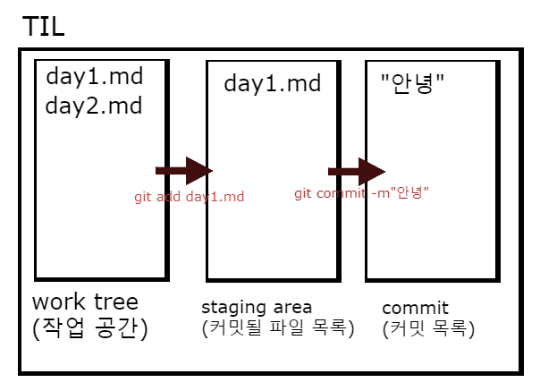
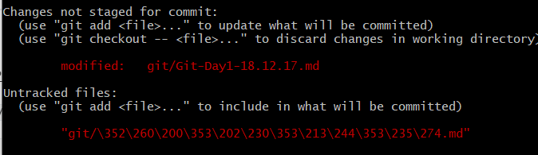
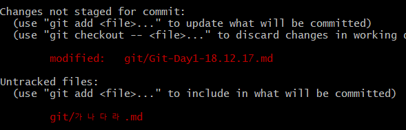

# Git

`Git`은 분산형 버전 관리 시스템(DVCS - Distributed Version Control System)이다.

소스코드의 버전 관리를 할 수 있고, 이력이 관리된다.

### Git 사용 이유?

`git init` : 폴더 하나를 git 으로 관리하겠다




윈도우에서 사용하기 위해 [git for windows (Git bash)](https://gitforwindows.org/)  설치.

사용하고자 하는 폴더에서 우클릭 -> Git Bash Here


## 기초 명령어 정리

### 0. git 초기 설정

```
$ git config --global user.name "유저 이름"
$ git config --global user.email "유저 이메일"
$ git config --global --list
```

설정 되면

```
user.name=sweetrain096
user.email=gpfhddl09@gmail.com
```

이렇게 출력됨.

github에서 사용하고자 하는 폴더에서 우클릭 -> Git Bash Here


### 1.  git 저장소 설정

```
$ git init
```

출력결과 : 
```
Initialized empty Git repository in C:/Users/student/Desktop/TIL/.git/
student@DESKTOP MINGW64 ~/Desktop/TIL (master)
#마스터로 변한다!!
```

**초기 init은 한번만 한다!!**

**주의! 반드시 현재 디렉토리에 git을 사용하고 있는지, (master)가 있는 지 확인할 것.


### 1. git add

`git add`는 현재 `working tree`에서 `commit`할 목록에 담아놓는 것이다.

그리고 그 목록은 `staging area`라고 한다.

```
$ touch a.txt
$ git add .
```

* git add a.txt를 해도 되지만, 우선 git add . 를 하자! -> 폴더에 있는 모든 파일을 업데이트한다.
* `.`은 리눅스 상에서 현재 디렉토리를 뜻한다.

```
$ git add kospi.py
```


### 2. git commit

`git commit`은 현재코드  `status` 를 스냅샷 찍는 것과 동일.

`staging area`에 담겨 있는 내용을 이력으로 기록한다.

```
$ git status
$ git commit -m "커밋 메시지"
```


### + git add와 commit을 한번에

```
$ git commit -m "hi"
```


### git status

git의 현재 상태를 확인한다. 자주자주 입력해보기

```
$ git status
```

****


+ git status 및 add 등으로 수정 할 때 한국어 파일명이 깨지는 상황 방지

  1. bashrc에 추가 : `vi .bashrc`

     ```bash
     alias ls='ls --show-control-chars'
     ```

  2. git bash에 아래 명령어 입력

     ```bash
     git config core.quotepath false
     
     git config --global core.quotepath fasle
     위에거는 글로벌 명령어
     ```

     + bash창에 입력하면 한국어 파일명이 잘 저장된다.

     

     

     


## 원격 저장소로 보내기(push)

사전에 github에 저장소(repository)를 만들어 놓는다.

1. github 원격 저장소 : 이름을 `origin`으로 만들어준다(생성/설정). (1회만 하기)

```
$ git remote add origin 
https://github.com/sweetrain096/rain-s_TIL.git
```

2. 원격 저장소로 보낸다.(push)

```
git push -u origin master
```


## 원격 저장소에서 받기

디렉토리 하나를 생성 한 후 디렉토리에서 Git Bash Here

```powershell
$ git clone "주소"
```


## 원격 저장소에서 가져오기(pull)

github 원격 저장소(repository)에서 변경된 커밋 내용(파일)을 가져오기 위해서는 `pull`명령어를 사용한다. 

```
$ git pull origin master
```


## 원격 저장소 복제하기(clone)

원격 저장소를 복제하기 위해서는 `clone` 명령어를 사용한다. 

clone은 한번만 진행. 이후 업데이트 사항은 pull로 가져온다.

```
$ git clone url(https://github.com/~~~.git)
```


## 원격 저장소에 올리기 싫은 것 관리하기(gitignore)

디렉토리에 .gitignore 파일을 생성한 후 원하지 않는 디렉토리 및 파일이름 작성 후 저장.

git에 올리지 않는 게 좋은 디렉토리 및 파일들을 확인하는 곳 [**gitignore**](https://www.gitignore.io/)


```
# .gitignore

.ipynb_checkpoints/
```


```bash
$ vi .gitignore
```

i눌러서 끼워넣기

모든 내용 붙여넣기

esc -> :wq


# 1. git 저장소

1. 폴더를 git 저장소로 활용 : git init
2. 원격 저장소를 가져옴 : git clone url


## gitlab

1. git init
2. git add .
3. git commit
4. git remote add gitlab "url 주소"
5. git push gitlab master


### git commit 틀릴때

```bash
git commit --amend
```

수정한 후 ctrl + x -> y -> enter


### git commit 확인

```bash
$ git log -1
```


## [git 입문 홈페이지](<https://backlog.com/git-tutorial/kr/>)

git branch 용어

- fast-forwarding : master에서부터 한칸/ 여러칸 앞으로 갔고, master에는 변경 없음. 
- merge commit : a라는 branch가 앞으로 갔는데 master도 앞으로 진행됐을 때 master가 진행되는 경우 **(Auto merge)**
- merge comflict : master와 다른 브랜치가 같이 변경을 했는데, 이 두가지가 같은 파일을수정했을 때 git이 자동으로 순서를 정해주지 못하는 경우 **(수정 / git add / git commit)**


+ rebase라는 용어를 보면 그냥 거르기 => 이력이 변경되는 사항


> 브랜치 용어
>
> > ## 메인 브랜치(Main branch)
> >
> > 'master' 브랜치와 'develop' 브랜치, 이 두 종류의 브랜치를 보통 메인 브랜치로 사용합니다.
> >
> > - **master**
> >   'master' 브랜치에서는, 배포 가능한 상태만을 관리합니다. 커밋할 때에는 태그를 사용하여 배포 번호를 기록합니다.
> > - **develop**
> >   'develop' 브랜치는 앞서 설명한 통합 브랜치의 역할을 하며, 평소에는 이 브랜치를 기반으로 개발을 진행합니다.
> >
> > ## 피처 브랜치(Feature branch)
> >
> > 피처 브랜치는, 앞서 설명한 토픽 브랜치 역할을 담당합니다.
> >
> > 이 브랜치는 새로운 기능 개발 및 버그 수정이 필요할 때에 'develop' 브랜치로부터 분기합니다. 피처 브랜치에서의 작업은 기본적으로 공유할 필요가 없기 때문에, 원격으로는 관리하지 않습니다. 개발이 완료되면 'develop' 브랜치로 병합하여 다른 사람들과 공유합니다.
> >
> > ## 릴리즈 브랜치(Release branch)
> >
> > 릴리즈 브랜치에서는 버그를 수정하거나 새로운 기능을 포함한 상태로 모든 기능이 정상적으로 동작하는지 확인합니다. 릴리즈 브랜치의 이름은 관례적으로 브랜치 이름 앞에 'release-' 를 붙입니다. 이 때, 다음 번 릴리즈를 위한 개발 작업은 'develop' 브랜치 에서 계속 진행해 나가면 됩니다.
> >
> > 릴리즈 브랜치에서는 릴리즈를 위한 최종적인 버그 수정 등의 개발을 수행합니다. 모든 준비를 마치고 배포 가능한 상태가 되면 'master' 브랜치로 병합시키고, 병합한 커밋에 릴리즈 번호 태그를 추가합니다.
> >
> > 릴리즈 브랜치에서 기능을 점검하며 발견한 버그 수정 사항은 'develop' 브랜치에도 적용해 주어야 합니다. 그러므로 배포 완료 후 'develop' 브랜치에 대해서도 병합 작업을 수행합니다.
> >
> > ## 핫픽스 브랜치(Hotfix branch)
> >
> > 배포한 버전에 긴급하게 수정을 해야 할 필요가 있을 경우, 'master' 브랜치에서 분기하는 브랜치입니다. 관례적으로 브랜치 이름 앞에 'hotfix-'를 붙입니다.
> >
> > 예를 들어 'develop' 브랜치에서 개발을 한창 진행하고 있는 도중에 이전에 배포한 소스코드에 아주 큰 버그가 발견되는 경우를 생각해 보세요. 문제가 되는 부분을 빠르게 수정해서 안정적으로 다시 배포해야 하는 상황입니다. 'develop' 브랜치에서 문제가 되는 부분을 수정하여 배포 가능한 버전을 만들기에는 시간도 많이 소요되고 안정성을 보장하기도 어렵습니다. 그렇기 때문에 바로 배포가 가능한 'master' 브랜치에서 직접 브랜치를 만들어 필요한 부분 만을 수정한 후 다시 'master'브랜치에 병합하여 이를 배포하려고 하는 것이죠.
> >
> > 이 때 만든 핫픽스 브랜치에서의 변경 사항은 'develop' 브랜치에도 병합하여 문제가 되는 부분을 처리해 주어야 합니다.

1.     


1. 다른 브랜치로 이동하기

   ```bash
   student@DESKTOP MINGW64 ~/Desktop/gitbranch (master)
   $ git checkout -b rain
   Switched to a new branch 'rain'
   ```

2. 임의로 파일 두개 만들어보기

   ```bash
   student@DESKTOP MINGW64 ~/Desktop/gitbranch (rain)
   $ touch rain.txt
   
   student@DESKTOP MINGW64 ~/Desktop/gitbranch (rain)
   $ touch rain2.txt
   
   student@DESKTOP MINGW64 ~/Desktop/gitbranch (rain)
   $ git add .
   
   ```

3. 다시 마스터 가기

   ```bash
   $ git checkout master
   Switched to branch 'master'
   Your branch is up to date with 'origin/master'.
   
   ```

   

   

   

4. 차이점

   ```bash
   $ git diff rain
   diff --git a/rain.txt b/rain.txt
   deleted file mode 100644
   index e69de29..0000000
   diff --git a/rain2.txt b/rain2.txt
   deleted file mode 100644
   index e69de29..0000000
   
   ```

5. master와 합치기

   ```bash
   $ git merge rain
   Updating b796384..abcfdd5
   Fast-forward
    rain.txt  | 0
    rain2.txt | 0
    2 files changed, 0 insertions(+), 0 deletions(-)
    create mode 100644 rain.txt
    create mode 100644 rain2.txt
   
   ```

   

   

6. git branch list 확인

   ```bash
   $ git branch
   * master
     rain
   
   ```

7. branch 삭제

   ```bash
   $ git branch -d rain
   Deleted branch rain (was abcfdd5).
   ```

8. 브랜치 만들면서 이동

   ```bash
   git checkout -b 브랜치명
   ```

   분리해서 사용

   ```bash
   git branch 브랜치명		//만들기
   git checkout 브랜치명	//이동
   ```

9. 파일 생성

   ```bash
   student@DESKTOP MINGW64 ~/Desktop/gitbranch (sweet)
   $ touch movie.txt
   
   student@DESKTOP MINGW64 ~/Desktop/gitbranch (sweet)
   $ git add .
   
   student@DESKTOP MINGW64 ~/Desktop/gitbranch (sweet)
   $ git commit -m"영화"
   [sweet 26a316a] 영화
    1 file changed, 0 insertions(+), 0 deletions(-)
    create mode 100644 movie.txt
   
   ```

10. master 이동 후 한칸 앞으로

    ```bash
    student@DESKTOP MINGW64 ~/Desktop/gitbranch (sweet)
    $ git checkout master
    Switched to branch 'master'
    Your branch is ahead of 'origin/master' by 1 commit.
      (use "git push" to publish your local commits)
    
    student@DESKTOP MINGW64 ~/Desktop/gitbranch (master)
    $ touch profile.txt
    
    student@DESKTOP MINGW64 ~/Desktop/gitbranch (master)
    $ git add .
    
    student@DESKTOP MINGW64 ~/Desktop/gitbranch (master)
    $ git commit -m" profile -master"
    [master f41b5a1]  profile -master
     1 file changed, 0 insertions(+), 0 deletions(-)
     create mode 100644 profile.txt
    
    ```

11. merge하기

    ```bash
    student@DESKTOP MINGW64 ~/Desktop/gitbranch (master)
    $ git merge sweet
    Merge made by the 'recursive' strategy.
     movie.txt | 0
     1 file changed, 0 insertions(+), 0 deletions(-)
     create mode 100644 movie.txt
    
    ```

    

    

    이렇게 저장하게 되면 master와 sweet가 묶인 merge 커밋을 맨 앞에 하나 붙이고 생긴 순서대로 붙는다. 위의 경우에는 

    ```
    merge commit - master - sweet - 이전커밋
    ```

    ```bash
    $ git log
    commit dbc5101512a196b721e4451b9278ae4e63b26bef (HEAD -> master)
    Merge: f41b5a1 26a316a
    Author: sweetrain096 <gpfhddl09@gmail.com>
    Date:   Fri May 10 09:35:59 2019 +0900
    
        Merge branch 'sweet'
    
    commit f41b5a1290342f7d7146cb75b346208d85ca0087
    Author: sweetrain096 <gpfhddl09@gmail.com>
    Date:   Fri May 10 09:35:16 2019 +0900
    
         profile -master
    
    commit 26a316ad0a7b635ed82d1ee6494858905a4a78f5 (sweet)
    Author: sweetrain096 <gpfhddl09@gmail.com>
    Date:   Fri May 10 09:34:03 2019 +0900
    
        영화
    
    ```

    

    

12. sweet 삭제해보기

    ```bash
    $ git branch -d sweet
    Deleted branch sweet (was 26a316a).
    
    ```

13. 새로 만들기

    ```bash
    student@DESKTOP MINGW64 ~/Desktop/gitbranch (master)
    $ git checkout -b han
    Switched to a new branch 'han'
    
    ```

14. 수정할 용 같은 파일을 수정한 후 저장

    ```bash
    student@DESKTOP MINGW64 ~/Desktop/gitbranch (han)
    $ git add .
    
    student@DESKTOP MINGW64 ~/Desktop/gitbranch (han)
    $ git commit -m" 프로필 han 수정"
    [han ce6990c]  프로필 han 수정
     1 file changed, 2 insertions(+)
    
    ```

15. 이동

    ```bash
    student@DESKTOP MINGW64 ~/Desktop/gitbranch (han)
    $ git checkout master
    Switched to branch 'master'
    Your branch is ahead of 'origin/master' by 4 commits.
      (use "git push" to publish your local commits)
    
    ```

16. 파일수정

    ```txt
    프로필 이미지 100 * 100
    반갑습니다~ ㅇㅇ님 ^^
    ```

17. add

    ```bash
    student@DESKTOP MINGW64 ~/Desktop/gitbranch (master)
    $ git add .
    
    student@DESKTOP MINGW64 ~/Desktop/gitbranch (master)
    $ git commit -m"프로필 마스터 수정"
    [master ca6f990] 프로필 마스터 수정
     1 file changed, 2 insertions(+)
    
    ```

18. merge 해보기

    ```bash
    student@DESKTOP MINGW64 ~/Desktop/gitbranch (master)
    $ git merge han
    Auto-merging profile.txt
    CONFLICT (content): Merge conflict in profile.txt
    Automatic merge failed; fix conflicts and then commit the result.
    
    ```

    + `CONFLICT` : 파일이 충돌났고, 자동 merge가 실패. 충돌을 고친 후 다시 커밋. 

    이 때 파일을 열어보면

    ```txt
    <<<<<<< HEAD
    프로필 이미지 100 * 100
    반갑습니다~ ㅇㅇ님 ^^
    =======
    프로필 이미지 크기를 300 * 300
    ~~님 하이
    >>>>>>> han
    ```

    master가 위에, 아래는 브랜치가나온다.

    이것을 vs코드로 열면

    

    하나 설정할 수 있게 만들어져있고

    위에 네개의 버튼을 눌러 저장하게 되면 된다. 

    이 경우에는 인코딩이 깨진다.

19. status 확인하기

    ```bash
    student@DESKTOP MINGW64 ~/Desktop/gitbranch (master|MERGING)
    $ git status
    On branch master
    Your branch is ahead of 'origin/master' by 5 commits.
      (use "git push" to publish your local commits)
    
    You have unmerged paths.
      (fix conflicts and run "git commit")
      (use "git merge --abort" to abort the merge)
    
    Unmerged paths:
      (use "git add <file>..." to mark resolution)
    
            both modified:   profile.txt
    
    no changes added to commit (use "git add" and/or "git commit -a")
    
    ```

    master에서 MERGING 커밋 메세지가 필요하다는 뜻

20. 위에서 master를 살렸고, add/commit 하기

    ```bash
    student@DESKTOP MINGW64 ~/Desktop/gitbranch (master|MERGING)
    $ git add .
    
    student@DESKTOP MINGW64 ~/Desktop/gitbranch (master|MERGING)
    $ git commit -"merge han branch -master반영"
    [master 3239e67] erge han branch -master반영
    
    ```

21. 원래 이렇게 합친 경우에는 브랜치를 삭제하고 다시 파야한다. 하지만 그렇지 않은 경우의 에러를 보기 위해 그대로 사용하기

22. ```bash
    student@DESKTOP MINGW64 ~/Desktop/gitbranch (master)
    $ git checkout han
    Switched to branch 'han'
    
    ```

    han 브랜치로 들어간 다음에 profile 파일을 수정하기

    ```bash
    
    student@DESKTOP MINGW64 ~/Desktop/gitbranch (han)
    $ git checkout master
    Switched to branch 'master'
    M       rain.txt
    Your branch is ahead of 'origin/master' by 7 commits.
      (use "git push" to publish your local commits)
    
    student@DESKTOP MINGW64 ~/Desktop/gitbranch (master)
    $ git branch -d han
    Deleted branch han (was ce6990c).
    
    ```


## 윈도우 로컬에서 pyenv 사용하기[x]

1. [install ](<https://github.com/pyenv-win/pyenv-win>)

2. git bash에서 할거니까

   ```bash
   pip install pyenv-win --target $HOME/.pyenv
   ```

3. bash에서 사용하기

   ```bash
   vi ~/.bashrc
   #alias python='winpty python.exe'
   alias jn='jupyter notebook'
   export KOBIS_KEY="9a678709f02e6c18438932ed1bf7bee4"
   export PATH="/c/Users/student/.pyenv/bin:$PATH"
   ```
   
4. global

   ```bash
   $ python -V
   Python 3.5.3
   
   student@DESKTOP MINGW64 ~/Desktop
   $ pyenv global 3.6.8
   
   student@DESKTOP MINGW64 ~/Desktop
   $ pyenv rehash
   
   ```

   


## 윈도우 로컬에서 pyenv 사용하기[O]

```bash
1.
$ pyenv install 3.7.2
2.
$ pyenv global 3.7.2
3.
$ pyenv rehash

```


