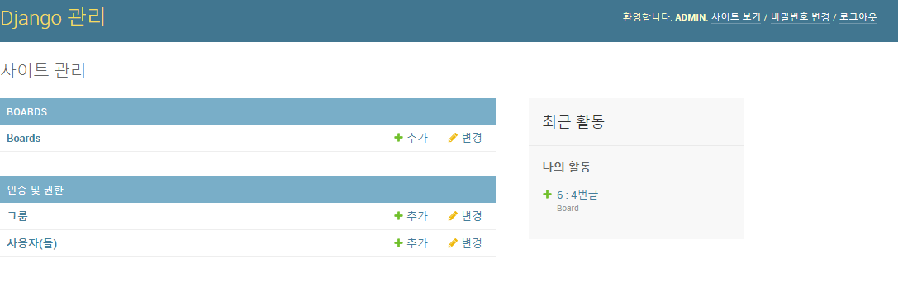
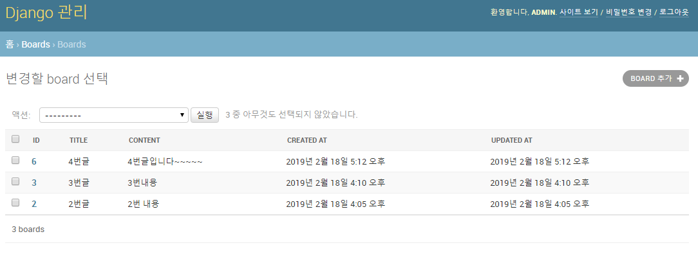
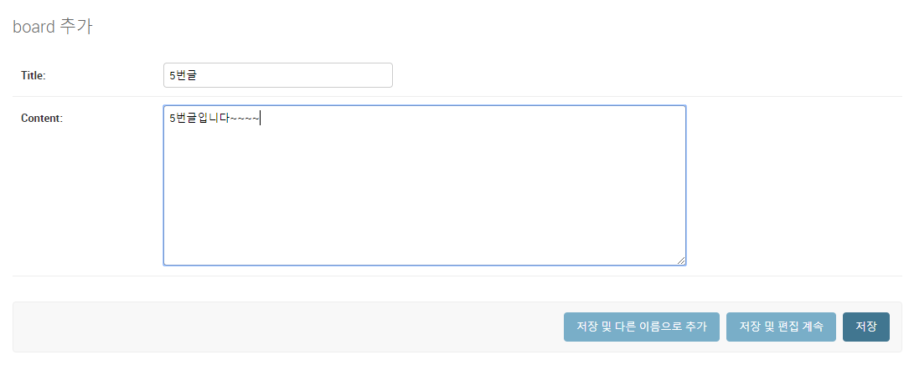
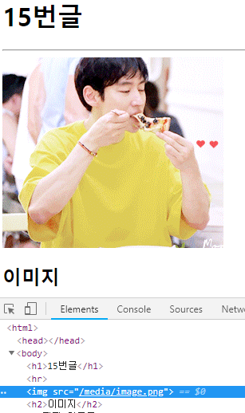
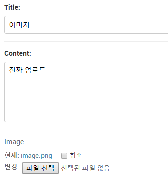

# [Django](https://docs.djangoproject.com/ko/2.1/intro/tutorial01/)

## 시작을 하면 9번부터 읽으세요.... 정신건강에 좋습니다....

+ [djano template language](https://docs.djangoproject.com/en/1.7/topics/templates/)

+ 다른사람 코드를 clone 받아오면 가장 먼저 해야 할 일??

  => migration => migrate

  why? clone 받아온 코드에는 기본적으로 DB가 없다. 그것을 먼저 설정해주기.

  

  

## 0. 구조 확인하기


## 1. 시작하기

0. c9에서 사용될 것이므로 c9 설정 & django 설치

```
pip install django
```


1. 프로젝트 시작하기

   ```python
   $ django-admin startproject (django_intro)(프로젝트 이름)
   ```

   ​	프로젝트 시작하겠다는 뜻

   ​	하게 되면 프로젝트 이름으로 파일 생성

   ```bash
   django-admin startapp home(app 이름)
   ```

   + [gitignore](https://gitignore.io/) 들어가서 django 내용 복사.
   + 터미널에 vi .gitignore 엔터 안에 내용 붙여넣기
   + 저장.

   

   

   

   ```
   django_intro
   	django_intro
   		django_intro
   			__init__.py
   			settings.py
   			urls.py
   			wsgi.py
   		db.sqlite3
   		manage.py
   	README.md
   ```

   ```
   ├── django_intro
   │   ├── __init__.py
   │   ├── __pycache__
   │   │   ├── __init__.cpython-36.pyc
   │   │   ├── settings.cpython-36.pyc
   │   │   ├── urls.cpython-36.pyc
   │   │   └── wsgi.cpython-36.pyc
   │   ├── settings.py
   │   ├── urls.py
   │   └── wsgi.py
   ├── db.sqlite3
   └── manage.py
   ```

   

   지금부터 pwd는 `~/workspace/django_intro` 이다.


2. 서버 실행하기

   + `settings.py`   (django_intro/django_intro/settings.py)

   ```python
   28| ALLOWED_HOSTS = ['*']
   # c9에서는 host - 0.0.0.0, port - 8080만 활용할 수 있기 때문에 위와 같이 설정한다.
   ```

   ```bash
   ~/workspace/django_intro $ python manage.py runserver 0.0.0.0:8080
   ```

   실행시키면 서버에서 로켓모양이 떠야한다!

   앞으로 모든 장고 명령어는 프로젝트를 만들때를 제외하고 `python manage.py`를 활용한다. 따라서, 명령어가 안 될때는 반드시 `pwd`와 `ls`를 통해 현재 bash(터미널) 위치를 확인하자

   


## 2. 사용하기(hello, django)

> Django 프로젝트는 여러가지 app의 집합.
>
> 각각의  app은 MTV 패턴으로 구성되어 있다.
>
> M (Model) : 어플리케이션의 핵심 로직의 동작을 수행한다. 
>
> T (Template) : 사용자에게 결과물을 보여준다.
>
> V (View) : 모델과 템플릿의 동작을 제어한다. (모델의 상태를 변경하거나 값을 가져오고, 템플릿에 값을 전달하기 등)
>
> **일반적으로 MVC패턴으로 더 많이 사용된다.**
>
> 
>
> MVC (MODEL VIEW CONTROLER)
>
> 모델링 : 데이터베이스
>
> view : 보여주는 것 (html)
>
> controler : 모델과 뷰 사이의 연결고리
>
> template(mtv) == view(mvc)
>
> view(mtv) == controler(mvc)


### 1. 기본 로직

앞으로 1. 요청 url(`urls.py`)	2. 처리할 view 설정(`views.py`)		3. 결과 보여줄 template 설정(`templates/`)으로 작성할것.


1. url 설정 (`urls.py`)

   ```python
   # django_intro/urls.py
   from django.contrib import admin
   from django.urls import path
   # home 폴더 내에 있는 views.py를 불러온다.
   from home import views
   
   urlpatterns = [
       path('admin/', admin.site.urls),
       # 요청이 home/으로 오면, views의 index 함수를 실행시킨다.
       path('home/', views.index)
   ]
   ```

   

2. view 설정(`views.py`)

   ```python
   # home/views.py
   from django.shortcuts import render, HttpResponse
   
   # Create your views here.
   def index(request):
       return HttpResponse("hello, django!")
   ```

   + 주의할 점은 선언된 함수에서 `request`를 인자로 받아야 한다.
     + request는 사용자(client. 클라이언트)의 요청 정보와 서버에 대한 정보가 담겨있다.
     + Django 내부에서 해당 함수를 호출하면서 정보를 넘겨주기 때문에 반드시 명시해야한다.

3. (`settings.py`)

   ```python
   INSTALLED_APPS = [
       'django.contrib.admin',
       'django.contrib.auth',
       'django.contrib.contenttypes',
       'django.contrib.sessions',
       'django.contrib.messages',
       'django.contrib.staticfiles',
       'home',		#이것을 추가
   ]
   # 하나하나의 앱들, 외부 라이브러리 추가.
   # 맨 마지막에 붙어도 ','를 붙이기(트레일링)
   ```

   


views.py

```python
def index(request):
    print(request)
    print(type(request))
    print(request.META)
    return HttpResponse("hello, django!")
```

print(request)

out :

<WSGIRequest: GET '/home/'>


print(type(request))

out :

<class 'django.core.handlers.wsgi.WSGIRequest'>


(요청에 대한 클라이언트 정보)

print(request.META)

out :

{'APACHE_PID_FILE': '/home/ubuntu/lib/apache2/run/apache2.pid', 'MANPATH': '/home/ubuntu/.nvm/versions/node/v6.11.2/share/man:/usr/local/rvm/rubies/ruby-2.4.0/share/man:/usr/local/man:/usr/local/share/man:/usr/share/man:/usr/local/rvm/man', 'rvm_bin_path': '/usr/local/rvm/bin', 'C9_SHARED': '/mnt/shared', 'PYENV_ROOT': '/home/ubuntu/.pyenv', 'C9_FULLNAME': 'Rain ...(후략)


## 3. Template (MTV 中 T)

> Django에서 활용되는 Template은 DTL(Django Template Language)이다.
>
> jinja2 와 문법이 유사.


1. 요청 url 설정

   ```python
   # urls.py
   path('home/dinner/', views.dinner),
   ```

2. view 설정

   ```python
   # views.py
   def dinner(request):
       box = ['치킨', '밥', '피자']
       pick = random.choice(box)
       return render(request, 'dinner.html', {'dinner' : pick})
   ```

   + Template을 리턴하려면,  `render`를 사용하여야 한다.
     + `request` (필수)
     + `template 파일 이름` (필수)
     + `template 변수` (선택) : `dictionary` 타입으로 구성해야한다.

3. Template 설정

   ```bash
   $ mkdir home/templates
   $ touch home/templates/dinner.html
   ```

   ```html
   <!-- home/templates/dinner.html -->
   <h1> {{dinner}} </h1>
   ```

4. base 설정

   ```html
   <!DOCTYPE html>
   <html lang="ko">
   <head>
       <meta charset="UTF-8">
       <meta name="viewport" content="width=device-width, initial-scale=1.0">
       <meta http-equiv="X-UA-Compatible" content="ie=edge">
       <title></title>
   </head>
   <body>
       <h1> Django 실습</h1>
       <hr>
       
       
   </body>
   </html>
   ```

   

## 4. Variable Routing

1. url 설정

   ```python
   path('home/you/<name>', views.you),
   path('hone/cube/<int:num>', views, cube),
   ```

2. view 파일 설정

   ```python
   def you(request, name):
       return render(request, 'you.html', {'name' : name})
   ```

3. template 설정

   ```django
   <h1> {{ name }}, 안녕!! </h1>
   ```


## 5. Form data

1. `ping`

   1. 요청 url 설정

      ```python
      path('home/ping/', views.ping)
      ```

   2. view 설정

      ```python
      def ping(request):
          return render(request, 'ping.html')
      ```

   3. template 설정

      ```django
      <form action='/home/pong/'>
          <inupt name="message" tyep="text">
          <inupt type="submit">
      </form>
      ```

2. `pong`

   1. 요청 url 설정

      ```python
      path('home/pong/', views.pong)
      ```

   2. view 설정

      ```python
      def pong(request):
          msg = request.GET.get("message")
          return render(request, 'pong.html', {'msg' : msg})
      ```

   3. template 설정

      ```django
      <h1>{{ msg }}</h1>
      ```

3. POST 요청 처리

   1. 요청 FORM 수정

      ```django
      <form action="/home/pong/" method="POST">
          
      </form>
      ```

   2. view 수정

      ```python
      def pong(request):
          msg = request.POST.get("message")
      ```

   + `csrf_token`은 보안을 위해 django에서 기본적으로 설정해 놓은 보안 장치(?) 이다.
     + CSRF 공격 : Cross Site Request Forgery
     + form을 통해 POST 요청을 보낸다는 것은 데이터베이스에 반영되는 경우가 대부분인데, 해당 요청을 우리가 만든 정해진 form에서 보내는지 검증하는 것.
     + 실제로 input type hidden으로 특정한 hash 값이 담겨 있는 것을 볼 수 있다.
     + `settings.py`에 `MIDDLEWARE` 설정에 보면 csrf  관련된 내용이 설정된 것을 볼 수 있다.


## 6. dictionary 접근

> views.py에서 만든 딕셔너리에 접근하기 위해 인스턴스 변수(?) 처럼 사용할 수 있다~

1. 요청 url 설정

   ```python
   from django.contrib import admin
   from django.urls import path
   from rain import views
   
   urlpatterns = [
       path('admin/', admin.site.urls),
       path('info/', views.info),
       path('student/<student>', views.student),
   ]
   ```

2. view 설정

   ```python
   from django.shortcuts import render
   
   students = {"박길동" : 28, "홍길동" : 30, "김길동" : 22}
   # Create your views here.
   def info(request):
       teacher = '갓탁희... 그저 빛....'
       return render(request, 'info.html', {'students' : students, 'teacher' : teacher})
       
   def student(request, student):
       # age = students[student]
       age = students.get(student, 'unknown')
       # 아래가 중요!!!!!!!!!!!!
       student1 = {'name' : 'rain', 'age' : 24, 'nickname' : 'sweetrain'}
       return render(request, 'student.html', {'student' : student, 'age' : age,'student1' : student1})
   ```

3. template 설정

   ```django
   
       <h1> 등록되지 않은 학생입니다. </h1>
   
       <h1>이름 : {{student}}</h1>
       <h2>나이 : {{age}}</h2>
   
   <h3>student1</h3>
   <h4>{{ student1.name }}</h4>
   <h4>{{ student1.age }}</h4>
   <h4>{{ student1.nickname }}</h4>
   ```

   


## 7. Django 문법

+ views.py

  ```python
  def template_example(request):
      my_dict = {'name' : 'han', 'nickname' : 'sweetrain', 'age' : 24}
      my_list = ['짜장면', '짬뽕', '탕수육', '양장피', '초밥']
      my_sentence = 'Life is short, you need python!'
      messages = ['apple', 'banana', 'cucumber', 'mango']
      datetimenow = datetime.datetime.now()
      empty_list = []
      return render(request, 'template_example.html', {'my_dict' : my_dict, 
          'my_list' : my_list, 'my_sentence' : my_sentence, 'messages' : messages,
          'datetimenow' : datetimenow, 'empty_list' : empty_list
      })
  ```

  

### 1. [반복문](https://docs.djangoproject.com/en/1.7/ref/templates/builtins/#for), [빈 리스트 반복문](https://docs.djangoproject.com/en/1.7/ref/templates/builtins/#for-empty)

```django
<p>1. 반복문</p>

    {{ forloop.counter }}
    
        <p>어머님은 짜장면이 싫다고하셨어~</p>
    
        <p>{{ menu }}</p>
    

<hr>
<!-- 빈 리스트가 들어올 때!!!!-->

    <p>{{ user }}</p>
    
        <p>지금 가입된 유저가 없습니다.</p>

```

out : 

\1. 반복문

1

어머님은 짜장면이 싫다고하셨어~

2

짬뽕

3

탕수육

4

양장피

------

지금 가입된 유저가 없습니다.

------


+ forloop 문법

| **Variable**            | **Description**                          |
| ----------------------- | ---------------------------------------- |
| **forloop.counter**     | 루프의 현재 반복 (1- 색인)               |
| **forloop.counter0**    | 루프의 현재 반복 (0- 색인)               |
| **forloop.revcounter**  | 루프 끝에서의 반복 횟수 (1- 색인)        |
| **forloop.revcounter0** | 루프 끝에서 반복 횟수 (0- 색인)          |
| **forloop.first**       | 첫번째                                   |
| **forloop.last**        | 마지막                                   |
| **forloop.parentloop**  | 중첩 루프의 경우 현재 루프를 둘러싼 루프 |


### 2. 조건문

```django
<p>2. 조건문</p>

    <p>짜장면은 고추가루!</p>


    <p>치킨이 있다면 나오겠지?</p>

```

out :

\2. 조건문

짜장면은 고추가루!


### 3. filter

```django
<p>3. length filter 활용</p>

    
        <p>글씨가 너무 길어요</p>
    
        <p> {{ message }}, {{ message|length }}</p>
    

```

out : 

\3. length filter 활용

apple, 5

글씨가 너무 길어요

글씨가 너무 길어요

mango, 5


### 4. lorem

```django
<p>4. lorem ipsum : %를 주의하자!</p>
<!-- lorem 함수 -->

<hr>
<!-- lorem 3단어 -->

<hr>
<!-- lorem 4단어 랜덤. 계속 바뀐다. -->

<hr>
<!-- lorem 2 문단. html 구조에서도 문단구조이다. -->

<hr>
```

out :

\4. lorem ipsum : %를 주의하자!

Lorem ipsum dolor sit amet, consectetur adipisicing elit, sed do eiusmod tempor incididunt ut labore et dolore magna aliqua. Ut enim ad minim veniam, quis nostrud exercitation ullamco laboris nisi ut aliquip ex ea commodo consequat. Duis aute irure dolor in reprehenderit in voluptate velit esse cillum dolore eu fugiat nulla pariatur. Excepteur sint occaecat cupidatat non proident, sunt in culpa qui officia deserunt mollit anim id est laborum.

------

lorem ipsum dolor

------

quam veritatis consequuntur deserunt

------

Lorem ipsum dolor sit amet, consectetur adipisicing elit, sed do eiusmod tempor incididunt ut labore et dolore magna aliqua. Ut enim ad minim veniam, quis nostrud exercitation ullamco laboris nisi ut aliquip ex ea commodo consequat. Duis aute irure dolor in reprehenderit in voluptate velit esse cillum dolore eu fugiat nulla pariatur. Excepteur sint occaecat cupidatat non proident, sunt in culpa qui officia deserunt mollit anim id est laborum.

Repellat ab numquam repudiandae velit vero voluptas veniam itaque voluptatem, nostrum voluptate est voluptatum quasi vero quibusdam ducimus ex quod, quas sapiente voluptatum fuga possimus necessitatibus praesentium mollitia, aliquid delectus sunt eius facilis inventore culpa. Adipisci sapiente eaque ad alias asperiores molestiae et obcaecati quaerat aspernatur, doloribus officiis modi inventore iste eum assumenda nemo atque quasi voluptate eius, cum nemo quae amet quidem id sint laboriosam et, delectus nihil doloribus facilis velit iusto esse, reiciendis dicta officia iste laudantium rerum sunt?


### 5. 글자수제한(truncate)

```django
<p>5. 글자수 제한(truncate)</p>
<p>{{ my_sentence|truncatewords:3 }}</p>
<p>truncatechars:4는 ' ...'으로 공백 + ... 을 포함한다.</p>
<p>{{ my_sentence|truncatechars:4 }}</p>
<p>{{ my_sentence|truncatechars:10 }}</p>
```

out :

\5. 글자수 제한(truncate)

Life is short, ...

truncatechars:4는 ' ...'으로 공백 + ... 을 포함한다.

...

Life i ...


### 6. 글자 관련 필터

```django
<p>6. 글자 관련 필터</p>
<!--길이출력-->
<p>{{ 'abc'|length }}</p>
<!--소문자 변환 -->
<p>{{ 'ABC'|lower }}</p>
<!-- 띄어쓰기 맨 앞 대문자 -->
<p>{{ my_sentence|title }}</p>
<!-- 문장의 맨 앞글자만 대문자-->
<p>{{ 'abc def. hi'|capfirst }}</p>
<!-- 문자열 or list 중 하나만 랜덤으로 리턴-->
<!-- 딕셔너리는 key?에러가 난다 -->
<p>{{ 'abcadsf'|random }}</p>
<p>{{ my_list|random }}</p>
```

out : 

\6. 글자 관련 필터

3

abc

### Life Is Short, You Need Python!

Abc def. hi

a

짬뽕


### 7. 연산

```django
<p>7. 연산</p>
<p>{{ 4|add:6 }}</p>
```

out :

\7. 연산

10


+ [django-mathfilters](https://pypi.org/project/django-mathfilters/) 라는 외부 라이브러리를 설치해야 덧셈 외의 다른 값을 사용 가능하다.
+ [github](https://github.com/dbrgn/django-mathfilters) mathfilters 사용


### 8. [날짜표현](https://docs.djangoproject.com/en/1.7/ref/templates/builtins/#date)

```django
<p>8. 날짜표현</p>
{{ now }} <br>
 <br>
 <br>
 <br>
 <br>
<br>
<!-- 아래는 주석. D로 쓰면 원래 요일을 Monday를 M으로 표현. but 한글은 안줄어든다..-->
<!---->
<!--datetimenow로 해서 date로 type을 지정해줘야지만 사용할 수 있다!-->
{{ datetimenow|date:"SHORT_DATETIME_FORMAT" }}

```

out :

\8. 날짜표현

2019년 2월 12일 11:24 오전 

2019-2-12 11:24 

2019년 2월 12일 11:24 오전 

2019-2-12. 

2019년 2월 12일 

2019년 02월 12일 (화요일) 11:24

2019-2-12 12:04


+ 우리가 지역 및 시간설정을 했기 때문에 년 월 일 순서로 나오는것.
+ 장고에서는 now를 기본적으로 현재 시간으로 사용할 수 있다.
+ 그러나 나중에 다른 시간을 사용하려면 views.py에서 datetime.datetime.now로 불러 사용해야한다.


### 9. urlize

```django
<p>9. urlize</p>
<p>자동으로 앞에 http://를 붙여준다.</p>
{{ 'google.com'|urlize }}
```

out :

\9. urlize

자동으로 앞에 http://를 붙여준다.

google.com


## 8. static file 관리

> 정적 파일(image, css, js)을 서버 저장이 되어 있을 때, 이를 각각의 템플릿에 불러오는 방법.


### 디렉토리 구조

static에 들어갈 내용을 `home(app 이름)/static/구분폴더(img, stylesheet 등)/file`로 넣어준다.

`/static/`이라는 폴더를 만드는게 핵심 (기본이 `/static`)

```
├── home
│   ├── static
│   │   ├── imgs
│   │   │   └── 1.jpg
│   │   └── stylesheets
│   │       └── style.css
```


1. 파일 생성

   + home/static/style.css

     ```css
       body {
           color:pink;
       }
     ```

   + home/templates/base.html

     ```django
     <!DOCTYPE html>
     <html lang="ko">
     <head>
         <meta charset="UTF-8">
         <meta name="viewport" content="width=device-width, initial-scale=1.0">
         <meta http-equiv="X-UA-Compatible" content="ie=edge">
         <title></title>
         
     </head>
     <body>
         <h1> Django 실습</h1>
         <hr>
         
         
     </body>
     </html>
     ```

2. 템플릿 활용

   + home/templates/static_example.html

   + **상속을 받는다면 extends가 최상단에 위치해야한다!!! **

     ```django
     
        
        
        <link rel="stylesheet" href="" type="text/css" />
        
        
        
            
            
        
     
     ```


out :


+ static 폴더를 사용할 수 있는 이유?

  settings.py

  ```python
  # 맨 아래쪽
  
  # Static files (CSS, JavaScript, Images)
  # https://docs.djangoproject.com/en/2.1/howto/static-files/
  
  STATIC_URL = '/static/'
  
  ```


### 추가적인 디렉토리 사용

`settings.py`

```python
STATIC_URL = '/static/'
# 기본으로 INSTALLED_APPS 아래 있는 static 디렉토리를 탐색
# 추가적인 디렉토리를 활용하려면 아래와 같이 작성(임의 디렉토리 추가)
STATICFILES_DIRS = [
    os.path.join(BASE_DIR, 'assets'),
]
```

+ `STATICFILES_DIRS` 이름으로 폴더명을 지정해주면 그 디렉토리에 static 파일을 저장하여 사용할 수 있다.


## 9. URL 설정 분리. (app 여러개 쓰기)

> 위와 같이 코드를 짜는 경우에, `django_ntro/urls.py`에 모든 url 정보가 담기게 된다.
>
> 일반적으로 Django 어플리케이션에서 url을 설정하는 방법은 app별로 `urls.py`를 구성하는 것.

>templates, static
>
>file 이름을 서로 다른 app에서 동일하게 사용하게되면 settings.py에서 먼저 나오는 app의 file을 읽어서 내보낸다. 때문에 이름을 다르게 사용하거나, app별로 app 이름으로 폴더를 생성하여 사용한다.


1. 새 app 만들기

   ```bash
   $ python manage.py startapp utilities
   ```

2. django_intro/settings.py

   ```python
   INSTALLED_APPS = [
       'django.contrib.admin',
       'django.contrib.auth',
       'django.contrib.contenttypes',
       'django.contrib.sessions',
       'django.contrib.messages',
       'django.contrib.staticfiles',
       'home',
       'utilities',
   ]
   ```

3. django_intro/urls.py

   ```python
   # include 추가
   from django.urls import path, include
   ```

   home/ 이 붙어있는 모든 내용을 복사하여 아래 home/urls.py에 넣은 후,

   ```python
   urlpatterns = [
       path('admin/', admin.site.urls),
       # 요청이 home/으로 오면, home/urls.py의 설정들에 맞춰 뷰로 보내준다.
       path('home/', include('home.urls')),
   ]
   ```

   urlpatterns을 수정한다.

   + `include`를 통해 `app/urls.py` 에 설정된 url을 포함.

   

4. home/urls.py 생성(내가 직접 만들어야한다!!)

   ctrl + f 를 눌러 home/을 없앤다.

   ```python
   from django.urls import path, include
   # . 폴더 (현재 디렉토리) 내에 있는 views.py를 불러온다.
   from . import views
   
   urlpatterns = [
       path('', views.index),
       path('dinner/', views.dinner),
       path('you/<name>/', views.you),
       path('cube/<int:num>/', views.cube),
       path('ping/', views.ping),
       path('pong/', views.pong),
       path('user_new/', views.user_new),
       path('user_read/', views.user_read),
       path('template_example/', views.template_example),
       path('static_example/', views.static_example)
   ]
   ```
   + `home/views.py` 파일에서 `index`를 호출하는 url은 `http://<host>/` 가 아니라, `http://<host>/home/`이다.

   

5. django_intro/urls.py

   ```python
   urlpatterns = [
       path('admin/', admin.site.urls),
       # 요청이 home/으로 오면, home/urls.py의 설정들에 맞춰 뷰로 보내준다.
       path('home/', include('home.urls')),
       # 새 app 추가.
       path('utilities/', include('utilities.urls')),
   ]
   ```


## 10 Templates, static 폴더 설정

### 디렉토리 구조

디렉토리 구조는 `home/templates/home/`으로 구성된다.


1. settings.py의 templates 부분을 수정한다.

   ```python
   TEMPLATES = [
       {
           'BACKEND': 'django.template.backends.django.DjangoTemplates',
           # 아래 부분을 수정한다.
           # 'DIRS': [os.path.join(BASE_DIR, 프로젝트 이름 바로 아래 폴더
           #                                 (만약 이름이 없다면 프로젝트 폴더 
           # 								가장 상단에 존재한다., 'templates')],
   
           'DIRS': [os.path.join(BASE_DIR, 'django_intro', 'templates')],
           'APP_DIRS': True,
           'OPTIONS': {
               'context_processors': [
                   'django.template.context_processors.debug',
                   'django.template.context_processors.request',
                   'django.contrib.auth.context_processors.auth',
                   'django.contrib.messages.context_processors.messages',
               ],
           },
       },
   ]
   ```

   + `DIRS` : templates를 커스텀하여 경로를 설정할 수 있다.

     + 경로 설정

       ```python
       'DIRS': [os.path.join(BASE_DIR, 'django_intro', 'templates')],
       # =>/workspace/Django_intro/django_intro/templates/
       ```

   + `APP_DIRS` : `INSTALLED_APPS`에 설정된 APP의 디렉토리에 있는 `templates`를 템플릿으로 활용한다.(True)

2. `home/templates/home/내용`, `home/static/home/내용` 으로 폴더를 만들어준다.

   ```
   ├── home
   │   ├── static
   │   │   └── home
   │   │       ├── imgs
   │   │       │   └── 1.jpg
   │   │       └── stylesheets
   │   │           └── style.css
   │   ├── templates
   │   │   └── home
   │   │       ├── base.html
   │   │       ├── cube.html
   │   │       ├── dinner.html
   │   │       ├── index.html
   │   │       ├── ping.html
   │   │       ├── pong.html
   │   │       ├── static_example.html
   │   │       ├── template_example.html
   │   │       ├── user_new.html
   │   │       ├── user_read.html
   │   │       └── you.html
   ```

   static과 templates 폴더 안에 app 이름으로 폴더를 다시 만든 후 모든 내용을 집어넣는다.

   + 이렇게 하는 이유???
     + django는 templates와 static을 각각 모아서 확인을 하게된다. 

     + templates들의 모임에서 각각의 app의 것인지를 확인하기 위해서는 폴더명으로 한번 더 감싸서 app들의 MTV인지를 확인시켜 주는 것이다.

       

3. 이후, base.html을 사용하고 있는 모든 html 에 에러가 날 것. 

   + `django_intro`(settings.py와 ulrs.py가 존재하는 폴더) 안에 `templates` 폴더를 만들어준다.

   + `home/templates/home/base.html`을 `django_intro/`아래로 이동시킨다.

     ```
     ├── django_intro
     │   ├── templates
     │   │   └── base.html
     │   ├── settings.py
     │   ├── urls.py
     │   └── wsgi.py
     ├── home
     └── utilities`django_intro/settings.py`
     ```


   utilities/urls.py(직접 생성)


```python
from django.urls import path
from . import views

urlpatterns = [
    path('', views.index),  #/utilities/    
]
```


## 11. Model 만들기	(아래부터 새로 시작)

# Django CURD

## MODEL 기초


1. django_crud 프로젝트 만들기

   ```bash
   $ django-admin startproject django_crud
   ```

2. boards app 설정

   ```bash
   $ cd django_crud
   $ django-admin startapp boards
   ```

3. app 등록

   ```python
   #  settings.py
   ALLOWED_HOSTS = ["*"]
   INSTALLED_APPS = [
       'django.contrib.admin',
       'django.contrib.auth',
       'django.contrib.contenttypes',
       'django.contrib.sessions',
       'django.contrib.messages',
       'django.contrib.staticfiles',
       'boards',
   ]
   LANGUAGE_CODE = 'ko-kr'
   
   TIME_ZONE = 'Asia/Seoul'
   ```

4. 최상단 django_crud 디렉토리 이름을 장고CRUD로 바꾸고 

5. Model 생성

   board/models.py 수정.=> ORM 설정

   ```python
   # board/models.py 
   
   from django.db import models
   
   # Create your models here.
   # class 명을 단수형으로 하기.
   class Board(models.Model):
       # column들을 어떻게 설정할건지 지정하기.
       # CharField는 몇글자 제한할건지 꼭 넣어주기
       title = models.CharField(max_length=10)
       # TextField는 글자 제한 없다.
       content = models.TextField()
       # 자동 날자 기입하도록 조건 추가.
       created_at = models.DateTimeField(auto_now_add=True)
       # 업데이트 될 때 마다 계속 변경되기 때문에 now를 적지 않는다.
       updated_at = models.DateTimeField(auto_now=True)
   ```

   + DB의 컬럼과, 어떠한 타입으로(글자 제한이나 어떠한 타입 정의 등) 정의할 것인지에 대해 `django.db.models`를 활용해서 `Board` 클래스를 만든다.

   + class Meta: 를 사용할 수 있다.

     ```python
     class Board(models.Model):
         title = models.CharField(max_length=10)
         content = models.TextField()
         created_at = models.DateTimeField(auto_now_add=True)
         updated_at = models.DateTimeField(auto_now=True)
         
         class Meta:
             ordering = ['-title']
     ```

     + order는 기본적으로 order_by로 할 수 있으나, class를 만들 때에 사용할 수 도 있다. 위와 같이 Meta 태그를 걸어서 title 의 역순. 내림차순으로 정렬할 수 있다.

6. bash창

   ```bash
    $ python manage.py makemigrations
   ```

   + migration 한다. : 내가 만들기 전. 클래스. 모델 파일을 마이그래이션으로 반영하는것은 우리가 디비에 어떤식으로 반영할건지를 지정.

   + 다시 말해, db의 스키마를 지정하는 것 처럼, DB에 반영하기 전에, 현재 등록된 APP의 `models.py`를 바탕으로 DB 설계도를 작성하는 것을 `마이그래이션 한다`고 한다.

   + `migrations`폴더에 `0001_initial.py` 파일들이 생성된다.

   + `id` : primary key는 기본적으로 처음 테이블 생성시 자동으로 만들어진다.

     ```python
     class Board(models.Model):
         id = models.AutoField(Primary_key=True)
         ...
     ```

     

7. 내가 원하는대로 잘 만들어졌는지 확인하기 위한 명령어. sqlite3로 만들어진다.

   out :

   ```
   BEGIN;
   --
   -- Create model Board
   --
   CREATE TABLE "boards_board" ("id" integer NOT NULL PRIMARY KEY AUTOINCREMENT, "title" varchar(10) NOT NULL, "content" text NOT NULL, "created_at" datetime NOT NULL);
   COMMIT;
   ```

8. DB에 반영 : migrate

   ```bash
   $ python manage.py migrate
   ```

   + 실제 쿼리문을 확인하는 방법

     ```bash
     $ python manage.py sqlmigrate boards 0001
     ```

     + App 이름(boards)와 migration 버전(0001, 0002, ...)으로 명령어를 입력하면, 실제 데이터 베이스에 적용되는 sql 쿼리를 확인할 수 있다.
     + `sqlmigrate` 명령어는 실제로 DB에 반영되지는 않는다. (단순 쿼리 확인)

## 장고 ORM 활용하기

> 시작하기에 앞서서 django shell에서 모델과 관련된 메소드를 활용하여 데이터베이스 조작하기

0. `django shell` 활용 하기 

   ```bash
   $ python manage.py shell
   ```

   + 이 경우에는 내가 활용할 모듈 혹은 파일을 직접 import 해야한다. 번거롭기 때문에 `django_extensions`을 깔아서 활용.

   django-extensions 설치

   ```bash
   $ pip install django-extensions
   ```

   + 해당 모듈을 활용하기 위해서는 `settings.py`에 APP 등록을 해야한다.

     ```python
     # settings.py
     INSTALLED_APPS = [
         'django.contrib.admin',
         'django.contrib.auth',
         'django.contrib.contenttypes',
         'django.contrib.sessions',
         'django.contrib.messages',
         'django.contrib.staticfiles',
         # app 위에 추가
         'django_extensions',
         'boards',
     ]
     ```

   + `shell_plus` 실행

     ```bash
     $ python manage.py shell_plus
     ```

     + 실행하면, `INSTALLED_APPS`에 설정된 내용들이 자동 import 된다.

1. 메소드 정리

   1. CRUD - C : Create

      ```python
      # 1번
      board = Board()
      board.title = '1번 제목'
      board.content = '1번 내용'
      board.save()
      
      # 2번
      board = Board(title='2번 제목', content='2번 내용')
      board.save()
      
      # 3번
      board = Board.objects.create(title='3번 제목', content='3번 내용')
      # 3번 같은 경우는 save를 하지 않아도 자동 저장된다.
      ```

      + `save()`

        ```python
        board = Board(title='2번 제목', content='2번 내용')
        board.id #=> None
        board.created_at #=> None
        board.save()
        board.id #=>1
        board.created_at #=> datetime.datetime(2019, 2, 18, 7, 5, 12, 420766, tzinfo=<UTC>)
        ```

        + `save()` 메소드를 호출 해야, DB에 저장된다. DB에 저장되면서 `id`와 `created_at`에 값이 부여된다.
        + `save()`전에 `full_clean()` 메소드를 통해 현제 board 객체가 validateion(검증)에 적합한지를 알아볼 수 있다.

      + bash창에서 알아보기

        ```bash
        >>> board = Board(title='안녕?', content='내용이야')
        >>> board
        <Board: Board object (None)>
        >>> board.title
        '안녕?'
        >>> board.save()
        >>> board
        # (1)은 아이디
        <Board: Board object (1)>
        
        
        
        >>> board = Board()
        >>> board.title = "2번글"
        >>> board.content = "2번 내용"
        >>> board.id
        >>> board.created_at
        # save를 해야지만 DB에 반영이 된다!!!!
        >>> board.save()
        >>> board.id
        2
        >>> board.created_at
        datetime.datetime(2019, 2, 18, 7, 5, 12, 420766, tzinfo=<UTC>)
        
        
        >>> board = Board.objects.create(title='3번글', content='3번내용')     
        >>> board
        <Board: 3 : 3번글>
        
        ```

   2. CURD - R : Read

      1. `all()`

         ```python
         boards = Board.objects.all()
         #=> <QuerySet [<Board: 1 : 안녕?>, <Board: 2 : 2번글>, <Board: 3 : 3번글>]>
         ```

      2. `get(pk=value)`

         ```python
         Board.objects.get(pk=1)
         # Board.objects.get(id=1)
         ```

         + `get()` 은 데이터베이스에 일치하는 값이 없으면, 오류가 발생.
         + 또한, 결과가 여러개의 값이면, 오류가 발생한다.
         + 따라서, `id` 즉, Primary Key에만 사용하자.
         + 리턴값은 **board 오브젝트**이다! (`filter()`, `all()`은 모두 queryset이 리턴된다.)

      3. `filter(column=Value)`

         ```python
         Board.objects.filter(title='안녕?')
         # => <QuerySet [<Board: 1 : 안녕?>]>
         Board.objects.filter(id=1)
         # => <QuerySet [<Board: 1 : 안녕?>]>
         # 더블언더스코어(__) 활용.(DB의 like)
         Board.objects.filter(title__contains='번글')
         # => <QuerySet [<Board: 2 : 2번글>, <Board: 3 : 3번글>]>
         ```

         + 데이터베이스에서 찾았을 때, 결과가 하나이더라도 리턴값은 QuerySet이다. 결과가 없어도 비어있는 QuerySet을 리턴한다.!

   3. CURD - D : Delete

      1. delete

         ```python
         board = Board.objects.get(pk=1)
         board.delete()
         ```

   4. CURD - U : update

      1. update

         ```python
         board = Board.objects.get(pk=1)
         board.title = "수정"
         board.save()
         ```

         + `save()` 메소드는 board 오브젝트에 id가 없을 때에는 값을 추가하고, 있으면 수정한다.

   5. 추가 메소드

      ```python
      # 정렬
      Board.objects.order_by('title') # 오름차순
      Board.objects.order_by('-title') # 내림차순
      
      # 특정 단어 기준 탐색
      Board.objects.filter(title__contains='글')	# 제목에 글이 들어간 모든 데이터
      Board.objects.filter(title__startswith='1') # 제목이 1로 시작하는 모든 데이터
      Board.objects.filter(title__endswith='글') # 제목이 글로 끝나는 모든 데이터
      
      >>> Board.objects.filter(title__endswith='글')[0]
      <Board: 2 : 2번글>
      >>> Board.objects.filter(title__endswith='글')[1]
      <Board: 3 : 3번글>
      ```


## admin 활용하기

1. `boards/admin.py`

   ```python
   from django.contrib import admin
   # admin.py에서 Board 클래스를 쓰려면 반드시 import 해야한다.
   # 명시적 상대 (.models : 현재디렉토리에 있는 models.py)
   from .models import Board
   # Register your models here.
   class BoardAdmin(admin.ModelAdmin):
       list_display = ['id', 'title', 'content', 'created_at', 'updated_at',]
   admin.site.register(Board, BoardAdmin)
   ```

   ```bash
   $ python manage.py createsuperuser
   사용자 이름 (leave blank to use 'ubuntu'): admin
   이메일 주소: 
   Password: 
   Password (again): 
   # email 주소 작성 및 password 작성. 비밀번호는 123123으로 작성했다.
   ```

   ```bash
   $ python manage.py runserver 0.0.0.0:8080
   ```

   

   

   


## 게시판 만들기

### index 생성

1. `/django_curd/urls.py`

   ```python
   from django.contrib import admin
   from django.urls import path, include
   
   urlpatterns = [
       path('admin/', admin.site.urls),
       path('boards/', include('boards.urls'))
   ]
   ```

2. `/boards/urls.py` 생성

   ```python
   from django.urls import path
   from . import views
   
   urlpatterns = [
       path('', views.index),  # local host - :8080/boards/
   ]
   ```

3. `/boards/views.py`

   ```python
   from .models import Board       # 명시적 상대 import vs 암묵적 상대 import : ex) from model import Board
   
   # Create your views here.
   def index(request):
       # boards = Board.objects.all()[::-1]    # python이 정렬을 바꾸는것
       boards = Board.objects.order_by('-id')  # DB가 정렬을 바꾸는것
       return render(request, 'boards/index.html', {'boards' : boards})
   ```

   

4. `/boards/templates/boards/base.html`

   ```html
   <!DOCTYPE html>
   <html lang="ko">
   <head>
       <!-- 캐릭터셋. 어떤 인코딩 쓰는지? -->
       <meta charset="UTF-8">      
       <!--반응형-->
       <meta name="viewport" content="width=device-width, initial-scale=1.0">
       <meta http-equiv="X-UA-Compatible" content="ie=edge">
       <title>게시판</title>
       <link rel="stylesheet" href="https://stackpath.bootstrapcdn.com/bootstrap/4.3.1/css/bootstrap.min.css" integrity="sha384-ggOyR0iXCbMQv3Xipma34MD+dH/1fQ784/j6cY/iJTQUOhcWr7x9JvoRxT2MZw1T" crossorigin="anonymous">
   </head>
   <body>
       <nav class="navbar navbar-expand-lg navbar-light bg-light">
           <a class="navbar-brand" href="#">Navbar</a>
           <button class="navbar-toggler" type="button" data-toggle="collapse" data-target="#navbarSupportedContent" aria-controls="navbarSupportedContent" aria-expanded="false" aria-label="Toggle navigation">
           <span class="navbar-toggler-icon"></span>
           </button>
       
           <div class="collapse navbar-collapse" id="navbarSupportedContent">
               <ul class="navbar-nav mr-auto">
                   <li class="nav-item active">
                       <a class="nav-link" href="#">Home <span class="sr-only">(current)</span></a>
                   </li>
                   <li class="nav-item">
                       <a class="nav-link" href="#">Link</a>
                   </li>
                   <li class="nav-item dropdown">
                       <a class="nav-link dropdown-toggle" href="#" id="navbarDropdown" role="button" data-toggle="dropdown" aria-haspopup="true" aria-expanded="false">
                 Dropdown
               </a>
                       <div class="dropdown-menu" aria-labelledby="navbarDropdown">
                           <a class="dropdown-item" href="#">Action</a>
                           <a class="dropdown-item" href="#">Another action</a>
                           <div class="dropdown-divider"></div>
                           <a class="dropdown-item" href="#">Something else here</a>
                       </div>
                   </li>
                   <li class="nav-item">
                       <a class="nav-link disabled" href="#" tabindex="-1" aria-disabled="true">Disabled</a>
                   </li>
               </ul>
               <form class="form-inline my-2 my-lg-0">
                   <input class="form-control mr-sm-2" type="search" placeholder="Search" aria-label="Search">
                   <button class="btn btn-outline-success my-2 my-sm-0" type="submit">Search</button>
               </form>
           </div>
       </nav>
       
       
       
       
       <script src="https://code.jquery.com/jquery-3.3.1.slim.min.js" integrity="sha384-q8i/X+965DzO0rT7abK41JStQIAqVgRVzpbzo5smXKp4YfRvH+8abtTE1Pi6jizo" crossorigin="anonymous"></script>
       <script src="https://cdnjs.cloudflare.com/ajax/libs/popper.js/1.14.7/umd/popper.min.js" integrity="sha384-UO2eT0CpHqdSJQ6hJty5KVphtPhzWj9WO1clHTMGa3JDZwrnQq4sF86dIHNDz0W1" crossorigin="anonymous"></script>
       <script src="https://stackpath.bootstrapcdn.com/bootstrap/4.3.1/js/bootstrap.min.js" integrity="sha384-JjSmVgyd0p3pXB1rRibZUAYoIIy6OrQ6VrjIEaFf/nJGzIxFDsf4x0xIM+B07jRM" crossorigin="anonymous"></script>
   </body>
   </html>
   ```

5. `/boards/templates/boards/index.html`

   ```html
   
   
   <h1>게시판</h1>
   <a href="/boards/new">글 작성하러 가기!</a>
   <hr>
   <!--DB에 있는 값들을 읽어오기-->
   
   <ul>
       <p>{{board.id}}번째 글</p>
       <p>제목 : {{board.title}}</p>
       <!--timesince 를 통하여 몇시간 전에 작성했는지 확인 가능 -->
       <p>작성 시각 : {{board.created_at|timesince}}전</p>
       <a href="/boards/{{board.pk}}/">상세보기</a>
       <hr>
   
   </ul>
   
   
   
   ```

   

### CRUD : C

1. `/boards/urls.py` 

   ```python
       path('new/', views.new), # local host - :8080/boards/new/
   ```

2. `/boards/views.py`

   ```python
   def new(request):
       return render(request, 'boards/new.html')
   ```

3. `/boards/templates/boards/new.html`

   ```html
   
   
   
   <div class="container my-5">
       <form action="/boards/create/" method="POST">
           
           <!--form 안에 required 를 넣으면 값을 무조건 넣게 된다!!-->
           <input name="title" type="text"><br>
           <textarea name="content"></textarea><br>
           <input type="submit">
       </form>
   </div>
   
   ```

4. `/boards/urls.py` 

   ```python
       path('create/', views.create),
   ```

5. `/boards/views.py`

   ```python
   from .models import Board
   
   def create(request):
       
       title = request.POST.get('title')   # 값이 없어도 None 값이 저장된다.
               # request.POST['title'] => 값이 없으면 에러가 난다.
       content = request.POST.get('content')
       board = Board(title = title, content = content)
       # board.title = title
       # board.content = content
       '''
       아래와 같이 한번에 받아도 가능하기는 하다.
       board = Board(title=request.POST.get('title'),
                   content=tequest.POST.get('content'))
       '''
       board.save()
       # return render(request, 'boards/create.html', {'board':board})
       return redirect(f'/boards/{board.id}/')
       
   ```

   + `/boards/{board.id}/` 에 들어가기 위해서는 상세보기인 READ를 만들어야한다.


### CRUD : R

1. `/boards/urls.py` 

   ```python
       path('<int:pk>/', views.detail),
   ```

2. `/boards/views.py`

   ```python
   def detail(request, pk):
       board = Board.objects.get(pk=pk)
       return render(request, 'boards/detail.html', {'board' : board})
   ```

3. `/boards/templates/boards/detail.html`

   ```html
   
   
   
   <h1>{{board.id}}</h1>
   <hr>
   <h2>{{board.title}}</h2>
   <p>{{board.content}}</p>
   <p>{{board.created_at}}</p>
   <p>{{board.updated_at}}</p>
   <a href="/boards/">글 목록 보기</a>
   <!--팝업창을 띄워서 다시 한 번 확인하기-->
   <a href="/boards/{{board.pk}}/delete/" onclick="return confirm('정말 삭제하시겠습니까?')">삭제하기</a>
   <a href="/boards/{{board.pk}}/edit/">수정하기</a>
   
   ```

   + delete와 edit 부분은 아래 update 에서 이어서.


### CRUD : D


1. `/boards/urls.py` 

   ```python
       path('<int:pk>/delete/', views.delete),
   ```

2. `/boards/views.py`

   ```python
   def delete(request, pk):
       board = Board.objects.get(pk=pk)
       board.delete()
       return redirect('/boards/')
   ```


### CRUD : U

1. `/boards/urls.py` 

   ```python
       path('<int:pk>/edit/', views.edit),
   ```

2. `/boards/views.py`

   ```python
   def edit(request, pk):
       board = Board.objects.get(pk=pk)
       return render(request, 'boards/edit.html', {'board' : board})
   ```

3. `/boards/templates/boards/edit.html`

   ```html
   
   
   <div class="container my-5">
       <form action="/boards/{{board.pk}}/update/" method="POST">
           
           <!--form 안에 required 를 넣으면 값을 무조건 넣게 된다!!-->
           <input name="title" type="text" value={{board.title}}><br>
           <textarea name="content">{{board.content}}</textarea><br>
           <input type="submit">
       </form>
   </div>
   
   ```

4. `/boards/urls.py` 

   ```python
       path('<int:pk>/update/', views.update),
   ```

5. `/boards/views.py`

   ```python
   def update(request, pk):
       board = Board.objects.get(pk=pk)
       board.title = request.POST.get('title')
       board.content = request.POST.get('content')
       board.save()
       
       return redirect(f'/boards/{board.id}/')
   ```

+ edit.html

  ```django
  <input name="birthday" type="date" value={{student.birtday|date:'Y-m-d'}}>
  ```

  날짜와 같은 것을 받아오게 될 때 value에 값을 그대로 가져오려면 필터로 맞춰주어야 한다.


## GET요청과 POST요청

+ GET 요청은 url 뒤에 /로 자동으로 막는다.
+ post는 url 뒤에 / 로 막지 않는다.


## 전생에 어떤 직업이었을까?

1. faker 설치

   ```bash
   pip install faker
   ```

   


## URL 이름 지정

```python
# urls.py
app_name = 'boards'

urlpatterns = [
    path('', views.index, name='index'),    # /borads/ 를 index로 보낼 수 있다.
    path('<int:pk>/', views.detail, name='detail'), # /boards/new/
    path('new/', views.new, name='new'),
    path('create/', views.create, name='create'),
    path('<int:pk>/edit/', views.edit, name='edit'),
    path('<int:pk>/update/', views.update, name='update'),
    path('<int:pk>/delete/', views.delete, name='delete'),

]
```

```python
# views.py
def update(request, pk):
    edit = Board.objects.get(pk = pk)
    edit.title = request.POST.get("title")
    edit.content = request.POST.get("content")
    edit.save()
    return redirect(f'boards:detail')

def delete(request, pk):
    delete_content = Board.objects.get(pk = pk)
    delete_content.delete()
    return redirect('boards:index')
```

```django
<!--detail.html-->


<div class="container">
    <h1>{{content.id}}번글 : {{content.title}}</h1>
    <h3>작성 날짜 : {{content.created_at}} 수정 날짜 : {{content.updated_at}}</h3>
    <p>내용 : {{content.content}}</p>
    <a href="">목록으로 가기</a>	<!--목록 이름으로-->
    <a href="">수정하기</a>	<!--variable routing이 사용될 때에는 보내야 할 값으로 뒤에 붙여서 보내기-->
    <a href="">삭제하기</a>
</div>

```


## GET, POST 요청 사용하기

```python
# views.py

def new(request):
    if request.method == 'POST':
        new = Board()
        new.title = request.POST.get("title")
        new.content = request.POST.get("content")
        new.save()
        return redirect('boards:detail', new.pk)
    else:
        return render(request, 'boards/new.html')
```

위의 경우, post 방식으로 들어오면 들어온 정보로 알아서 제작. get방식으로 들어오게 되면 알아서 만든 html 템플릿을 뿌려준다.


```python
# views.py
def edit(request, pk):
    if request.method == 'POST':
        edit = Board.objects.get(pk = pk)
        edit.title = request.POST.get("title")
        edit.content = request.POST.get("content")
        edit.save()
        return redirect('boards:detail', edit.pk)
    else:
        edit_content = Board.objects.get(pk = pk)
        return render(request, 'boards/edit.html', {'edit_content' : edit_content})
```


```python
# views.py
def delete(request, pk):
    delete_content = Board.objects.get(pk = pk)
    if request.method == 'POST':
        delete_content.delete()
        return redirect('boards:index')
    else:
        return redirect('boards:detail', delete_content.pk)
```

post로 들어오게 되면 제대로 삭제.

아닌 경우 상세페이지를 redirect하여 화면을 다시 보여준다.


## image 파일 입력받기

### image 입력

1. `models.py`

   ```python
   class Board(models.Model):
       title = models.CharField(max_length=30)
       content = models.TextField()
       image = models.ImageField(blank=True)
       created_at = models.DateTimeField(auto_now_add=True)
       updated_at = models.DateTimeField(auto_now=True)
   ```

2. migrations

   ```bash
   $ pip install Pillow 
   $ python manage.py makemigrations
   $ python manage.py migrate
   ```

3. `new.html`

   ```html
   <!--file upload를 위해서는 form에 enctype을 설정해줘야 한다.-->
   <!--기본값은 application/x-www-form-urlencoded 이다.-->
   <form method="POST" enctype="multipart/form-data">
       
       <input type="text" name="title"><br>
       <textarea name="content"></textarea><br>
       <!--accept는 file 업로드시 확장자 제한을 하거나, audio, video, image 제한을 한다. 여기서는 아직 검증 안됨-->
       <input type="file" name="image" accept="image/*"><br>
       <input type="submit">
   </form>
   ```

4. `views.py`

   ```python
   def new(request):
       if request.method == 'POST':
           board = Board()
           board.title = request.POST.get('title')
           board.content = request.POST.get('content')
           board.image = request.FILES.get('image')
   ```

   + `board.image = request.FILES.get('image')`
   + file은 POST가 아니라 FILES로 받는다!

5. 웹 사이트에 들어가서 이미지를 저장받게 되면, 

   ```bash
   .
   ├── assets
   ├── boards
   ├── db.sqlite3
   ├── django_recrud
   ├── image.png		=> app과 같은 위치
   └── manage.py
   ```

   app 과 같은 위치(boards)에 저장한 이미지가 들어가게된다.

6. `settings.py`

   ```python
   # media files (사용자가 업로드 한 이미지 파일 관리)
   MEDIA_URL = '/media/'
   MEDIA_ROOT = os.path.join(BASE_DIR, 'media')
   ```

   ```bash
   .
   ├── assets
   ├── boards
   ├── db.sqlite3
   ├── django_recrud
   ├── image.png
   ├── manage.py
   └── media
       └── image.png
   ```

   `media` 폴더 안에 image.png가 들어가게된다.

7. `django_recrud/urls.py`

   ```python
   from django.contrib import admin
   from django.urls import path, include
   # media를 찾아가기 위해 셋팅 및 static 설정
   from django.conf import settings
   from django.conf.urls.static import static
   
   urlpatterns = [
       path('admin/', admin.site.urls),
       path('boards/', include('boards.urls'))
   ]
   
   # urlpatterns에 static 추가. 
   urlpatterns += static(settings.MEDIA_URL, document_root=settings.MEDIA_ROOT)
   ```

8. `detail.html`

   ```html
   <h1>{{ board.id }}번글</h1>
   <hr>
   <!--image를 띄우기 위해 아래 와 같이 작성-->
   
   <h2>{{ board.title }}</h2>
   <p>{{ board.content }}</p>
   ```

   

   `board.image.url`로 가져와야 `.png`까지 (확장자까지) 가져올 수 있다.

9. `admin` 페이지 확인

   

10. shell_plus 확인

    ```bash
    $ python manage.py shell_plus
    >>> Board.objects.all()
    <QuerySet [<Board: <Board(12): ????asdfasfd>>, <Board: <Board(13): 12312312312>>, <Board: <Board(14): 3번일까?>>, <Board: <Board(15): 이미지>>]>
    >>> board = Board.objects.get(pk=15)
    >>> board.image
    <ImageFieldFile: image.png>
    >>> dir(board.image)
    ['DEFAULT_CHUNK_SIZE', '__bool__', '__class__', '__delattr__', '__dict__', '__dir__', '__doc__', '__enter__', '__eq__', '__exit__', '__format__', '__ge__', '__getattribute__', '__getstate__', '__gt__', '__hash__', '__init__', '__init_subclass__', '__iter__', '__le__', '__len__', '__lt__', '__module__', '__ne__', '__new__', '__reduce__', '__reduce_ex__', '__repr__', '__setattr__', '__sizeof__', '__str__', '__subclasshook__', '__weakref__', '_committed', '_del_file', '_file', '_get_file', '_get_image_dimensions', '_require_file', '_set_file', 'chunks', 'close', 'closed', 'delete', 'encoding', 'field', 'file', 'fileno', 'flush', 'height', 'instance', 'isatty', 'multiple_chunks', 'name', 'newlines', 'open', 'path', 'read', 'readable', 'readinto', 'readline', 'readlines', 'save', 'seek', 'seekable', 'size', 'storage', 'tell', 'truncate', 'url', 'width', 'writable', 'write', 'writelines']
    >>> board.image.size
    89604
    >>> board.image.path
    '/home/ubuntu/workspace/django_recrud/media/image.png'
    >>> board.image.url
    '/media/image.png'
    >>> type(board.image)
    <class 'django.db.models.fields.files.ImageFieldFile'>
    >>> type(board.title)
    <class 'str'>
    ```


### image 없을 때 기본 default

1. `detail.html`

   ```html
   
       
   
       <p>이미지가 없어요.</p>
       
   
   ```

   

### image 사이즈 동일하게 사용

1. 라이브러리 설치

   ```bash
   $ pip install pilkit
   $ pip install django-imagit
   ```

2. `settings.py`

   ```python
   INSTALLED_APPS = [
       'imagekit',
       'boards',
   ]
   ```

   + `imagekit`이라는 앱 등록

3. `models.py`

   ```python
   from django.db import models
   # 라이브러리 사용 위해 불러오기
   from imagekit.models import ProcessedImageField
   from imagekit.processors import ResizeToFill, ResizeToFit
   
   # Create your models here.
   # 게시글
   class Board(models.Model):
       title = models.CharField(max_length=30)
       content = models.TextField()
       image = models.ImageField(blank=True)
       # 썸네일 생성
       thumbnail_fit = ProcessedImageField(
               blank=True,
               upload_to = 'boards/media',
               processors = [ResizeToFit(300, 300)],
               format = 'JPEG',
               options = {'quality' : 90},
           )
       thumbnail_fill = ProcessedImageField(
               blank=True,
               upload_to = 'boards/media',
               processors = [ResizeToFill(300, 300)],
               format = 'JPEG',
               options = {'quality' : 90},
           )
   ```

   + `upload_to` : 업로드 할 위치
   + `processors` : 전처리 과정
   + `format` : 저장 위치

4. `views.py`

   ```python
   def new(request):
       if request.method == 'POST':
           board = Board()
           board.title = request.POST.get('title')
           board.content = request.POST.get('content')
           board.image = request.FILES.get('image')
           board.thumbnail_fill = request.FILES.get('image')
           board.thumbnail_fit = request.FILES.get('image')
           board.save()
   ```

5. `detail.html`

   ```html
   
       
       
       
   
       <p>이미지가 없어요.</p>
       
   
   ```

   + thumbnail_fill : 이미지 자체를 늘리거나 줄여 원하는 사이즈를 맞춘다.
   + thumbnail_fit : 이미지 중 가장 긴 부분을 원하는 사이즈에 맞춘 후 나머지를 잘라낸다.

   

6. `models.py`

   ```python
   def board_image_path(board, filename):
       return f'boards/{board.pk}/images/{filename}'
   
   class Board(models.Model):
   	thumbnail_fit = ProcessedImageField(
               blank=True,
           	# file 위치 설정
               upload_to = board_image_path,
               processors = [ResizeToFit(300, 300)],
               format = 'JPEG',
               options = {'quality' : 90},
           )
       thumbnail_fill = ProcessedImageField(
               blank=True,
               upload_to = board_image_path,
               processors = [ResizeToFill(300, 300)],
               format = 'JPEG',
               options = {'quality' : 90},
           )
   ```

   ```bash
   └── media
       ├── boards
       │   ├── None
       │   │   └── images
       │   │       ├── image.jpg
       │   │       └── image_I4DbyrQ.jpg
   ```

   


## django 에서는...

1. @app.route 부분(flask)이 urls.py 안에 모두 들어가게된다.

   | flask              | django              |
   | ------------------ | ------------------- |
   | @app.route('home') | def index(request): |
   |                    | return 'hello'      |
   
   

2. 하나의 project 안에 여러개의 app이 들어가게 된다고 생각하면 된다.

   ```bash
   $ python manage.py startapp home
   ```

   새로운 폴더(home)(app)을 만들게 된다. => MTV의 집합


### static과 media의 차이

+ static : 내가 사용하는 정적파일(img, js, css)
  + 내가 만든 파일(home.css)
  + 외부에서 가져온 파일(bootstrap.min.css) => 라이브러리를 가져다가 쓰기만 한다.
+ MEDIA : 클라이언트(사용자)가 업로드 한 파일


## [TDD(Test-driven development) : TEST Code 작성하기](<https://docs.djangoproject.com/en/2.2/intro/tutorial05/>)

> TDD(Test-driven development) : 테스트 주도 개발. 매우 짧은 개발 사이클을 반복하는 소프트웨어 개발 프로세스 중 하나. 요구사항을 검증하는 자동화된 테스트케이스를 작성. 그 후, 그 테스트케이스를 통과하기 위한 최소한의 코드를 생성.

+ TDD를 한다. == 테스트코드를 작성한다.
+ When testing, more is better[¶](https://docs.djangoproject.com/en/2.2/intro/tutorial05/#when-testing-more-is-better)
+ 각각의 동작을 모두 분리하게 사용. 
+ 테스트 코드에서 하는 모든 작업은 실제 DB에 영향을 미치지 않는다.


> + given, when, then
>
>   어떤 상황이 주어지면, 어떤 상황이 벌어지면, 어떤 동작을 실행시켜야 한다.


1. 설치

   ```bash
   $ pip install django_test_plus
   ```

2. 선생님꺼 clone

3. django_test 프로젝트에서 실행시킬것.

4. migrate

   ```bash
   $ python manage.py makemigrations
   $ python manage.py migrate
   ```

5. `boards/test.py`

   ```python
   from test_plus.test import TestCase
   from django.conf import settings
   
   class SettingsTest(TestCase):
       # class 이름은 중요하지 않는다. 중요한것은 상속받는것.
       
       # 1. settings 값 확인
       def test_01_settings_locale(self):
           # def 이름이 test여야만 실행이 된다.
           self.assertEqual(settings.USE_I18N, True)
           # settings.py에 있는 USE_I18N이 True인지 확인하기
           
   ```

   1. settings의 값을 확인한다.  저장 후 실행을 확인해본다.

   ```bash
   $ python manage.py test boards
   Creating test database for alias 'default'...
   System check identified no issues (0 silenced).
   .
   ----------------------------------------------------------------------
   Ran 1 test in 0.001s
   
   OK
   Destroying test database for alias 'default'...
   ```

   + 실행시키는 방법은 python manage.py test `app 이름`

6. `boards/tests.py`

   ```python
       def test_01_settings_locale(self):
           # def 이름이 test여야만 실행이 된다.
           self.assertEqual(settings.USE_I18N, True)
           # settings.py에 있는 USE_I18N이 True인지 확인하기
           self.assertEqual(settings.TIME_ZONE, 'UTC')
           
   ```

   만약 내가 Asia/Seoul로 설정해놨으면 

   ```bash
   ======================================================================
   FAIL: test_01_settings_locale (boards.tests.SettingsTest)
   ----------------------------------------------------------------------
   Traceback (most recent call last):
     File "/home/ubuntu/workspace/django_test/boards/tests.py", line 12, in test_01_settings_locale
       self.assertEqual(settings.TIME_ZONE, 'UTC')
   AssertionError: 'Asia/Seoul' != 'UTC'
   - Asia/Seoul
   + UTC
   
   
   ----------------------------------------------------------------------
   Ran 1 test in 0.001s
   
   FAILED (failures=1)
   Destroying test database for alias 'default'...
   ```

7. `boards/tests.py`

   ```python
   from .models import Board
   class BoardModelTest(TestCase):
       def test_01_model(self):
           board = Board.objects.create(title='테스트', content='내용', user_id=1)
           self.assertEqual(str(board), f'Board{board.pk}')
           
   ```

   + `self.assertEqual(str(board), f'Board{board.pk}')`
   + `self.assertEqual(a, b)` : a와 b가 같은지를 확인 같으면 OK로 넘어가지만 달라지면 failed를 띄운다.


### crud 오류 검증

#### 1. Create

1. `boards/test.py`

   ```python
   from .forms import BoardForm
   class BoardViewCreateTest(TestCase):
       def test_01_get(self):
           # get요청을 보낼 때
           response = self.get_check_200('boards:create')
           # 요청을 보낸다. boards:create url로 가서 200이 들어오는지까지 체크
           # self.assertContains(response, '<form')
           # 요청 받은 response 안에 <form 으로 시작하는 폼의 시작이 들어있는지 체크
           self.assertIsInstance(response.context['form'], BoardForm)
   ```

   + `self.assertContains(response, '<form')` 부분을 사용하려고 했지만 완벽한 코드는 아니다. 때문에 instance를 사용.

   ```bash
   ======================================================================
   FAIL: test_01_get (boards.tests.BoardViewCreateTest)
   ----------------------------------------------------------------------
   Traceback (most recent call last):
     File "/home/ubuntu/workspace/django_test/boards/tests.py", line 24, in test_01_get
       response = self.get_check_200('boards:create')
     File "/home/ubuntu/.pyenv/versions/django-venv/lib/python3.6/site-packages/test_plus/test.py", line 232, in get_check_200
       self.response_200(response)
     File "/home/ubuntu/.pyenv/versions/django-venv/lib/python3.6/site-packages/test_plus/test.py", line 177, in response_200
       self.assertEqual(response.status_code, 200)
   AssertionError: 302 != 200
   
   ----------------------------------------------------------------------
   Ran 3 tests in 0.016s
   
   FAILED (failures=1)
   Destroying test database for alias 'default'...
   ```

   302 error는 여러가지이유가 있지만 redirect에서 걸리는 경우가 많다.

   여기에서는 login required에서 튕겨나갔다.

2. `boards/test.py`

   ```python
   from .forms import BoardForm
   class BoardViewCreateTest(TestCase):
       def test_01_get(self):
           # get요청을 보낼 때
           self.user = self.make_user(username='test', password='aszx1234')
           # with를 사용하여 with 안에서만 작동시키기. 여기선, 블록 안에서만 로그인.
           with self.login(username='test', password='aszx1234'):
               response = self.get_check_200('boards:create')
               # 요청을 보낸다. boards:create url로 가서 200이 들어오는지까지 체크
               # self.assertContains(response, '<form')
               # 요청 받은 response 안에 <form 으로 시작하는 폼의 시작이 들어있는지 체크
               self.assertIsInstance(response.context['form'], BoardForm)
               # response.context안에 있는 딕셔너리 키로 form이 있는데 그 form이 
               # 우리가 구별하려고 하는 BoardForm 과 같은지 확인한다.
               
               
   ```

   + user를 하나 만든 후, with로 로그인 상태를 만들어준다. with 블록을 나가면 로그인은 끝난다.

3. boardform이 제대로 생성되는지 확인하기

4. `boards/tests.py`

   ```python
   class BoardModelTest(TestCase):
   	def test_02_modelform_with_data(self):
           data = {'title': 'test', 'content': 'test'}
           self.assertEqual(BoardForm(data).is_valid(), True)
           
       def test_03_modelform_without_title(self):
           data = {'content': 'test'}
           self.assertEqual(BoardForm(data).is_valid(), False)
       
       def test_04_modelform_without_content(self):
           data = {'title': 'test'}
           self.assertEqual(BoardForm(data).is_valid(), False)
   ```

   02번이 내용과 제목이 제대로 들어왔을때 valid하면 true로 체크

   03번과 04번은 둘 중 하나만 들어왔을 때 invalid한것과 false를 체크.

5. view create에서 생성할 때 매번 회원 만들고 로그인하기 힘들기 때문에 한번에 만들어준다.

   ```python
   class BoardViewCreateTest(TestCase):
       def setUp(self):
           # 아래 모든 def를 실행할 때 한번씩 실행하게 만든다.
           # Given
           self.user = self.make_user(username='test', password='aszx1234')
           # user를 사용할 때 def에서는 self.user로 사용한다.
       
       def test_01_get(self):
           # get요청을 보낼 때
           # When
           # with를 사용하여 with 안에서만 작동시키기. 여기선, 블록 안에서만 로그인.
           with self.login(username='test', password='aszx1234'):
               response = self.get_check_200('boards:create')
               # 요청을 보낸다. boards:create url로 가서 200이 들어오는지까지 체크
               # self.assertContains(response, '<form')
               # 요청 받은 response 안에 <form 으로 시작하는 폼의 시작이 들어있는지 체크
               # Then
               self.assertIsInstance(response.context['form'], BoardForm)
               # response.context안에 있는 딕셔너리 키로 form이 있는데 그 form이 
               # 우리가 구별하려고 하는 BoardForm 과 같은지 확인한다.
               
       def test_02_login_required(self):
           self.assertLoginRequired('boards:create')
           # 로그인 체크
   ```

   + `def setUp(self):`으로 class에 들어오는 모든 경우 만들어준다.

   위 코드를 Given, When, Then으로 볼 수 있는데, 위에서 확인 가능.

   

6. 글 작성

   ```python
       def test_03_post(self):
           # given
           data = {'title': '제목작성', 'content': '내용없음'}
           # when
           with self.login(username='test', password='aszx1234'):
               self.post('boards:create', data=data)
               # then
               self.response_302()
   
   ```

   + `self.response_302()` : 리다이렉트로 잘 들어왔는지 체크


#### 2. read (detail)

1. board 글 읽기

   ```python
   class BoardViewDetailTest(TestCase):
       def setUp(self):
           self.user = self.make_user(username='test', password='aszx1234')
           
       def test_01_get(self):
           board = Board.objects.create(
                                   title = '제목',
                                   content = '내용',
                                   user = self.user
                                   )
           self.get_check_200('boards:detail', board_pk=board.pk)
   ```

   + board를 하나 만든 후, 그 board의 pk 를 따라 글 읽기

   

   

2. 응답받은것의 내용이 제대로 있는지 확인

   ```python
   class BoardViewDetailTest(TestCase):
   	def test_02_contain_board(self):
           board = Board.objects.create(
                                   title = '제목',
                                   content = '내용',
                                   user = self.user
                                   )
           response = self.get_check_200('boards:detail', board_pk=board.pk)
           self.assertResponseContains(board.title, html=False)
           self.assertResponseContains(board.content, html=False)
           # 응답받은 것에 내가 원하는 board title, board content를 각각 잘 가지고 있는지
           # 체크를 하는것이다. 그러나 내가 가져오는 값이 html의 값은 아닌것을 정해준다.
   ```

   + html=False를 하지 않고 True를 해도 값을 가져오긴 한다. html에도 역시 존재하기 때문

3. 응답하는 페이지가 내가 원하는 html 페이지인지 확인

   ```python
       def test_03_template(self):
           board = Board.objects.create(
                                   title = '제목',
                                   content = '내용',
                                   user = self.user
                                   )
           response = self.get_check_200('boards:detail', board_pk=board.pk)
           self.assertTemplateUsed(response, 'boards/detail.html')
   ```

4. board 반복 제거

   ```python
   class BoardViewDetailTest(TestCase):
       def setUp(self):
           self.user = self.make_user(username='test', password='aszx1234')
           # given
           self.board = Board.objects.create(
                                   title = '제목',
                                   content = '내용',
                                   user = self.user
                                   )
           
       def test_01_get(self):
           # when then
           self.get_check_200('boards:detail', board_pk=self.board.pk)
           
       def test_02_contain_board(self):
           # when
           response = self.get_check_200('boards:detail', board_pk=self.board.pk)
           # then
           self.assertResponseContains(self.board.title, html=False)
           self.assertResponseContains(self.board.content, html=False)
           # 응답받은 것에 내가 원하는 board title, board content를 각각 잘 가지고 있는지
           # 체크를 하는것이다. 그러나 내가 가져오는 값이 html의 값은 아닌것을 정해준다.
           
       def test_03_template(self):
           # when
           response = self.get_check_200('boards:detail', board_pk=self.board.pk)
           # then
           self.assertTemplateUsed(response, 'boards/detail.html')
   ```

   


#### 3. query 확인(template)

1. d

   ```python
   class BoardViewIndexTest(TestCase):
       def setUp(self):
           self.user = self.make_user(username='test', password='aszx1234')
           # given
           self.board = Board.objects.create(
                                   title = '제목',
                                   content = '내용',
                                   user = self.user
                                   )
           
       def test_01_boards_queryset(self):
           Board.objects.create(
                           title = '제목1',
                           content = '내용1',
                           user = self.user
                           )
           # board 여러개로 확인하기위해 한개 더 생성
           boards = Board.objects.order_by('-pk')
           response = self.get_check_200('boards:index')
           self.assertQuerysetEqual(response.context['boards'], map(repr, boards))
           # 우리가 가져온 boards와 응답을 통해 들어온 response의 boards 를 비교
           # map에서 repr로 수정. str로 출력이 되면 board1 board2 이런식으로 출력되기 때문에
           # 우리가 원하는대로 출력시키기 위해서는 repr 을 사용한다.
           
   ```

2. template이 원하는 것이 맞는지 확인

   ```python
       def test_02_template(self):
           # when
           response = self.get_check_200('boards:index')
           # then
           self.assertTemplateUsed(response, 'boards/index.html')
   ```

   


#### 4. 삭제

1. get요청으로 삭제하러 들어왔는가?

   ```python
   class BoardViewDeleteTest(TestCase):
       def setUp(self):
           # given
           self.user = self.make_user(username='test', password='aszx1234')
           self.board = Board.objects.create(
                                   title = '제목',
                                   content = '내용',
                                   user = self.user
                                   )
           
       def test_01_delete_get(self):
           # when
           with self.login(username='test', password='aszx1234'):
               self.get('boards:delete', board_pk = self.board.pk)
               self.response_405()
           
   ```

   + get요청으로 들어온 self의 response가 405인가를 확인하기.
   + 405 : method Not Allowed. post로 받아야 하는데 get으로 받아서 메소드 오류

2. 글 삭제

   ```python
       def test_02_post_302(self):
           with self.login(username='test', password = 'aszx1234'):
               self.post('boards:delete', board_pk = self.board.pk)
               self.response_302()
   ```

   돌아가야 하는 곳으로 리다이렉트 시켜준다.

3. 글 삭제 확인

   ```python
       def test_03_delete(self):
           with self.login(username='test', password = 'aszx1234'):
               self.post('boards:delete', board_pk = self.board.pk)
               self.assertEqual(Board.objects.all().count(), 0)
   ```

   + 마지막 체크를 해버리는 방법은 여러가지가 있다. 
   + 여기서는 board를 맨 위에서 하나 만들어주었고, 글을 삭제하게 되면 objects가 없어지기 때문에 count를 0으로 체크한다.


## [rest API](<https://gmlwjd9405.github.io/2018/09/21/rest-and-restful.html>)

>REST API : HTTP Metod + URI(URL)을 잘 합쳐서 주소를 만든다.
>
>> 우리는 rest 서버를 만드는것을 하는것이다. 위에서 했던것처럼 web 어플리케이션을 만드는 것이 아니다.
>
>
>
>우리가 CRUD를 직접 만들지 않아도 사용 할 수 있게 대응된다.
>
>C : POST
>
>R : GET
>
>U : PUT
>
>D : DELETE

+ 현재 html에서 사용할 수 있는것은 POST, GET. 그러나 다른 http method를 사용해서 다양한 요청을 보낼 수 있다. 

> REST란
>
> + repersentational State Transter의 약자
>   + 자원을 이름(자원의 표현)으로 구분하여 해당 자원의 상태(정보)를 주고 받는 모든것을 의미
>   + 자원의 표현 / 자원의 상태 전달.
> + 장점 : HTTP 프로토콜의 인프라를 그대로 사용하므로 REST API 사용을 위한 별도의 인프라를 구축할 필요가 없다.
> + 단점 : 표준 존재 X
> + 개념 : 
>   + HTTP URI(Uniform Resource Identifier)를 통해 자원을 명시하고, HTTP Method(POST, GET, PUT, DELETE)를 통해 해당 자원에 대한 CRUD Operation을 적용하는것을 의미.


+ 자원 + 행위 + 표현 => 자원 : URI / 행위 : GET/POST/PUT/DELETE / 표현 : JSON


### 기본 조작

1. project 생성

   `$ django-admin startproject music_api`

2. restapi 설치

   `$ pip install djangorestframework`

3. `settings.py`

   ```python
   INSTALLED_APPS = [
       ...
       'rest_framework',
   ]
   
   ```

   

4. app 생성

   `$ python manage.py startapp musics`

5. `settings.py`

   ```python
   INSTALLED_APPS = [
       ...
       'rest_framework',
       'musics',
   ]
   ```

   

6. `musics/models.py`

   ```python
   from django.db import models
   
   # Create your models here.
   class Artist(models.Model):
       name = models.TextField()
       
       def __str__(self):
           return self.name
           
   class Music(models.Model):
       title = models.TextField()
       artist = models.ForeignKey(Artist, on_delete=models.CASCADE)
       
       def __str__(self):
           return self.title
           
   class Comment(models.Model):
       content = models.TextField()
       music = models.ForeignKey(Music, on_delete=models.CASCADE)
   ```

7. `musics/admin.py`

   ```python
   from django.contrib import admin
   from .models import Artist, Music
   # Register your models here.
   admin.site.register(Artist)
   admin.site.register(Music)
   ```

8. migrations/migrate/createsuperuser

   ```bash
   $ python manage.py makemigrations
   $ python manage.py migrate
   $ python manage.py createsuperuser
   ```

9. admin에 들어가서 알아서 데이터 추가하기

10. `urls.py`

    ```python
    from django.urls import path, include
    urlpatterns = [
        path('admin/', admin.site.urls),
        path('api/v1/', include('musics.urls')),
    ]
    ```

11. `musics/views.py`

    ```python
    from django.shortcuts import render
    from rest_framework.decorators import api_view
    # api로 이루어진 view 파일을 만들기위해 함수 불러오기
    from .models import Music
    # Create your views here.
    
    @api_view(['GET'])
    # get 요청을 받는다. required get과 같은 역할. 그것의 api버전
    def music_list(request):
        musics = Music.objects.all()
        return 
    ```

12. `musics/serializers.py`

    ```python
    from rest_framework import serializers
    
    from .models import Music
    
    class MusicSerializer(serializers.ModelSerializer):
        class Meta:
            model = Music
            fields = ['id', 'title', 'artist']
    ```

    + 사용하는 방법이 model form과 아주 유사하다.

13. `musics/views.py`

    ```python
    from django.shortcuts import render
    from rest_framework.decorators import api_view
    from rest_framework.response import Response
    # api로 이루어진 view 파일을 만들기위해 함수 불러오기
    from .models import Music
    from .serializers import MusicSerializer
    # Create your views here.
    
    @api_view(['GET'])
    # get 요청을 받는다. required get과 같은 역할. 그것의 api버전
    def music_list(request):
        musics = Music.objects.all()
        serializer = MusicSerializer(musics, many=True)
        return Response(serializer.data)
    ```

    + 여러개의 목록이 있기 때문에 many=True를 해준다. 이 경우, 가져오는 내용이 리스트 안의 딕셔너리로 생성이 된다.
    + serializer는 우리가 사용하기 쉽게 결과값을 만드는 역할을 한다. like 리스트나 딕셔너리.

    

    

    이런식으로 자동으로 만들어진다. artist는 pk값이 들어간다.

    

    

14. postman으로 확인해보기

    

    

    

15. `musics/urls.py`

    ```python
    urlpatterns = [
        path('musics/', views.music_list),
        path('musics/<int:music_pk>/', views.music_detail),
    ]
    ```

16. `musics/views.py`

    ```python
    @api_view(['GET'])
    def music_detail(request, music_pk):
        music = get_object_or_404(Music, pk=music_pk)
        serializer = MusicSerializer(music)
        return Response(serializer.data)
    ```

    

    

### API 명세 만들기

+ [swagger](<https://swagger.io/>)


1. 설치하기

   ```bash
   $ pip install django-rest-swagger
   ```

2. `settings.py`

   ```python
   INSTALLED_APPS = [
       ...
       'rest_framework',
       'rest_framework_swagger',
       'musics',
   ]
   ```

3. `musics/urls.py`

   ```python
   from django.urls import path
   from rest_framework_swagger.views import get_swagger_view
   from . import views
   
   urlpatterns = [
       path('docs/', get_swagger_view(title='음악 정보 API')),
       path('musics/', views.music_list),
       path('musics/<int:music_pk>/', views.music_detail),
   ]
   ```

   + 

4. 상세 설명 (docs)

   `musics/views.py`

   ```python
   def music_list(request):
       '''
       음악 정보 출력
       '''
       musics = Music.objects.all()
       serializer = MusicSerializer(musics, many=True)
       return Response(serializer.data)
   
   @api_view(['GET'])
   def music_detail(request, music_pk):
       '''
       음악 상세 보기
       '''
       music = get_object_or_404(Music, pk=music_pk)
       serializer = MusicSerializer(music)
       return Response(serializer.data)
   ```

   

   설명이 생성된다.


#### 가수 리스트 생성하기

1. `musics/urls.py`

   ```python
       ...
       path('artists/', views.artist_list),
   ]
   ```

2. `musics/views.py`

   ```python
   from .models import Music, Artist
   @api_view(['GET'])
   def artist_list(request):
       '''
       가수 리스트 출력
       '''
       artists = Artist.objects.all()
   ```

3. `musics/serializers.py`

   ```python
   from .models import Music, Artist
   
   class MusicSerializer(serializers.ModelSerializer):
       class Meta:
           model = Music
           fields = ['id', 'title', 'artist']
   
   class ArtistSerializer(serializers.ModelSerializer):
       class Meta:
           model = Artist
           fields = ['id', 'name']
           # fields = '__all__'
   ```

4. `musics/views.py`

   ```python
   from .serializers import MusicSerializer, ArtistSerializer
   
   @api_view(['GET'])
   def artist_list(request):
       '''
       가수 리스트 출력
       '''
       artists = Artist.objects.all()
       serializer = ArtistSerializer(artists, many=True)
       return Response(serializer.data)
   ```

   

#### 가수의 노래 목록 포함시키기

1. `musics/serializers.py`

   ```python
   class ArtistSerializer(serializers.ModelSerializer):
       musics = MusicSerializer(source='music_set', many=True, read_only=True)
       class Meta:
           model = Artist
           fields = '__all__'
   ```

   + musics를 만들 때 read_only를 실행시켜 읽을수만 있게 한다.

   musics라는 이름으로 데이터를 딕셔너리 형태 변환하여 보내준다.

   


#### 가수 detail 만들기

1. `musics/urls.py`

   ```python
   urlpatterns = [
       ...
       path('artists/', views.artist_list),
       path('artists/<int:artist_pk>/', views.artist_detail),
   ]
   ```

2. `musics/views.py`

   ```python
   @api_view(['GET'])
   def artist_detail(request, artist_pk):
       '''
       아티스트 상세
       '''
       artist = get_object_or_404(Artist, pk=artist_pk)
       serializer = ArtistSerializer(artist)
       return Response(serializer.data)
   ```

3. 가수목록에서는 노래를 빼자 => 하나로 공유했던 serializer를 분리한다.

4. `musics/serializers.py`

   ```python
   class ArtistDetailSerializer(serializers.ModelSerializer):
       musics = MusicSerializer(source='music_set', many=True, read_only=True)
       class Meta:
           model = Artist
           # fields = ['id', 'name']
           fields = '__all__'
           
   class ArtistSerializer(serializers.ModelSerializer):
       class Meta:
           model = Artist
           # fields = ['id', 'name']
           fields = '__all__'
   ```

   

5. `musics/views.py`

   ```python
   from .serializers import MusicSerializer, ArtistSerializer, ArtistDetailSerializer
   
   
   def artist_detail(request, artist_pk):
       '''
       아티스트 상세
       '''
       artist = get_object_or_404(Artist, pk=artist_pk)
       serializer = ArtistDetailSerializer(artist)
       return Response(serializer.data)
   ```

6. 목록에서 몇 곡 불렀는지 확인하기

   `musics/serializers.py`

   ```python
   class ArtistSerializer(serializers.ModelSerializer):
       music_count = serializers.IntegerField(source = 'music_set.count')
       class Meta:
           model = Artist
           # fields = ['id', 'name']
           fields = '__all__'
   
   ```

   + views에서 처리를 하는 것이 아니라 serializer에서 해결한다.


#### 댓글 작성

1. `musics/urls.py`

   ```python
       path('musics/<int:music_pk>/comments/', views.comment_create),
   ]
   ```

2. `musics/serializers.py`

   ```python
   from .models import Music, Artist, Comment
   
   class CommentSerializer(serializers.ModelSerializer):
       class Meta:
           model = Comment
           fields = ['id', 'content']
   ```

3. `musics/views.py`

   ```python
   from .serializers import MusicSerializer, ArtistSerializer, ArtistDetailSerializer, CommentSerializer
   
   @api_view(['POST'])
   def comment_create(request, music_pk):
       '''
       댓글 생성
       '''
       serializer = CommentSerializer(data=request.data)
       if serializer.is_valid():
           serializer.save(music_id=music_pk)
           return Response(serializer.data)
   ```

   

   

4. `musics/views.py`

   ```python
   @api_view(['POST'])
   def comment_create(request, music_pk):
       '''
       댓글 생성
       '''
       music = get_object_or_404(Music, pk=music_pk)
       serializer = CommentSerializer(data=request.data)
       if serializer.is_valid(raise_exception=True):
           serializer.save(music = music)
           return Response(serializer.data)
   ```

   + `raise_exception=True` 를 넣어주면 valid 하지 못한 것이 들어올 때 사용자 잘못이라는 에러를  표시해준다. 만약 이부분이 없이 넘어오는 값이 invalid 하면 505 에러가 나며 서버. 즉 내가 잘못한 것으로 된다.

   + `raise_exception=True`일 때

     

   + 아닐때

     

     


#### 댓글 수정/삭제

+ 수정은 PUT 삭제는 DELETE 요청으로 보낼것이기에 같은 함수 안에 요청으로 분기를 나눠 사용할 수 있다.

1. `musics/urls.py`

   ```python
       path('musics/<int:music_pk>/comments/<int:comment_pk>/', views.comment_update_delete),
   ]
   ```

2. `musics/views.py`

   ```python
   from .models import Music, Artist, Comment
   
   @api_view(['DELETE'])
   def comment_update_delete(request, music_pk, comment_pk):
       '''
       댓글 삭제
       '''
       comment = get_object_or_404(Comment, pk=comment_pk)
       comment.delete()
       return Response({'message': f'음악 {music_pk}의 댓글이 삭제되었습니다.'})
   ```

   

3. `musics/views.py`

   ```python
   @api_view(['DELETE', 'PUT'])
   def comment_update_delete(request, music_pk, comment_pk):
       '''
       댓글 삭제 / 수정
       '''
       comment = get_object_or_404(Comment, pk=comment_pk)
       if request.method == 'PUT':
           serializer = CommentSerializer(data=request.data, instance=comment)
           if serializer.is_valid(raise_exception=True):
               serializer.save()
               return Response({'message': '성공적으로 수정되었습니다.'})
       else:
           comment.delete()
           return Response({'message': f'음악 {music_pk}의 댓글이 삭제되었습니다.'})
   ```

   + 수정과 삭제를 구분하기 위해 method를 통해 분기를 나누고 사용

   

4. 


### CRUD 정리
| list | musics/            | GET    |
| ---- | ------------------ | ------ |
| C    | musics/            | POST   |
| R    | musics/{music_pk}/ | GET    |
| U    | musics/{music_pk}/ | PUT    |
| D    | musics/{music_pk}/ | DELETE |


## movie api 사용해보기


[themoviedb](<https://www.themoviedb.org/>)

settings>API>Create 

발급 후 `API Key (v3 auth)` 따로 적어서 저장해놓기


postman 켜놓기


the movie db의 우상단에 API 클릭 > API Documentation의 링크로 들어가기


가장 순위가 높은 영화 찾기


### 댓글 달기

1. post요청을 보내기 위해서는 token을 발급받아야한다.

   `request_token`를 받는다.

   `https://api.themoviedb.org/3/authentication/token/new?` 뒤에 api 키를 붙여 포스트맨으로 GET요청을 보내면 발급받을 수 있다..

   `https://themoviedb.org/authenticate/{{request_token}}` 을 사이트로 들어가서 accept?를 눌러서 허용.

2. session id를 가져와야한다.

   `Create Session`에서 사용할 주소를 가져온 후 `https://api.themoviedb.org/3/authentication/session/new?` 뒤에 api키를 붙여 넣고, 1번에서 만들어 놓은 `request_token`을 가져온다.

   가져오는 것이 application/json으로 가져와야 하기 때문에 

   

   이런식으로 가져온다. 

   꼭 `""` 으로 묶어서 가져와야 하며, "request_token" : "토큰~~~~" 을 사용하여 딕셔너리로 묶어 post 요청을 보낸다. 

   정상 작동을 하면 success : true, session id가 넘어오게 된다.


### 


api key : 7fb3aed649f9be5b13b1a72db2a5e8e6

request_token : 8252753cd4ef3022ee7d0715133e016b3c09d19c

session_id : b273872174c929bcd16036cb3b2006f009c319e8


## validator

+ forms.py에서 가져와서 검증을 하는것이 아니라 model을 만들 때 부터 검증될 수 있는 제한. 나이 제한, 이메일 제한 등을 걸어주는것.

```python
# home/models.py
from django.core.validators import MinValueValidator, EmailValidator

# Create your models here.
class Person(models.Model):
    name = models.CharField(max_length=50)
    age = models.IntegerField(validators=[MinValueValidator(19, message="미성년자 가입 불가")])
    eamil = models.CharField(max_length=100, validators=[EmailValidator(message="이메일 형식을 맞춰주세요")])
    
```


