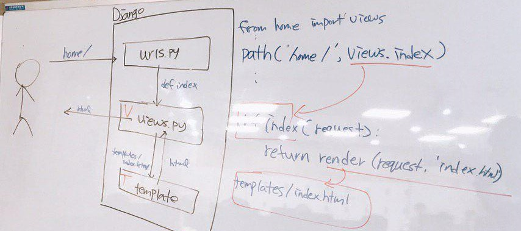
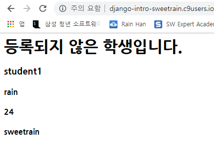

# [Django](https://docs.djangoproject.com/ko/2.1/intro/tutorial01/)

## 시작을 하면 9번부터 읽으세요.... 정신건강에 좋습니다....

+ [djano template language](https://docs.djangoproject.com/en/1.7/topics/templates/)

## 0. 구조 확인하기




## 1. 시작하기

0. c9에서 사용될 것이므로 c9 설정 & django 설치

```
pip install django
```


1. 프로젝트 시작하기

   ```python
   $ django-admin startproject (django_intro)(프로젝트 이름)
   ```

   ​	프로젝트 시작하겠다는 뜻

   ​	하게 되면 프로젝트 이름으로 파일 생성

   ```bash
   django-admin startapp home(app 이름)
   ```

   

   ```
   django_intro
   	django_intro
   		django_intro
   			__init__.py
   			settings.py
   			urls.py
   			wsgi.py
   		db.sqlite3
   		manage.py
   	README.md
   ```

   ```
   ├── django_intro
   │   ├── __init__.py
   │   ├── __pycache__
   │   │   ├── __init__.cpython-36.pyc
   │   │   ├── settings.cpython-36.pyc
   │   │   ├── urls.cpython-36.pyc
   │   │   └── wsgi.cpython-36.pyc
   │   ├── settings.py
   │   ├── urls.py
   │   └── wsgi.py
   ├── db.sqlite3
   └── manage.py
   ```

   

   지금부터 pwd는 `~/workspace/django_intro` 이다.


2. 서버 실행하기

   + `settings.py`   (django_intro/django_intro/settings.py)

   ```python
   28| ALLOWED_HOSTS = ['*']
   # c9에서는 host - 0.0.0.0, port - 8080만 활용할 수 있기 때문에 위와 같이 설정한다.
   ```

   ```bash
   ~/workspace/django_intro $ python manage.py runserver 0.0.0.0:8080
   ```

   실행시키면 서버에서 로켓모양이 떠야한다!

   앞으로 모든 장고 명령어는 프로젝트를 만들때를 제외하고 `python manage.py`를 활용한다. 따라서, 명령어가 안 될때는 반드시 `pwd`와 `ls`를 통해 현재 bash(터미널) 위치를 확인하자

   


## 2. 사용하기(hello, django)

> Django 프로젝트는 여러가지 app의 집합.
>
> 각각의  app은 MTV 패턴으로 구성되어 있다.
>
> M (Model) : 어플리케이션의 핵심 로직의 동작을 수행한다. 
>
> T (Template) : 사용자에게 결과물을 보여준다.
>
> V (View) : 모델과 템플릿의 동작을 제어한다. (모델의 상태를 변경하거나 값을 가져오고, 템플릿에 값을 전달하기 등)
>
> **일반적으로 MVC패턴으로 더 많이 사용된다.**
>
> 
>
> MVC (MODEL VIEW CONTROLER)
>
> 모델링 : 데이터베이스
>
> view : 보여주는 것 (html)
>
> controler : 모델과 뷰 사이의 연결고리
>
> template(mtv) == view(mvc)
>
> view(mtv) == controler(mvc)


### 1. 기본 로직

앞으로 1. 요청 url(`urls.py`)	2. 처리할 view 설정(`views.py`)		3. 결과 보여줄 template 설정(`templates/`)으로 작성할것.


1. url 설정 (`urls.py`)

   ```python
   # django_intro/urls.py
   from django.contrib import admin
   from django.urls import path
   # home 폴더 내에 있는 views.py를 불러온다.
   from home import views
   
   urlpatterns = [
       path('admin/', admin.site.urls),
       # 요청이 home/으로 오면, views의 index 함수를 실행시킨다.
       path('home/', views.index)
   ]
   ```

   

2. view 설정(`views.py`)

   ```python
   # home/views.py
   from django.shortcuts import render, HttpResponse
   
   # Create your views here.
   def index(request):
       return HttpResponse("hello, django!")
   ```

   + 주의할 점은 선언된 함수에서 `request`를 인자로 받아야 한다.
     + request는 사용자(client. 클라이언트)의 요청 정보와 서버에 대한 정보가 담겨있다.
     + Django 내부에서 해당 함수를 호출하면서 정보를 넘겨주기 때문에 반드시 명시해야한다.

3. (`settings.py`)

   ```python
   INSTALLED_APPS = [
       'django.contrib.admin',
       'django.contrib.auth',
       'django.contrib.contenttypes',
       'django.contrib.sessions',
       'django.contrib.messages',
       'django.contrib.staticfiles',
       'home',		#이것을 추가
   ]
   # 하나하나의 앱들, 외부 라이브러리 추가.
   # 맨 마지막에 붙어도 ','를 붙이기(트레일링)
   ```

   


views.py

```python
def index(request):
    print(request)
    print(type(request))
    print(request.META)
    return HttpResponse("hello, django!")
```

print(request)

out :

<WSGIRequest: GET '/home/'>


print(type(request))

out :

<class 'django.core.handlers.wsgi.WSGIRequest'>


(요청에 대한 클라이언트 정보)

print(request.META)

out :

{'APACHE_PID_FILE': '/home/ubuntu/lib/apache2/run/apache2.pid', 'MANPATH': '/home/ubuntu/.nvm/versions/node/v6.11.2/share/man:/usr/local/rvm/rubies/ruby-2.4.0/share/man:/usr/local/man:/usr/local/share/man:/usr/share/man:/usr/local/rvm/man', 'rvm_bin_path': '/usr/local/rvm/bin', 'C9_SHARED': '/mnt/shared', 'PYENV_ROOT': '/home/ubuntu/.pyenv', 'C9_FULLNAME': 'Rain ...(후략)


## 3. Template (MTV 中 T)

> Django에서 활용되는 Template은 DTL(Django Template Language)이다.
>
> jinja2 와 문법이 유사.


1. 요청 url 설정

   ```python
   # urls.py
   path('home/dinner/', views.dinner),
   ```

2. view 설정

   ```python
   # views.py
   def dinner(request):
       box = ['치킨', '밥', '피자']
       pick = random.choice(box)
       return render(request, 'dinner.html', {'dinner' : pick})
   ```

   + Template을 리턴하려면,  `render`를 사용하여야 한다.
     + `request` (필수)
     + `template 파일 이름` (필수)
     + `template 변수` (선택) : `dictionary` 타입으로 구성해야한다.

3. Template 설정

   ```bash
   $ mkdir home/templates
   $ touch home/templates/dinner.html
   ```

   ```html
   <!-- home/templates/dinner.html -->
   <h1> {{dinner}} </h1>
   ```

4. base 설정

   ```html
   <!DOCTYPE html>
   <html lang="ko">
   <head>
       <meta charset="UTF-8">
       <meta name="viewport" content="width=device-width, initial-scale=1.0">
       <meta http-equiv="X-UA-Compatible" content="ie=edge">
       <title></title>
   </head>
   <body>
       <h1> Django 실습</h1>
       <hr>
       
       
   </body>
   </html>
   ```

   

## 4. Variable Routing

1. url 설정

   ```python
   path('home/you/<name>', views.you),
   path('hone/cube/<int:num>', views, cube),
   ```

2. view 파일 설정

   ```python
   def you(request, name):
       return render(request, 'you.html', {'name' : name})
   ```

3. template 설정

   ```django
   <h1> {{ name }}, 안녕!! </h1>
   ```


## 5. Form data

1. `ping`

   1. 요청 url 설정

      ```python
      path('home/ping/', views.ping)
      ```

   2. view 설정

      ```python
      def ping(request):
          return render(request, 'ping.html')
      ```

   3. template 설정

      ```django
      <form action='/home/pong/'>
          <inupt name="message" tyep="text">
          <inupt type="submit">
      </form>
      ```

2. `pong`

   1. 요청 url 설정

      ```python
      path('home/pong/', views.pong)
      ```

   2. view 설정

      ```python
      def pong(request):
          msg = request.GET.get("message")
          return render(request, 'pong.html', {'msg' : msg})
      ```

   3. template 설정

      ```django
      <h1>{{ msg }}</h1>
      ```

3. POST 요청 처리

   1. 요청 FORM 수정

      ```django
      <form action="/home/pong/" method="POST">
          
      </form>
      ```

   2. view 수정

      ```python
      def pong(request):
          msg = request.POST.get("message")
      ```

   + `csrf_token`은 보안을 위해 django에서 기본적으로 설정해 놓은 보안 장치(?) 이다.
     + CSRF 공격 : Cross Site Request Forgery
     + form을 통해 POST 요청을 보낸다는 것은 데이터베이스에 반영되는 경우가 대부분인데, 해당 요청을 우리가 만든 정해진 form에서 보내는지 검증하는 것.
     + 실제로 input type hidden으로 특정한 hash 값이 담겨 있는 것을 볼 수 있다.
     + `settings.py`에 `MIDDLEWARE` 설정에 보면 csrf  관련된 내용이 설정된 것을 볼 수 있다.


## 6. dictionary 접근

> views.py에서 만든 딕셔너리에 접근하기 위해 인스턴스 변수(?) 처럼 사용할 수 있다~

1. 요청 url 설정

   ```python
   from django.contrib import admin
   from django.urls import path
   from rain import views
   
   urlpatterns = [
       path('admin/', admin.site.urls),
       path('info/', views.info),
       path('student/<student>', views.student),
   ]
   ```

2. view 설정

   ```python
   from django.shortcuts import render
   
   students = {"박길동" : 28, "홍길동" : 30, "김길동" : 22}
   # Create your views here.
   def info(request):
       teacher = '갓탁희... 그저 빛....'
       return render(request, 'info.html', {'students' : students, 'teacher' : teacher})
       
   def student(request, student):
       # age = students[student]
       age = students.get(student, 'unknown')
       # 아래가 중요!!!!!!!!!!!!
       student1 = {'name' : 'rain', 'age' : 24, 'nickname' : 'sweetrain'}
       return render(request, 'student.html', {'student' : student, 'age' : age,'student1' : student1})
   ```

3. template 설정

   ```django
   
       <h1> 등록되지 않은 학생입니다. </h1>
   
       <h1>이름 : {{student}}</h1>
       <h2>나이 : {{age}}</h2>
   
   <h3>student1</h3>
   <h4>{{ student1.name }}</h4>
   <h4>{{ student1.age }}</h4>
   <h4>{{ student1.nickname }}</h4>
   ```

   


## 7. Django 문법

+ views.py

  ```python
  def template_example(request):
      my_dict = {'name' : 'han', 'nickname' : 'sweetrain', 'age' : 24}
      my_list = ['짜장면', '짬뽕', '탕수육', '양장피', '초밥']
      my_sentence = 'Life is short, you need python!'
      messages = ['apple', 'banana', 'cucumber', 'mango']
      datetimenow = datetime.datetime.now()
      empty_list = []
      return render(request, 'template_example.html', {'my_dict' : my_dict, 
          'my_list' : my_list, 'my_sentence' : my_sentence, 'messages' : messages,
          'datetimenow' : datetimenow, 'empty_list' : empty_list
      })
  ```

  

### 1. [반복문](https://docs.djangoproject.com/en/1.7/ref/templates/builtins/#for), [빈 리스트 반복문](https://docs.djangoproject.com/en/1.7/ref/templates/builtins/#for-empty)

```django
<p>1. 반복문</p>

    {{ forloop.counter }}
    
        <p>어머님은 짜장면이 싫다고하셨어~</p>
    
        <p>{{ menu }}</p>
    

<hr>
<!-- 빈 리스트가 들어올 때!!!!-->

    <p>{{ user }}</p>
    
        <p>지금 가입된 유저가 없습니다.</p>

```

out : 

\1. 반복문

1

어머님은 짜장면이 싫다고하셨어~

2

짬뽕

3

탕수육

4

양장피

------

지금 가입된 유저가 없습니다.

------


+ forloop 문법

| **Variable**            | **Description**                          |
| ----------------------- | ---------------------------------------- |
| **forloop.counter**     | 루프의 현재 반복 (1- 색인)               |
| **forloop.counter0**    | 루프의 현재 반복 (0- 색인)               |
| **forloop.revcounter**  | 루프 끝에서의 반복 횟수 (1- 색인)        |
| **forloop.revcounter0** | 루프 끝에서 반복 횟수 (0- 색인)          |
| **forloop.first**       | 첫번째                                   |
| **forloop.last**        | 마지막                                   |
| **forloop.parentloop**  | 중첩 루프의 경우 현재 루프를 둘러싼 루프 |


### 2. 조건문

```django
<p>2. 조건문</p>

    <p>짜장면은 고추가루!</p>


    <p>치킨이 있다면 나오겠지?</p>

```

out :

\2. 조건문

짜장면은 고추가루!


### 3. filter

```django
<p>3. length filter 활용</p>

    
        <p>글씨가 너무 길어요</p>
    
        <p> {{ message }}, {{ message|length }}</p>
    

```

out : 

\3. length filter 활용

apple, 5

글씨가 너무 길어요

글씨가 너무 길어요

mango, 5


### 4. lorem

```django
<p>4. lorem ipsum : %를 주의하자!</p>
<!-- lorem 함수 -->

<hr>
<!-- lorem 3단어 -->

<hr>
<!-- lorem 4단어 랜덤. 계속 바뀐다. -->

<hr>
<!-- lorem 2 문단. html 구조에서도 문단구조이다. -->

<hr>
```

out :

\4. lorem ipsum : %를 주의하자!

Lorem ipsum dolor sit amet, consectetur adipisicing elit, sed do eiusmod tempor incididunt ut labore et dolore magna aliqua. Ut enim ad minim veniam, quis nostrud exercitation ullamco laboris nisi ut aliquip ex ea commodo consequat. Duis aute irure dolor in reprehenderit in voluptate velit esse cillum dolore eu fugiat nulla pariatur. Excepteur sint occaecat cupidatat non proident, sunt in culpa qui officia deserunt mollit anim id est laborum.

------

lorem ipsum dolor

------

quam veritatis consequuntur deserunt

------

Lorem ipsum dolor sit amet, consectetur adipisicing elit, sed do eiusmod tempor incididunt ut labore et dolore magna aliqua. Ut enim ad minim veniam, quis nostrud exercitation ullamco laboris nisi ut aliquip ex ea commodo consequat. Duis aute irure dolor in reprehenderit in voluptate velit esse cillum dolore eu fugiat nulla pariatur. Excepteur sint occaecat cupidatat non proident, sunt in culpa qui officia deserunt mollit anim id est laborum.

Repellat ab numquam repudiandae velit vero voluptas veniam itaque voluptatem, nostrum voluptate est voluptatum quasi vero quibusdam ducimus ex quod, quas sapiente voluptatum fuga possimus necessitatibus praesentium mollitia, aliquid delectus sunt eius facilis inventore culpa. Adipisci sapiente eaque ad alias asperiores molestiae et obcaecati quaerat aspernatur, doloribus officiis modi inventore iste eum assumenda nemo atque quasi voluptate eius, cum nemo quae amet quidem id sint laboriosam et, delectus nihil doloribus facilis velit iusto esse, reiciendis dicta officia iste laudantium rerum sunt?


### 5. 글자수제한(truncate)

```django
<p>5. 글자수 제한(truncate)</p>
<p>{{ my_sentence|truncatewords:3 }}</p>
<p>truncatechars:4는 ' ...'으로 공백 + ... 을 포함한다.</p>
<p>{{ my_sentence|truncatechars:4 }}</p>
<p>{{ my_sentence|truncatechars:10 }}</p>
```

out :

\5. 글자수 제한(truncate)

Life is short, ...

truncatechars:4는 ' ...'으로 공백 + ... 을 포함한다.

...

Life i ...


### 6. 글자 관련 필터

```django
<p>6. 글자 관련 필터</p>
<!--길이출력-->
<p>{{ 'abc'|length }}</p>
<!--소문자 변환 -->
<p>{{ 'ABC'|lower }}</p>
<!-- 띄어쓰기 맨 앞 대문자 -->
<p>{{ my_sentence|title }}</p>
<!-- 문장의 맨 앞글자만 대문자-->
<p>{{ 'abc def. hi'|capfirst }}</p>
<!-- 문자열 or list 중 하나만 랜덤으로 리턴-->
<!-- 딕셔너리는 key?에러가 난다 -->
<p>{{ 'abcadsf'|random }}</p>
<p>{{ my_list|random }}</p>
```

out : 

\6. 글자 관련 필터

3

abc

### Life Is Short, You Need Python!

Abc def. hi

a

짬뽕


### 7. 연산

```django
<p>7. 연산</p>
<p>{{ 4|add:6 }}</p>
```

out :

\7. 연산

10


+ [django-mathfilters](https://pypi.org/project/django-mathfilters/) 라는 외부 라이브러리를 설치해야 덧셈 외의 다른 값을 사용 가능하다.
+ [github](https://github.com/dbrgn/django-mathfilters) mathfilters 사용


### 8. [날짜표현](https://docs.djangoproject.com/en/1.7/ref/templates/builtins/#date)

```django
<p>8. 날짜표현</p>
{{ now }} <br>
 <br>
 <br>
 <br>
 <br>
<br>
<!-- 아래는 주석. D로 쓰면 원래 요일을 Monday를 M으로 표현. but 한글은 안줄어든다..-->
<!---->
<!--datetimenow로 해서 date로 type을 지정해줘야지만 사용할 수 있다!-->
{{ datetimenow|date:"SHORT_DATETIME_FORMAT" }}

```

out :

\8. 날짜표현

2019년 2월 12일 11:24 오전 

2019-2-12 11:24 

2019년 2월 12일 11:24 오전 

2019-2-12. 

2019년 2월 12일 

2019년 02월 12일 (화요일) 11:24

2019-2-12 12:04


+ 우리가 지역 및 시간설정을 했기 때문에 년 월 일 순서로 나오는것.
+ 장고에서는 now를 기본적으로 현재 시간으로 사용할 수 있다.
+ 그러나 나중에 다른 시간을 사용하려면 views.py에서 datetime.datetime.now로 불러 사용해야한다.


### 9. urlize

```django
<p>9. urlize</p>
<p>자동으로 앞에 http://를 붙여준다.</p>
{{ 'google.com'|urlize }}
```

out :

\9. urlize

자동으로 앞에 http://를 붙여준다.

google.com


## 8. static file 관리

> 정적 파일(image, css, js)을 서버 저장이 되어 있을 때, 이를 각각의 템플릿에 불러오는 방법.


### 디렉토리 구조

static에 들어갈 내용을 `home(app 이름)/static/구분폴더(img, stylesheet 등)/file`로 넣어준다.

`/static/`이라는 폴더를 만드는게 핵심 (기본이 `/static`)

```
├── home
│   ├── static
│   │   ├── imgs
│   │   │   └── 1.jpg
│   │   └── stylesheets
│   │       └── style.css
```


1. 파일 생성

   + home/static/style.css

     ```css
       body {
           color:pink;
       }
     ```

   + home/templates/base.html

     ```django
     <!DOCTYPE html>
     <html lang="ko">
     <head>
         <meta charset="UTF-8">
         <meta name="viewport" content="width=device-width, initial-scale=1.0">
         <meta http-equiv="X-UA-Compatible" content="ie=edge">
         <title></title>
         
     </head>
     <body>
         <h1> Django 실습</h1>
         <hr>
         
         
     </body>
     </html>
     ```

2. 템플릿 활용

   + home/templates/static_example.html

     ```django
     
        
        
        <link rel="stylesheet" href="" type="text/css" />
        
        
        
            
            
        
     
     ```


out :


+ static 폴더를 사용할 수 있는 이유?

  settings.py

  ```python
  # 맨 아래쪽
  
  # Static files (CSS, JavaScript, Images)
  # https://docs.djangoproject.com/en/2.1/howto/static-files/
  
  STATIC_URL = '/static/'
  
  ```


## 9. URL 설정 분리. (app 여러개 쓰기)

> 위와 같이 코드를 짜는 경우에, `django_ntro/urls.py`에 모든 url 정보가 담기게 된다.
>
> 일반적으로 Django 어플리케이션에서 url을 설정하는 방법은 app별로 `urls.py`를 구성하는 것.

>templates, static
>
>file 이름을 서로 다른 app에서 동일하게 사용하게되면 settings.py에서 먼저 나오는 app의 file을 읽어서 내보낸다. 때문에 이름을 다르게 사용하거나, app별로 app 이름으로 폴더를 생성하여 사용한다.


1. 새 app 만들기

   ```bash
   $ python manage.py startapp utilities
   ```

2. django_intro/settings.py

   ```python
   INSTALLED_APPS = [
       'django.contrib.admin',
       'django.contrib.auth',
       'django.contrib.contenttypes',
       'django.contrib.sessions',
       'django.contrib.messages',
       'django.contrib.staticfiles',
       'home',
       'utilities',
   ]
   ```

3. django_intro/urls.py

   ```python
   # include 추가
   from django.urls import path, include
   ```

   home/ 이 붙어있는 모든 내용을 복사하여 아래 home/urls.py에 넣은 후,

   ```python
   urlpatterns = [
       path('admin/', admin.site.urls),
       # 요청이 home/으로 오면, home/urls.py의 설정들에 맞춰 뷰로 보내준다.
       path('home/', include('home.urls')),
   ]
   ```

   urlpatterns을 수정한다.

   + `include`를 통해 `app/urls.py` 에 설정된 url을 포함.

   

4. home/urls.py 생성(내가 직접 만들어야한다!!)

   ctrl + f 를 눌러 home/을 없앤다.

   ```python
   from django.urls import path, include
   # . 폴더 (현재 디렉토리) 내에 있는 views.py를 불러온다.
   from . import views
   
   urlpatterns = [
       path('', views.index),
       path('dinner/', views.dinner),
       path('you/<name>/', views.you),
       path('cube/<int:num>/', views.cube),
       path('ping/', views.ping),
       path('pong/', views.pong),
       path('user_new/', views.user_new),
       path('user_read/', views.user_read),
       path('template_example/', views.template_example),
       path('static_example/', views.static_example)
   ]
   ```
   + `home/views.py` 파일에서 `index`를 호출하는 url은 `http://<host>/` 가 아니라, `http://<host>/home/`이다.

   

5. django_intro/urls.py

   ```python
   urlpatterns = [
       path('admin/', admin.site.urls),
       # 요청이 home/으로 오면, home/urls.py의 설정들에 맞춰 뷰로 보내준다.
       path('home/', include('home.urls')),
       # 새 app 추가.
       path('utilities/', include('utilities.urls')),
   ]
   ```


## 10 Templates, static 폴더 설정

### 디렉토리 구조

디렉토리 구조는 `home/templates/home/`으로 구정된다.


1. settings.py의 templates 부분을 수정한다.

   ```python
   TEMPLATES = [
       {
           'BACKEND': 'django.template.backends.django.DjangoTemplates',
           # 아래 부분을 수정한다.
           # 'DIRS': [os.path.join(BASE_DIR, 프로젝트 이름 바로 아래 폴더
           #                                 (만약 이름이 없다면 프로젝트 폴더 
           # 								가장 상단에 존재한다., 'templates')],
   
           'DIRS': [os.path.join(BASE_DIR, 'django_intro', 'templates')],
           'APP_DIRS': True,
           'OPTIONS': {
               'context_processors': [
                   'django.template.context_processors.debug',
                   'django.template.context_processors.request',
                   'django.contrib.auth.context_processors.auth',
                   'django.contrib.messages.context_processors.messages',
               ],
           },
       },
   ]
   ```

   + `DIRS` : templates를 커스텀하여 경로를 설정할 수 있다.

     + 경로 설정

       ```python
       'DIRS': [os.path.join(BASE_DIR, 'django_intro', 'templates')],
       # =>/workspace/Django_intro/django_intro/templates/
       ```

   + `APP_DIRS` : `INSTALLED_APPS`에 설정된 APP의 디렉토리에 있는 `templates`를 템플릿으로 활용한다.(True)

2. `home/templates/home/내용`, `home/static/home/내용` 으로 폴더를 만들어준다.

   ```
   ├── home
   │   ├── static
   │   │   └── home
   │   │       ├── imgs
   │   │       │   └── 1.jpg
   │   │       └── stylesheets
   │   │           └── style.css
   │   ├── templates
   │   │   └── home
   │   │       ├── base.html
   │   │       ├── cube.html
   │   │       ├── dinner.html
   │   │       ├── index.html
   │   │       ├── ping.html
   │   │       ├── pong.html
   │   │       ├── static_example.html
   │   │       ├── template_example.html
   │   │       ├── user_new.html
   │   │       ├── user_read.html
   │   │       └── you.html
   ```

   static과 templates 폴더 안에 app 이름으로 폴더를 다시 만든 후 모든 내용을 집어넣는다.

   + 이렇게 하는 이유???
     + django는 templates와 static을 각각 모아서 확인을 하게된다. 

     + templates들의 모임에서 각각의 app의 것인지를 확인하기 위해서는 폴더명으로 한번 더 감싸서 app들의 MTV인지를 확인시켜 주는 것이다.

       

3. 이후, base.html을 사용하고 있는 모든 html 에 에러가 날 것. 

   + `django_intro`(settings.py와 ulrs.py가 존재하는 폴더) 안에 `templates` 폴더를 만들어준다.

   + `home/templates/home/base.html`을 `django_intro/`아래로 이동시킨다.

     ```
     ├── django_intro
     │   ├── templates
     │   │   └── base.html
     │   ├── settings.py
     │   ├── urls.py
     │   └── wsgi.py
     ├── home
     └── utilities`django_intro/settings.py`
     ```

4. 


   utilities/urls.py(직접 생성)


```python
from django.urls import path
from . import views

urlpatterns = [
    path('', views.index),  #/utilities/    
]
```


## django 에서는...

1. @app.route 부분(flask)이 urls.py 안에 모두 들어가게된다.

   | flask              | django              |
   | ------------------ | ------------------- |
   | @app.route('home') | def index(request): |
   |                    | return 'hello'      |
   
   

2. 하나의 project 안에 여러개의 app이 들어가게 된다고 생각하면 된다.

   ```bash
   $ python manage.py startapp home
   ```

   새로운 폴더(home)(app)을 만들게 된다. => MTV의 집합