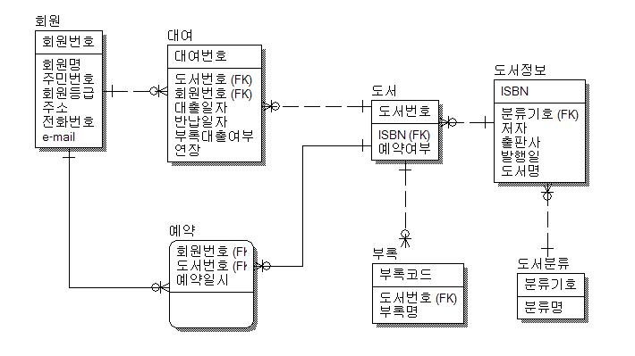

# 데이터베이스 관계설정


1. 1 : N (일 대 다 관계)

   ex) 게시글 하나에 댓글 여러개

   

   게시판의 내용과 댓글의 내용들. 

   댓글에서 board. 게시판의 id. (pk)를 쥐고 있는것이 용이하다. 

   댓글의 내용 뒤에 붙은 게시판의 id를 확인하여 같은 id를 가진 게시글을 읽어온다. 

   

2. N : N (다 대 다 관계)

   ex) 사람 여러명이 그룹 여러개를 만들 수 있다

   

   각각의 테이블을 연결하는 하나의 테이블을 새로 만든다.

   A게시판의 id와 B 게시판의 id. user의 id를 하나의 테이블로 묶은 후 정보를 가져올 때에는 user의 id를 가져오게 된다.

   

3. 1 : 1(일 대 일 관계)

   이 경우 하나의 테이블로 합칠 수 있기 때문에 주로 하나의 테이블로 합치게 된다.


ERD : 개체간의 관계 다이어그램. => 앱을 만들기 위한 기본 설계도를 작성한다.




## 데이터 무결성(data integrity)

if 특정 게시글이 삭제되면 댓글을 어떻게 처리할까?

게시글이 삭제되면 우선 댓글을 절대 찾을 수 없다. 하지만 데이터베이스에는 남게된다. 

이것을 어떻게 처리??

1. 모두 삭제		=> CASCADE 
2. NULL => 처리 불가
3. default 값을 줘서 처리
4. 댓글이 달리면 삭제 자체 불가.


### 무결성 제한의 유형

1. 개체 무결성 

   + pk. 고유키(유일키) 개념. 모든 테이블이 기본 키 pk를 가져야 한다.
   + Primary Key
   + 모든 레코드(row)에는 Not null, Unique 로 갖는 값이 반드시 있다.

2. 참조 무결성

   관계설정(FK(foreign key) relationship)

   + 외래 키.(외부 키)
   + 레퍼런스 참조를 잃었을 때 어떻게 할 것인가?
   + 참조하고 있는 대상(FK- foreign key - 다른 테이블의 PK)이 수정 혹은 삭제가 되었을 때 ㅇ래와 같이 할 수 있다.
     + CASECADE : 삭제가 되었을 때 해당하는 값을 가지는 모든 레코드를 삭제
       + ex) 게시글 삭제 시 모든 댓글 삭제
     + SET_NULL : 삭제가 되었을 때 해당 값을 모두 NULL로 지정. => not null 조건시 사용 불가.
     + SET_DEFAULT : 해당하는 값을 모두 default 값으로 지정. (Default 값이 지정되어야 할 수 있다.)
     + PROTECT : 참조하는 대상이 있는 경우(댓글이 있는 경우) 삭제를 방지 -> 오류 발생.
     + SET( ) : django에서 특정 함수를 호출. 1번 더미(가짜 이름 등)을 만들어 그 부분으로 내용을 돌려버리기

3. 속성(도메인) 무결성(속성)

   + NOT NULL
   + INT, VARCHAR, TEXT, BOOL, DATETIME
   + Male/Feamale
   + 특정 조건에 부합하는 것.


## 데이터베이스 일대 다 관계 (1 : N)

> 게시글 (1) - 댓글(N)


## 사용하기

1. `models.py` 설정

   ```python
   from django.db import models
   
   # Create your models here.
   # 게시글
   class Board(models.Model):
       title = models.CharField(max_length=30)
       content = models.TextField()
       created_at = models.DateTimeField(auto_now_add=True)
       updated_at = models.DateTimeField(auto_now=True)
       
       def __str__(self):
           return f'<Board({self.id}): {self.title}>'
           
   # 댓글
   # 아래부분 추가
   class Comment(models.Model):
       content = models.CharField(max_length=100)
       created_at = models.DateTimeField(auto_now_add=True)
       updated_at = models.DateTimeField(auto_now=True)
       board = models.ForeignKey(Board, on_delete=models.CASCADE)
       # ForeingKey로 받아온 변수 명_id로 변수를 불러올 수 있다.
       
       def __str__(self):
           return self.content
   ```

   + on_delete는 참조하는 객체가 삭제될 경우 설정.
   + CASCADE : 같이 삭제
   + SET_NULL : NULL 값으로 변경(NOT NULL인 경우 불가능)
   + SET_DEFAULT : DEFAULT 값으로 변경(DEFAULT값 없으면 불가능)
   + PROTECT : 삭제 불가
   + `board = models.ForeignKey(Board, on_delete=models.CASCADE)` 부분에서, models.ForeignKey로 생성되면 알아서 board_id라는 column명으로 생성된다.

2. `migrations`, `migrate`

   ```bash
   $ python manage.py makemigrations
   => Migrations for 'boards':
     boards/migrations/0002_comment.py
       - Create model Comment
   $ python manage.py showmigrations
   => admin
    [X] 0001_initial
    [X] 0002_logentry_remove_auto_add
    [X] 0003_logentry_add_action_flag_choices
   auth
    [X] 0001_initial
    [X] 0002_alter_permission_name_max_length
    [X] 0003_alter_user_email_max_length
    [X] 0004_alter_user_username_opts
    [X] 0005_alter_user_last_login_null
    [X] 0006_require_contenttypes_0002
    [X] 0007_alter_validators_add_error_messages
    [X] 0008_alter_user_username_max_length
    [X] 0009_alter_user_last_name_max_length
   boards
    [X] 0001_initial
    [ ] 0002_comment		=> 여기만 안된다.
   contenttypes
    [X] 0001_initial
    [X] 0002_remove_content_type_name
   sessions
    [X] 0001_initial
    $ python manage.py migrate
   ```

   + boards_comment 테이블 생성 쿼리 확인

     ```sql
     $ python manage.py sqlmigrate boards 0002
     =>
     BEGIN;
     --
     -- Create model Comment
     --
     CREATE TABLE "boards_comment" ("id" integer NOT NULL PRIMARY KEY AUTOINCREMENT, 
     "content" varchar(100) NOT NULL, 
     "created_at" datetime NOT NULL, 
     "updated_at" datetime NOT NULL, 
     "board_id" integer NOT NULL REFERENCES "boards_board" ("id") DEFERRABLE INITIALLY DEFERRED);
     CREATE INDEX "boards_comment_board_id_76b617ec" ON "boards_comment" ("board_id");
     COMMIT;
     ```

     뜯어보기

     ```sql
     -- Create model Comment
     => Comment라는 모델이 생성.
     
     "board_id" integer NOT NULL REFERENCES "boards_board" ("id") DEFERRABLE INITIALLY DEFERRED);
     => board_id : 게시판(board)의 아이디를 가져오는 column. 
     ```

   + 실제 데이터베이스 확인

     ```bash
     $ sqlite3 db.sqlite3
     >> SELECT * FROM boards_comment;
     ```

     | id   | content | created_at | updated_at | board_id |
     | ---- | ------- | ---------- | ---------- | -------- |
     | 1    | 1번댓글 | 시간       | 시간       | 12       |

     `board_id`로 이름이 잡혀있는것을 확인하자!

     + 실제 데이터 베이스에는 `모델명_id` 로 컬럼이 추가되어있으며, 값은 해당하는 id가 된다.

       ex) `board_id`

3. shell_plus 확인

   + shell 실행

     ```bash
     $ python manage.py shell_plus
     ```

   + 게시글 작성

     ```bash
     >>> board = Board(title='제목1', content='내용')
     >>> board.save()
     >>> board.pk
     1
     
     ```

   + 댓글 작성

     ```bash
     >>> board = Board.objects.get(pk=1)
     >>> comment = Comment(content="댓글1", board=board)
     >>> comment.save()
     >>> comment.pk
     1
     
     >>> comment2 = Comment()
     >>> comment2.content = "댓글2"
     >>> comment2.board = board
     >>> comment2.save()
     >>> comment2.pk
     2
     ```

     + 댓글을 저장할 때 Board 객체의 오브젝트 자체를 저장

   + 관계 활용하기

     + board(1) -> comment(N) : `comment_set`

     ```bash
     >>> board = Board.objects.get(pk=1)
     >>> board.comment_set.all()
     <QuerySet [<Comment: 댓글1>, <Comment: 댓글2>]>
     ```

     N개니까 queryset을 리턴

     + comment(N) -> board(1) : `board`(참조하는 모델명)

       ```bash
       >>> comment = Comment.objects.get(pk=1)
       >>> comment.board
       <board: 1번글>
       >>> comment.board_id
       1
       
       ```

       1개를 리턴하는것이기 때문에 바로 오브젝트를 리턴 가능.


## CRUD

1. R : 댓글 보기

   `views.py` detail 설정

   ```python
   def detail(request, pk):
       board = Board.objects.get(pk=pk)
       comments = board.comment_set.all()
       return render(request, 'boards/detail.html', {
           'board': board, 
           'comments' : comments
       })
   ```

   `detail.html`

   ```html
   <p>댓글{{ comments.count }}개</p>
   <p>댓글 작성</p>
   
   <li>{{ forloop.counter }} : {{ comment.content }}</li>
   
       <b><p>댓글이 없습니다.</p></b>
   
   ```

   

2. C : 댓글 적기

   `urls.py`

   ```python
   path('<int:board_pk>/comments/', views.comments_create, name='comments_create'),
   ```

   + board의 pk와 comment의 pk를 각각 명시적으로 사용해준다.

   `detail.html`

   <p>댓글 작성</p>
   <form action="" method="POST">
       
       <input name="content" type="text">
       <input type="submit">
   </form>

   ```html
   <p>댓글 작성</p>
   <form action="" method="POST">
       
       <input name="content" type="text">
       <input type="submit">
   </form>
   ```

   `views.py`

   ```python
   def detail(request, board_pk):
       board = Board.objects.get(board_pk)
       comments = board.comment_set.all()
       return render(request, 'boards/detail.html', {
           'board': board, 
           'comments' : comments
       })
   ```

   + pk를 `board_pk`로 꼭 바꿔주어야 한다!!
   + 이어서, 댓글을 생성할 함수를 만들어준다.

   ```python
   from .models import Board, Comment
   
   def comments_create(request, board_pk):
       # 1. 댓글 달 게시물을 가져온다.
       board = Board.objects.get(pk=board_pk)
       # 2. 댓글을 저장한다.
       comment = Comment()
       comment.content = request.POST.get('content')
       comment.board = board
       comment.save()
       return redirect('boards:detail', board.pk)
       # return redirect('boards:detail', comment.board_id)와 동일
   ```

   

3. D : 댓글 삭제

   `urls.py`

   ```python
   path('<int:board_pk>/comments/<int:comment_pk>/delete/', views.comments_delete, name='comments_delete')
   ```

   `views.py`

   ```python
   def comments_delete(request, board_pk, comment_pk):
       if request.method == 'POST':
           comment = Comment.objects.get(pk=comment_pk)
           comment.delete()
       return redirect('boards:detail', board_pk)
   ```

   `detail.html`

   ```html
   
   <li>{{ comment.content }}
       <form action="" method="POST" style="display: inline" onsubmit="return confirm('삭제할거야?')">
           
           <input type="submit" value="삭제">
       </form>
   </li>
   
   
   ```

   + 반복문 안에서 delete 버튼을 만들어 반복.

   

   1. dsef

