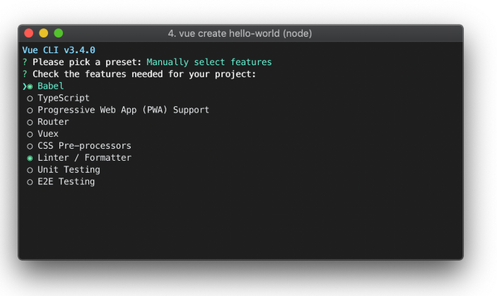
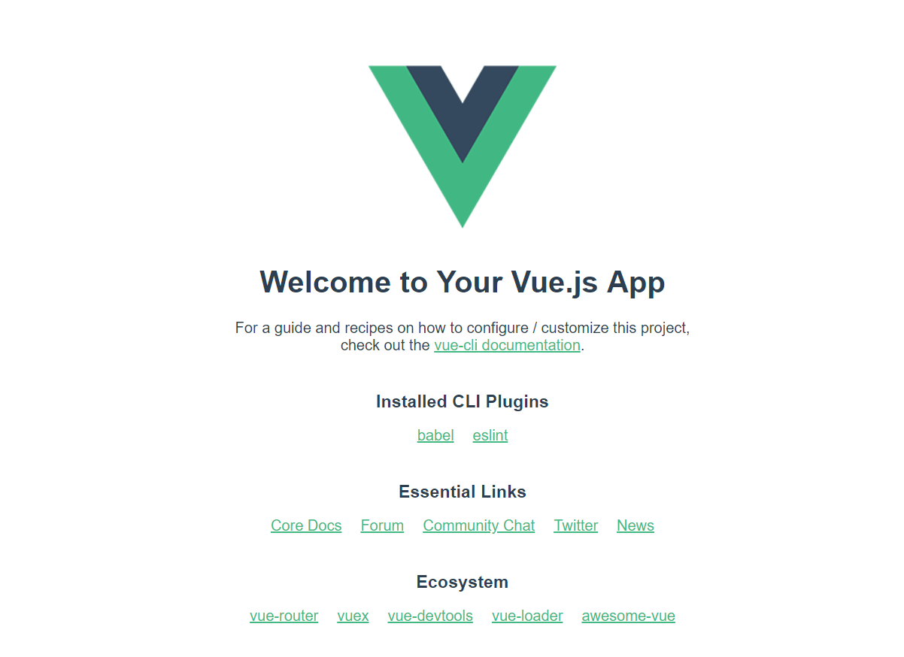

# Vue CLI

> Vue CLI는 Vue.js 개발을 위한 표준 툴이다. 이 포스트에서는 Vue CLI을 이용한 개발 환경 구축을 목표로 한다.

[Vue CLI 홈페이지](<https://cli.vuejs.org/>)


## Vue CLI 란? 

🛠️Vue.js 개발을 위한 표준 툴

Vue 프로젝트를 손쉽게 만들 수 있도록 도와주는 커맨드라인 도구. 


## Vue CLI 설치

+ `vue-cli` 명령어는 vue cli 2버전이고, `@vue/cli`는 vue cli 3 버전이다. 만약 vue cli2버전이 설치되어 있는 환경에서는 충돌 되지 않도록 삭제 후 설치를 진행하도록 한다.


### 0. 기본 요구사항 설치

vue cli를 사용하기 위해서는 Node.js와 yarn이 필요하다. 이미 설치 된 상황이면 넘어간다.


#### 1. Node.js 설치

[Node.js 공식 홈페이지 - 설치](<https://nodejs.org/ko/>) 페이지에서 LTS버전을 설치한다.

[참고 포스트](<https://sweetlog.netlify.com/blog/gatsby-blog/#1-node-js>)

+ 만약, 여러 버전을 관리하고 싶다면 [nvm](<https://github.com/nvm-sh/nvm>) 또는 [nvm-windows](<https://github.com/coreybutler/nvm-windows>)를 사용해 관리할 수 있다.


#### 2. yarn 설치

```bash
npm install -g yarn
```


### 1. vue cli 설치

패키지를 설치 시 아래 두 명령 중 하나를 사용하면 된다. 

```bash
npm install -g @vue/cli
# OR
yarn global add @vue/cli
```


설치가 성공적으로 이루어지면 

```bash
vue --version
```

명령어를 입력 했을 때


3.X 버전을 표시하면 정상 설치 된 것이다.


## 프로젝트 시작하기

`vue create 프로젝트명` 명령어로 프로젝트를 생성한다.

프로젝트 이름은 `vue_cli`로 한다.

```bash
$ vue create vue_cli
? Please pick a preset: (Use arrow keys)
> default (babel, eslint)
  Manually select features

```

사전설정을 하라는 메시지가 표시된다.

+ default : Babel + ESLint 설정과 함께 제공되는 기본 사전설정

  + 신속하게 프로토 타이핑 하는데 유용하다.
  + 언제든 추가 옵션을 설치할 수 있다.

+ Manually : 필요한 기능들을 선택하여 사전 설정

  + 생산 지향 프로젝트를 위해 필요할 수 있는 옵션을 더 많이 제공한다.

    

  + 공식문서에서 제공하는 사진을 보면 다양한 사전 설정을 할 수 있음을 볼 수 있다.


**default로 설치를 하고 넘어간다.**

설치가 성공적으로 끝난다면 다음과 같은 메시지를 볼 수 있다.

```bash
Done in 8.88s.
-  Running completion hooks...
⚓  Running completion hooks...

-  Generating README.md...
📄  Generating README.md...

🎉  Successfully created project vue_cli.
👉  Get started with the following commands:

 $ cd vue_cli
 $ yarn serve
```


## 개발 서버 구동하기

개발 서버를 구동하기 위해서 cmd 창에 뜬 대로 해당 프로젝트 디렉토리로 이동, yarn serve 커맨드를 하면 실행이 된다.

```bash
 $ cd vue_cli
 
 $ yarn serve
 # or
 $ npm run serve
```

`yarn serve` 명령어를 실행하거나 `npm run serve` 명령어를 실행해도 같은 결과를 볼 수 있다.

```bash
  App running at:
  - Local:   http://localhost:8080/
  - Network: http://192.168.31.142:8080/

  Note that the development build is not optimized.
  To create a production build, run yarn build.

```

`http://localhost:8080/`에 접속하면 아래와 같은 페이지를 만날 수 있다.



실제 `npm run serve` 명령어를 실행시키기 위해서는 `npm install`를 사용하여 `node_modules`를 설치했어야 하는데 vue cli가 이미 설치를 했음을 알 수 있다.


### Ref

[Vue CLI 공식 가이드](<https://cli.vuejs.org/>)

[Vue CLI 3 사용법](<https://www.daleseo.com/vue-cli3/>)