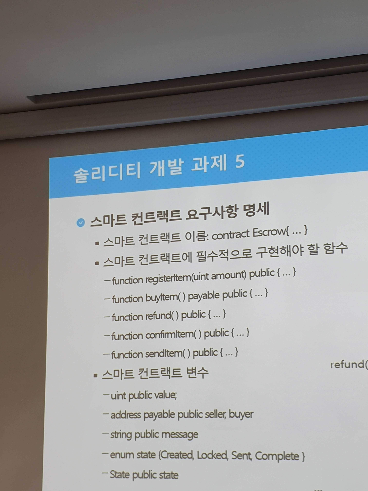

# 블록체인 과제

#### 과제 1번

+ 스마트 컨트랙트의 이름은 다음과 같다

  + SimpleStorage

+ 스마트 컨트랙트를 통해 상태변수에 정수값을 저장하고 읽어오는 기능을 수행한다.

+ 필수적으로 구현되어야 할 함수는 다음과 같다.

  + 컨트랙트 생성자
    + 생성자에서 상태변수의 값을 0으로 초기화
  + function set(uint)
    + 인자로 전달받은 정수값을 상태변수에 저장하는 함수
  + function get(uint)
    + 상태변수에 저장된 정수값을 반환하는 함수

+ `SimpleStorage.sol`

  ```sol
  pragma solidity 0.5.2;	//버전
  
  contract SimpleStorage{	//생성자
      
      uint256 value;
      
      constructor() public{
          value = 0;
      }
      
      function setValue(uint256 _value) public{			//값을 넣으면 value에 값 넣기
          value = _value;
      }
      
      function getValue() public view returns (uint256){	//저장된 함수를 return 
      													//view : 값을 수정할 수 없고 가져올 수만 있는 값.
          return value;
      }
  }
  ```

+ 실행하기

  + SimpleStorage 잘 뜨는지 보고, Deploy 클릭
  + 회색 창 왼쪽 화살표를 누르면 setValue와 getValue가 나오는데 하나씩 누르면 결과가 나옴


#### 과제 2

+ `ballot.sol` 파일을 분석하기

  ```sol
  pragma solidity >=0.4.22 <0.6.0;
  contract Ballot {
  
      struct Voter {
          uint weight;
          bool voted;			// 투표 여부. ture : 이미 투표
          uint8 vote;			// 투표된 제안의 인덱스 데이터값
          address delegate;	// 투표자
      }
      struct Proposal {
          uint voteCount;		// 누적 투표 수
      }
  
      address chairperson;
      mapping(address => Voter) voters;	// 각각의 가능한 주소에 대해 'Voter' 구조체를 저장하는 상태 변수를 선언
      Proposal[] proposals;				// 동적 할당 된 'Proposal' 구조체의 배열
  
      /// Create a new ballot with $(_numProposals) different proposals.
      constructor(uint8 _numProposals) public {
          chairperson = msg.sender;
          voters[chairperson].weight = 1;
          proposals.length = _numProposals;
      }
  
      /// Give $(toVoter) the right to vote on this ballot.
      /// May only be called by $(chairperson).
      function giveRightToVote(address toVoter) public {
          if (msg.sender != chairperson || voters[toVoter].voted) return;
          voters[toVoter].weight = 1;
      }
  
      /// Delegate your vote to the voter $(to).
      function delegate(address to) public {
          Voter storage sender = voters[msg.sender]; // assigns reference
          if (sender.voted) return;
          while (voters[to].delegate != address(0) && voters[to].delegate != msg.sender)
              to = voters[to].delegate;
          if (to == msg.sender) return;
          sender.voted = true;
          sender.delegate = to;
          Voter storage delegateTo = voters[to];
          if (delegateTo.voted)
              proposals[delegateTo.vote].voteCount += sender.weight;
          else
              delegateTo.weight += sender.weight;
      }
  
      /// Give a single vote to proposal $(toProposal).
      function vote(uint8 toProposal) public {
          Voter storage sender = voters[msg.sender];
          if (sender.voted || toProposal >= proposals.length) return;
          sender.voted = true;
          sender.vote = toProposal;
          proposals[toProposal].voteCount += sender.weight;
      }
  
      function winningProposal() public view returns (uint8 _winningProposal) {
          uint256 winningVoteCount = 0;
          for (uint8 prop = 0; prop < proposals.length; prop++)
              if (proposals[prop].voteCount > winningVoteCount) {
                  winningVoteCount = proposals[prop].voteCount;
                  _winningProposal = prop;
              }
      }
  }
  
  ```

+ Voter 구조체와 Proposal 구조체의 쓰임에 대해 설명할 수 있는가?

  + 각 구조체는 어떠한 정보를 담기 위함인가?
    + 구조체를 구성하는 각 변수
  + 구조체와 구조체의 리스트를 선언하고 사용할 수 있는가?

+ msg.sender는 무엇을 뜻하는가?

  + msg.sender와 같은 특성을 갖는 변수를 무엇이라 지칭하는가?

+ 조건문, 반복문을 사용할 수 있는가?

+ 생성자 및 함수의 선언을 이해할 수 있는가?

+ 생성자 및 함수의 동작을 설명할 수 있는가?

  + constructor
  + givRigthToVote(address toVoter)
  + delegate(address to)
  + vote(uint8 toProposal)
  + winningProposal() returns (uint8 _winningProposal)

+ givRightToVote 함수의 if문을 require문으로 변경할 수 있는가?

+ 함수 내 storage 변수를 설명할 수 있는가?

+ Openzeppelin SafeMath 라이브러리를 사용하여 코드를 변경할 수 있는가?

+ Ballot.sol은 모든 참가자들에게 투표권을 부여할 수 있는 형태인가?

  여러 투표에 투표할 수 있는 컨트랙트로 확장할 수 있는 방법은 무엇인가?


#### 문제3

+ 목적
  + 이더리움 토큰 표준 ERC20에 대한 이해
  + 암호화폐 기반 Dapp 개발을 위한 기초 지식 습득
+ 솔리디티 스마트 컨트랙트 개발 환경
  + Remix 사용
+ 배포 환경
  + Metamask 이용
  + 이더리움 테스트넷(Ropsten) 이용
+ 요구사항 명세
  + 필수적으로 구현해야 할 컨트랙트 및 함수는 다음과 같다
    + constract ERC20TokenInterface{}
      + ERC20 표준에서 요구하는 인터페이스 정의
    + contract ERC20Token is ERC20TokenInterface{}
      + ERC20TokenInterface 컨트랙트를 상속하는 컨트랙트
      + ERC20Token 인터페이스를 구현
    + contract MyCustom Token is ERC20Token{}
      + ERC20Token 컨트랙트를 상속하는 컨트랙트
      + 컨트랙트 생성자
      + function balanceOf(address): 해당 주소의 잔액을 반환하는 함수
      + fuction transfer() : 컨트랙트 혹은 주소로 토큰을 전송하는 함수


#### 문제 5




```sol
pragma solidity >=0.4.22 <0.6.0;

contract EscrowTest{
    uint public value;				//판매자의 가격을 저장
    address payable public seller;	//주소
    address payable public buyer;	//주소
    string public message;
    enum State {Created, Locked, Sent, Complete}	//state
    State public state;
    mapping(address=> uint) balanceOf;
    function registrItem(uint amount)public{
        seller = msg.sender;	//함수를 실행시킨 사람의 주소를 넘긴다.
        state = State.Created;	//거래가 생겼다는 의미로 create로 저장
        value = amount;			//물건의 가격
    }
    function buyItem() public payable {//구매자가 구매 버튼 누르기
        require(msg.value == value, "insert correct price");//조건문을 넣고 맞는지 아닌지만 확인. 맞으면 아래 실행. 거짓이면 가스부터 실행된것까지 모두 초기화.
        buyer = msg.sender;		// 구매자의 주소 저장
        balanceOf[seller] += value;		// 구매자가 돈을 보낸다.=> 중간업자(?)에게 돈이 묶인다. => selfdestruct(seller)
        state = State.Locked; 	//상태 변경이 락
    }
    function refund() public{
        require(state == State.Locked, "state is not lockded");		// 상태가 lock일대 가능. 돈은 보냈고, 구매자가 물건을 아직 못받았을때.
        balanceOf[seller] -= value;		//물건 가격만큼 밸런스에서 빼고
        selfdestruct(buyer);	// 묶여 있던 돈을 구매자에게 다시 보내주고 
        state = State.Created; 		// 상태를 create로 변경=> 처음 구매 가능 상태로 초기화
    }
    function confirmItem() public{
        require(buyer == msg.sender, "You are not buyer");	//버튼을 누른 사람이 구매자가 맞는지
        require(state == State.Sent, "state is not sent");	상태가 sent가 맞는지
        selfdestruct(seller);	// 돈을 contract주소에 묶어놓았을 때, buyer가 보낸 돈을 판매자에게 준다.
        state = State.Complete;		// 상태가 완료.
    }
    function sendItem() public{		//물건을 보낸다.
        require(seller == msg.sender, "You are not seller");	//버튼을 누른 사람이 판매자가 맞는지 
        require(state == State.Locked, "state is not locked");	//돈을 보내면 lock된 상태가 있으니 맞으면 돈을 보낸건지 확인 가능
        state = State.Sent;		// 상태를 sent(보낸다)로 변경
    }
}
```


