# 블록체인


## 00. 설치 및 워크스페이스 구축

### 1. 설치

+ VirtualBox - <https://www.virtualbox.org/>

  Vagrant - <https://www.vagrantup.com/>

  VSCode - <https://code.visualstudio.com/>

### 2. 디렉토리 구축

```
C:\dev 폴더 생성
C:\dev\eth_prac001 폴더 생성
```


### 3. vs code

+ 터미널 열기

  ```bash
  PS C:\Users\multicampus\Desktop> cd c:\dev\eth_prac001
  PS C:\dev\eth_prac001> vagrant init
  ```

+ `eth_prac001` 디렉토리에 `Vagrantfile` 파일 생성

+ vs code에서 `Vagrantfile` open

+ 파일 내용을

  ```txt
  Vagrant.configure("2") do |config|
    config.vm.define "eth01" do |eth01|
      eth01.vm.box = "ubuntu/bionic64"
      eth01.vm.hostname = "eth01"
      eth01.vm.network "private_network", ip: "192.168.50.10"
      eth01.vm.provider "virtualbox" do |eth01v|
        eth01v.memory = 4096
      end
    end
    config.vm.define "eth02" do |eth02|
      eth02.vm.box = "ubuntu/bionic64"
      eth02.vm.hostname = "eth02"
      eth02.vm.network "private_network", ip: "192.168.50.11"
      eth02.vm.provider "virtualbox" do |eth02v|
        eth02v.memory = 4096
      end
    end
  end
  ```

  수정하고 저장


## 01. 가상머신 구동

### 1. 가상머신 설치

+ 나중에 노드를 만들어서 구동하기 위해 2개를 설치한다.


+ vs code 터미널

  ```bash
  PS C:\dev\eth_prac001> vagrant up eth01
  ```

  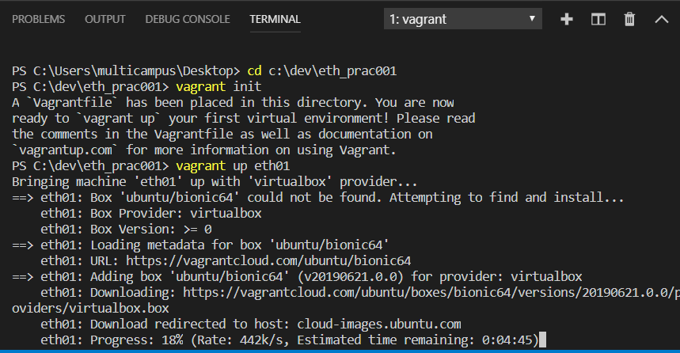

  설치 화면

  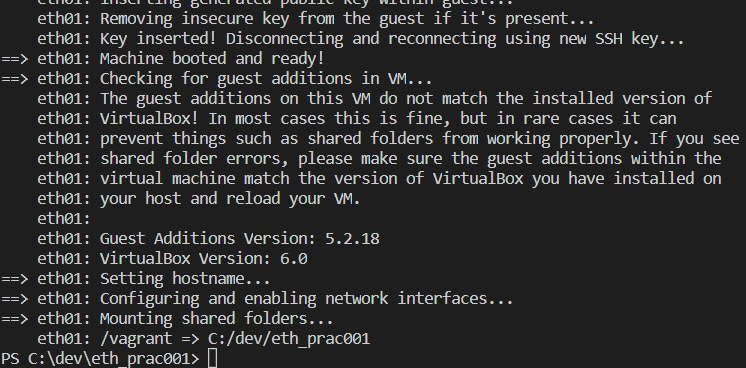

+ 설치가 끝나면 **옆에 + 버튼을 눌러 2번 터미널 열기**

+ 디렉토리 이동 후 설치

  ```bash
  PS C:\Users\multicampus\Desktop> cd c:\dev\eth_prac001
  PS C:\dev\eth_prac001> vagrant up eth02
  ```

  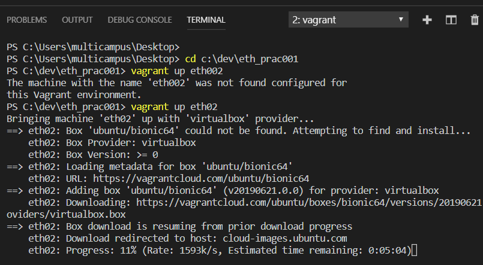

  2번 터미널에 설치

+ 설치가 다 되면 

  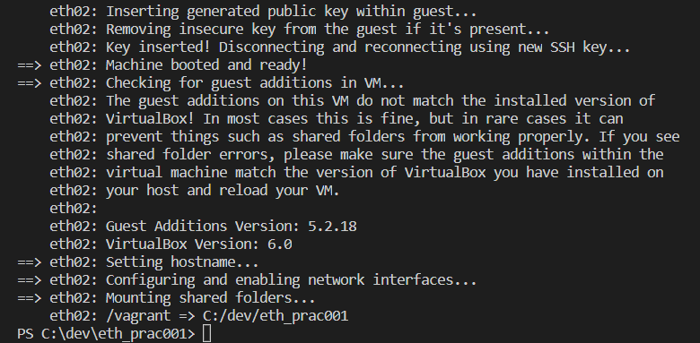

  이렇게 멈춤. 우상단에 보면 vagrant 였던 내용이 powershell로 변경됨.

+ **성공 메세지**

  ```bash
  ==> eth01: Machine booted and ready!
  ==> eth01: Checking for guest additions in VM...
  ```

  

  ```bash
  ==> eth02: Machine booted and ready!
  ==> eth02: Checking for guest additions in VM...
  ```

  이 두개가 터미널에 떴다면 성공적으로 설치가 된것.

  

+ **만약 1번과 2번을 동시에 실행했을 경우 에러가 발생할 수 있다.** 어떤 에러? VBoxManage.exe 에러

  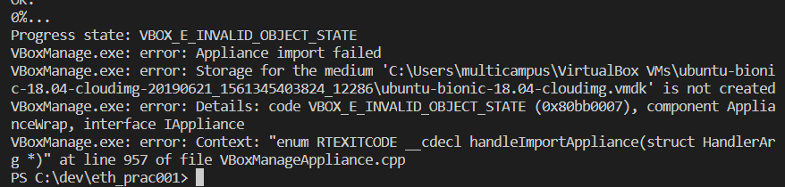

  이 경우 `C:\Users\multicampus\`에서 `.vagrant.d` 디렉토리를 삭제한다. 이후 터미널 1번부터 차례대로 설치를 진행한다. **두개를 동시에 하면 충돌날 수 있기 때문에 하나씩 진행한다.**


### 2. 가상머신 가동

+ 가상머신 켜기

  + 첫번째 터미널

    ```bash
    PS C:\dev\eth_prac001> vagrant ssh eth01
    ```

    ```bash
    vagrant@eth01:~$
    ```

    

  + 두 번째 터미널

    ```bash
    PS C:\dev\eth_prac001> vagrant ssh eth02
    ```

    ```bash
    vagrant@eth02:~$
    ```

  

  

  

  

#### Geth 설치

+  **1번 가상머신(eth01)**에 Geth(Go-ethereum client) 설치

  + 설치

    ```bash
    vagrant@eth01:~$ sudo apt-get update
    vagrant@eth01:~$ sudo apt-get install sofware-properties-common
    vagrant@eth01:~$ sudo add-apt-repository -y ppa:ethereum/ethereum
    vagrant@eth01:~$ sudo apt-get install ethereum
    ```

    

  + 설치 확인

    ```bash
    vagrant@eth01:~$ geth version
    Geth
    Version: 1.8.27-stable
    Git Commit: ...(이후생략)
    ```

  

+ 설치가 끝났다면 2번 터미널(eth02)에서도 반복해준다.


## 03. 프라이빗 이더리움 구축

### 1. 가상머신 내 workspace 디렉토리 생성 후 이동

- eth01 가상머신 내에서 수행

  ```bash
  vagrant@eth01:~$ mkdir -p dev/eth_localdata
  vagrant@eth01:~$ cd dev/eth_localdata/
  vagrant@eth01:~/dev/eth_localdata$ ==> 결과
  ```

- 프라이빗 이더리움을 위한 `genesis`블록파일 생성

  ```bash
  vagrant@eth01:~/dev/eth_localdata$ vi CustomGenesis.json
  ```

  

  이렇게 하면 vi 에디터가 열리고 아래의 json 코드를 넣고 저장한다.

  ```json
  {
    "config": {
      "chainId": 921,
      "homesteadBlock": 0,
      "eip155Block": 0,
      "eip158Block": 0
    },
    "alloc": {},
    "coinbase": "0x0000000000000000000000000000000000000000",
    "difficulty": "0x20",
    "extraData": "",
    "gasLimit": "0x47e7c5",
    "nonce": "0x0000000000000042",
    "mixhash": "0x0000000000000000000000000000000000000000000000000000000000000000",
    "parentHash": "0x0000000000000000000000000000000000000000000000000000000000000000",
    "timestamp": "0x00"
   }
  ```

  - 끼워넣기 : `i`, 저장하고 탈출하기 : esc 키 누른 후 `:wq`


### 2. Geth 초기화

+ eth01 가상머신에서 수행

  ```bash
  vagrant@eth01:~/dev/eth_localdata$ geth --datadir /home/vagrant/dev/eth_localdata init /home/vagrant/dev/eth_localdata/CustomGenesis.json
  ```

+ 정상적으로 초기화 시 workspace 내에 다음과 같은 파일들이 생성

  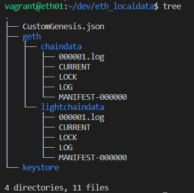

  + 만약 tree가 설치되어있지 않다면, 

    ```bash
    sudo apt-get install tree
    ```

    설치 후 tree 명령어


### 3. 1번과 2번을 2번터미널(eth02)에서 반복한다.

+ 역시 다 하고 나면 workspace 

  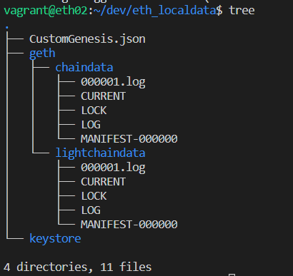

  


### 4. Geth 구동

+ eth01 가상머신에서 수행

  ```bash
  vagrant@eth01:~/dev/eth_localdata$ geth --networkid 921 --maxpeers 2 --datadir /home/vagrant/dev/eth_localdata/ --port 30303 console
  ```

+ eth02 가상머신에서 수행

  ```bash
  vagrant@eth02:~/dev/eth_localdata$ geth --networkid 921 --maxpeers 2 --datadir /home/vagrant/dev/eth_localdata/ --port 30304 console
  ```


#### 5. 노드 연결

+ 노드 정보 확인

+ `eth01` 가상머신 / Geth console

  ```bash
  > admin.nodeInfo.enode
  "enode://f9620853f42adf521fddcb3acf20aea910fc712560fd5bd8b06d0f40d5d8873016798e487586c030510f6ab6d90dde6986fea3341a9530a602d3324b6ff80a48@127.0.0.1:30303"
  ```

+ `eth02` 가상머신 / Geth console

  ```bash
  > admin.addPeer("enode://f9620853f42adf521fddcb3acf20aea910fc712560fd5bd8b06d0f40d5d8873016798e487586c030510f6ab6d90dde6986fea3341a9530a602d3324b6ff80a48@127.0.0.1:30303")
  true
  ```

+ `eth01` 가상머신에서

  ```bash
  > admin.peers
  ```


#### 6. 이더리움 계정(EoA) 생성

+ `eth01` 가상머신 / Geth console

  ```bash
  > personal.newAccount("test1234")
  "0x324f82ceacbf1e100c80483384e75f266b6b1fbc"
  ```

+ 생성된 계정 확인

+ `eth01` 가상머신 / Geth console

  ```bash
  > eth.accounts
  ["0x324f82ceacbf1e100c80483384e75f266b6b1fbc"]
  ```

+ `eth02` 가상머신에서도 동일하게 계정 생성

  ```bash
  > personal.newAccount("test1234")
  "0x8b5b0bb1ce0901b99d251f39ae2366626763e0af"
  > eth.accounts
  ["0x8b5b0bb1ce0901b99d251f39ae2366626763e0af"]
  ```


#### 7. 트랜잭션 생성

+ 트랜잭션 생성을 위한 이더 채굴

+ `eth01`가상머신 / Geth console

  ```bash
  > miner.start(1)
  ```

+ 20여개의 블록 채굴 확인 후 mining 종료

  ```bash
  > miner.stop()
  
  ```

+ 채굴 보상으로 획득한 이더 잔액 확인

  ```bash
  > eth.getBalance("0x324f82ceacbf1e100c80483384e75f266b6b1fbc")
  ```

+ 트랜잭션 생성

  ```bash
  > eth.sendTransaction({from:"0x324f82ceacbf1e100c80483384e75f266b6b1fbc", to:"eth02 account", value:web3.toWei(1, "ether") })
  ```

  


## 03. 스마트 컨트랙트 개발도구 소개

### 01. Remix [홈페이지](<http://remix.ethereum.org/#optimize=false&evmVersion=null>)

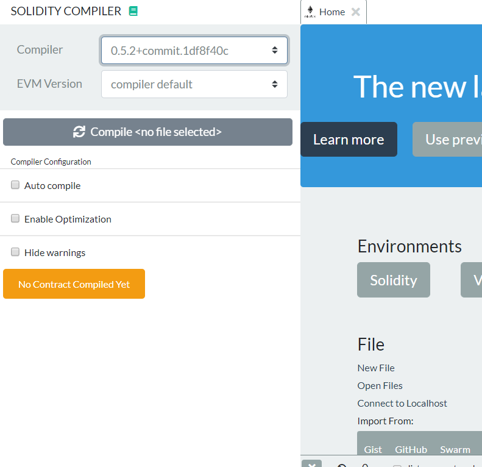

+ 오른쪽 solidity 클릭 후 왼쪽 컴파일러 0.5.2 버전 이상 클릭
+ 왼쪽 문서 클릭 후 browser 옆 + 버튼 클릭 


+ 과제용?

+ 과제

  Remix - [http://remix.ethereum.org](http://remix.ethereum.org/)

  ​	홈페이지 들어가기

  Metamask - <https://metamask.io/>

  ​	확장프로그램 설치 후 로그인


### 02. metamask

+ 지갑을 만든 후 특정 문장(?) 단어의 나열(?) 이 뜨는데 따로 저장해 둔 후 다음 페이지에서 같은 순서로 입력하면 인증이 된다.

+ 결과적으로 성공하면

  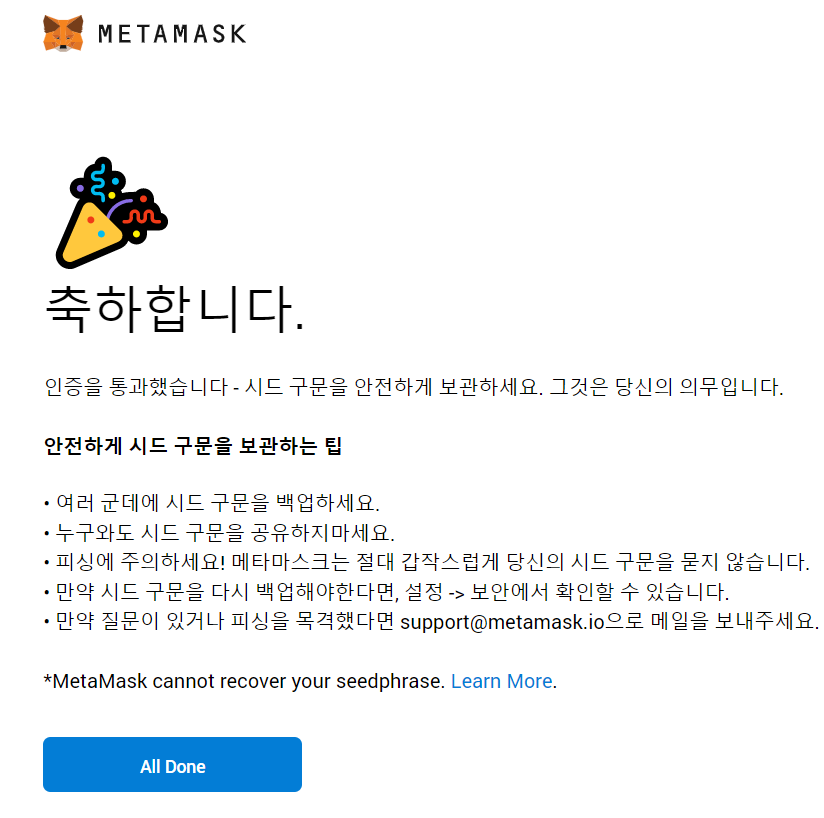

  위와 같은 화면이 뜬다.

  <del>굉장히 귀찮은 과정이기 때문에 축하합니다가 뜨면 희열이 올라온다.</del>
  
  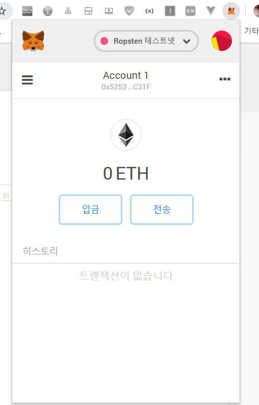


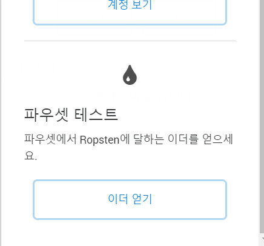

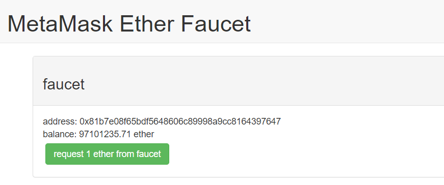


