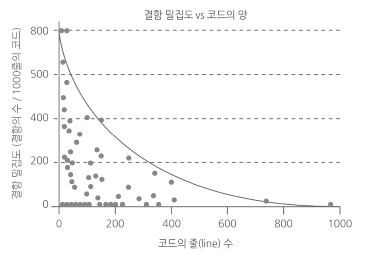

# 190619 클린 코드 / 시큐어 코딩

## 1. 클린코드란?

과거>

> 깨끗한 코드는 한 가지를 제대로 한다. - 바야네 스트롭스트룹

> 깨끗한 코드는 단순하고 직접적이다. - 그래디 부치

> 특정 목적을 달성하는 방법은 (여러가지가 아니라) 하나만 제공한다. - 큰 데이브 토마스

> 깨끗한 코드는 언제나 누군가 주의 깊게 짰다는 느낌을 준다. - 마이클 페더즈
>
> > 레거시코드(지저분한(?) 초기 코드) 활용 전략을 쓴 사람

> 중복 줄이기, 표현력 높이기, 초반부터 간단한 추상화 고려학 - 론 제프리

> 코드를 읽으면서 짐작했던 기능을 각 루틴이 그대로 수행된다면 클린 코드 - 워드 커닝엄


현재>

시큐어 코드까지 합쳐져서 악성코드까지 침범되지 않아야 한다.


### 클린코드

+ 코드를 작성하는 의도와 목적이 명확하며, 다른 사람이 **쉽게 읽을 수 있어야 한다.** 즉, **가독성이 좋아야 한다**.
+ 코드의 이해 시간이 최소화 되어야 하는 방식
  + 이해 : 코드를 자유롭게 수정, 버그를 찾고 적용 가능


## 2. 클린코드는 왜 필요할까?

+ 코드를 읽는 시간 : 코드를 짜는 시간  = 10 : 1
  + 새 코드를 짜면서 끊임없이 기존 코드를 읽는다.
  + 읽기 쉬우면 짜기도 쉬워진다.


## 3. 클린 코드를 만드는 규칙

### 의미 있는 이름 (Naming)

+ 변수, 클래스, 메서드에 의도가 분명한 이름을 사용한다.

  + 변수 이름이 측정하는 값과 단위를 나타냄
  + 의미 있는 이름은 메소드의 기능을 명확하게 해준다.

+ 잘못된 정보를 전달할 수 있는 이름을 사용하지 않는다.

  + 범용적으로 사용되는 단어를 다른 의미로 사용하지 않는다. ex) hp, aix, sco 등
  + 가독성이 떨어지는 문자를 사용하지 않는다. ex) L, I, 1, 0, o, O 
  + 연속된 숫자 또는 불용어(noise word)를 덧붙이는 방식을 피하라. 
    + ex) a1, a2 등
    + ex) customerInfo => customer(email/age/name) 등 의미있는 내용으로 사용

  


### 명확하고 간결하게 주석 달기

+ 주석의 목적
  + 코드를 읽는 사람이 코드를 작성한 사라만큼 코드를 잘 이해할 수 있도록 돕는 것
+ 주석은 반드시 달아야 할 경우에만 사용
+ 설명을 위한 설명을 달지 말 것.
  + 함수의 중요한 세부 사항을 주석으로 남기는 것이 좋다.
    + ex) name으로 노드를 찾거나 아니면 NULL을 반환 한다.


### 보기좋게 배치하고 꾸미기

+ 규칙적인 들여쓰기 및 줄바꿈
+ 줄바꿈과 들여쓰기를 이용하여 일관되고 사용
+ 테이블 구조로 변경
+ 메소드를 이용하여 불규칙한 중복 코드를 제거
  + 헬퍼메소드 이용하여 코드가독성 향상
+ 코드의 열맞추기
+ 코드를 그룹과 계층 구조 방식으로 조작
  + 클래스 전체를 하나의 그룹보다 여러개의 그룹으로 묶기
+ 코드를 문단으로 나눠서 작성
  + 비슷한 생각을 하나의 문단으로 묶으면 읽기 좋은 코드


### 읽기 쉽게 흐름 제어 만들기

+ 왼쪽에 변수를 오른쪽에 상수를 두고 비교
  
  + length >= 10
  
+ 부정이 아닌 긍정을 다루기

  + 꼭 그렇다기보단 확률이 적은것을 먼저 처리하기

  + ```c
    if (a!=b){
        //다른경우
    }
    else{
        //같은경우
    }
    보다,
    
    if (a==b){
        //같은경우
    }
    else{
        //다른경우
    }
    ```

+ if/else를 사용하고 삼항연산자는 매우 간단한 경우에만 사용한다.

+ do/while 루프를 피하라

  + 그냥 while을 사용하는것이 좋다.

+ 중첩을 최소화하기

  + if 안에 if 쓰는 경우를 자제하기

+ 설명 변수와 요약 변스를 이용하여 커다란 표현을 작게 만들기

  + 요약변수
    + if 문장을 ','로 분리한 0번째가 i라면, 에서 분리 하는 부분을 따로 변수에 저장해두고 쓰기
  + 변수를 만들어버린 후 변수끼리 비교하는것이 좋다.


### 착한 함수

+ 함수는 가급적 작게, 한번에 하나의 작업만 수행하도록 작성되어야 한다.


## 4. 레거시 코드를 다루기 위한 프렉티스

### 코드 리뷰

+ 정리가 안 된 코드를 발견하고 점진적으로 개선하는 방법 : 리팩토링


### 리팩토링 방법

+ 코드리뷰

  + 사람들에게 코드 설명
  + 코드를 보여주기 위해서는 공통된 스타일가이드 준수 및 주석 등에 신경씀 =>가독성 향상

+ 코드 인스펙션(code inspection)

  + 작성한 개발 소스를 분석하여 개발 표준에 위배되었거나 잘못 작성된 부분을 수정하는 작업

  + 역할 정의

    + 조정자 : 기획자. 프로세스 검투할 산출물과 담당자 지정. 검토 회의 주관.
    + 발표자 : 산출물을 만든 사람. 리뷰할 문제 및 문제점, 이슈 제공
    + 검토자 : 코드를 검토하고 의견을 제시
    + 기록자 : 검토 회의시 발견된 수정사항 기록 및 결과 공유

  + 역할 절차

    1. plannig : 계획 수립
    2. overview : 교육과 역할 정의
    3. preparation : 코드 인스펙션(툴 존재)을 위한 인터뷰, 산출물, 도구 준비
    4. metting : 미팅. 회의
    5. rework : 발견된 결함 수정 및 재검토
    6. fellow up :  보고된 결함 및 이슈가 수정되었는지 확인하고 시정조치 이행

    적정 수? : 시간당 400줄정도

    

+ 코드 리뷰 체크리스트 존재.


### 리팩토링

+ 더러운 코드를 점진적으로 반복 수행되는 과정을 통해 코드를 조금씩 개선해 나가는것


