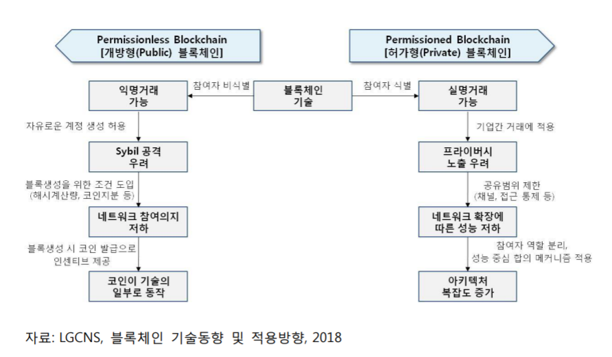

# 190620 블록체인

## 1. 블록체인의 시작

### 비트코인 : 블록체인의 등장

+ 전자화폐
  + 인터넷 기술이 발달하며 전자화폐 등장
  + 2009년 비트코인이라는 암호화폐 등장
  + 비트코인 != 블록체인
  + 비트코인이 동작하는 핵심 기술에 블록체인이 있다.
+ 실물화폐와의 차이?
  + 비트코인은 탈 중앙화된 화폐
    + 실물화폐 : 중앙기관에서 발행하고 금융기관에서 관리
    + 비트코인 : 별도의 발행기관과 관리 기관 없음
+ 탈중앙화의 기여점?
  + 지불 결제의 중개에 드는 비용을 줄일 수 있음.
    + 금융기관 없이도 송금 가능

### 블록체인의 역사 : 사이버 펑크 운동

+ 사회와 중앙 기관에 대한 불신
+ 사회와 정치적 변화를 꾀하는 사람들이 암호화를 통해 목적을 이루어보자 하는 것이 사이버펑크 운동의 핵심

### 비트코인의 거래

+ 비트코인은 탈중앙화된 장부로 이루어짐
  + 참여자가 모든 사람의 거래 내역을 저장함 : 분산화
  + 참여자가 합의하여 거래를 결정 : 분권화
+ 내가 거래한 내용을 모든 사람이 알고있다.
  + 사람들이 관리를 하는 역할보다는 모두 사용을 하는 역할.
  + 그렇다면 모든 사람들이 사용해서 가격이 오르는건가?
    + 이것은 현재 시점에서는 답변이 어렵다. 
    + 왜 올라가는지 의문...?

## 2. 블록체인과 p2p 네트워크

### Peer-to-Peer 네트워크

+ 블록체인은 p2p 네트워크를 통해 거래를 저장함

  + 클라이언트 / 서버는 계층을 두고 데이터를 전송

  + p2p는 동등 계층간의 데이터를 전송하는 기법을 말함

  + 피어들은 서버와 클라이언트의 역할을 동시에 한다.

    

+ 주로 비구조화 오버레이를 사용한다.

### 정의

1. 블록체인의 불가역성
   
   + 한번 기록 / 승인 된 데이터는 수정과 삭제가 불가능하다.
2. 데이터의 출처 검증

   + 데이터 저장 시 데이터의 출처를 기록해야한다.
3. 모두가 검증 가능한 데이터 저장소

   + 참여자 모두가 데이터 무결성을 확인할 수 있어야 한다.

4. 합의된 데이터 저장

## 3. 블록체인과 디지털 서명

### 비트코인의 부인 방지

+ == 블록체인의 부인 방지
+ 다른 사람이 자신의 돈을 보낼 수 없어야 한다.
+ 내가 보냈다는 사실을 추구헤 부인할 수 없어야 한다.

### 비트코인의 지갑

+ 개인키 생성 : 256비트의 무작위 숫자 생성 : k
+ 공개키 생성 : k * G(생성포인트), 개인키 추론 불가 : K
+ 비트코인 주소 생성 : Base 58(RIPEMD160(SHA2(K))) : A

+ 공개키 기반 구조
+ 개인키/공개키가 비대칭 키로서 활용
+ 두개의 키가 쌍으로 사용된다.

### 공개키 기반 구조의 활용

+ 받는 사람의 공개키로 암호화
  + 내가 친구에게만 알려주고 싶은 비밀
  + 이 경우 친구의 개인키로만 복원
+ 보내는 사람의 개인키로 암호화
  + 내가 친구에게 하는 약속
  + 내 공개키를 이용하여 누구든지 원본 복원
  + 비트코인과 블록체인에선 보통 이 방법을 사용

## 4. 블록 생성과 작업 증명

### 블록체인과 블록

+ 블록체인에서의 블록은 거래 장부(?) 
+ 블록 안에는 거래 내용이 들어가고, 약 10분 단위(블록 체인마다 다르다) 로 끊어서 블록이 다음 블록으로 연결된다.

### 해시 알고리즘

+ 주로 원본 값의 위변조 여부를 확인하는데 활용
+ 출력값으로 입력값을 유추할 수 없음
+ 출력값으로부터 입력값을 뽑아낼 수 없다.

### 블록의 구성

+ 비트코인 블록의 구조
  + 이전 블록의 해시코드 => **체인**의 역할을 한다.
  + 트래잭션의 해시코드
  + 블록 생성 시간
  + 문제 난이도
  + 문제 정답

### 트랜잭션(거래내용)의 해시 저장 : 머클 트리

+ 거래 내용이 트리의 leaf에 하나씩 들어가게 된다. 
+ 두개씩 짝지어서 각각의 거래를 하시로 묶고, 그 부모로 또 묶는다. 결국 최종 root로 하나의 값으로 묶게 된다.
+ 이 중, 하나의 값이라도 변화하게 되면 root가 가지게 되는 해쉬값이 달라지기 때문에 바로 체킹을 할 수 있다.

### 비트 코인 채굴하기

+ 작업증명
  + 사용할 수 있는 해쉬 중에서 가장 빠르게 찾는 것 => 채굴 => Nonce 값에 사용된다
  + 어떠한 문장을 해쉬로 변화시켰을 때 특정 조건을 만족시키는 문장(?)을 찾는것.

### 비트코인과 보상

+ nonce를 찾는 값
+ 채굴 인센티브 : 12.5BTC
+ 각 트랜잭션의 수수료 : x BTC

비트코인은 21.0M개의 채굴양이 존재한다.

+ 한계
  + 높아지는 전력량

### 6승인과 포크

+ 포크 : 이중 지불을 하면 블록의 분기가 발생함
+ 6승인 : 블록의 완전 승인은 6개의 블록이 더 생성되어야 함
+ 포크시 블록 승인 : 먼저 6승인을 성공한 블록이 완전 승인됨

+ 일반 노드들은 승인 확률이 높은 블록을 기반으로 블록을 생성함
+ 따라서 길이가 길거나 블록 시간이 빠른 쪽에 먼저 블록을 만듦

### 이중지불

+ 이중지불은 지불이 완전히 승인 나기 전에 다른 지불을 진행하는것을 으미ㅣ
+ 비트코인은 승인에 시간이 걸리기 때문에 이중 지불이 가능.

### 51% 공격

+ 51%를 넘기면 내용을 바꿀 수 있다는 가정.
+ but 51%이상을 한시간 안에 장악해야함. 이것은 매우 어려운 과정

### 합의의 의미

+ 작업증명의 과정이 합의에 의해 이루어진다.

## 정리 : 블록체인 데이터가 신뢰받는 이유

1. 한번 기록 / 승인 된 데이터는 수정과 삭제가 불가능하다.
2. 데이터 저장 시 데이터의 출처를 기록해야한다.
3. 참여자 모두가 데이터 무결성을 확인할 수 있어야 한다.
4. 합의된 데이터 저장

특징

1. P2P
2. Public key infrastructure
3. hash algorithm
4. consensus

## 5. 스마트 컨트렉트

### 이더리움의 등장

+ 이더리움 서비스를 통해 네트워크 상에서 스마트 컨트랙트를 가능하게 한다.

### 스마트 컨트랙트

+ 특정 계약을 스스로 수립, 검증, 이행하기 위한 컴퓨터 프로토콜
+ 계약의 보안을 높이기 위한 방안
+ 계약 비용을 감소
+ 악의와 사고적 예외를 최소화
+ 중개자를 최소화
+ 사기에 의한 손실 낮춘다.
+ 중재 손실 낮춘다.
+ 강제적으로 실행한다.
+ => 강제적으로 정해진 계약. 규칙들을 적용. 
+ 사장되었던 이유?
  + 코드를 누가 가지고 있을 것인가에 대한 의문. 그리고 어떻게 잘 지킬것인가에 대한 의문
+ 블록체인에 스마트 컨트랙트 데이터를 기록하겠다.

### 프로그래머블 머니

+ 프로그램에서 짜놓은 로직에서만 진행되고 전달되는돈
+ 스마트 컨트랙트를 통해 가능해졌다.

### 스마트 컨트랙트 활용사례

+ 토큰 서비스(ERC20) 사용
+ 에스크로 서비스 사용가능

### 스마트 컨트랙트|이더리움 가상 머신

+ 이더리움 가상 머신
  + 누구나 계약 프로그램을 프로그램하고 이더를 이동함
  + 모든 트랜잭션이 동기화 되어 실행되는 단일 글로벌 컴퓨터

### 스마트 컨트랙트 배포 및 실행

+ 계약 생성 과정
  1. 계약 코드 -> 커파일
  2. 바이트 코인 -> 트랜잭션 생성
  3. 블록체인 블록 -> 배포
  4. 블록체인 네트워크
+ 스마트 계약 실행 과정
  1. 사용자 주소 + 함수 주소 + 매개변수 -> 트랜잭션 생성
  2. 블록체인 블록 -> 실행
  3. 블록체인 네트워크

스마트 컨트랙트를 통해 입출금 송금 외에 다양한 방식의 실행이 가능. ex) 프로그래밍, 스마트 계약

### 튜링 완전성과 가스

+ 스마트 계약을 실행하기 위한 수수료
  + 수수료 = 가스 가격 X 사용 가스 수
  + 가스 가격 : Gwei단위 ( 1Gwei - 0.000000001)
  + 가스 가격을 정의할 수 있으나, 많을수록 빠른 처리 가능
  + 가스 제한을 걸어서 비용을 넘어버리면 더 이상 돌아가지 못하게 된다.
  + 이것을 막은 이유? => 여러가지 이유가 있지만 while문이 들어올 경우 모든 사람이 while문만 돌리게 된다. == DOS공격의 일환. 이 경우 아무것도 못하고 while 만 돌게 되는데 이것을 막아줄 수 있다.
+ 호출하는 함수 종류에 따라 비용 차등 부여

### 공개형 블록체인의 한계

+ 누구나 참여 가능하고 누구나 볼 수 있는, 비트코인이나 이더리움 등

1. 프라이버시
2. 트랜잭션 최종성
3. 식별 가능한 참여자
   + 비즈니스에서는 상대방이 누구인지 식별할 수 있어야함.
   + 하지만 비트코인에서는 익명성
   + 참여자가 규칙 준수하는지도 확인해야함.
4. 확장성
5. 생산성과 통합

=> 허가형 블록체인이 등장

### 허가형과 공개형의 차이

+ 허가형 : 들어오려면 인증을 받고 들어와야한다.
+ 

 [출처](<http://daylifg.com/dstory/tech/detail?idx=552>)

